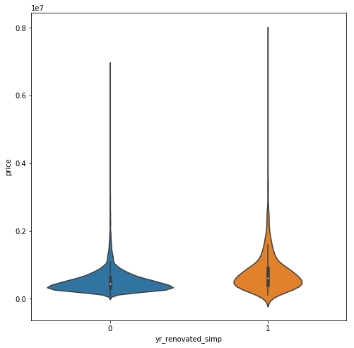
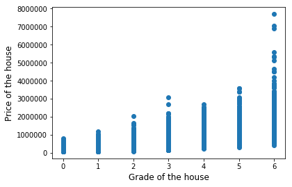
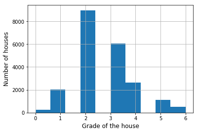
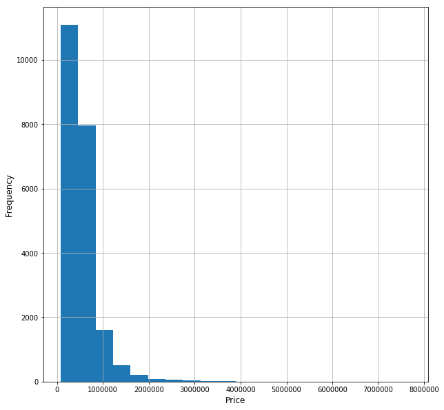
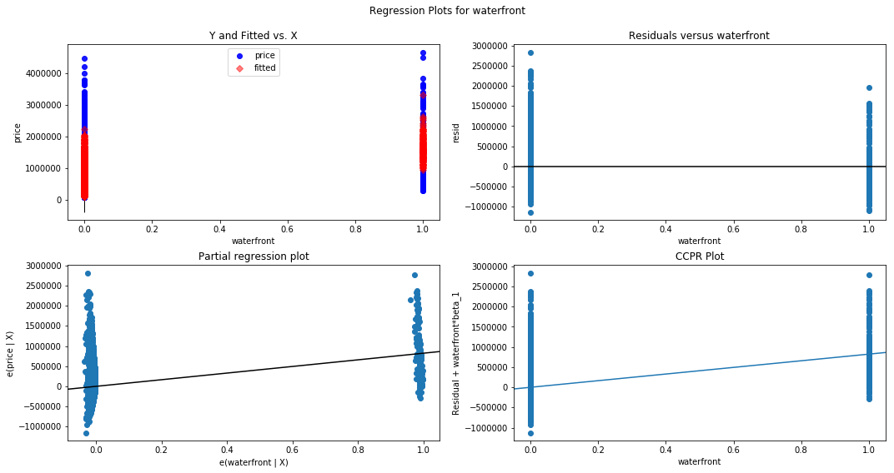
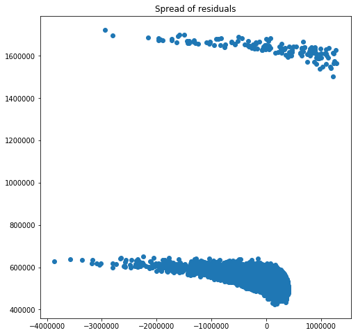
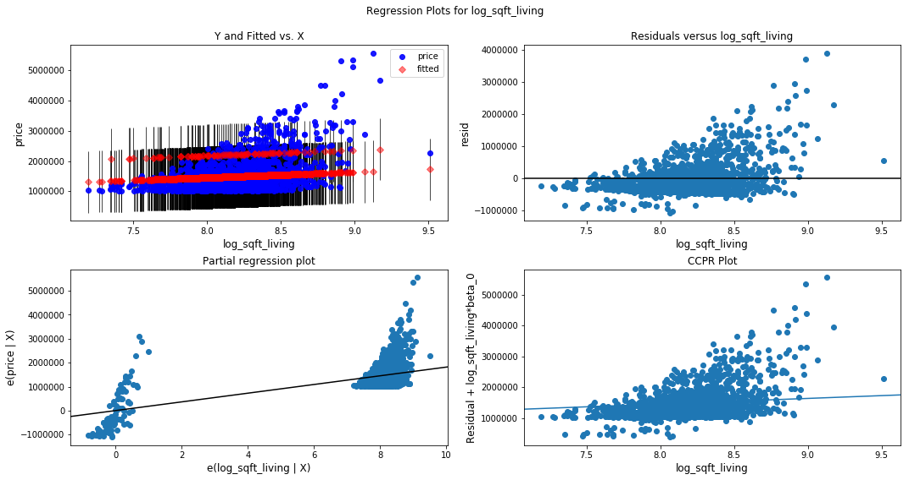

## Final Project Submission

Please fill out:
* Student name: Levi Raichik 
* Student pace: full time
* Scheduled project review date/time: June 4, 2 PM
* Instructor name: Rafael Carrasco
* Blog post URL: https://medium.com/@lraichik/analyzing-king-county-seattle-housing-data-ba3132a76933?source=friends_link&sk=b1d7d504debc8c3d2cd6b3ead1c5950d


# Table of contents

* [Introduction](#Introduction)
* [Import](#Import-everything-I-may-need)
* [Load data and check it out](#Load-the-data)
* [Data Cleaning](#Data-Cleaning)
* [Examining the Data](#Examining-the-data)
    * [Q1: Does the amount of views of a home before it is sold show anything about the final sale price?](#Q1:-Does-the-amount-of-views-of-a-home-before-it-is-sold-show-anything-about-the-final-sale-price?)
    * [Q2: Does the condition score of the house have an affect on the price?](#Q2:-Does-the-condition-score-of-the-house-have-an-affect-on-the-price?)
    * [Q3: Does the size of a lot have an affect on the price?](#Q3:-Does-the-size-of-a-lot-have-an-affect-on-the-price?)
    * [Q4: Does year built or year renovated affect the price?](#Q4:-Does-year-built-or-year-renovated-affect-the-price?)
    * [Q5: Do the amount of floors a house have an affect on the price?](#Q5:-Do-the-amount-of-floors-a-house-have-an-affect-on-the-price?)
    * [Q6: Does the grade show anything on the price?](#Q6:-Does-the-grade-show-anything-on-the-price?)
    * [Q7: What affect does waterfront have on price?](#Q7:-What-affect-does-waterfront-have-on-price?)
    * [Q8: Will combining bedrooms and bathrooms result in a better coefficient with the price?](#Q8:-Will-combining-bedrooms-and-bathrooms-result-in-a-better-coefficient-with-the-price?)
    * [Q9: What affect do bathrooms have on the price by themselves?](#Q9:-What-affect-do-bathrooms-have-on-the-price-by-themselves?)
    * [Q10: What affect does sqft of living space have on the price?](#Q10:-What-affect-does-sqft-of-living-space-have-on-the-price?)
    * [Q11: Difference between houses over 1 Million dollars and under?](#Q11:-Difference-between-houses-over-1-Million-dollars-and-under?)
    * [Q12: How much of a factor was the year or the month in which the house was sold?](#Q12:-How-much-of-a-factor-was-the-year-or-the-month-in-which-the-house-was-sold?)
* [Modeling](#Modeling)
    * [Trying to model with sqft living or grade](#Trying-to-model-with-sqft-living-or-grade)
        * [Model 1a testing](#Model-1a-testing)
        * [Model 1b testing](#Model-1b-testing)
        * [Model 2a testing](#Model-2a-testing)
        * [Model 2b testing](#Model-2b-testing)
    * [Trying to split price into above and under 1 million in 2 models](#Trying-to-split-price-into-above-and-under-1-million-in-2-models)    
        * [Under 1 million dollars](#Under-1-million-dollars)
            * [Under 1 million dollars Final Model](#Under-1-million-dollars-Final-Model)
        * [Over 1 million dollars model](#Over-1-million-dollars-model)
            * [Over 1 Million dollars Final Model](#Over-1-Million-dollars-Final-Model)
* [Explaining three features used in modeling](#Explaining-three-features-used-in-modeling)
* [Conclusion](#Conclusion)

# Introduction

In this notebook, I will try to analyze the data from King county, Seattle to see what is driving the housing prices there.  
I will try to build a model that can predict what those prices will be in the future based on the the data points that affected those sales in 2014 and 2015.

[Back to Table of Contents](#Table-of-contents)

## Import everything I may need


```python
# Your code here - remember to use markdown cells for comments as well!
import pandas as pd
import numpy as np
import matplotlib.pyplot as plt
%matplotlib inline
import statsmodels.api as sm
from sklearn.linear_model import LinearRegression
from sklearn.metrics import mean_squared_error
from sklearn.model_selection import cross_val_score
from sklearn.model_selection import train_test_split
from statsmodels.formula.api import ols
import statsmodels.formula.api as amf
import statsmodels.stats.api as sms
import seaborn as sns
```

## Load the data


```python
data = pd.read_csv('kc_house_data.csv')
```

## Get column explainations


```python
# Copied the column explainations from the .md file and pasted it into a markdown cell
```

# Column Names and descriptions for Kings County Data Set
* **id** - unique identified for a house
* **dateDate** - house was sold
* **pricePrice** -  is prediction target
* **bedroomsNumber** -  of Bedrooms/House
* **bathroomsNumber** -  of bathrooms/bedrooms
* **sqft_livingsquare** -  footage of the home
* **sqft_lotsquare** -  footage of the lot
* **floorsTotal** -  floors (levels) in house
* **waterfront** - House which has a view to a waterfront
* **view** - Has been viewed
* **condition** - How good the condition is ( Overall )
* **grade** - overall grade given to the housing unit, based on King County grading system
* **sqft_above** - square footage of house apart from basement
* **sqft_basement** - square footage of the basement
* **yr_built** - Built Year
* **yr_renovated** - Year when house was renovated
* **zipcode** - zip
* **lat** - Latitude coordinate
* **long** - Longitude coordinate
* **sqft_living15** - The square footage of interior housing living space for the nearest 15 neighbors
* **sqft_lot15** - The square footage of the land lots of the nearest 15 neighbors


## Check data basics


```python
data.head() #Getting a general look at how the dataset looks
```


<div>
<style scoped>
    .dataframe tbody tr th:only-of-type {
        vertical-align: middle;
    }

    .dataframe tbody tr th {
        vertical-align: top;
    }

    .dataframe thead th {
        text-align: right;
    }
</style>
<table border="1" class="dataframe">
  <thead>
    <tr style="text-align: right;">
      <th></th>
      <th>id</th>
      <th>date</th>
      <th>price</th>
      <th>bedrooms</th>
      <th>bathrooms</th>
      <th>sqft_living</th>
      <th>sqft_lot</th>
      <th>floors</th>
      <th>waterfront</th>
      <th>view</th>
      <th>...</th>
      <th>grade</th>
      <th>sqft_above</th>
      <th>sqft_basement</th>
      <th>yr_built</th>
      <th>yr_renovated</th>
      <th>zipcode</th>
      <th>lat</th>
      <th>long</th>
      <th>sqft_living15</th>
      <th>sqft_lot15</th>
    </tr>
  </thead>
  <tbody>
    <tr>
      <th>0</th>
      <td>7129300520</td>
      <td>10/13/2014</td>
      <td>221900.0</td>
      <td>3</td>
      <td>1.00</td>
      <td>1180</td>
      <td>5650</td>
      <td>1.0</td>
      <td>NaN</td>
      <td>0.0</td>
      <td>...</td>
      <td>7</td>
      <td>1180</td>
      <td>0.0</td>
      <td>1955</td>
      <td>0.0</td>
      <td>98178</td>
      <td>47.5112</td>
      <td>-122.257</td>
      <td>1340</td>
      <td>5650</td>
    </tr>
    <tr>
      <th>1</th>
      <td>6414100192</td>
      <td>12/9/2014</td>
      <td>538000.0</td>
      <td>3</td>
      <td>2.25</td>
      <td>2570</td>
      <td>7242</td>
      <td>2.0</td>
      <td>0.0</td>
      <td>0.0</td>
      <td>...</td>
      <td>7</td>
      <td>2170</td>
      <td>400.0</td>
      <td>1951</td>
      <td>1991.0</td>
      <td>98125</td>
      <td>47.7210</td>
      <td>-122.319</td>
      <td>1690</td>
      <td>7639</td>
    </tr>
    <tr>
      <th>2</th>
      <td>5631500400</td>
      <td>2/25/2015</td>
      <td>180000.0</td>
      <td>2</td>
      <td>1.00</td>
      <td>770</td>
      <td>10000</td>
      <td>1.0</td>
      <td>0.0</td>
      <td>0.0</td>
      <td>...</td>
      <td>6</td>
      <td>770</td>
      <td>0.0</td>
      <td>1933</td>
      <td>NaN</td>
      <td>98028</td>
      <td>47.7379</td>
      <td>-122.233</td>
      <td>2720</td>
      <td>8062</td>
    </tr>
    <tr>
      <th>3</th>
      <td>2487200875</td>
      <td>12/9/2014</td>
      <td>604000.0</td>
      <td>4</td>
      <td>3.00</td>
      <td>1960</td>
      <td>5000</td>
      <td>1.0</td>
      <td>0.0</td>
      <td>0.0</td>
      <td>...</td>
      <td>7</td>
      <td>1050</td>
      <td>910.0</td>
      <td>1965</td>
      <td>0.0</td>
      <td>98136</td>
      <td>47.5208</td>
      <td>-122.393</td>
      <td>1360</td>
      <td>5000</td>
    </tr>
    <tr>
      <th>4</th>
      <td>1954400510</td>
      <td>2/18/2015</td>
      <td>510000.0</td>
      <td>3</td>
      <td>2.00</td>
      <td>1680</td>
      <td>8080</td>
      <td>1.0</td>
      <td>0.0</td>
      <td>0.0</td>
      <td>...</td>
      <td>8</td>
      <td>1680</td>
      <td>0.0</td>
      <td>1987</td>
      <td>0.0</td>
      <td>98074</td>
      <td>47.6168</td>
      <td>-122.045</td>
      <td>1800</td>
      <td>7503</td>
    </tr>
  </tbody>
</table>
<p>5 rows × 21 columns</p>
</div>


```python
data.info()
```

    <class 'pandas.core.frame.DataFrame'>
    RangeIndex: 21597 entries, 0 to 21596
    Data columns (total 21 columns):
    id               21597 non-null int64
    date             21597 non-null object
    price            21597 non-null float64
    bedrooms         21597 non-null int64
    bathrooms        21597 non-null float64
    sqft_living      21597 non-null int64
    sqft_lot         21597 non-null int64
    floors           21597 non-null float64
    waterfront       19221 non-null float64
    view             21534 non-null float64
    condition        21597 non-null int64
    grade            21597 non-null int64
    sqft_above       21597 non-null int64
    sqft_basement    21597 non-null object
    yr_built         21597 non-null int64
    yr_renovated     17755 non-null float64
    zipcode          21597 non-null int64
    lat              21597 non-null float64
    long             21597 non-null float64
    sqft_living15    21597 non-null int64
    sqft_lot15       21597 non-null int64
    dtypes: float64(8), int64(11), object(2)
    memory usage: 3.5+ MB
    

[Back to Table of Contents](#Table-of-contents)

# Data Cleaning

## Checking for null values, placeholders and duplicates

### Null Values


```python
data.isna().sum()
```


    id                  0
    date                0
    price               0
    bedrooms            0
    bathrooms           0
    sqft_living         0
    sqft_lot            0
    floors              0
    waterfront       2376
    view               63
    condition           0
    grade               0
    sqft_above          0
    sqft_basement       0
    yr_built            0
    yr_renovated     3842
    zipcode             0
    lat                 0
    long                0
    sqft_living15       0
    sqft_lot15          0
    dtype: int64


Waterfront has a lot of null values, though that might just mean it is not on the waterfront  
View has a few, though that could also mean 0 people viewed it  
yr_renovated has a lot, though that could just mean that it was never renovated

### Placeholders


```python
for col in data.columns:
    print(col, '\n', data[col].value_counts(normalize=True).head(), '\n\n')
```

    id 
     795000620     0.000139
    1825069031    0.000093
    2019200220    0.000093
    7129304540    0.000093
    1781500435    0.000093
    Name: id, dtype: float64 
    
    
    date 
     6/23/2014    0.006575
    6/26/2014    0.006066
    6/25/2014    0.006066
    7/8/2014     0.005880
    4/27/2015    0.005834
    Name: date, dtype: float64 
    
    
    price 
     350000.0    0.007964
    450000.0    0.007964
    550000.0    0.007362
    500000.0    0.007038
    425000.0    0.006945
    Name: price, dtype: float64 
    
    
    bedrooms 
     3    0.454878
    4    0.318655
    2    0.127796
    5    0.074131
    6    0.012594
    Name: bedrooms, dtype: float64 
    
    
    bathrooms 
     2.50    0.248970
    1.00    0.178312
    1.75    0.141131
    2.25    0.094782
    2.00    0.089364
    Name: bathrooms, dtype: float64 
    
    
    sqft_living 
     1300    0.006390
    1400    0.006251
    1440    0.006158
    1660    0.005973
    1010    0.005973
    Name: sqft_living, dtype: float64 
    
    
    sqft_lot 
     5000    0.016576
    6000    0.013428
    4000    0.011622
    7200    0.010187
    7500    0.005510
    Name: sqft_lot, dtype: float64 
    
    
    floors 
     1.0    0.494189
    2.0    0.381303
    1.5    0.088438
    3.0    0.028291
    2.5    0.007455
    Name: floors, dtype: float64 
    
    
    waterfront 
     0.0    0.992404
    1.0    0.007596
    Name: waterfront, dtype: float64 
    
    
    view 
     0.0    0.901923
    2.0    0.044441
    3.0    0.023591
    1.0    0.015325
    4.0    0.014721
    Name: view, dtype: float64 
    
    
    condition 
     3    0.649164
    4    0.262861
    5    0.078761
    2    0.007871
    1    0.001343
    Name: condition, dtype: float64 
    
    
    grade 
     7     0.415521
    8     0.280826
    9     0.121082
    6     0.094365
    10    0.052507
    Name: grade, dtype: float64 
    
    
    sqft_above 
     1300    0.009816
    1010    0.009724
    1200    0.009538
    1220    0.008890
    1140    0.008520
    Name: sqft_above, dtype: float64 
    
    
    sqft_basement 
     0.0      0.593879
    ?        0.021021
    600.0    0.010048
    500.0    0.009677
    700.0    0.009631
    Name: sqft_basement, dtype: float64 
    
    
    yr_built 
     2014    0.025883
    2006    0.020975
    2005    0.020836
    2004    0.020049
    2003    0.019447
    Name: yr_built, dtype: float64 
    
    
    yr_renovated 
     0.0       0.958096
    2014.0    0.004112
    2003.0    0.001746
    2013.0    0.001746
    2007.0    0.001690
    Name: yr_renovated, dtype: float64 
    
    
    zipcode 
     98103    0.027874
    98038    0.027272
    98115    0.026994
    98052    0.026578
    98117    0.025605
    Name: zipcode, dtype: float64 
    
    
    lat 
     47.6624    0.000787
    47.5491    0.000787
    47.5322    0.000787
    47.6846    0.000787
    47.6711    0.000741
    Name: lat, dtype: float64 
    
    
    long 
     -122.290    0.005325
    -122.300    0.005140
    -122.362    0.004815
    -122.291    0.004630
    -122.372    0.004584
    Name: long, dtype: float64 
    
    
    sqft_living15 
     1540    0.009122
    1440    0.009029
    1560    0.008890
    1500    0.008334
    1460    0.007825
    Name: sqft_living15, dtype: float64 
    
    
    sqft_lot15 
     5000    0.019771
    4000    0.016484
    6000    0.013335
    7200    0.009724
    4800    0.006714
    Name: sqft_lot15, dtype: float64 
    
    
    

sqft_basement has some ? values  
I do not see anything else from this that looks like a placeholder value

### Duplicates


```python
duplicates1 = data[data.duplicated()]
duplicates1.head()
```


<div>
<style scoped>
    .dataframe tbody tr th:only-of-type {
        vertical-align: middle;
    }

    .dataframe tbody tr th {
        vertical-align: top;
    }

    .dataframe thead th {
        text-align: right;
    }
</style>
<table border="1" class="dataframe">
  <thead>
    <tr style="text-align: right;">
      <th></th>
      <th>id</th>
      <th>date</th>
      <th>price</th>
      <th>bedrooms</th>
      <th>bathrooms</th>
      <th>sqft_living</th>
      <th>sqft_lot</th>
      <th>floors</th>
      <th>waterfront</th>
      <th>view</th>
      <th>...</th>
      <th>grade</th>
      <th>sqft_above</th>
      <th>sqft_basement</th>
      <th>yr_built</th>
      <th>yr_renovated</th>
      <th>zipcode</th>
      <th>lat</th>
      <th>long</th>
      <th>sqft_living15</th>
      <th>sqft_lot15</th>
    </tr>
  </thead>
  <tbody>
  </tbody>
</table>
<p>0 rows × 21 columns</p>
</div>


So no fully duplicated rows, but I want to check on id to see if any id's are duplicated


```python
duplicates2 = data[data.duplicated(subset='id')]
print (len(duplicates2))
duplicates2.head()
```

    177
    


<div>
<style scoped>
    .dataframe tbody tr th:only-of-type {
        vertical-align: middle;
    }

    .dataframe tbody tr th {
        vertical-align: top;
    }

    .dataframe thead th {
        text-align: right;
    }
</style>
<table border="1" class="dataframe">
  <thead>
    <tr style="text-align: right;">
      <th></th>
      <th>id</th>
      <th>date</th>
      <th>price</th>
      <th>bedrooms</th>
      <th>bathrooms</th>
      <th>sqft_living</th>
      <th>sqft_lot</th>
      <th>floors</th>
      <th>waterfront</th>
      <th>view</th>
      <th>...</th>
      <th>grade</th>
      <th>sqft_above</th>
      <th>sqft_basement</th>
      <th>yr_built</th>
      <th>yr_renovated</th>
      <th>zipcode</th>
      <th>lat</th>
      <th>long</th>
      <th>sqft_living15</th>
      <th>sqft_lot15</th>
    </tr>
  </thead>
  <tbody>
    <tr>
      <th>94</th>
      <td>6021501535</td>
      <td>12/23/2014</td>
      <td>700000.0</td>
      <td>3</td>
      <td>1.50</td>
      <td>1580</td>
      <td>5000</td>
      <td>1.0</td>
      <td>0.0</td>
      <td>0.0</td>
      <td>...</td>
      <td>8</td>
      <td>1290</td>
      <td>290.0</td>
      <td>1939</td>
      <td>0.0</td>
      <td>98117</td>
      <td>47.6870</td>
      <td>-122.386</td>
      <td>1570</td>
      <td>4500</td>
    </tr>
    <tr>
      <th>314</th>
      <td>4139480200</td>
      <td>12/9/2014</td>
      <td>1400000.0</td>
      <td>4</td>
      <td>3.25</td>
      <td>4290</td>
      <td>12103</td>
      <td>1.0</td>
      <td>0.0</td>
      <td>3.0</td>
      <td>...</td>
      <td>11</td>
      <td>2690</td>
      <td>1600.0</td>
      <td>1997</td>
      <td>0.0</td>
      <td>98006</td>
      <td>47.5503</td>
      <td>-122.102</td>
      <td>3860</td>
      <td>11244</td>
    </tr>
    <tr>
      <th>325</th>
      <td>7520000520</td>
      <td>3/11/2015</td>
      <td>240500.0</td>
      <td>2</td>
      <td>1.00</td>
      <td>1240</td>
      <td>12092</td>
      <td>1.0</td>
      <td>0.0</td>
      <td>0.0</td>
      <td>...</td>
      <td>6</td>
      <td>960</td>
      <td>280.0</td>
      <td>1922</td>
      <td>1984.0</td>
      <td>98146</td>
      <td>47.4957</td>
      <td>-122.352</td>
      <td>1820</td>
      <td>7460</td>
    </tr>
    <tr>
      <th>346</th>
      <td>3969300030</td>
      <td>12/29/2014</td>
      <td>239900.0</td>
      <td>4</td>
      <td>1.00</td>
      <td>1000</td>
      <td>7134</td>
      <td>1.0</td>
      <td>0.0</td>
      <td>0.0</td>
      <td>...</td>
      <td>6</td>
      <td>1000</td>
      <td>0.0</td>
      <td>1943</td>
      <td>NaN</td>
      <td>98178</td>
      <td>47.4897</td>
      <td>-122.240</td>
      <td>1020</td>
      <td>7138</td>
    </tr>
    <tr>
      <th>372</th>
      <td>2231500030</td>
      <td>3/24/2015</td>
      <td>530000.0</td>
      <td>4</td>
      <td>2.25</td>
      <td>2180</td>
      <td>10754</td>
      <td>1.0</td>
      <td>0.0</td>
      <td>0.0</td>
      <td>...</td>
      <td>7</td>
      <td>1100</td>
      <td>1080.0</td>
      <td>1954</td>
      <td>0.0</td>
      <td>98133</td>
      <td>47.7711</td>
      <td>-122.341</td>
      <td>1810</td>
      <td>6929</td>
    </tr>
  </tbody>
</table>
<p>5 rows × 21 columns</p>
</div>


```python
duplicates2.id.value_counts().head()
```


    795000620     2
    1922059278    1
    5101402435    1
    4139440480    1
    6021501535    1
    Name: id, dtype: int64


Found duplicated ID 795000620  
I need to see why the other ones showed up as duplicated if there is only one of each  
For now I will check on 795000620

### Dealing with duplicated ID


```python
duplicates2.loc[duplicates2['id'] == 795000620]
```


<div>
<style scoped>
    .dataframe tbody tr th:only-of-type {
        vertical-align: middle;
    }

    .dataframe tbody tr th {
        vertical-align: top;
    }

    .dataframe thead th {
        text-align: right;
    }
</style>
<table border="1" class="dataframe">
  <thead>
    <tr style="text-align: right;">
      <th></th>
      <th>id</th>
      <th>date</th>
      <th>price</th>
      <th>bedrooms</th>
      <th>bathrooms</th>
      <th>sqft_living</th>
      <th>sqft_lot</th>
      <th>floors</th>
      <th>waterfront</th>
      <th>view</th>
      <th>...</th>
      <th>grade</th>
      <th>sqft_above</th>
      <th>sqft_basement</th>
      <th>yr_built</th>
      <th>yr_renovated</th>
      <th>zipcode</th>
      <th>lat</th>
      <th>long</th>
      <th>sqft_living15</th>
      <th>sqft_lot15</th>
    </tr>
  </thead>
  <tbody>
    <tr>
      <th>17589</th>
      <td>795000620</td>
      <td>12/15/2014</td>
      <td>124000.0</td>
      <td>3</td>
      <td>1.0</td>
      <td>1080</td>
      <td>6250</td>
      <td>1.0</td>
      <td>0.0</td>
      <td>0.0</td>
      <td>...</td>
      <td>5</td>
      <td>1080</td>
      <td>0.0</td>
      <td>1950</td>
      <td>0.0</td>
      <td>98168</td>
      <td>47.5045</td>
      <td>-122.33</td>
      <td>1070</td>
      <td>6250</td>
    </tr>
    <tr>
      <th>17590</th>
      <td>795000620</td>
      <td>3/11/2015</td>
      <td>157000.0</td>
      <td>3</td>
      <td>1.0</td>
      <td>1080</td>
      <td>6250</td>
      <td>1.0</td>
      <td>NaN</td>
      <td>0.0</td>
      <td>...</td>
      <td>5</td>
      <td>1080</td>
      <td>0.0</td>
      <td>1950</td>
      <td>NaN</td>
      <td>98168</td>
      <td>47.5045</td>
      <td>-122.33</td>
      <td>1070</td>
      <td>6250</td>
    </tr>
  </tbody>
</table>
<p>2 rows × 21 columns</p>
</div>


```python
data.iloc[17589]
```


    id                795000620
    date             12/15/2014
    price                124000
    bedrooms                  3
    bathrooms                 1
    sqft_living            1080
    sqft_lot               6250
    floors                    1
    waterfront                0
    view                      0
    condition                 2
    grade                     5
    sqft_above             1080
    sqft_basement           0.0
    yr_built               1950
    yr_renovated              0
    zipcode               98168
    lat                 47.5045
    long                -122.33
    sqft_living15          1070
    sqft_lot15             6250
    Name: 17589, dtype: object


```python
data.iloc[17590]
```


    id               795000620
    date             3/11/2015
    price               157000
    bedrooms                 3
    bathrooms                1
    sqft_living           1080
    sqft_lot              6250
    floors                   1
    waterfront             NaN
    view                     0
    condition                2
    grade                    5
    sqft_above            1080
    sqft_basement          0.0
    yr_built              1950
    yr_renovated           NaN
    zipcode              98168
    lat                47.5045
    long               -122.33
    sqft_living15         1070
    sqft_lot15            6250
    Name: 17590, dtype: object


They seem the same, except row 17590 is missing some data points and the price is different, probably due to it being done at a later date.  
I will keep the later one as it has an updated price and is more recent.  
I will change the missing data on it to match the orignal one


```python
data.loc[data.id == 795000620, ['waterfront', 'yr_renovated']] = 0
```


```python
data.iloc[17590]
```


    id               795000620
    date             3/11/2015
    price               157000
    bedrooms                 3
    bathrooms                1
    sqft_living           1080
    sqft_lot              6250
    floors                   1
    waterfront               0
    view                     0
    condition                2
    grade                    5
    sqft_above            1080
    sqft_basement          0.0
    yr_built              1950
    yr_renovated             0
    zipcode              98168
    lat                47.5045
    long               -122.33
    sqft_living15         1070
    sqft_lot15            6250
    Name: 17590, dtype: object


```python
data.drop(17589, inplace=True)
```


```python
data.iloc[17588:17591]
```


<div>
<style scoped>
    .dataframe tbody tr th:only-of-type {
        vertical-align: middle;
    }

    .dataframe tbody tr th {
        vertical-align: top;
    }

    .dataframe thead th {
        text-align: right;
    }
</style>
<table border="1" class="dataframe">
  <thead>
    <tr style="text-align: right;">
      <th></th>
      <th>id</th>
      <th>date</th>
      <th>price</th>
      <th>bedrooms</th>
      <th>bathrooms</th>
      <th>sqft_living</th>
      <th>sqft_lot</th>
      <th>floors</th>
      <th>waterfront</th>
      <th>view</th>
      <th>...</th>
      <th>grade</th>
      <th>sqft_above</th>
      <th>sqft_basement</th>
      <th>yr_built</th>
      <th>yr_renovated</th>
      <th>zipcode</th>
      <th>lat</th>
      <th>long</th>
      <th>sqft_living15</th>
      <th>sqft_lot15</th>
    </tr>
  </thead>
  <tbody>
    <tr>
      <th>17588</th>
      <td>795000620</td>
      <td>9/24/2014</td>
      <td>115000.0</td>
      <td>3</td>
      <td>1.0</td>
      <td>1080</td>
      <td>6250</td>
      <td>1.0</td>
      <td>0.0</td>
      <td>0.0</td>
      <td>...</td>
      <td>5</td>
      <td>1080</td>
      <td>0.0</td>
      <td>1950</td>
      <td>0.0</td>
      <td>98168</td>
      <td>47.5045</td>
      <td>-122.330</td>
      <td>1070</td>
      <td>6250</td>
    </tr>
    <tr>
      <th>17590</th>
      <td>795000620</td>
      <td>3/11/2015</td>
      <td>157000.0</td>
      <td>3</td>
      <td>1.0</td>
      <td>1080</td>
      <td>6250</td>
      <td>1.0</td>
      <td>0.0</td>
      <td>0.0</td>
      <td>...</td>
      <td>5</td>
      <td>1080</td>
      <td>0.0</td>
      <td>1950</td>
      <td>0.0</td>
      <td>98168</td>
      <td>47.5045</td>
      <td>-122.330</td>
      <td>1070</td>
      <td>6250</td>
    </tr>
    <tr>
      <th>17591</th>
      <td>8651430220</td>
      <td>7/25/2014</td>
      <td>183000.0</td>
      <td>3</td>
      <td>1.0</td>
      <td>870</td>
      <td>5200</td>
      <td>1.0</td>
      <td>0.0</td>
      <td>0.0</td>
      <td>...</td>
      <td>6</td>
      <td>870</td>
      <td>0.0</td>
      <td>1969</td>
      <td>NaN</td>
      <td>98042</td>
      <td>47.3702</td>
      <td>-122.078</td>
      <td>870</td>
      <td>5200</td>
    </tr>
  </tbody>
</table>
<p>3 rows × 21 columns</p>
</div>


## Convert the Date and sqft_basement columns so they are not objects


```python
data['sqft_basement'] = pd.to_numeric(data['sqft_basement'], errors='coerce')
```


```python
data['date'] = pd.to_datetime(data['date'])
```


```python
data.info()
```

    <class 'pandas.core.frame.DataFrame'>
    Int64Index: 21596 entries, 0 to 21596
    Data columns (total 21 columns):
    id               21596 non-null int64
    date             21596 non-null datetime64[ns]
    price            21596 non-null float64
    bedrooms         21596 non-null int64
    bathrooms        21596 non-null float64
    sqft_living      21596 non-null int64
    sqft_lot         21596 non-null int64
    floors           21596 non-null float64
    waterfront       19221 non-null float64
    view             21533 non-null float64
    condition        21596 non-null int64
    grade            21596 non-null int64
    sqft_above       21596 non-null int64
    sqft_basement    21142 non-null float64
    yr_built         21596 non-null int64
    yr_renovated     17755 non-null float64
    zipcode          21596 non-null int64
    lat              21596 non-null float64
    long             21596 non-null float64
    sqft_living15    21596 non-null int64
    sqft_lot15       21596 non-null int64
    dtypes: datetime64[ns](1), float64(9), int64(11)
    memory usage: 3.6 MB
    


```python
data.isna().sum()
```


    id                  0
    date                0
    price               0
    bedrooms            0
    bathrooms           0
    sqft_living         0
    sqft_lot            0
    floors              0
    waterfront       2375
    view               63
    condition           0
    grade               0
    sqft_above          0
    sqft_basement     454
    yr_built            0
    yr_renovated     3841
    zipcode             0
    lat                 0
    long                0
    sqft_living15       0
    sqft_lot15          0
    dtype: int64


The ?'s in sqft_basement changed to NaN. I will change them to 0 anyway as if we do not know the amount then it would probably be nothing

### Dealing with null values


```python
data.sqft_basement.fillna(0, inplace=True)
```


```python
data.isna().sum()
```


    id                  0
    date                0
    price               0
    bedrooms            0
    bathrooms           0
    sqft_living         0
    sqft_lot            0
    floors              0
    waterfront       2375
    view               63
    condition           0
    grade               0
    sqft_above          0
    sqft_basement       0
    yr_built            0
    yr_renovated     3841
    zipcode             0
    lat                 0
    long                0
    sqft_living15       0
    sqft_lot15          0
    dtype: int64


View and yr_renovated probably mean no-one saw them and not renovated so I will change both to 0 as well


```python
data.view.fillna(0, inplace=True)
```


```python
data.yr_renovated.fillna(0, inplace=True)
```


```python
data.isna().sum()
```


    id                  0
    date                0
    price               0
    bedrooms            0
    bathrooms           0
    sqft_living         0
    sqft_lot            0
    floors              0
    waterfront       2375
    view                0
    condition           0
    grade               0
    sqft_above          0
    sqft_basement       0
    yr_built            0
    yr_renovated        0
    zipcode             0
    lat                 0
    long                0
    sqft_living15       0
    sqft_lot15          0
    dtype: int64


```python
data[pd.isnull(data['waterfront'])].tail()
```


<div>
<style scoped>
    .dataframe tbody tr th:only-of-type {
        vertical-align: middle;
    }

    .dataframe tbody tr th {
        vertical-align: top;
    }

    .dataframe thead th {
        text-align: right;
    }
</style>
<table border="1" class="dataframe">
  <thead>
    <tr style="text-align: right;">
      <th></th>
      <th>id</th>
      <th>date</th>
      <th>price</th>
      <th>bedrooms</th>
      <th>bathrooms</th>
      <th>sqft_living</th>
      <th>sqft_lot</th>
      <th>floors</th>
      <th>waterfront</th>
      <th>view</th>
      <th>...</th>
      <th>grade</th>
      <th>sqft_above</th>
      <th>sqft_basement</th>
      <th>yr_built</th>
      <th>yr_renovated</th>
      <th>zipcode</th>
      <th>lat</th>
      <th>long</th>
      <th>sqft_living15</th>
      <th>sqft_lot15</th>
    </tr>
  </thead>
  <tbody>
    <tr>
      <th>21578</th>
      <td>5087900040</td>
      <td>2014-10-17</td>
      <td>350000.0</td>
      <td>4</td>
      <td>2.75</td>
      <td>2500</td>
      <td>5995</td>
      <td>2.0</td>
      <td>NaN</td>
      <td>0.0</td>
      <td>...</td>
      <td>8</td>
      <td>2500</td>
      <td>0.0</td>
      <td>2008</td>
      <td>0.0</td>
      <td>98042</td>
      <td>47.3749</td>
      <td>-122.107</td>
      <td>2530</td>
      <td>5988</td>
    </tr>
    <tr>
      <th>21582</th>
      <td>8956200760</td>
      <td>2014-10-13</td>
      <td>541800.0</td>
      <td>4</td>
      <td>2.50</td>
      <td>3118</td>
      <td>7866</td>
      <td>2.0</td>
      <td>NaN</td>
      <td>2.0</td>
      <td>...</td>
      <td>9</td>
      <td>3118</td>
      <td>0.0</td>
      <td>2014</td>
      <td>0.0</td>
      <td>98001</td>
      <td>47.2931</td>
      <td>-122.264</td>
      <td>2673</td>
      <td>6500</td>
    </tr>
    <tr>
      <th>21586</th>
      <td>844000965</td>
      <td>2014-06-26</td>
      <td>224000.0</td>
      <td>3</td>
      <td>1.75</td>
      <td>1500</td>
      <td>11968</td>
      <td>1.0</td>
      <td>NaN</td>
      <td>0.0</td>
      <td>...</td>
      <td>6</td>
      <td>1500</td>
      <td>0.0</td>
      <td>2014</td>
      <td>0.0</td>
      <td>98010</td>
      <td>47.3095</td>
      <td>-122.002</td>
      <td>1320</td>
      <td>11303</td>
    </tr>
    <tr>
      <th>21587</th>
      <td>7852140040</td>
      <td>2014-08-25</td>
      <td>507250.0</td>
      <td>3</td>
      <td>2.50</td>
      <td>2270</td>
      <td>5536</td>
      <td>2.0</td>
      <td>NaN</td>
      <td>0.0</td>
      <td>...</td>
      <td>8</td>
      <td>2270</td>
      <td>0.0</td>
      <td>2003</td>
      <td>0.0</td>
      <td>98065</td>
      <td>47.5389</td>
      <td>-121.881</td>
      <td>2270</td>
      <td>5731</td>
    </tr>
    <tr>
      <th>21595</th>
      <td>291310100</td>
      <td>2015-01-16</td>
      <td>400000.0</td>
      <td>3</td>
      <td>2.50</td>
      <td>1600</td>
      <td>2388</td>
      <td>2.0</td>
      <td>NaN</td>
      <td>0.0</td>
      <td>...</td>
      <td>8</td>
      <td>1600</td>
      <td>0.0</td>
      <td>2004</td>
      <td>0.0</td>
      <td>98027</td>
      <td>47.5345</td>
      <td>-122.069</td>
      <td>1410</td>
      <td>1287</td>
    </tr>
  </tbody>
</table>
<p>5 rows × 21 columns</p>
</div>


I checked the lat and long of the first 5 and last 5 lines in google maps.  
None of them are on the waterfront.  
Based on that and on the very low percentage of waterfront properties in the data, (see value counts above) I will change all NaN to 0 as well for waterfront


```python
data.waterfront.fillna(0, inplace=True)
```


```python
data.isna().sum()
```


    id               0
    date             0
    price            0
    bedrooms         0
    bathrooms        0
    sqft_living      0
    sqft_lot         0
    floors           0
    waterfront       0
    view             0
    condition        0
    grade            0
    sqft_above       0
    sqft_basement    0
    yr_built         0
    yr_renovated     0
    zipcode          0
    lat              0
    long             0
    sqft_living15    0
    sqft_lot15       0
    dtype: int64


I have now dealt with all the Null data, duplicates and placeholder data, as well as changing the object columns to number formats

[Back to Table of Contents](#Table-of-contents)

# Examining the data


```python
data.describe()
```


<div>
<style scoped>
    .dataframe tbody tr th:only-of-type {
        vertical-align: middle;
    }

    .dataframe tbody tr th {
        vertical-align: top;
    }

    .dataframe thead th {
        text-align: right;
    }
</style>
<table border="1" class="dataframe">
  <thead>
    <tr style="text-align: right;">
      <th></th>
      <th>id</th>
      <th>price</th>
      <th>bedrooms</th>
      <th>bathrooms</th>
      <th>sqft_living</th>
      <th>sqft_lot</th>
      <th>floors</th>
      <th>waterfront</th>
      <th>view</th>
      <th>condition</th>
      <th>grade</th>
      <th>sqft_above</th>
      <th>sqft_basement</th>
      <th>yr_built</th>
      <th>yr_renovated</th>
      <th>zipcode</th>
      <th>lat</th>
      <th>long</th>
      <th>sqft_living15</th>
      <th>sqft_lot15</th>
    </tr>
  </thead>
  <tbody>
    <tr>
      <th>count</th>
      <td>2.159600e+04</td>
      <td>2.159600e+04</td>
      <td>21596.000000</td>
      <td>21596.000000</td>
      <td>21596.000000</td>
      <td>2.159600e+04</td>
      <td>21596.000000</td>
      <td>21596.000000</td>
      <td>21596.000000</td>
      <td>21596.000000</td>
      <td>21596.000000</td>
      <td>21596.000000</td>
      <td>21596.000000</td>
      <td>21596.000000</td>
      <td>21596.000000</td>
      <td>21596.000000</td>
      <td>21596.000000</td>
      <td>21596.000000</td>
      <td>21596.000000</td>
      <td>21596.000000</td>
    </tr>
    <tr>
      <th>mean</th>
      <td>4.580650e+09</td>
      <td>5.403159e+05</td>
      <td>3.373217</td>
      <td>2.115878</td>
      <td>2080.368170</td>
      <td>1.509982e+04</td>
      <td>1.494119</td>
      <td>0.006761</td>
      <td>0.233191</td>
      <td>3.409891</td>
      <td>7.658039</td>
      <td>1788.629654</td>
      <td>285.729811</td>
      <td>1971.000648</td>
      <td>68.761391</td>
      <td>98077.947675</td>
      <td>47.560096</td>
      <td>-122.213977</td>
      <td>1986.662762</td>
      <td>12758.584877</td>
    </tr>
    <tr>
      <th>std</th>
      <td>2.876687e+09</td>
      <td>3.673657e+05</td>
      <td>0.926317</td>
      <td>0.768965</td>
      <td>918.102146</td>
      <td>4.141355e+04</td>
      <td>0.539685</td>
      <td>0.081946</td>
      <td>0.764689</td>
      <td>0.650490</td>
      <td>1.173087</td>
      <td>827.764881</td>
      <td>439.825715</td>
      <td>29.375567</td>
      <td>364.045627</td>
      <td>53.510803</td>
      <td>0.138554</td>
      <td>0.140725</td>
      <td>685.217946</td>
      <td>27275.037483</td>
    </tr>
    <tr>
      <th>min</th>
      <td>1.000102e+06</td>
      <td>7.800000e+04</td>
      <td>1.000000</td>
      <td>0.500000</td>
      <td>370.000000</td>
      <td>5.200000e+02</td>
      <td>1.000000</td>
      <td>0.000000</td>
      <td>0.000000</td>
      <td>1.000000</td>
      <td>3.000000</td>
      <td>370.000000</td>
      <td>0.000000</td>
      <td>1900.000000</td>
      <td>0.000000</td>
      <td>98001.000000</td>
      <td>47.155900</td>
      <td>-122.519000</td>
      <td>399.000000</td>
      <td>651.000000</td>
    </tr>
    <tr>
      <th>25%</th>
      <td>2.123049e+09</td>
      <td>3.220000e+05</td>
      <td>3.000000</td>
      <td>1.750000</td>
      <td>1430.000000</td>
      <td>5.040000e+03</td>
      <td>1.000000</td>
      <td>0.000000</td>
      <td>0.000000</td>
      <td>3.000000</td>
      <td>7.000000</td>
      <td>1190.000000</td>
      <td>0.000000</td>
      <td>1951.000000</td>
      <td>0.000000</td>
      <td>98033.000000</td>
      <td>47.471100</td>
      <td>-122.328000</td>
      <td>1490.000000</td>
      <td>5100.000000</td>
    </tr>
    <tr>
      <th>50%</th>
      <td>3.904930e+09</td>
      <td>4.500000e+05</td>
      <td>3.000000</td>
      <td>2.250000</td>
      <td>1910.000000</td>
      <td>7.619000e+03</td>
      <td>1.500000</td>
      <td>0.000000</td>
      <td>0.000000</td>
      <td>3.000000</td>
      <td>7.000000</td>
      <td>1560.000000</td>
      <td>0.000000</td>
      <td>1975.000000</td>
      <td>0.000000</td>
      <td>98065.000000</td>
      <td>47.571800</td>
      <td>-122.231000</td>
      <td>1840.000000</td>
      <td>7620.000000</td>
    </tr>
    <tr>
      <th>75%</th>
      <td>7.308950e+09</td>
      <td>6.450000e+05</td>
      <td>4.000000</td>
      <td>2.500000</td>
      <td>2550.000000</td>
      <td>1.068550e+04</td>
      <td>2.000000</td>
      <td>0.000000</td>
      <td>0.000000</td>
      <td>4.000000</td>
      <td>8.000000</td>
      <td>2210.000000</td>
      <td>550.000000</td>
      <td>1997.000000</td>
      <td>0.000000</td>
      <td>98118.000000</td>
      <td>47.678000</td>
      <td>-122.125000</td>
      <td>2360.000000</td>
      <td>10083.000000</td>
    </tr>
    <tr>
      <th>max</th>
      <td>9.900000e+09</td>
      <td>7.700000e+06</td>
      <td>33.000000</td>
      <td>8.000000</td>
      <td>13540.000000</td>
      <td>1.651359e+06</td>
      <td>3.500000</td>
      <td>1.000000</td>
      <td>4.000000</td>
      <td>5.000000</td>
      <td>13.000000</td>
      <td>9410.000000</td>
      <td>4820.000000</td>
      <td>2015.000000</td>
      <td>2015.000000</td>
      <td>98199.000000</td>
      <td>47.777600</td>
      <td>-121.315000</td>
      <td>6210.000000</td>
      <td>871200.000000</td>
    </tr>
  </tbody>
</table>
</div>


```python
data.loc[:, ['price', 'bedrooms', 'bathrooms', 'sqft_living', 'sqft_lot', 'floors', 'waterfront', 'view', 'condition', 'grade', 'sqft_above', 'sqft_basement', 'yr_built', 'yr_renovated', 'sqft_living15', 'sqft_lot15']].head()
```


<div>
<style scoped>
    .dataframe tbody tr th:only-of-type {
        vertical-align: middle;
    }

    .dataframe tbody tr th {
        vertical-align: top;
    }

    .dataframe thead th {
        text-align: right;
    }
</style>
<table border="1" class="dataframe">
  <thead>
    <tr style="text-align: right;">
      <th></th>
      <th>price</th>
      <th>bedrooms</th>
      <th>bathrooms</th>
      <th>sqft_living</th>
      <th>sqft_lot</th>
      <th>floors</th>
      <th>waterfront</th>
      <th>view</th>
      <th>condition</th>
      <th>grade</th>
      <th>sqft_above</th>
      <th>sqft_basement</th>
      <th>yr_built</th>
      <th>yr_renovated</th>
      <th>sqft_living15</th>
      <th>sqft_lot15</th>
    </tr>
  </thead>
  <tbody>
    <tr>
      <th>0</th>
      <td>221900.0</td>
      <td>3</td>
      <td>1.00</td>
      <td>1180</td>
      <td>5650</td>
      <td>1.0</td>
      <td>0.0</td>
      <td>0.0</td>
      <td>3</td>
      <td>7</td>
      <td>1180</td>
      <td>0.0</td>
      <td>1955</td>
      <td>0.0</td>
      <td>1340</td>
      <td>5650</td>
    </tr>
    <tr>
      <th>1</th>
      <td>538000.0</td>
      <td>3</td>
      <td>2.25</td>
      <td>2570</td>
      <td>7242</td>
      <td>2.0</td>
      <td>0.0</td>
      <td>0.0</td>
      <td>3</td>
      <td>7</td>
      <td>2170</td>
      <td>400.0</td>
      <td>1951</td>
      <td>1991.0</td>
      <td>1690</td>
      <td>7639</td>
    </tr>
    <tr>
      <th>2</th>
      <td>180000.0</td>
      <td>2</td>
      <td>1.00</td>
      <td>770</td>
      <td>10000</td>
      <td>1.0</td>
      <td>0.0</td>
      <td>0.0</td>
      <td>3</td>
      <td>6</td>
      <td>770</td>
      <td>0.0</td>
      <td>1933</td>
      <td>0.0</td>
      <td>2720</td>
      <td>8062</td>
    </tr>
    <tr>
      <th>3</th>
      <td>604000.0</td>
      <td>4</td>
      <td>3.00</td>
      <td>1960</td>
      <td>5000</td>
      <td>1.0</td>
      <td>0.0</td>
      <td>0.0</td>
      <td>5</td>
      <td>7</td>
      <td>1050</td>
      <td>910.0</td>
      <td>1965</td>
      <td>0.0</td>
      <td>1360</td>
      <td>5000</td>
    </tr>
    <tr>
      <th>4</th>
      <td>510000.0</td>
      <td>3</td>
      <td>2.00</td>
      <td>1680</td>
      <td>8080</td>
      <td>1.0</td>
      <td>0.0</td>
      <td>0.0</td>
      <td>3</td>
      <td>8</td>
      <td>1680</td>
      <td>0.0</td>
      <td>1987</td>
      <td>0.0</td>
      <td>1800</td>
      <td>7503</td>
    </tr>
  </tbody>
</table>
</div>


```python
data.corr()
```


<div>
<style scoped>
    .dataframe tbody tr th:only-of-type {
        vertical-align: middle;
    }

    .dataframe tbody tr th {
        vertical-align: top;
    }

    .dataframe thead th {
        text-align: right;
    }
</style>
<table border="1" class="dataframe">
  <thead>
    <tr style="text-align: right;">
      <th></th>
      <th>id</th>
      <th>price</th>
      <th>bedrooms</th>
      <th>bathrooms</th>
      <th>sqft_living</th>
      <th>sqft_lot</th>
      <th>floors</th>
      <th>waterfront</th>
      <th>view</th>
      <th>condition</th>
      <th>grade</th>
      <th>sqft_above</th>
      <th>sqft_basement</th>
      <th>yr_built</th>
      <th>yr_renovated</th>
      <th>zipcode</th>
      <th>lat</th>
      <th>long</th>
      <th>sqft_living15</th>
      <th>sqft_lot15</th>
    </tr>
  </thead>
  <tbody>
    <tr>
      <th>id</th>
      <td>1.000000</td>
      <td>-0.016842</td>
      <td>0.001126</td>
      <td>0.005074</td>
      <td>-0.012308</td>
      <td>-0.131929</td>
      <td>0.018553</td>
      <td>-0.003605</td>
      <td>0.011754</td>
      <td>-0.023939</td>
      <td>0.008052</td>
      <td>-0.010852</td>
      <td>-0.004399</td>
      <td>0.021575</td>
      <td>-0.010624</td>
      <td>-0.008109</td>
      <td>-0.001822</td>
      <td>0.020622</td>
      <td>-0.002782</td>
      <td>-0.138578</td>
    </tr>
    <tr>
      <th>price</th>
      <td>-0.016842</td>
      <td>1.000000</td>
      <td>0.308777</td>
      <td>0.525871</td>
      <td>0.701900</td>
      <td>0.089868</td>
      <td>0.256768</td>
      <td>0.264310</td>
      <td>0.393493</td>
      <td>0.035948</td>
      <td>0.667931</td>
      <td>0.605351</td>
      <td>0.321086</td>
      <td>0.053918</td>
      <td>0.117849</td>
      <td>-0.053319</td>
      <td>0.306682</td>
      <td>0.021994</td>
      <td>0.585213</td>
      <td>0.082835</td>
    </tr>
    <tr>
      <th>bedrooms</th>
      <td>0.001126</td>
      <td>0.308777</td>
      <td>1.000000</td>
      <td>0.514508</td>
      <td>0.578210</td>
      <td>0.032467</td>
      <td>0.177931</td>
      <td>-0.002129</td>
      <td>0.078349</td>
      <td>0.026458</td>
      <td>0.356564</td>
      <td>0.479380</td>
      <td>0.297221</td>
      <td>0.155659</td>
      <td>0.017896</td>
      <td>-0.154072</td>
      <td>-0.009959</td>
      <td>0.132041</td>
      <td>0.393399</td>
      <td>0.030686</td>
    </tr>
    <tr>
      <th>bathrooms</th>
      <td>0.005074</td>
      <td>0.525871</td>
      <td>0.514508</td>
      <td>1.000000</td>
      <td>0.755742</td>
      <td>0.088363</td>
      <td>0.502555</td>
      <td>0.063627</td>
      <td>0.186005</td>
      <td>-0.126645</td>
      <td>0.665797</td>
      <td>0.686655</td>
      <td>0.278457</td>
      <td>0.507156</td>
      <td>0.047167</td>
      <td>-0.204697</td>
      <td>0.024254</td>
      <td>0.224862</td>
      <td>0.569845</td>
      <td>0.088291</td>
    </tr>
    <tr>
      <th>sqft_living</th>
      <td>-0.012308</td>
      <td>0.701900</td>
      <td>0.578210</td>
      <td>0.755742</td>
      <td>1.000000</td>
      <td>0.173447</td>
      <td>0.353924</td>
      <td>0.104635</td>
      <td>0.281708</td>
      <td>-0.059562</td>
      <td>0.762776</td>
      <td>0.876444</td>
      <td>0.428644</td>
      <td>0.318129</td>
      <td>0.051052</td>
      <td>-0.199735</td>
      <td>0.052137</td>
      <td>0.241183</td>
      <td>0.756386</td>
      <td>0.184336</td>
    </tr>
    <tr>
      <th>sqft_lot</th>
      <td>-0.131929</td>
      <td>0.089868</td>
      <td>0.032467</td>
      <td>0.088363</td>
      <td>0.173447</td>
      <td>1.000000</td>
      <td>-0.004824</td>
      <td>0.021458</td>
      <td>0.075052</td>
      <td>-0.008852</td>
      <td>0.114722</td>
      <td>0.184134</td>
      <td>0.015025</td>
      <td>0.052940</td>
      <td>0.004977</td>
      <td>-0.129578</td>
      <td>-0.085518</td>
      <td>0.230222</td>
      <td>0.144755</td>
      <td>0.718203</td>
    </tr>
    <tr>
      <th>floors</th>
      <td>0.018553</td>
      <td>0.256768</td>
      <td>0.177931</td>
      <td>0.502555</td>
      <td>0.353924</td>
      <td>-0.004824</td>
      <td>1.000000</td>
      <td>0.020794</td>
      <td>0.028401</td>
      <td>-0.264201</td>
      <td>0.458762</td>
      <td>0.523971</td>
      <td>-0.241901</td>
      <td>0.489178</td>
      <td>0.003785</td>
      <td>-0.059474</td>
      <td>0.049223</td>
      <td>0.125913</td>
      <td>0.280062</td>
      <td>-0.010732</td>
    </tr>
    <tr>
      <th>waterfront</th>
      <td>-0.003605</td>
      <td>0.264310</td>
      <td>-0.002129</td>
      <td>0.063627</td>
      <td>0.104635</td>
      <td>0.021458</td>
      <td>0.020794</td>
      <td>1.000000</td>
      <td>0.380543</td>
      <td>0.016641</td>
      <td>0.082819</td>
      <td>0.071776</td>
      <td>0.083048</td>
      <td>-0.024490</td>
      <td>0.073938</td>
      <td>0.028932</td>
      <td>-0.012159</td>
      <td>-0.037632</td>
      <td>0.083822</td>
      <td>0.030657</td>
    </tr>
    <tr>
      <th>view</th>
      <td>0.011754</td>
      <td>0.393493</td>
      <td>0.078349</td>
      <td>0.186005</td>
      <td>0.281708</td>
      <td>0.075052</td>
      <td>0.028401</td>
      <td>0.380543</td>
      <td>1.000000</td>
      <td>0.045597</td>
      <td>0.249080</td>
      <td>0.166008</td>
      <td>0.270623</td>
      <td>-0.054462</td>
      <td>0.090337</td>
      <td>0.085089</td>
      <td>0.006315</td>
      <td>-0.077715</td>
      <td>0.278921</td>
      <td>0.073080</td>
    </tr>
    <tr>
      <th>condition</th>
      <td>-0.023939</td>
      <td>0.035948</td>
      <td>0.026458</td>
      <td>-0.126645</td>
      <td>-0.059562</td>
      <td>-0.008852</td>
      <td>-0.264201</td>
      <td>0.016641</td>
      <td>0.045597</td>
      <td>1.000000</td>
      <td>-0.147157</td>
      <td>-0.159010</td>
      <td>0.168437</td>
      <td>-0.361707</td>
      <td>-0.055833</td>
      <td>0.003057</td>
      <td>-0.015144</td>
      <td>-0.105973</td>
      <td>-0.093220</td>
      <td>-0.003150</td>
    </tr>
    <tr>
      <th>grade</th>
      <td>0.008052</td>
      <td>0.667931</td>
      <td>0.356564</td>
      <td>0.665797</td>
      <td>0.762776</td>
      <td>0.114722</td>
      <td>0.458762</td>
      <td>0.082819</td>
      <td>0.249080</td>
      <td>-0.147157</td>
      <td>1.000000</td>
      <td>0.756085</td>
      <td>0.165796</td>
      <td>0.447849</td>
      <td>0.015605</td>
      <td>-0.185629</td>
      <td>0.113547</td>
      <td>0.200282</td>
      <td>0.713841</td>
      <td>0.120970</td>
    </tr>
    <tr>
      <th>sqft_above</th>
      <td>-0.010852</td>
      <td>0.605351</td>
      <td>0.479380</td>
      <td>0.686655</td>
      <td>0.876444</td>
      <td>0.184134</td>
      <td>0.523971</td>
      <td>0.071776</td>
      <td>0.166008</td>
      <td>-0.159010</td>
      <td>0.756085</td>
      <td>1.000000</td>
      <td>-0.051202</td>
      <td>0.424021</td>
      <td>0.020637</td>
      <td>-0.261525</td>
      <td>-0.001215</td>
      <td>0.344820</td>
      <td>0.731757</td>
      <td>0.195071</td>
    </tr>
    <tr>
      <th>sqft_basement</th>
      <td>-0.004399</td>
      <td>0.321086</td>
      <td>0.297221</td>
      <td>0.278457</td>
      <td>0.428644</td>
      <td>0.015025</td>
      <td>-0.241901</td>
      <td>0.083048</td>
      <td>0.270623</td>
      <td>0.168437</td>
      <td>0.165796</td>
      <td>-0.051202</td>
      <td>1.000000</td>
      <td>-0.130110</td>
      <td>0.065003</td>
      <td>0.073327</td>
      <td>0.109842</td>
      <td>-0.142397</td>
      <td>0.199258</td>
      <td>0.015878</td>
    </tr>
    <tr>
      <th>yr_built</th>
      <td>0.021575</td>
      <td>0.053918</td>
      <td>0.155659</td>
      <td>0.507156</td>
      <td>0.318129</td>
      <td>0.052940</td>
      <td>0.489178</td>
      <td>-0.024490</td>
      <td>-0.054462</td>
      <td>-0.361707</td>
      <td>0.447849</td>
      <td>0.424021</td>
      <td>-0.130110</td>
      <td>1.000000</td>
      <td>-0.202563</td>
      <td>-0.347181</td>
      <td>-0.148386</td>
      <td>0.409977</td>
      <td>0.326350</td>
      <td>0.070770</td>
    </tr>
    <tr>
      <th>yr_renovated</th>
      <td>-0.010624</td>
      <td>0.117849</td>
      <td>0.017896</td>
      <td>0.047167</td>
      <td>0.051052</td>
      <td>0.004977</td>
      <td>0.003785</td>
      <td>0.073938</td>
      <td>0.090337</td>
      <td>-0.055833</td>
      <td>0.015605</td>
      <td>0.020637</td>
      <td>0.065003</td>
      <td>-0.202563</td>
      <td>1.000000</td>
      <td>0.062416</td>
      <td>0.027967</td>
      <td>-0.064551</td>
      <td>0.000672</td>
      <td>0.004283</td>
    </tr>
    <tr>
      <th>zipcode</th>
      <td>-0.008109</td>
      <td>-0.053319</td>
      <td>-0.154072</td>
      <td>-0.204697</td>
      <td>-0.199735</td>
      <td>-0.129578</td>
      <td>-0.059474</td>
      <td>0.028932</td>
      <td>0.085089</td>
      <td>0.003057</td>
      <td>-0.185629</td>
      <td>-0.261525</td>
      <td>0.073327</td>
      <td>-0.347181</td>
      <td>0.062416</td>
      <td>1.000000</td>
      <td>0.266792</td>
      <td>-0.564241</td>
      <td>-0.279225</td>
      <td>-0.147285</td>
    </tr>
    <tr>
      <th>lat</th>
      <td>-0.001822</td>
      <td>0.306682</td>
      <td>-0.009959</td>
      <td>0.024254</td>
      <td>0.052137</td>
      <td>-0.085518</td>
      <td>0.049223</td>
      <td>-0.012159</td>
      <td>0.006315</td>
      <td>-0.015144</td>
      <td>0.113547</td>
      <td>-0.001215</td>
      <td>0.109842</td>
      <td>-0.148386</td>
      <td>0.027967</td>
      <td>0.266792</td>
      <td>1.000000</td>
      <td>-0.135389</td>
      <td>0.048656</td>
      <td>-0.086144</td>
    </tr>
    <tr>
      <th>long</th>
      <td>0.020622</td>
      <td>0.021994</td>
      <td>0.132041</td>
      <td>0.224862</td>
      <td>0.241183</td>
      <td>0.230222</td>
      <td>0.125913</td>
      <td>-0.037632</td>
      <td>-0.077715</td>
      <td>-0.105973</td>
      <td>0.200282</td>
      <td>0.344820</td>
      <td>-0.142397</td>
      <td>0.409977</td>
      <td>-0.064551</td>
      <td>-0.564241</td>
      <td>-0.135389</td>
      <td>1.000000</td>
      <td>0.335594</td>
      <td>0.255581</td>
    </tr>
    <tr>
      <th>sqft_living15</th>
      <td>-0.002782</td>
      <td>0.585213</td>
      <td>0.393399</td>
      <td>0.569845</td>
      <td>0.756386</td>
      <td>0.144755</td>
      <td>0.280062</td>
      <td>0.083822</td>
      <td>0.278921</td>
      <td>-0.093220</td>
      <td>0.713841</td>
      <td>0.731757</td>
      <td>0.199258</td>
      <td>0.326350</td>
      <td>0.000672</td>
      <td>-0.279225</td>
      <td>0.048656</td>
      <td>0.335594</td>
      <td>1.000000</td>
      <td>0.183508</td>
    </tr>
    <tr>
      <th>sqft_lot15</th>
      <td>-0.138578</td>
      <td>0.082835</td>
      <td>0.030686</td>
      <td>0.088291</td>
      <td>0.184336</td>
      <td>0.718203</td>
      <td>-0.010732</td>
      <td>0.030657</td>
      <td>0.073080</td>
      <td>-0.003150</td>
      <td>0.120970</td>
      <td>0.195071</td>
      <td>0.015878</td>
      <td>0.070770</td>
      <td>0.004283</td>
      <td>-0.147285</td>
      <td>-0.086144</td>
      <td>0.255581</td>
      <td>0.183508</td>
      <td>1.000000</td>
    </tr>
  </tbody>
</table>
</div>


Made a new dataframe that drops the 3 columns that have nothing to do with price, did not change orig dataframe as I may want it later, also dropped lat and long as well as I do not see how I would be able to use that in the model


```python
rdata = data.drop(['id', 'zipcode', 'date', 'lat', 'long'], axis=1)
```


```python
rdata.head()
```


<div>
<style scoped>
    .dataframe tbody tr th:only-of-type {
        vertical-align: middle;
    }

    .dataframe tbody tr th {
        vertical-align: top;
    }

    .dataframe thead th {
        text-align: right;
    }
</style>
<table border="1" class="dataframe">
  <thead>
    <tr style="text-align: right;">
      <th></th>
      <th>price</th>
      <th>bedrooms</th>
      <th>bathrooms</th>
      <th>sqft_living</th>
      <th>sqft_lot</th>
      <th>floors</th>
      <th>waterfront</th>
      <th>view</th>
      <th>condition</th>
      <th>grade</th>
      <th>sqft_above</th>
      <th>sqft_basement</th>
      <th>yr_built</th>
      <th>yr_renovated</th>
      <th>sqft_living15</th>
      <th>sqft_lot15</th>
    </tr>
  </thead>
  <tbody>
    <tr>
      <th>0</th>
      <td>221900.0</td>
      <td>3</td>
      <td>1.00</td>
      <td>1180</td>
      <td>5650</td>
      <td>1.0</td>
      <td>0.0</td>
      <td>0.0</td>
      <td>3</td>
      <td>7</td>
      <td>1180</td>
      <td>0.0</td>
      <td>1955</td>
      <td>0.0</td>
      <td>1340</td>
      <td>5650</td>
    </tr>
    <tr>
      <th>1</th>
      <td>538000.0</td>
      <td>3</td>
      <td>2.25</td>
      <td>2570</td>
      <td>7242</td>
      <td>2.0</td>
      <td>0.0</td>
      <td>0.0</td>
      <td>3</td>
      <td>7</td>
      <td>2170</td>
      <td>400.0</td>
      <td>1951</td>
      <td>1991.0</td>
      <td>1690</td>
      <td>7639</td>
    </tr>
    <tr>
      <th>2</th>
      <td>180000.0</td>
      <td>2</td>
      <td>1.00</td>
      <td>770</td>
      <td>10000</td>
      <td>1.0</td>
      <td>0.0</td>
      <td>0.0</td>
      <td>3</td>
      <td>6</td>
      <td>770</td>
      <td>0.0</td>
      <td>1933</td>
      <td>0.0</td>
      <td>2720</td>
      <td>8062</td>
    </tr>
    <tr>
      <th>3</th>
      <td>604000.0</td>
      <td>4</td>
      <td>3.00</td>
      <td>1960</td>
      <td>5000</td>
      <td>1.0</td>
      <td>0.0</td>
      <td>0.0</td>
      <td>5</td>
      <td>7</td>
      <td>1050</td>
      <td>910.0</td>
      <td>1965</td>
      <td>0.0</td>
      <td>1360</td>
      <td>5000</td>
    </tr>
    <tr>
      <th>4</th>
      <td>510000.0</td>
      <td>3</td>
      <td>2.00</td>
      <td>1680</td>
      <td>8080</td>
      <td>1.0</td>
      <td>0.0</td>
      <td>0.0</td>
      <td>3</td>
      <td>8</td>
      <td>1680</td>
      <td>0.0</td>
      <td>1987</td>
      <td>0.0</td>
      <td>1800</td>
      <td>7503</td>
    </tr>
  </tbody>
</table>
</div>


```python
rdata.corr()
```


<div>
<style scoped>
    .dataframe tbody tr th:only-of-type {
        vertical-align: middle;
    }

    .dataframe tbody tr th {
        vertical-align: top;
    }

    .dataframe thead th {
        text-align: right;
    }
</style>
<table border="1" class="dataframe">
  <thead>
    <tr style="text-align: right;">
      <th></th>
      <th>price</th>
      <th>bedrooms</th>
      <th>bathrooms</th>
      <th>sqft_living</th>
      <th>sqft_lot</th>
      <th>floors</th>
      <th>waterfront</th>
      <th>view</th>
      <th>condition</th>
      <th>grade</th>
      <th>sqft_above</th>
      <th>sqft_basement</th>
      <th>yr_built</th>
      <th>yr_renovated</th>
      <th>sqft_living15</th>
      <th>sqft_lot15</th>
    </tr>
  </thead>
  <tbody>
    <tr>
      <th>price</th>
      <td>1.000000</td>
      <td>0.308777</td>
      <td>0.525871</td>
      <td>0.701900</td>
      <td>0.089868</td>
      <td>0.256768</td>
      <td>0.264310</td>
      <td>0.393493</td>
      <td>0.035948</td>
      <td>0.667931</td>
      <td>0.605351</td>
      <td>0.321086</td>
      <td>0.053918</td>
      <td>0.117849</td>
      <td>0.585213</td>
      <td>0.082835</td>
    </tr>
    <tr>
      <th>bedrooms</th>
      <td>0.308777</td>
      <td>1.000000</td>
      <td>0.514508</td>
      <td>0.578210</td>
      <td>0.032467</td>
      <td>0.177931</td>
      <td>-0.002129</td>
      <td>0.078349</td>
      <td>0.026458</td>
      <td>0.356564</td>
      <td>0.479380</td>
      <td>0.297221</td>
      <td>0.155659</td>
      <td>0.017896</td>
      <td>0.393399</td>
      <td>0.030686</td>
    </tr>
    <tr>
      <th>bathrooms</th>
      <td>0.525871</td>
      <td>0.514508</td>
      <td>1.000000</td>
      <td>0.755742</td>
      <td>0.088363</td>
      <td>0.502555</td>
      <td>0.063627</td>
      <td>0.186005</td>
      <td>-0.126645</td>
      <td>0.665797</td>
      <td>0.686655</td>
      <td>0.278457</td>
      <td>0.507156</td>
      <td>0.047167</td>
      <td>0.569845</td>
      <td>0.088291</td>
    </tr>
    <tr>
      <th>sqft_living</th>
      <td>0.701900</td>
      <td>0.578210</td>
      <td>0.755742</td>
      <td>1.000000</td>
      <td>0.173447</td>
      <td>0.353924</td>
      <td>0.104635</td>
      <td>0.281708</td>
      <td>-0.059562</td>
      <td>0.762776</td>
      <td>0.876444</td>
      <td>0.428644</td>
      <td>0.318129</td>
      <td>0.051052</td>
      <td>0.756386</td>
      <td>0.184336</td>
    </tr>
    <tr>
      <th>sqft_lot</th>
      <td>0.089868</td>
      <td>0.032467</td>
      <td>0.088363</td>
      <td>0.173447</td>
      <td>1.000000</td>
      <td>-0.004824</td>
      <td>0.021458</td>
      <td>0.075052</td>
      <td>-0.008852</td>
      <td>0.114722</td>
      <td>0.184134</td>
      <td>0.015025</td>
      <td>0.052940</td>
      <td>0.004977</td>
      <td>0.144755</td>
      <td>0.718203</td>
    </tr>
    <tr>
      <th>floors</th>
      <td>0.256768</td>
      <td>0.177931</td>
      <td>0.502555</td>
      <td>0.353924</td>
      <td>-0.004824</td>
      <td>1.000000</td>
      <td>0.020794</td>
      <td>0.028401</td>
      <td>-0.264201</td>
      <td>0.458762</td>
      <td>0.523971</td>
      <td>-0.241901</td>
      <td>0.489178</td>
      <td>0.003785</td>
      <td>0.280062</td>
      <td>-0.010732</td>
    </tr>
    <tr>
      <th>waterfront</th>
      <td>0.264310</td>
      <td>-0.002129</td>
      <td>0.063627</td>
      <td>0.104635</td>
      <td>0.021458</td>
      <td>0.020794</td>
      <td>1.000000</td>
      <td>0.380543</td>
      <td>0.016641</td>
      <td>0.082819</td>
      <td>0.071776</td>
      <td>0.083048</td>
      <td>-0.024490</td>
      <td>0.073938</td>
      <td>0.083822</td>
      <td>0.030657</td>
    </tr>
    <tr>
      <th>view</th>
      <td>0.393493</td>
      <td>0.078349</td>
      <td>0.186005</td>
      <td>0.281708</td>
      <td>0.075052</td>
      <td>0.028401</td>
      <td>0.380543</td>
      <td>1.000000</td>
      <td>0.045597</td>
      <td>0.249080</td>
      <td>0.166008</td>
      <td>0.270623</td>
      <td>-0.054462</td>
      <td>0.090337</td>
      <td>0.278921</td>
      <td>0.073080</td>
    </tr>
    <tr>
      <th>condition</th>
      <td>0.035948</td>
      <td>0.026458</td>
      <td>-0.126645</td>
      <td>-0.059562</td>
      <td>-0.008852</td>
      <td>-0.264201</td>
      <td>0.016641</td>
      <td>0.045597</td>
      <td>1.000000</td>
      <td>-0.147157</td>
      <td>-0.159010</td>
      <td>0.168437</td>
      <td>-0.361707</td>
      <td>-0.055833</td>
      <td>-0.093220</td>
      <td>-0.003150</td>
    </tr>
    <tr>
      <th>grade</th>
      <td>0.667931</td>
      <td>0.356564</td>
      <td>0.665797</td>
      <td>0.762776</td>
      <td>0.114722</td>
      <td>0.458762</td>
      <td>0.082819</td>
      <td>0.249080</td>
      <td>-0.147157</td>
      <td>1.000000</td>
      <td>0.756085</td>
      <td>0.165796</td>
      <td>0.447849</td>
      <td>0.015605</td>
      <td>0.713841</td>
      <td>0.120970</td>
    </tr>
    <tr>
      <th>sqft_above</th>
      <td>0.605351</td>
      <td>0.479380</td>
      <td>0.686655</td>
      <td>0.876444</td>
      <td>0.184134</td>
      <td>0.523971</td>
      <td>0.071776</td>
      <td>0.166008</td>
      <td>-0.159010</td>
      <td>0.756085</td>
      <td>1.000000</td>
      <td>-0.051202</td>
      <td>0.424021</td>
      <td>0.020637</td>
      <td>0.731757</td>
      <td>0.195071</td>
    </tr>
    <tr>
      <th>sqft_basement</th>
      <td>0.321086</td>
      <td>0.297221</td>
      <td>0.278457</td>
      <td>0.428644</td>
      <td>0.015025</td>
      <td>-0.241901</td>
      <td>0.083048</td>
      <td>0.270623</td>
      <td>0.168437</td>
      <td>0.165796</td>
      <td>-0.051202</td>
      <td>1.000000</td>
      <td>-0.130110</td>
      <td>0.065003</td>
      <td>0.199258</td>
      <td>0.015878</td>
    </tr>
    <tr>
      <th>yr_built</th>
      <td>0.053918</td>
      <td>0.155659</td>
      <td>0.507156</td>
      <td>0.318129</td>
      <td>0.052940</td>
      <td>0.489178</td>
      <td>-0.024490</td>
      <td>-0.054462</td>
      <td>-0.361707</td>
      <td>0.447849</td>
      <td>0.424021</td>
      <td>-0.130110</td>
      <td>1.000000</td>
      <td>-0.202563</td>
      <td>0.326350</td>
      <td>0.070770</td>
    </tr>
    <tr>
      <th>yr_renovated</th>
      <td>0.117849</td>
      <td>0.017896</td>
      <td>0.047167</td>
      <td>0.051052</td>
      <td>0.004977</td>
      <td>0.003785</td>
      <td>0.073938</td>
      <td>0.090337</td>
      <td>-0.055833</td>
      <td>0.015605</td>
      <td>0.020637</td>
      <td>0.065003</td>
      <td>-0.202563</td>
      <td>1.000000</td>
      <td>0.000672</td>
      <td>0.004283</td>
    </tr>
    <tr>
      <th>sqft_living15</th>
      <td>0.585213</td>
      <td>0.393399</td>
      <td>0.569845</td>
      <td>0.756386</td>
      <td>0.144755</td>
      <td>0.280062</td>
      <td>0.083822</td>
      <td>0.278921</td>
      <td>-0.093220</td>
      <td>0.713841</td>
      <td>0.731757</td>
      <td>0.199258</td>
      <td>0.326350</td>
      <td>0.000672</td>
      <td>1.000000</td>
      <td>0.183508</td>
    </tr>
    <tr>
      <th>sqft_lot15</th>
      <td>0.082835</td>
      <td>0.030686</td>
      <td>0.088291</td>
      <td>0.184336</td>
      <td>0.718203</td>
      <td>-0.010732</td>
      <td>0.030657</td>
      <td>0.073080</td>
      <td>-0.003150</td>
      <td>0.120970</td>
      <td>0.195071</td>
      <td>0.015878</td>
      <td>0.070770</td>
      <td>0.004283</td>
      <td>0.183508</td>
      <td>1.000000</td>
    </tr>
  </tbody>
</table>
</div>


```python
pd.plotting.scatter_matrix(rdata, figsize=(15,15));
```


```python
for col in rdata.columns:
    print(col, '\n', rdata[col].value_counts().head(), '\n\n')
```

    price 
     350000.0    172
    450000.0    172
    550000.0    159
    500000.0    152
    425000.0    150
    Name: price, dtype: int64 
    
    
    bedrooms 
     3    9823
    4    6882
    2    2760
    5    1601
    6     272
    Name: bedrooms, dtype: int64 
    
    
    bathrooms 
     2.50    5377
    1.00    3850
    1.75    3048
    2.25    2047
    2.00    1930
    Name: bathrooms, dtype: int64 
    
    
    sqft_living 
     1300    138
    1400    135
    1440    133
    1660    129
    1010    129
    Name: sqft_living, dtype: int64 
    
    
    floors 
     1.0    10672
    2.0     8235
    1.5     1910
    3.0      611
    2.5      161
    Name: floors, dtype: int64 
    
    
    waterfront 
     0.0    21450
    1.0      146
    Name: waterfront, dtype: int64 
    
    
    grade 
     7     8974
    8     6065
    9     2615
    6     2038
    10    1134
    Name: grade, dtype: int64 
    
    
    sqft_above 
     1300    212
    1010    210
    1200    206
    1220    192
    1140    184
    Name: sqft_above, dtype: int64 
    
    
    sqft_basement 
     0.0      13279
    600.0      217
    500.0      209
    700.0      208
    800.0      201
    Name: sqft_basement, dtype: int64 
    
    
    yr_built 
     2014    559
    2006    453
    2005    450
    2004    433
    2003    420
    Name: yr_built, dtype: int64 
    
    
    yr_renovated 
     0.0       20852
    2014.0       73
    2003.0       31
    2013.0       31
    2007.0       30
    Name: yr_renovated, dtype: int64 
    
    
    sqft_living15 
     1540    197
    1440    195
    1560    192
    1500    180
    1460    169
    Name: sqft_living15, dtype: int64 
    
    
    sqft_lot15 
     5000    427
    4000    356
    6000    288
    7200    210
    4800    145
    Name: sqft_lot15, dtype: int64 
    
    
    

Checking out the general look of the amount of square feet in the living space as that has the highest correlation with the price


```python
rdata.sqft_living.hist(bins=20)
plt.xlabel('Sqaure feet of living space')
plt.ylabel('Number of houses')
plt.show()
```


Before checking into this, I would like to find other aspects of the houses that I can possibly use in conjunction with the living space to be able to make a model that can properly predict prices

[Back to Table of Contents](#Table-of-contents)

## Q1: Does the amount of views of a home before it is sold show anything about the final sale price?


```python
a = data.loc[data['view'] > 0]
```


```python
a.head()
```


<div>
<style scoped>
    .dataframe tbody tr th:only-of-type {
        vertical-align: middle;
    }

    .dataframe tbody tr th {
        vertical-align: top;
    }

    .dataframe thead th {
        text-align: right;
    }
</style>
<table border="1" class="dataframe">
  <thead>
    <tr style="text-align: right;">
      <th></th>
      <th>id</th>
      <th>date</th>
      <th>price</th>
      <th>bedrooms</th>
      <th>bathrooms</th>
      <th>sqft_living</th>
      <th>sqft_lot</th>
      <th>floors</th>
      <th>waterfront</th>
      <th>view</th>
      <th>...</th>
      <th>sqft_basement</th>
      <th>yr_built</th>
      <th>yr_renovated</th>
      <th>zipcode</th>
      <th>lat</th>
      <th>long</th>
      <th>sqft_living15</th>
      <th>sqft_lot15</th>
      <th>months</th>
      <th>year</th>
    </tr>
  </thead>
  <tbody>
    <tr>
      <th>15</th>
      <td>9297300055</td>
      <td>2015-01-24</td>
      <td>650000.0</td>
      <td>4</td>
      <td>3.00</td>
      <td>2950</td>
      <td>5000</td>
      <td>2.0</td>
      <td>0.0</td>
      <td>3.0</td>
      <td>...</td>
      <td>970.0</td>
      <td>1979</td>
      <td>0.0</td>
      <td>98126</td>
      <td>47.5714</td>
      <td>-122.375</td>
      <td>2140</td>
      <td>4000</td>
      <td>1</td>
      <td>2015</td>
    </tr>
    <tr>
      <th>21</th>
      <td>2524049179</td>
      <td>2014-08-26</td>
      <td>2000000.0</td>
      <td>3</td>
      <td>2.75</td>
      <td>3050</td>
      <td>44867</td>
      <td>1.0</td>
      <td>0.0</td>
      <td>4.0</td>
      <td>...</td>
      <td>720.0</td>
      <td>1968</td>
      <td>0.0</td>
      <td>98040</td>
      <td>47.5316</td>
      <td>-122.233</td>
      <td>4110</td>
      <td>20336</td>
      <td>8</td>
      <td>2014</td>
    </tr>
    <tr>
      <th>49</th>
      <td>822039084</td>
      <td>2015-03-11</td>
      <td>1350000.0</td>
      <td>3</td>
      <td>2.50</td>
      <td>2753</td>
      <td>65005</td>
      <td>1.0</td>
      <td>1.0</td>
      <td>2.0</td>
      <td>...</td>
      <td>588.0</td>
      <td>1953</td>
      <td>0.0</td>
      <td>98070</td>
      <td>47.4041</td>
      <td>-122.451</td>
      <td>2680</td>
      <td>72513</td>
      <td>3</td>
      <td>2015</td>
    </tr>
    <tr>
      <th>58</th>
      <td>7922800400</td>
      <td>2014-08-27</td>
      <td>951000.0</td>
      <td>5</td>
      <td>3.25</td>
      <td>3250</td>
      <td>14342</td>
      <td>2.0</td>
      <td>0.0</td>
      <td>4.0</td>
      <td>...</td>
      <td>0.0</td>
      <td>1968</td>
      <td>0.0</td>
      <td>98008</td>
      <td>47.5880</td>
      <td>-122.116</td>
      <td>2960</td>
      <td>11044</td>
      <td>8</td>
      <td>2014</td>
    </tr>
    <tr>
      <th>60</th>
      <td>1516000055</td>
      <td>2014-12-10</td>
      <td>650000.0</td>
      <td>3</td>
      <td>2.25</td>
      <td>2150</td>
      <td>21235</td>
      <td>1.0</td>
      <td>0.0</td>
      <td>3.0</td>
      <td>...</td>
      <td>560.0</td>
      <td>1959</td>
      <td>0.0</td>
      <td>98166</td>
      <td>47.4336</td>
      <td>-122.339</td>
      <td>2570</td>
      <td>18900</td>
      <td>12</td>
      <td>2014</td>
    </tr>
  </tbody>
</table>
<p>5 rows × 23 columns</p>
</div>


```python
plt.scatter(a.view, a.price)
plt.xlabel('Number of views before house sold')
plt.ylabel('Number of houses')
plt.show()
```


```python
rdata.drop(['view'], axis=1, inplace=True)
```


```python
rdata.corr()
```


<div>
<style scoped>
    .dataframe tbody tr th:only-of-type {
        vertical-align: middle;
    }

    .dataframe tbody tr th {
        vertical-align: top;
    }

    .dataframe thead th {
        text-align: right;
    }
</style>
<table border="1" class="dataframe">
  <thead>
    <tr style="text-align: right;">
      <th></th>
      <th>price</th>
      <th>bedrooms</th>
      <th>bathrooms</th>
      <th>sqft_living</th>
      <th>sqft_lot</th>
      <th>floors</th>
      <th>waterfront</th>
      <th>condition</th>
      <th>grade</th>
      <th>sqft_above</th>
      <th>sqft_basement</th>
      <th>yr_built</th>
      <th>yr_renovated</th>
      <th>sqft_living15</th>
      <th>sqft_lot15</th>
    </tr>
  </thead>
  <tbody>
    <tr>
      <th>price</th>
      <td>1.000000</td>
      <td>0.308777</td>
      <td>0.525871</td>
      <td>0.701900</td>
      <td>0.089868</td>
      <td>0.256768</td>
      <td>0.264310</td>
      <td>0.035948</td>
      <td>0.667931</td>
      <td>0.605351</td>
      <td>0.321086</td>
      <td>0.053918</td>
      <td>0.117849</td>
      <td>0.585213</td>
      <td>0.082835</td>
    </tr>
    <tr>
      <th>bedrooms</th>
      <td>0.308777</td>
      <td>1.000000</td>
      <td>0.514508</td>
      <td>0.578210</td>
      <td>0.032467</td>
      <td>0.177931</td>
      <td>-0.002129</td>
      <td>0.026458</td>
      <td>0.356564</td>
      <td>0.479380</td>
      <td>0.297221</td>
      <td>0.155659</td>
      <td>0.017896</td>
      <td>0.393399</td>
      <td>0.030686</td>
    </tr>
    <tr>
      <th>bathrooms</th>
      <td>0.525871</td>
      <td>0.514508</td>
      <td>1.000000</td>
      <td>0.755742</td>
      <td>0.088363</td>
      <td>0.502555</td>
      <td>0.063627</td>
      <td>-0.126645</td>
      <td>0.665797</td>
      <td>0.686655</td>
      <td>0.278457</td>
      <td>0.507156</td>
      <td>0.047167</td>
      <td>0.569845</td>
      <td>0.088291</td>
    </tr>
    <tr>
      <th>sqft_living</th>
      <td>0.701900</td>
      <td>0.578210</td>
      <td>0.755742</td>
      <td>1.000000</td>
      <td>0.173447</td>
      <td>0.353924</td>
      <td>0.104635</td>
      <td>-0.059562</td>
      <td>0.762776</td>
      <td>0.876444</td>
      <td>0.428644</td>
      <td>0.318129</td>
      <td>0.051052</td>
      <td>0.756386</td>
      <td>0.184336</td>
    </tr>
    <tr>
      <th>sqft_lot</th>
      <td>0.089868</td>
      <td>0.032467</td>
      <td>0.088363</td>
      <td>0.173447</td>
      <td>1.000000</td>
      <td>-0.004824</td>
      <td>0.021458</td>
      <td>-0.008852</td>
      <td>0.114722</td>
      <td>0.184134</td>
      <td>0.015025</td>
      <td>0.052940</td>
      <td>0.004977</td>
      <td>0.144755</td>
      <td>0.718203</td>
    </tr>
    <tr>
      <th>floors</th>
      <td>0.256768</td>
      <td>0.177931</td>
      <td>0.502555</td>
      <td>0.353924</td>
      <td>-0.004824</td>
      <td>1.000000</td>
      <td>0.020794</td>
      <td>-0.264201</td>
      <td>0.458762</td>
      <td>0.523971</td>
      <td>-0.241901</td>
      <td>0.489178</td>
      <td>0.003785</td>
      <td>0.280062</td>
      <td>-0.010732</td>
    </tr>
    <tr>
      <th>waterfront</th>
      <td>0.264310</td>
      <td>-0.002129</td>
      <td>0.063627</td>
      <td>0.104635</td>
      <td>0.021458</td>
      <td>0.020794</td>
      <td>1.000000</td>
      <td>0.016641</td>
      <td>0.082819</td>
      <td>0.071776</td>
      <td>0.083048</td>
      <td>-0.024490</td>
      <td>0.073938</td>
      <td>0.083822</td>
      <td>0.030657</td>
    </tr>
    <tr>
      <th>condition</th>
      <td>0.035948</td>
      <td>0.026458</td>
      <td>-0.126645</td>
      <td>-0.059562</td>
      <td>-0.008852</td>
      <td>-0.264201</td>
      <td>0.016641</td>
      <td>1.000000</td>
      <td>-0.147157</td>
      <td>-0.159010</td>
      <td>0.168437</td>
      <td>-0.361707</td>
      <td>-0.055833</td>
      <td>-0.093220</td>
      <td>-0.003150</td>
    </tr>
    <tr>
      <th>grade</th>
      <td>0.667931</td>
      <td>0.356564</td>
      <td>0.665797</td>
      <td>0.762776</td>
      <td>0.114722</td>
      <td>0.458762</td>
      <td>0.082819</td>
      <td>-0.147157</td>
      <td>1.000000</td>
      <td>0.756085</td>
      <td>0.165796</td>
      <td>0.447849</td>
      <td>0.015605</td>
      <td>0.713841</td>
      <td>0.120970</td>
    </tr>
    <tr>
      <th>sqft_above</th>
      <td>0.605351</td>
      <td>0.479380</td>
      <td>0.686655</td>
      <td>0.876444</td>
      <td>0.184134</td>
      <td>0.523971</td>
      <td>0.071776</td>
      <td>-0.159010</td>
      <td>0.756085</td>
      <td>1.000000</td>
      <td>-0.051202</td>
      <td>0.424021</td>
      <td>0.020637</td>
      <td>0.731757</td>
      <td>0.195071</td>
    </tr>
    <tr>
      <th>sqft_basement</th>
      <td>0.321086</td>
      <td>0.297221</td>
      <td>0.278457</td>
      <td>0.428644</td>
      <td>0.015025</td>
      <td>-0.241901</td>
      <td>0.083048</td>
      <td>0.168437</td>
      <td>0.165796</td>
      <td>-0.051202</td>
      <td>1.000000</td>
      <td>-0.130110</td>
      <td>0.065003</td>
      <td>0.199258</td>
      <td>0.015878</td>
    </tr>
    <tr>
      <th>yr_built</th>
      <td>0.053918</td>
      <td>0.155659</td>
      <td>0.507156</td>
      <td>0.318129</td>
      <td>0.052940</td>
      <td>0.489178</td>
      <td>-0.024490</td>
      <td>-0.361707</td>
      <td>0.447849</td>
      <td>0.424021</td>
      <td>-0.130110</td>
      <td>1.000000</td>
      <td>-0.202563</td>
      <td>0.326350</td>
      <td>0.070770</td>
    </tr>
    <tr>
      <th>yr_renovated</th>
      <td>0.117849</td>
      <td>0.017896</td>
      <td>0.047167</td>
      <td>0.051052</td>
      <td>0.004977</td>
      <td>0.003785</td>
      <td>0.073938</td>
      <td>-0.055833</td>
      <td>0.015605</td>
      <td>0.020637</td>
      <td>0.065003</td>
      <td>-0.202563</td>
      <td>1.000000</td>
      <td>0.000672</td>
      <td>0.004283</td>
    </tr>
    <tr>
      <th>sqft_living15</th>
      <td>0.585213</td>
      <td>0.393399</td>
      <td>0.569845</td>
      <td>0.756386</td>
      <td>0.144755</td>
      <td>0.280062</td>
      <td>0.083822</td>
      <td>-0.093220</td>
      <td>0.713841</td>
      <td>0.731757</td>
      <td>0.199258</td>
      <td>0.326350</td>
      <td>0.000672</td>
      <td>1.000000</td>
      <td>0.183508</td>
    </tr>
    <tr>
      <th>sqft_lot15</th>
      <td>0.082835</td>
      <td>0.030686</td>
      <td>0.088291</td>
      <td>0.184336</td>
      <td>0.718203</td>
      <td>-0.010732</td>
      <td>0.030657</td>
      <td>-0.003150</td>
      <td>0.120970</td>
      <td>0.195071</td>
      <td>0.015878</td>
      <td>0.070770</td>
      <td>0.004283</td>
      <td>0.183508</td>
      <td>1.000000</td>
    </tr>
  </tbody>
</table>
</div>


Views of the house does not seem to indicate much about the price, seems that a bunch of outliers are affecting the correlation score on this so I dropped it from rdata  

Conculsion for a buyer or seller: I would not recommend checking on how many people previously saw a house as it does not seem to give useful data about the price of the house

[Back to Table of Contents](#Table-of-contents)

## Q2: Does the condition score of the house have an affect on the price?


```python
rdata.condition.value_counts()
```


    3    14020
    4     5677
    5     1701
    2      169
    1       29
    Name: condition, dtype: int64


```python
plt.scatter(data.condition, data.price)
plt.xlabel('Condition score on house')
plt.ylabel('Number of houses')
plt.show()
```


```python
rdata.drop(['condition'], axis=1, inplace=True)
```


```python
rdata.corr()
```


<div>
<style scoped>
    .dataframe tbody tr th:only-of-type {
        vertical-align: middle;
    }

    .dataframe tbody tr th {
        vertical-align: top;
    }

    .dataframe thead th {
        text-align: right;
    }
</style>
<table border="1" class="dataframe">
  <thead>
    <tr style="text-align: right;">
      <th></th>
      <th>price</th>
      <th>bedrooms</th>
      <th>bathrooms</th>
      <th>sqft_living</th>
      <th>sqft_lot</th>
      <th>floors</th>
      <th>waterfront</th>
      <th>grade</th>
      <th>sqft_above</th>
      <th>sqft_basement</th>
      <th>yr_built</th>
      <th>yr_renovated</th>
      <th>sqft_living15</th>
      <th>sqft_lot15</th>
    </tr>
  </thead>
  <tbody>
    <tr>
      <th>price</th>
      <td>1.000000</td>
      <td>0.308777</td>
      <td>0.525871</td>
      <td>0.701900</td>
      <td>0.089868</td>
      <td>0.256768</td>
      <td>0.264310</td>
      <td>0.667931</td>
      <td>0.605351</td>
      <td>0.321086</td>
      <td>0.053918</td>
      <td>0.117849</td>
      <td>0.585213</td>
      <td>0.082835</td>
    </tr>
    <tr>
      <th>bedrooms</th>
      <td>0.308777</td>
      <td>1.000000</td>
      <td>0.514508</td>
      <td>0.578210</td>
      <td>0.032467</td>
      <td>0.177931</td>
      <td>-0.002129</td>
      <td>0.356564</td>
      <td>0.479380</td>
      <td>0.297221</td>
      <td>0.155659</td>
      <td>0.017896</td>
      <td>0.393399</td>
      <td>0.030686</td>
    </tr>
    <tr>
      <th>bathrooms</th>
      <td>0.525871</td>
      <td>0.514508</td>
      <td>1.000000</td>
      <td>0.755742</td>
      <td>0.088363</td>
      <td>0.502555</td>
      <td>0.063627</td>
      <td>0.665797</td>
      <td>0.686655</td>
      <td>0.278457</td>
      <td>0.507156</td>
      <td>0.047167</td>
      <td>0.569845</td>
      <td>0.088291</td>
    </tr>
    <tr>
      <th>sqft_living</th>
      <td>0.701900</td>
      <td>0.578210</td>
      <td>0.755742</td>
      <td>1.000000</td>
      <td>0.173447</td>
      <td>0.353924</td>
      <td>0.104635</td>
      <td>0.762776</td>
      <td>0.876444</td>
      <td>0.428644</td>
      <td>0.318129</td>
      <td>0.051052</td>
      <td>0.756386</td>
      <td>0.184336</td>
    </tr>
    <tr>
      <th>sqft_lot</th>
      <td>0.089868</td>
      <td>0.032467</td>
      <td>0.088363</td>
      <td>0.173447</td>
      <td>1.000000</td>
      <td>-0.004824</td>
      <td>0.021458</td>
      <td>0.114722</td>
      <td>0.184134</td>
      <td>0.015025</td>
      <td>0.052940</td>
      <td>0.004977</td>
      <td>0.144755</td>
      <td>0.718203</td>
    </tr>
    <tr>
      <th>floors</th>
      <td>0.256768</td>
      <td>0.177931</td>
      <td>0.502555</td>
      <td>0.353924</td>
      <td>-0.004824</td>
      <td>1.000000</td>
      <td>0.020794</td>
      <td>0.458762</td>
      <td>0.523971</td>
      <td>-0.241901</td>
      <td>0.489178</td>
      <td>0.003785</td>
      <td>0.280062</td>
      <td>-0.010732</td>
    </tr>
    <tr>
      <th>waterfront</th>
      <td>0.264310</td>
      <td>-0.002129</td>
      <td>0.063627</td>
      <td>0.104635</td>
      <td>0.021458</td>
      <td>0.020794</td>
      <td>1.000000</td>
      <td>0.082819</td>
      <td>0.071776</td>
      <td>0.083048</td>
      <td>-0.024490</td>
      <td>0.073938</td>
      <td>0.083822</td>
      <td>0.030657</td>
    </tr>
    <tr>
      <th>grade</th>
      <td>0.667931</td>
      <td>0.356564</td>
      <td>0.665797</td>
      <td>0.762776</td>
      <td>0.114722</td>
      <td>0.458762</td>
      <td>0.082819</td>
      <td>1.000000</td>
      <td>0.756085</td>
      <td>0.165796</td>
      <td>0.447849</td>
      <td>0.015605</td>
      <td>0.713841</td>
      <td>0.120970</td>
    </tr>
    <tr>
      <th>sqft_above</th>
      <td>0.605351</td>
      <td>0.479380</td>
      <td>0.686655</td>
      <td>0.876444</td>
      <td>0.184134</td>
      <td>0.523971</td>
      <td>0.071776</td>
      <td>0.756085</td>
      <td>1.000000</td>
      <td>-0.051202</td>
      <td>0.424021</td>
      <td>0.020637</td>
      <td>0.731757</td>
      <td>0.195071</td>
    </tr>
    <tr>
      <th>sqft_basement</th>
      <td>0.321086</td>
      <td>0.297221</td>
      <td>0.278457</td>
      <td>0.428644</td>
      <td>0.015025</td>
      <td>-0.241901</td>
      <td>0.083048</td>
      <td>0.165796</td>
      <td>-0.051202</td>
      <td>1.000000</td>
      <td>-0.130110</td>
      <td>0.065003</td>
      <td>0.199258</td>
      <td>0.015878</td>
    </tr>
    <tr>
      <th>yr_built</th>
      <td>0.053918</td>
      <td>0.155659</td>
      <td>0.507156</td>
      <td>0.318129</td>
      <td>0.052940</td>
      <td>0.489178</td>
      <td>-0.024490</td>
      <td>0.447849</td>
      <td>0.424021</td>
      <td>-0.130110</td>
      <td>1.000000</td>
      <td>-0.202563</td>
      <td>0.326350</td>
      <td>0.070770</td>
    </tr>
    <tr>
      <th>yr_renovated</th>
      <td>0.117849</td>
      <td>0.017896</td>
      <td>0.047167</td>
      <td>0.051052</td>
      <td>0.004977</td>
      <td>0.003785</td>
      <td>0.073938</td>
      <td>0.015605</td>
      <td>0.020637</td>
      <td>0.065003</td>
      <td>-0.202563</td>
      <td>1.000000</td>
      <td>0.000672</td>
      <td>0.004283</td>
    </tr>
    <tr>
      <th>sqft_living15</th>
      <td>0.585213</td>
      <td>0.393399</td>
      <td>0.569845</td>
      <td>0.756386</td>
      <td>0.144755</td>
      <td>0.280062</td>
      <td>0.083822</td>
      <td>0.713841</td>
      <td>0.731757</td>
      <td>0.199258</td>
      <td>0.326350</td>
      <td>0.000672</td>
      <td>1.000000</td>
      <td>0.183508</td>
    </tr>
    <tr>
      <th>sqft_lot15</th>
      <td>0.082835</td>
      <td>0.030686</td>
      <td>0.088291</td>
      <td>0.184336</td>
      <td>0.718203</td>
      <td>-0.010732</td>
      <td>0.030657</td>
      <td>0.120970</td>
      <td>0.195071</td>
      <td>0.015878</td>
      <td>0.070770</td>
      <td>0.004283</td>
      <td>0.183508</td>
      <td>1.000000</td>
    </tr>
  </tbody>
</table>
</div>


Scores do not seem to indicate the price, as is shown in the coeff so I dropped this column as well

For a buyer that wants a cheap house, should checkout houses with all ratings as there seem to be cheaper houses with all types of ratings.  
For a buyer that wants to buy a expensive house, I would say to checkout ratings of 3 and above but in that category a higher rating does not indicate a higher price. However for such a buyer checking out houses with a 1 or 2 rating would not be something that I would recommend as they are usually cheaper

[Back to Table of Contents](#Table-of-contents)

## Q3: Does the size of a lot have an affect on the price?


```python
plt.scatter(data.sqft_lot, data.price)
plt.xlabel('Square feet of lot')
plt.ylabel('Price of houses')
plt.show()
```


```python
rdata['log_lot'] = np.log(data['sqft_lot'])
```


```python
rdata['sqft_lot'] = data['sqft_lot']
```


```python
plt.scatter(rdata.log_lot, rdata.price)
plt.xlabel('Lot size (log)')
plt.ylabel('Price of houses')
plt.show()
```


```python
np.corrcoef(rdata.log_lot, rdata.price)
```


    array([[1.        , 0.16155166],
           [0.16155166, 1.        ]])


```python
rdata.drop(['sqft_lot'], axis=1, inplace=True)
```


```python
rdata.drop(['log_lot'], axis=1, inplace=True)
```


```python
rdata.corr()
```


<div>
<style scoped>
    .dataframe tbody tr th:only-of-type {
        vertical-align: middle;
    }

    .dataframe tbody tr th {
        vertical-align: top;
    }

    .dataframe thead th {
        text-align: right;
    }
</style>
<table border="1" class="dataframe">
  <thead>
    <tr style="text-align: right;">
      <th></th>
      <th>price</th>
      <th>bedrooms</th>
      <th>bathrooms</th>
      <th>sqft_living</th>
      <th>floors</th>
      <th>waterfront</th>
      <th>grade</th>
      <th>sqft_above</th>
      <th>sqft_basement</th>
      <th>yr_built</th>
      <th>yr_renovated</th>
      <th>sqft_living15</th>
      <th>sqft_lot15</th>
    </tr>
  </thead>
  <tbody>
    <tr>
      <th>price</th>
      <td>1.000000</td>
      <td>0.308777</td>
      <td>0.525871</td>
      <td>0.701900</td>
      <td>0.256768</td>
      <td>0.264310</td>
      <td>0.667931</td>
      <td>0.605351</td>
      <td>0.321086</td>
      <td>0.053918</td>
      <td>0.117849</td>
      <td>0.585213</td>
      <td>0.082835</td>
    </tr>
    <tr>
      <th>bedrooms</th>
      <td>0.308777</td>
      <td>1.000000</td>
      <td>0.514508</td>
      <td>0.578210</td>
      <td>0.177931</td>
      <td>-0.002129</td>
      <td>0.356564</td>
      <td>0.479380</td>
      <td>0.297221</td>
      <td>0.155659</td>
      <td>0.017896</td>
      <td>0.393399</td>
      <td>0.030686</td>
    </tr>
    <tr>
      <th>bathrooms</th>
      <td>0.525871</td>
      <td>0.514508</td>
      <td>1.000000</td>
      <td>0.755742</td>
      <td>0.502555</td>
      <td>0.063627</td>
      <td>0.665797</td>
      <td>0.686655</td>
      <td>0.278457</td>
      <td>0.507156</td>
      <td>0.047167</td>
      <td>0.569845</td>
      <td>0.088291</td>
    </tr>
    <tr>
      <th>sqft_living</th>
      <td>0.701900</td>
      <td>0.578210</td>
      <td>0.755742</td>
      <td>1.000000</td>
      <td>0.353924</td>
      <td>0.104635</td>
      <td>0.762776</td>
      <td>0.876444</td>
      <td>0.428644</td>
      <td>0.318129</td>
      <td>0.051052</td>
      <td>0.756386</td>
      <td>0.184336</td>
    </tr>
    <tr>
      <th>floors</th>
      <td>0.256768</td>
      <td>0.177931</td>
      <td>0.502555</td>
      <td>0.353924</td>
      <td>1.000000</td>
      <td>0.020794</td>
      <td>0.458762</td>
      <td>0.523971</td>
      <td>-0.241901</td>
      <td>0.489178</td>
      <td>0.003785</td>
      <td>0.280062</td>
      <td>-0.010732</td>
    </tr>
    <tr>
      <th>waterfront</th>
      <td>0.264310</td>
      <td>-0.002129</td>
      <td>0.063627</td>
      <td>0.104635</td>
      <td>0.020794</td>
      <td>1.000000</td>
      <td>0.082819</td>
      <td>0.071776</td>
      <td>0.083048</td>
      <td>-0.024490</td>
      <td>0.073938</td>
      <td>0.083822</td>
      <td>0.030657</td>
    </tr>
    <tr>
      <th>grade</th>
      <td>0.667931</td>
      <td>0.356564</td>
      <td>0.665797</td>
      <td>0.762776</td>
      <td>0.458762</td>
      <td>0.082819</td>
      <td>1.000000</td>
      <td>0.756085</td>
      <td>0.165796</td>
      <td>0.447849</td>
      <td>0.015605</td>
      <td>0.713841</td>
      <td>0.120970</td>
    </tr>
    <tr>
      <th>sqft_above</th>
      <td>0.605351</td>
      <td>0.479380</td>
      <td>0.686655</td>
      <td>0.876444</td>
      <td>0.523971</td>
      <td>0.071776</td>
      <td>0.756085</td>
      <td>1.000000</td>
      <td>-0.051202</td>
      <td>0.424021</td>
      <td>0.020637</td>
      <td>0.731757</td>
      <td>0.195071</td>
    </tr>
    <tr>
      <th>sqft_basement</th>
      <td>0.321086</td>
      <td>0.297221</td>
      <td>0.278457</td>
      <td>0.428644</td>
      <td>-0.241901</td>
      <td>0.083048</td>
      <td>0.165796</td>
      <td>-0.051202</td>
      <td>1.000000</td>
      <td>-0.130110</td>
      <td>0.065003</td>
      <td>0.199258</td>
      <td>0.015878</td>
    </tr>
    <tr>
      <th>yr_built</th>
      <td>0.053918</td>
      <td>0.155659</td>
      <td>0.507156</td>
      <td>0.318129</td>
      <td>0.489178</td>
      <td>-0.024490</td>
      <td>0.447849</td>
      <td>0.424021</td>
      <td>-0.130110</td>
      <td>1.000000</td>
      <td>-0.202563</td>
      <td>0.326350</td>
      <td>0.070770</td>
    </tr>
    <tr>
      <th>yr_renovated</th>
      <td>0.117849</td>
      <td>0.017896</td>
      <td>0.047167</td>
      <td>0.051052</td>
      <td>0.003785</td>
      <td>0.073938</td>
      <td>0.015605</td>
      <td>0.020637</td>
      <td>0.065003</td>
      <td>-0.202563</td>
      <td>1.000000</td>
      <td>0.000672</td>
      <td>0.004283</td>
    </tr>
    <tr>
      <th>sqft_living15</th>
      <td>0.585213</td>
      <td>0.393399</td>
      <td>0.569845</td>
      <td>0.756386</td>
      <td>0.280062</td>
      <td>0.083822</td>
      <td>0.713841</td>
      <td>0.731757</td>
      <td>0.199258</td>
      <td>0.326350</td>
      <td>0.000672</td>
      <td>1.000000</td>
      <td>0.183508</td>
    </tr>
    <tr>
      <th>sqft_lot15</th>
      <td>0.082835</td>
      <td>0.030686</td>
      <td>0.088291</td>
      <td>0.184336</td>
      <td>-0.010732</td>
      <td>0.030657</td>
      <td>0.120970</td>
      <td>0.195071</td>
      <td>0.015878</td>
      <td>0.070770</td>
      <td>0.004283</td>
      <td>0.183508</td>
      <td>1.000000</td>
    </tr>
  </tbody>
</table>
</div>


As shown in the coeff score and the scatter plot, average lots seem to be where there is the most variation in price so I can not really recommend anything based on lot size.  
I dropped this column as well

I would not be able to make a recommendation for a buyer of a cheaper or more expensive house based on lot size as it does not seem to be something that affects it much

[Back to Table of Contents](#Table-of-contents)

## Q4: Does year built or year renovated affect the price?


```python
rdata['yr_built'] = data.yr_built
rdata['yr_renovated'] = data.yr_renovated
```


```python
rdata['yr_built'] = data.yr_built
```


```python
rdata['yr_renovated'] = data.yr_renovated
```


```python
plt.scatter(rdata.yr_built, rdata.price)
plt.xlabel('Year Built')
plt.ylabel('Price of house')
plt.show()
```


```python
rdata.yr_built.hist()
plt.xlabel('Year Built')
plt.ylabel('Number of houses')
plt.show()
```


```python
rdata.yr_renovated.hist()
plt.xlabel('Year Renovated')
plt.ylabel('Number of houses')
plt.show()
```


```python
plt.scatter(rdata.yr_renovated, rdata.price)
plt.xlabel('Year Renovated')
plt.ylabel('Price of house')
plt.show()
```


```python
rdata["yr_renovated_simp"] = [1 if yr > 2 else 0 for yr in rdata.yr_renovated]
```


```python
np.corrcoef(rdata.yr_renovated_simp, rdata.price)
```


    array([[1.        , 0.11753677],
           [0.11753677, 1.        ]])


```python
plt.figure(figsize=(8,8))
sns.violinplot(x='yr_renovated_simp', y='price', data=rdata)
plt.show()
```

    C:\Users\lraic\Anaconda3\envs\learn-env\lib\site-packages\scipy\stats\stats.py:1713: FutureWarning: Using a non-tuple sequence for multidimensional indexing is deprecated; use `arr[tuple(seq)]` instead of `arr[seq]`. In the future this will be interpreted as an array index, `arr[np.array(seq)]`, which will result either in an error or a different result.
      return np.add.reduce(sorted[indexer] * weights, axis=axis) / sumval
    





```python
# dropping yr built and yr renovated as they do not seem to impact anything much
rdata.drop(['yr_built', 'yr_renovated', 'yr_renovated_simp'], axis=1, inplace=True)
```

Neither of these seem to affect the price as they both have cheaper and expensive houses in about the same distribution.  
I can not use this information to make any recommendations to the buyer so I dropped these columns as well

[Back to Table of Contents](#Table-of-contents)

## Q5: Do the amount of floors a house have an affect on the price?


```python
plt.figure(figsize=(8,8))
sns.violinplot(x='floors', y='price', data=rdata)
plt.show()
```

    C:\Users\lraic\Anaconda3\envs\learn-env\lib\site-packages\scipy\stats\stats.py:1713: FutureWarning: Using a non-tuple sequence for multidimensional indexing is deprecated; use `arr[tuple(seq)]` instead of `arr[seq]`. In the future this will be interpreted as an array index, `arr[np.array(seq)]`, which will result either in an error or a different result.
      return np.add.reduce(sorted[indexer] * weights, axis=axis) / sumval
    


This does not seem to be affecting price much, even in the lower ranges.  
I can not recommend anything to a buyer based on amount of floors

[Back to Table of Contents](#Table-of-contents)

## Q6: Does the grade show anything on the price?


```python
plt.figure(figsize=(8,8))
sns.violinplot(x='grade', y='price', data=rdata)
plt.show()
```

    C:\Users\lraic\Anaconda3\envs\learn-env\lib\site-packages\scipy\stats\stats.py:1713: FutureWarning: Using a non-tuple sequence for multidimensional indexing is deprecated; use `arr[tuple(seq)]` instead of `arr[seq]`. In the future this will be interpreted as an array index, `arr[np.array(seq)]`, which will result either in an error or a different result.
      return np.add.reduce(sorted[indexer] * weights, axis=axis) / sumval
    


```python
plt.scatter(rdata.grade, rdata.price)
plt.xlabel('Grade of the house')
plt.ylabel('Price of the house')
plt.show()
```





From the above graph there seems to be a clear upwards trend with higher grades.  
I will now test below the affects of splitting up the grades into categories to see what I can figure out from that


```python
rdata.grade.hist()
plt.xlabel('Grade of the house')
plt.ylabel('Number of houses')
plt.show()
```





```python
rdata.grade.value_counts()
```


    2    8974
    3    6065
    4    2615
    1    2038
    5    1134
    6     501
    0     269
    Name: grade, dtype: int64


```python
rdata.grade = data.grade
```


```python
bins = [0, 5, 6, 7, 8, 9, 10, 13]
```


```python
bins_grade = pd.cut(rdata.grade, bins)
```


```python
bins_grade = bins_grade.cat.as_unordered()
```


```python
bins_grade.value_counts().plot(kind='bar')
plt.xlabel('Grade categories')
plt.ylabel('Number of houses')
plt.show()
```


```python
bins_grade.head()
```


    0    (6, 7]
    1    (6, 7]
    2    (5, 6]
    3    (6, 7]
    4    (7, 8]
    Name: grade, dtype: category
    Categories (7, interval[int64]): [(0, 5], (5, 6], (6, 7], (7, 8], (8, 9], (9, 10], (10, 13]]


```python
rdata['grade'] = bins_grade.cat.codes
```


```python
gd = pd.get_dummies(rdata.grade, prefix='grade')
```


```python
rdata = pd.concat([rdata, gd], axis=1)
rdata.head()
```


<div>
<style scoped>
    .dataframe tbody tr th:only-of-type {
        vertical-align: middle;
    }

    .dataframe tbody tr th {
        vertical-align: top;
    }

    .dataframe thead th {
        text-align: right;
    }
</style>
<table border="1" class="dataframe">
  <thead>
    <tr style="text-align: right;">
      <th></th>
      <th>price</th>
      <th>bedrooms</th>
      <th>bathrooms</th>
      <th>sqft_living</th>
      <th>floors</th>
      <th>waterfront</th>
      <th>grade</th>
      <th>sqft_above</th>
      <th>sqft_basement</th>
      <th>sqft_living15</th>
      <th>...</th>
      <th>2015</th>
      <th>2014</th>
      <th>year</th>
      <th>grade_0</th>
      <th>grade_1</th>
      <th>grade_2</th>
      <th>grade_3</th>
      <th>grade_4</th>
      <th>grade_5</th>
      <th>grade_6</th>
    </tr>
  </thead>
  <tbody>
    <tr>
      <th>0</th>
      <td>221900.0</td>
      <td>3</td>
      <td>1.00</td>
      <td>1180</td>
      <td>1.0</td>
      <td>0.0</td>
      <td>2</td>
      <td>1180</td>
      <td>0.0</td>
      <td>1340</td>
      <td>...</td>
      <td>0</td>
      <td>1</td>
      <td>2014</td>
      <td>0</td>
      <td>0</td>
      <td>1</td>
      <td>0</td>
      <td>0</td>
      <td>0</td>
      <td>0</td>
    </tr>
    <tr>
      <th>1</th>
      <td>538000.0</td>
      <td>3</td>
      <td>2.25</td>
      <td>2570</td>
      <td>2.0</td>
      <td>0.0</td>
      <td>2</td>
      <td>2170</td>
      <td>400.0</td>
      <td>1690</td>
      <td>...</td>
      <td>0</td>
      <td>1</td>
      <td>2014</td>
      <td>0</td>
      <td>0</td>
      <td>1</td>
      <td>0</td>
      <td>0</td>
      <td>0</td>
      <td>0</td>
    </tr>
    <tr>
      <th>2</th>
      <td>180000.0</td>
      <td>2</td>
      <td>1.00</td>
      <td>770</td>
      <td>1.0</td>
      <td>0.0</td>
      <td>1</td>
      <td>770</td>
      <td>0.0</td>
      <td>2720</td>
      <td>...</td>
      <td>1</td>
      <td>0</td>
      <td>2015</td>
      <td>0</td>
      <td>1</td>
      <td>0</td>
      <td>0</td>
      <td>0</td>
      <td>0</td>
      <td>0</td>
    </tr>
    <tr>
      <th>3</th>
      <td>604000.0</td>
      <td>4</td>
      <td>3.00</td>
      <td>1960</td>
      <td>1.0</td>
      <td>0.0</td>
      <td>2</td>
      <td>1050</td>
      <td>910.0</td>
      <td>1360</td>
      <td>...</td>
      <td>0</td>
      <td>1</td>
      <td>2014</td>
      <td>0</td>
      <td>0</td>
      <td>1</td>
      <td>0</td>
      <td>0</td>
      <td>0</td>
      <td>0</td>
    </tr>
    <tr>
      <th>4</th>
      <td>510000.0</td>
      <td>3</td>
      <td>2.00</td>
      <td>1680</td>
      <td>1.0</td>
      <td>0.0</td>
      <td>3</td>
      <td>1680</td>
      <td>0.0</td>
      <td>1800</td>
      <td>...</td>
      <td>1</td>
      <td>0</td>
      <td>2015</td>
      <td>0</td>
      <td>0</td>
      <td>0</td>
      <td>1</td>
      <td>0</td>
      <td>0</td>
      <td>0</td>
    </tr>
  </tbody>
</table>
<p>5 rows × 27 columns</p>
</div>


```python
rdata.corr()
```


<div>
<style scoped>
    .dataframe tbody tr th:only-of-type {
        vertical-align: middle;
    }

    .dataframe tbody tr th {
        vertical-align: top;
    }

    .dataframe thead th {
        text-align: right;
    }
</style>
<table border="1" class="dataframe">
  <thead>
    <tr style="text-align: right;">
      <th></th>
      <th>price</th>
      <th>bedrooms</th>
      <th>bathrooms</th>
      <th>sqft_living</th>
      <th>floors</th>
      <th>waterfront</th>
      <th>sqft_above</th>
      <th>sqft_basement</th>
      <th>sqft_living15</th>
      <th>sqft_lot15</th>
      <th>...</th>
      <th>2014</th>
      <th>year</th>
      <th>grade_0</th>
      <th>grade_1</th>
      <th>grade_2</th>
      <th>grade_3</th>
      <th>grade_4</th>
      <th>grade_5</th>
      <th>grade_6</th>
      <th>grade</th>
    </tr>
  </thead>
  <tbody>
    <tr>
      <th>price</th>
      <td>1.000000</td>
      <td>0.308777</td>
      <td>0.525871</td>
      <td>0.701900</td>
      <td>0.256768</td>
      <td>0.264310</td>
      <td>0.605351</td>
      <td>0.321086</td>
      <td>0.585213</td>
      <td>0.082835</td>
      <td>...</td>
      <td>-0.003691</td>
      <td>0.003691</td>
      <td>-0.090170</td>
      <td>-0.209487</td>
      <td>-0.316112</td>
      <td>0.004544</td>
      <td>0.235847</td>
      <td>0.340943</td>
      <td>0.478278</td>
      <td>0.654335</td>
    </tr>
    <tr>
      <th>bedrooms</th>
      <td>0.308777</td>
      <td>1.000000</td>
      <td>0.514508</td>
      <td>0.578210</td>
      <td>0.177931</td>
      <td>-0.002129</td>
      <td>0.479380</td>
      <td>0.297221</td>
      <td>0.393399</td>
      <td>0.030686</td>
      <td>...</td>
      <td>0.009962</td>
      <td>-0.009962</td>
      <td>-0.129986</td>
      <td>-0.239500</td>
      <td>-0.104809</td>
      <td>0.073129</td>
      <td>0.160288</td>
      <td>0.135762</td>
      <td>0.137155</td>
      <td>0.355900</td>
    </tr>
    <tr>
      <th>bathrooms</th>
      <td>0.525871</td>
      <td>0.514508</td>
      <td>1.000000</td>
      <td>0.755742</td>
      <td>0.502555</td>
      <td>0.063627</td>
      <td>0.686655</td>
      <td>0.278457</td>
      <td>0.569845</td>
      <td>0.088291</td>
      <td>...</td>
      <td>0.026625</td>
      <td>-0.026625</td>
      <td>-0.149541</td>
      <td>-0.366226</td>
      <td>-0.313534</td>
      <td>0.189395</td>
      <td>0.264744</td>
      <td>0.272632</td>
      <td>0.304703</td>
      <td>0.663623</td>
    </tr>
    <tr>
      <th>sqft_living</th>
      <td>0.701900</td>
      <td>0.578210</td>
      <td>0.755742</td>
      <td>1.000000</td>
      <td>0.353924</td>
      <td>0.104635</td>
      <td>0.876444</td>
      <td>0.428644</td>
      <td>0.756386</td>
      <td>0.184336</td>
      <td>...</td>
      <td>0.029050</td>
      <td>-0.029050</td>
      <td>-0.138170</td>
      <td>-0.312512</td>
      <td>-0.358973</td>
      <td>0.071086</td>
      <td>0.318490</td>
      <td>0.369227</td>
      <td>0.434371</td>
      <td>0.756034</td>
    </tr>
    <tr>
      <th>floors</th>
      <td>0.256768</td>
      <td>0.177931</td>
      <td>0.502555</td>
      <td>0.353924</td>
      <td>1.000000</td>
      <td>0.020794</td>
      <td>0.523971</td>
      <td>-0.241901</td>
      <td>0.280062</td>
      <td>-0.010732</td>
      <td>...</td>
      <td>0.022382</td>
      <td>-0.022382</td>
      <td>-0.085809</td>
      <td>-0.230547</td>
      <td>-0.308293</td>
      <td>0.201168</td>
      <td>0.244174</td>
      <td>0.173936</td>
      <td>0.132775</td>
      <td>0.462537</td>
    </tr>
    <tr>
      <th>waterfront</th>
      <td>0.264310</td>
      <td>-0.002129</td>
      <td>0.063627</td>
      <td>0.104635</td>
      <td>0.020794</td>
      <td>1.000000</td>
      <td>0.071776</td>
      <td>0.083048</td>
      <td>0.083822</td>
      <td>0.030657</td>
      <td>...</td>
      <td>0.005021</td>
      <td>-0.005021</td>
      <td>0.011114</td>
      <td>-0.007303</td>
      <td>-0.045486</td>
      <td>-0.011320</td>
      <td>0.007485</td>
      <td>0.051513</td>
      <td>0.096147</td>
      <td>0.079766</td>
    </tr>
    <tr>
      <th>sqft_above</th>
      <td>0.605351</td>
      <td>0.479380</td>
      <td>0.686655</td>
      <td>0.876444</td>
      <td>0.523971</td>
      <td>0.071776</td>
      <td>1.000000</td>
      <td>-0.051202</td>
      <td>0.731757</td>
      <td>0.195071</td>
      <td>...</td>
      <td>0.023810</td>
      <td>-0.023810</td>
      <td>-0.118493</td>
      <td>-0.280779</td>
      <td>-0.387302</td>
      <td>0.059400</td>
      <td>0.343380</td>
      <td>0.376396</td>
      <td>0.421314</td>
      <td>0.751067</td>
    </tr>
    <tr>
      <th>sqft_basement</th>
      <td>0.321086</td>
      <td>0.297221</td>
      <td>0.278457</td>
      <td>0.428644</td>
      <td>-0.241901</td>
      <td>0.083048</td>
      <td>-0.051202</td>
      <td>1.000000</td>
      <td>0.199258</td>
      <td>0.015878</td>
      <td>...</td>
      <td>0.015018</td>
      <td>-0.015018</td>
      <td>-0.063877</td>
      <td>-0.120919</td>
      <td>-0.019881</td>
      <td>0.035500</td>
      <td>0.017895</td>
      <td>0.060505</td>
      <td>0.112560</td>
      <td>0.161054</td>
    </tr>
    <tr>
      <th>sqft_living15</th>
      <td>0.585213</td>
      <td>0.393399</td>
      <td>0.569845</td>
      <td>0.756386</td>
      <td>0.280062</td>
      <td>0.083822</td>
      <td>0.731757</td>
      <td>0.199258</td>
      <td>1.000000</td>
      <td>0.183508</td>
      <td>...</td>
      <td>0.021592</td>
      <td>-0.021592</td>
      <td>-0.097432</td>
      <td>-0.281448</td>
      <td>-0.378259</td>
      <td>0.073337</td>
      <td>0.339535</td>
      <td>0.360826</td>
      <td>0.367286</td>
      <td>0.713132</td>
    </tr>
    <tr>
      <th>sqft_lot15</th>
      <td>0.082835</td>
      <td>0.030686</td>
      <td>0.088291</td>
      <td>0.184336</td>
      <td>-0.010732</td>
      <td>0.030657</td>
      <td>0.195071</td>
      <td>0.015878</td>
      <td>0.183508</td>
      <td>1.000000</td>
      <td>...</td>
      <td>-0.000155</td>
      <td>0.000155</td>
      <td>0.012610</td>
      <td>-0.020566</td>
      <td>-0.066239</td>
      <td>-0.031786</td>
      <td>0.063188</td>
      <td>0.074023</td>
      <td>0.095777</td>
      <td>0.119316</td>
    </tr>
    <tr>
      <th>bed_bath</th>
      <td>0.527756</td>
      <td>0.585032</td>
      <td>0.996433</td>
      <td>0.771683</td>
      <td>0.492827</td>
      <td>0.059969</td>
      <td>0.696615</td>
      <td>0.292615</td>
      <td>0.577674</td>
      <td>0.086525</td>
      <td>...</td>
      <td>0.026162</td>
      <td>-0.026162</td>
      <td>-0.154228</td>
      <td>-0.369946</td>
      <td>-0.306855</td>
      <td>0.186327</td>
      <td>0.266169</td>
      <td>0.271216</td>
      <td>0.301685</td>
      <td>0.662679</td>
    </tr>
    <tr>
      <th>bath_simp</th>
      <td>0.450486</td>
      <td>0.328098</td>
      <td>0.652713</td>
      <td>0.529402</td>
      <td>0.269439</td>
      <td>0.062584</td>
      <td>0.455448</td>
      <td>0.241704</td>
      <td>0.352521</td>
      <td>0.067255</td>
      <td>...</td>
      <td>0.010727</td>
      <td>-0.010727</td>
      <td>-0.041822</td>
      <td>-0.114879</td>
      <td>-0.217743</td>
      <td>-0.017204</td>
      <td>0.143462</td>
      <td>0.264007</td>
      <td>0.316025</td>
      <td>0.430565</td>
    </tr>
    <tr>
      <th>sqft_simp</th>
      <td>0.523666</td>
      <td>0.580115</td>
      <td>0.695360</td>
      <td>0.869676</td>
      <td>0.337652</td>
      <td>0.065588</td>
      <td>0.757002</td>
      <td>0.382507</td>
      <td>0.695236</td>
      <td>0.146484</td>
      <td>...</td>
      <td>0.028787</td>
      <td>-0.028787</td>
      <td>-0.136126</td>
      <td>-0.345868</td>
      <td>-0.365668</td>
      <td>0.175044</td>
      <td>0.368396</td>
      <td>0.298097</td>
      <td>0.206444</td>
      <td>0.672420</td>
    </tr>
    <tr>
      <th>high_price</th>
      <td>0.731723</td>
      <td>0.202989</td>
      <td>0.369857</td>
      <td>0.504967</td>
      <td>0.156817</td>
      <td>0.194007</td>
      <td>0.430399</td>
      <td>0.240822</td>
      <td>0.423272</td>
      <td>0.052669</td>
      <td>...</td>
      <td>-0.002408</td>
      <td>0.002408</td>
      <td>-0.030219</td>
      <td>-0.083702</td>
      <td>-0.218269</td>
      <td>-0.089301</td>
      <td>0.121318</td>
      <td>0.300704</td>
      <td>0.457501</td>
      <td>0.475045</td>
    </tr>
    <tr>
      <th>month</th>
      <td>-0.009838</td>
      <td>-0.001014</td>
      <td>0.007661</td>
      <td>0.012201</td>
      <td>0.014320</td>
      <td>0.008207</td>
      <td>0.010223</td>
      <td>0.007143</td>
      <td>0.002621</td>
      <td>0.003208</td>
      <td>...</td>
      <td>0.782333</td>
      <td>-0.782333</td>
      <td>-0.003529</td>
      <td>-0.011403</td>
      <td>-0.000861</td>
      <td>0.004942</td>
      <td>0.003998</td>
      <td>0.002893</td>
      <td>-0.000141</td>
      <td>0.009378</td>
    </tr>
    <tr>
      <th>2015</th>
      <td>0.003691</td>
      <td>-0.009962</td>
      <td>-0.026625</td>
      <td>-0.029050</td>
      <td>-0.022382</td>
      <td>-0.005021</td>
      <td>-0.023810</td>
      <td>-0.015018</td>
      <td>-0.021592</td>
      <td>0.000155</td>
      <td>...</td>
      <td>-1.000000</td>
      <td>1.000000</td>
      <td>0.010821</td>
      <td>0.018892</td>
      <td>0.012982</td>
      <td>-0.007018</td>
      <td>-0.017479</td>
      <td>-0.016095</td>
      <td>-0.004481</td>
      <td>-0.031227</td>
    </tr>
    <tr>
      <th>2014</th>
      <td>-0.003691</td>
      <td>0.009962</td>
      <td>0.026625</td>
      <td>0.029050</td>
      <td>0.022382</td>
      <td>0.005021</td>
      <td>0.023810</td>
      <td>0.015018</td>
      <td>0.021592</td>
      <td>-0.000155</td>
      <td>...</td>
      <td>1.000000</td>
      <td>-1.000000</td>
      <td>-0.010821</td>
      <td>-0.018892</td>
      <td>-0.012982</td>
      <td>0.007018</td>
      <td>0.017479</td>
      <td>0.016095</td>
      <td>0.004481</td>
      <td>0.031227</td>
    </tr>
    <tr>
      <th>year</th>
      <td>0.003691</td>
      <td>-0.009962</td>
      <td>-0.026625</td>
      <td>-0.029050</td>
      <td>-0.022382</td>
      <td>-0.005021</td>
      <td>-0.023810</td>
      <td>-0.015018</td>
      <td>-0.021592</td>
      <td>0.000155</td>
      <td>...</td>
      <td>-1.000000</td>
      <td>1.000000</td>
      <td>0.010821</td>
      <td>0.018892</td>
      <td>0.012982</td>
      <td>-0.007018</td>
      <td>-0.017479</td>
      <td>-0.016095</td>
      <td>-0.004481</td>
      <td>-0.031227</td>
    </tr>
    <tr>
      <th>grade_0</th>
      <td>-0.090170</td>
      <td>-0.129986</td>
      <td>-0.149541</td>
      <td>-0.138170</td>
      <td>-0.085809</td>
      <td>0.011114</td>
      <td>-0.118493</td>
      <td>-0.063877</td>
      <td>-0.097432</td>
      <td>0.012610</td>
      <td>...</td>
      <td>-0.010821</td>
      <td>0.010821</td>
      <td>1.000000</td>
      <td>-0.036254</td>
      <td>-0.094698</td>
      <td>-0.070182</td>
      <td>-0.041686</td>
      <td>-0.026439</td>
      <td>-0.017308</td>
      <td>-0.258913</td>
    </tr>
    <tr>
      <th>grade_1</th>
      <td>-0.209487</td>
      <td>-0.239500</td>
      <td>-0.366226</td>
      <td>-0.312512</td>
      <td>-0.230547</td>
      <td>-0.007303</td>
      <td>-0.280779</td>
      <td>-0.120919</td>
      <td>-0.281448</td>
      <td>-0.020566</td>
      <td>...</td>
      <td>-0.018892</td>
      <td>0.018892</td>
      <td>-0.036254</td>
      <td>1.000000</td>
      <td>-0.272188</td>
      <td>-0.201723</td>
      <td>-0.119816</td>
      <td>-0.075993</td>
      <td>-0.049747</td>
      <td>-0.463792</td>
    </tr>
    <tr>
      <th>grade_2</th>
      <td>-0.316112</td>
      <td>-0.104809</td>
      <td>-0.313534</td>
      <td>-0.358973</td>
      <td>-0.308293</td>
      <td>-0.045486</td>
      <td>-0.387302</td>
      <td>-0.019881</td>
      <td>-0.378259</td>
      <td>-0.066239</td>
      <td>...</td>
      <td>-0.012982</td>
      <td>0.012982</td>
      <td>-0.094698</td>
      <td>-0.272188</td>
      <td>1.000000</td>
      <td>-0.526920</td>
      <td>-0.312972</td>
      <td>-0.198500</td>
      <td>-0.129945</td>
      <td>-0.479046</td>
    </tr>
    <tr>
      <th>grade_3</th>
      <td>0.004544</td>
      <td>0.073129</td>
      <td>0.189395</td>
      <td>0.071086</td>
      <td>0.201168</td>
      <td>-0.011320</td>
      <td>0.059400</td>
      <td>0.035500</td>
      <td>0.073337</td>
      <td>-0.031786</td>
      <td>...</td>
      <td>0.007018</td>
      <td>-0.007018</td>
      <td>-0.070182</td>
      <td>-0.201723</td>
      <td>-0.526920</td>
      <td>1.000000</td>
      <td>-0.231949</td>
      <td>-0.147112</td>
      <td>-0.096304</td>
      <td>0.187782</td>
    </tr>
    <tr>
      <th>grade_4</th>
      <td>0.235847</td>
      <td>0.160288</td>
      <td>0.264744</td>
      <td>0.318490</td>
      <td>0.244174</td>
      <td>0.007485</td>
      <td>0.343380</td>
      <td>0.017895</td>
      <td>0.339535</td>
      <td>0.063188</td>
      <td>...</td>
      <td>0.017479</td>
      <td>-0.017479</td>
      <td>-0.041686</td>
      <td>-0.119816</td>
      <td>-0.312972</td>
      <td>-0.231949</td>
      <td>1.000000</td>
      <td>-0.087379</td>
      <td>-0.057201</td>
      <td>0.433947</td>
    </tr>
    <tr>
      <th>grade_5</th>
      <td>0.340943</td>
      <td>0.135762</td>
      <td>0.272632</td>
      <td>0.369227</td>
      <td>0.173936</td>
      <td>0.051513</td>
      <td>0.376396</td>
      <td>0.060505</td>
      <td>0.360826</td>
      <td>0.074023</td>
      <td>...</td>
      <td>0.016095</td>
      <td>-0.016095</td>
      <td>-0.026439</td>
      <td>-0.075993</td>
      <td>-0.198500</td>
      <td>-0.147112</td>
      <td>-0.087379</td>
      <td>1.000000</td>
      <td>-0.036280</td>
      <td>0.479715</td>
    </tr>
    <tr>
      <th>grade_6</th>
      <td>0.478278</td>
      <td>0.137155</td>
      <td>0.304703</td>
      <td>0.434371</td>
      <td>0.132775</td>
      <td>0.096147</td>
      <td>0.421314</td>
      <td>0.112560</td>
      <td>0.367286</td>
      <td>0.095777</td>
      <td>...</td>
      <td>0.004481</td>
      <td>-0.004481</td>
      <td>-0.017308</td>
      <td>-0.049747</td>
      <td>-0.129945</td>
      <td>-0.096304</td>
      <td>-0.057201</td>
      <td>-0.036280</td>
      <td>1.000000</td>
      <td>0.447900</td>
    </tr>
    <tr>
      <th>grade</th>
      <td>0.654335</td>
      <td>0.355900</td>
      <td>0.663623</td>
      <td>0.756034</td>
      <td>0.462537</td>
      <td>0.079766</td>
      <td>0.751067</td>
      <td>0.161054</td>
      <td>0.713132</td>
      <td>0.119316</td>
      <td>...</td>
      <td>0.031227</td>
      <td>-0.031227</td>
      <td>-0.258913</td>
      <td>-0.463792</td>
      <td>-0.479046</td>
      <td>0.187782</td>
      <td>0.433947</td>
      <td>0.479715</td>
      <td>0.447900</td>
      <td>1.000000</td>
    </tr>
  </tbody>
</table>
<p>26 rows × 26 columns</p>
</div>


```python
plt.scatter(rdata.grade, rdata.price)
plt.xlabel('Grade of the house, by category')
plt.ylabel('Price of houses')
plt.show()
```


We are still seeing that clear upwards trend and I will make some test models just to see if splitting grade up like this is a good option for a model or not


```python
model = sm.OLS(rdata.price, rdata[['waterfront', 'grade_0', 'grade_1', 'grade_2', 'grade_3', 'grade_4', 'grade_5', 'grade_6']]).fit()
model.summary()
```


<table class="simpletable">
<caption>OLS Regression Results</caption>
<tr>
  <th>Dep. Variable:</th>          <td>price</td>      <th>  R-squared:         </th>  <td>   0.526</td>  
</tr>
<tr>
  <th>Model:</th>                   <td>OLS</td>       <th>  Adj. R-squared:    </th>  <td>   0.526</td>  
</tr>
<tr>
  <th>Method:</th>             <td>Least Squares</td>  <th>  F-statistic:       </th>  <td>   3425.</td>  
</tr>
<tr>
  <th>Date:</th>             <td>Thu, 30 May 2019</td> <th>  Prob (F-statistic):</th>   <td>  0.00</td>   
</tr>
<tr>
  <th>Time:</th>                 <td>17:24:15</td>     <th>  Log-Likelihood:    </th> <td>-2.9931e+05</td>
</tr>
<tr>
  <th>No. Observations:</th>      <td> 21596</td>      <th>  AIC:               </th>  <td>5.986e+05</td> 
</tr>
<tr>
  <th>Df Residuals:</th>          <td> 21588</td>      <th>  BIC:               </th>  <td>5.987e+05</td> 
</tr>
<tr>
  <th>Df Model:</th>              <td>     7</td>      <th>                     </th>      <td> </td>     
</tr>
<tr>
  <th>Covariance Type:</th>      <td>nonrobust</td>    <th>                     </th>      <td> </td>     
</tr>
</table>
<table class="simpletable">
<tr>
       <td></td>         <th>coef</th>     <th>std err</th>      <th>t</th>      <th>P>|t|</th>  <th>[0.025</th>    <th>0.975]</th>  
</tr>
<tr>
  <th>waterfront</th> <td> 8.741e+05</td> <td> 2.11e+04</td> <td>   41.347</td> <td> 0.000</td> <td> 8.33e+05</td> <td> 9.16e+05</td>
</tr>
<tr>
  <th>grade_0</th>    <td> 2.324e+05</td> <td> 1.54e+04</td> <td>   15.066</td> <td> 0.000</td> <td> 2.02e+05</td> <td> 2.63e+05</td>
</tr>
<tr>
  <th>grade_1</th>    <td> 2.976e+05</td> <td> 5603.339</td> <td>   53.116</td> <td> 0.000</td> <td> 2.87e+05</td> <td> 3.09e+05</td>
</tr>
<tr>
  <th>grade_2</th>    <td> 4.005e+05</td> <td> 2670.275</td> <td>  150.003</td> <td> 0.000</td> <td> 3.95e+05</td> <td> 4.06e+05</td>
</tr>
<tr>
  <th>grade_3</th>    <td> 5.384e+05</td> <td> 3249.490</td> <td>  165.680</td> <td> 0.000</td> <td> 5.32e+05</td> <td> 5.45e+05</td>
</tr>
<tr>
  <th>grade_4</th>    <td> 7.664e+05</td> <td> 4949.021</td> <td>  154.856</td> <td> 0.000</td> <td> 7.57e+05</td> <td> 7.76e+05</td>
</tr>
<tr>
  <th>grade_5</th>    <td> 1.051e+06</td> <td> 7528.604</td> <td>  139.570</td> <td> 0.000</td> <td> 1.04e+06</td> <td> 1.07e+06</td>
</tr>
<tr>
  <th>grade_6</th>    <td>  1.63e+06</td> <td> 1.14e+04</td> <td>  143.400</td> <td> 0.000</td> <td> 1.61e+06</td> <td> 1.65e+06</td>
</tr>
</table>
<table class="simpletable">
<tr>
  <th>Omnibus:</th>       <td>17846.077</td> <th>  Durbin-Watson:     </th>  <td>   1.980</td>  
</tr>
<tr>
  <th>Prob(Omnibus):</th>  <td> 0.000</td>   <th>  Jarque-Bera (JB):  </th> <td>1783554.301</td>
</tr>
<tr>
  <th>Skew:</th>           <td> 3.401</td>   <th>  Prob(JB):          </th>  <td>    0.00</td>  
</tr>
<tr>
  <th>Kurtosis:</th>       <td>46.998</td>   <th>  Cond. No.          </th>  <td>    7.94</td>  
</tr>
</table><br/><br/>Warnings:<br/>[1] Standard Errors assume that the covariance matrix of the errors is correctly specified.


```python
model = sm.OLS(rdata.price, rdata[['grade']]).fit()
model.summary()
```


<table class="simpletable">
<caption>OLS Regression Results</caption>
<tr>
  <th>Dep. Variable:</th>          <td>price</td>      <th>  R-squared:         </th>  <td>   0.819</td>  
</tr>
<tr>
  <th>Model:</th>                   <td>OLS</td>       <th>  Adj. R-squared:    </th>  <td>   0.819</td>  
</tr>
<tr>
  <th>Method:</th>             <td>Least Squares</td>  <th>  F-statistic:       </th>  <td>9.782e+04</td> 
</tr>
<tr>
  <th>Date:</th>             <td>Thu, 30 May 2019</td> <th>  Prob (F-statistic):</th>   <td>  0.00</td>   
</tr>
<tr>
  <th>Time:</th>                 <td>17:24:41</td>     <th>  Log-Likelihood:    </th> <td>-3.0135e+05</td>
</tr>
<tr>
  <th>No. Observations:</th>      <td> 21596</td>      <th>  AIC:               </th>  <td>6.027e+05</td> 
</tr>
<tr>
  <th>Df Residuals:</th>          <td> 21595</td>      <th>  BIC:               </th>  <td>6.027e+05</td> 
</tr>
<tr>
  <th>Df Model:</th>              <td>     1</td>      <th>                     </th>      <td> </td>     
</tr>
<tr>
  <th>Covariance Type:</th>      <td>nonrobust</td>    <th>                     </th>      <td> </td>     
</tr>
</table>
<table class="simpletable">
<tr>
    <td></td>       <th>coef</th>     <th>std err</th>      <th>t</th>      <th>P>|t|</th>  <th>[0.025</th>    <th>0.975]</th>  
</tr>
<tr>
  <th>grade</th> <td> 2.044e+05</td> <td>  653.567</td> <td>  312.756</td> <td> 0.000</td> <td> 2.03e+05</td> <td> 2.06e+05</td>
</tr>
</table>
<table class="simpletable">
<tr>
  <th>Omnibus:</th>       <td>21149.797</td> <th>  Durbin-Watson:     </th>  <td>   1.970</td>  
</tr>
<tr>
  <th>Prob(Omnibus):</th>  <td> 0.000</td>   <th>  Jarque-Bera (JB):  </th> <td>2711652.934</td>
</tr>
<tr>
  <th>Skew:</th>           <td> 4.462</td>   <th>  Prob(JB):          </th>  <td>    0.00</td>  
</tr>
<tr>
  <th>Kurtosis:</th>       <td>57.165</td>   <th>  Cond. No.          </th>  <td>    1.00</td>  
</tr>
</table><br/><br/>Warnings:<br/>[1] Standard Errors assume that the covariance matrix of the errors is correctly specified.


Put lat and long back into the dataframe to see if location figured with those variables will affect the model


```python
rdata['lat'] = data.lat
```


```python
rdata['long'] = data.long
```


```python
model = sm.OLS(rdata.price, rdata[['grade', 'lat', 'long']]).fit()
model.summary()
```


<table class="simpletable">
<caption>OLS Regression Results</caption>
<tr>
  <th>Dep. Variable:</th>          <td>price</td>      <th>  R-squared:         </th>  <td>   0.830</td>  
</tr>
<tr>
  <th>Model:</th>                   <td>OLS</td>       <th>  Adj. R-squared:    </th>  <td>   0.830</td>  
</tr>
<tr>
  <th>Method:</th>             <td>Least Squares</td>  <th>  F-statistic:       </th>  <td>3.523e+04</td> 
</tr>
<tr>
  <th>Date:</th>             <td>Thu, 30 May 2019</td> <th>  Prob (F-statistic):</th>   <td>  0.00</td>   
</tr>
<tr>
  <th>Time:</th>                 <td>16:03:59</td>     <th>  Log-Likelihood:    </th> <td>-3.0066e+05</td>
</tr>
<tr>
  <th>No. Observations:</th>      <td> 21596</td>      <th>  AIC:               </th>  <td>6.013e+05</td> 
</tr>
<tr>
  <th>Df Residuals:</th>          <td> 21593</td>      <th>  BIC:               </th>  <td>6.013e+05</td> 
</tr>
<tr>
  <th>Df Model:</th>              <td>     3</td>      <th>                     </th>      <td> </td>     
</tr>
<tr>
  <th>Covariance Type:</th>      <td>nonrobust</td>    <th>                     </th>      <td> </td>     
</tr>
</table>
<table class="simpletable">
<tr>
    <td></td>       <th>coef</th>     <th>std err</th>      <th>t</th>      <th>P>|t|</th>  <th>[0.025</th>    <th>0.975]</th>  
</tr>
<tr>
  <th>grade</th> <td> 1.971e+05</td> <td> 1619.392</td> <td>  121.736</td> <td> 0.000</td> <td> 1.94e+05</td> <td>    2e+05</td>
</tr>
<tr>
  <th>lat</th>   <td> 4.945e+05</td> <td> 1.31e+04</td> <td>   37.619</td> <td> 0.000</td> <td> 4.69e+05</td> <td>  5.2e+05</td>
</tr>
<tr>
  <th>long</th>  <td> 1.923e+05</td> <td> 5108.362</td> <td>   37.640</td> <td> 0.000</td> <td> 1.82e+05</td> <td> 2.02e+05</td>
</tr>
</table>
<table class="simpletable">
<tr>
  <th>Omnibus:</th>       <td>22457.308</td> <th>  Durbin-Watson:     </th>  <td>   1.973</td>  
</tr>
<tr>
  <th>Prob(Omnibus):</th>  <td> 0.000</td>   <th>  Jarque-Bera (JB):  </th> <td>3474997.173</td>
</tr>
<tr>
  <th>Skew:</th>           <td> 4.894</td>   <th>  Prob(JB):          </th>  <td>    0.00</td>  
</tr>
<tr>
  <th>Kurtosis:</th>       <td>64.368</td>   <th>  Cond. No.          </th>  <td>1.01e+03</td>  
</tr>
</table><br/><br/>Warnings:<br/>[1] Standard Errors assume that the covariance matrix of the errors is correctly specified.<br/>[2] The condition number is large, 1.01e+03. This might indicate that there are<br/>strong multicollinearity or other numerical problems.


```python
plt.figure(figsize=(8,8))
plt.hist(rdata.price)
plt.xlabel('Price of houses')
plt.ylabel('Number of houses')
plt.show()
```


```python
plt.hist(model.predict())
plt.xlabel('Price of houses, predicted')
plt.ylabel('Number of houses')
plt.show()
```


```python
fig = plt.figure(figsize=(15,8))
fig = sm.graphics.plot_regress_exog(model, 'grade_3' ,fig=fig)
plt.show()
```


Grade seems to have a signifigant affect on the price, and due to how it is strongly it is correlated with so many other factors, I would like to try and use it in the end model.  
However, I will need to find the correct things to use along with it  
Lat and Long also seem to be worth keeping in and I will check into their affect more on the final model

Conclusion for a buyer at this point:
In general, the higher the grade, the higher the average price, though you can find houses with good grades for lower prices as well

[Back to Table of Contents](#Table-of-contents)

## Q7: What affect does waterfront have on price?


```python
plt.figure(figsize=(8,8))
sns.violinplot(x='waterfront', y='price', data=rdata)
plt.show()
```

    C:\Users\lraic\Anaconda3\envs\learn-env\lib\site-packages\scipy\stats\stats.py:1713: FutureWarning: Using a non-tuple sequence for multidimensional indexing is deprecated; use `arr[tuple(seq)]` instead of `arr[seq]`. In the future this will be interpreted as an array index, `arr[np.array(seq)]`, which will result either in an error or a different result.
      return np.add.reduce(sorted[indexer] * weights, axis=axis) / sumval
    


```python
rdata.waterfront.value_counts()
```


    0.0    21450
    1.0      146
    Name: waterfront, dtype: int64


There are only 146 out of 21,596 properties on the waterfront, but they do seem to have a higher price in general.  
I will leave this in for now.  

Recommendation for buyer, if he wants a waterfront property, should expect to pay more for it.  

Also based on correlation scores of squarefeet in the house: 0.10, Bedrooms: -0.002, Bathrooms: 0.063:  
I would tell the buyer to expect it to not only be more expensive, but also smaller and have less bedrooms and bathrooms then houses away from the waterfront

[Back to Table of Contents](#Table-of-contents)


## Q8: Will combining bedrooms and bathrooms result in a better coefficient with the price?
Due to the high correlations going on between bedrooms, bathrooms and sqft_living, I decided to try and put bedrooms and bathrooms together to see if I can get one score that would include both and better evaluate their relationship with the price  


```python
weights = np.linspace(0, 1, 10000)
max_corr = -1
desired_weights = None
for weight in weights:
    weight1 = weight
    weight2 = 1 - weight
    vals = weight1*rdata.bedrooms + weight2*rdata.bathrooms
    corr_coeff = np.abs(np.corrcoef(vals, rdata.price))[0][1]
    if corr_coeff > max_corr:
        desired_weights = [weight1, weight2]
        max_corr = corr_coeff
desired_weights
```


    [0.07950795079507951, 0.9204920492049204]


```python
rdata['bed_bath'] = desired_weights[0]*rdata.bedrooms + desired_weights[1]*rdata.bathrooms
```


```python
rdata.corr()
```


<div>
<style scoped>
    .dataframe tbody tr th:only-of-type {
        vertical-align: middle;
    }

    .dataframe tbody tr th {
        vertical-align: top;
    }

    .dataframe thead th {
        text-align: right;
    }
</style>
<table border="1" class="dataframe">
  <thead>
    <tr style="text-align: right;">
      <th></th>
      <th>price</th>
      <th>bedrooms</th>
      <th>bathrooms</th>
      <th>sqft_living</th>
      <th>floors</th>
      <th>waterfront</th>
      <th>sqft_above</th>
      <th>sqft_basement</th>
      <th>sqft_living15</th>
      <th>sqft_lot15</th>
      <th>...</th>
      <th>grade_2</th>
      <th>grade_3</th>
      <th>grade_4</th>
      <th>grade_5</th>
      <th>grade_6</th>
      <th>grade</th>
      <th>low_price</th>
      <th>high_price</th>
      <th>lat</th>
      <th>long</th>
    </tr>
  </thead>
  <tbody>
    <tr>
      <th>price</th>
      <td>1.000000</td>
      <td>0.308777</td>
      <td>0.525871</td>
      <td>0.701900</td>
      <td>0.256768</td>
      <td>0.264310</td>
      <td>0.605351</td>
      <td>0.321086</td>
      <td>0.585213</td>
      <td>0.082835</td>
      <td>...</td>
      <td>-0.316112</td>
      <td>0.004544</td>
      <td>0.235847</td>
      <td>0.340943</td>
      <td>0.478278</td>
      <td>0.654335</td>
      <td>-0.731715</td>
      <td>0.731723</td>
      <td>0.306682</td>
      <td>0.021994</td>
    </tr>
    <tr>
      <th>bedrooms</th>
      <td>0.308777</td>
      <td>1.000000</td>
      <td>0.514508</td>
      <td>0.578210</td>
      <td>0.177931</td>
      <td>-0.002129</td>
      <td>0.479380</td>
      <td>0.297221</td>
      <td>0.393399</td>
      <td>0.030686</td>
      <td>...</td>
      <td>-0.104809</td>
      <td>0.073129</td>
      <td>0.160288</td>
      <td>0.135762</td>
      <td>0.137155</td>
      <td>0.355900</td>
      <td>-0.204125</td>
      <td>0.202989</td>
      <td>-0.009959</td>
      <td>0.132041</td>
    </tr>
    <tr>
      <th>bathrooms</th>
      <td>0.525871</td>
      <td>0.514508</td>
      <td>1.000000</td>
      <td>0.755742</td>
      <td>0.502555</td>
      <td>0.063627</td>
      <td>0.686655</td>
      <td>0.278457</td>
      <td>0.569845</td>
      <td>0.088291</td>
      <td>...</td>
      <td>-0.313534</td>
      <td>0.189395</td>
      <td>0.264744</td>
      <td>0.272632</td>
      <td>0.304703</td>
      <td>0.663623</td>
      <td>-0.369135</td>
      <td>0.369857</td>
      <td>0.024254</td>
      <td>0.224862</td>
    </tr>
    <tr>
      <th>sqft_living</th>
      <td>0.701900</td>
      <td>0.578210</td>
      <td>0.755742</td>
      <td>1.000000</td>
      <td>0.353924</td>
      <td>0.104635</td>
      <td>0.876444</td>
      <td>0.428644</td>
      <td>0.756386</td>
      <td>0.184336</td>
      <td>...</td>
      <td>-0.358973</td>
      <td>0.071086</td>
      <td>0.318490</td>
      <td>0.369227</td>
      <td>0.434371</td>
      <td>0.756034</td>
      <td>-0.504005</td>
      <td>0.504967</td>
      <td>0.052137</td>
      <td>0.241183</td>
    </tr>
    <tr>
      <th>floors</th>
      <td>0.256768</td>
      <td>0.177931</td>
      <td>0.502555</td>
      <td>0.353924</td>
      <td>1.000000</td>
      <td>0.020794</td>
      <td>0.523971</td>
      <td>-0.241901</td>
      <td>0.280062</td>
      <td>-0.010732</td>
      <td>...</td>
      <td>-0.308293</td>
      <td>0.201168</td>
      <td>0.244174</td>
      <td>0.173936</td>
      <td>0.132775</td>
      <td>0.462537</td>
      <td>-0.158188</td>
      <td>0.156817</td>
      <td>0.049223</td>
      <td>0.125913</td>
    </tr>
    <tr>
      <th>waterfront</th>
      <td>0.264310</td>
      <td>-0.002129</td>
      <td>0.063627</td>
      <td>0.104635</td>
      <td>0.020794</td>
      <td>1.000000</td>
      <td>0.071776</td>
      <td>0.083048</td>
      <td>0.083822</td>
      <td>0.030657</td>
      <td>...</td>
      <td>-0.045486</td>
      <td>-0.011320</td>
      <td>0.007485</td>
      <td>0.051513</td>
      <td>0.096147</td>
      <td>0.079766</td>
      <td>-0.193812</td>
      <td>0.194007</td>
      <td>-0.012159</td>
      <td>-0.037632</td>
    </tr>
    <tr>
      <th>sqft_above</th>
      <td>0.605351</td>
      <td>0.479380</td>
      <td>0.686655</td>
      <td>0.876444</td>
      <td>0.523971</td>
      <td>0.071776</td>
      <td>1.000000</td>
      <td>-0.051202</td>
      <td>0.731757</td>
      <td>0.195071</td>
      <td>...</td>
      <td>-0.387302</td>
      <td>0.059400</td>
      <td>0.343380</td>
      <td>0.376396</td>
      <td>0.421314</td>
      <td>0.751067</td>
      <td>-0.429812</td>
      <td>0.430399</td>
      <td>-0.001215</td>
      <td>0.344820</td>
    </tr>
    <tr>
      <th>sqft_basement</th>
      <td>0.321086</td>
      <td>0.297221</td>
      <td>0.278457</td>
      <td>0.428644</td>
      <td>-0.241901</td>
      <td>0.083048</td>
      <td>-0.051202</td>
      <td>1.000000</td>
      <td>0.199258</td>
      <td>0.015878</td>
      <td>...</td>
      <td>-0.019881</td>
      <td>0.035500</td>
      <td>0.017895</td>
      <td>0.060505</td>
      <td>0.112560</td>
      <td>0.161054</td>
      <td>-0.240030</td>
      <td>0.240822</td>
      <td>0.109842</td>
      <td>-0.142397</td>
    </tr>
    <tr>
      <th>sqft_living15</th>
      <td>0.585213</td>
      <td>0.393399</td>
      <td>0.569845</td>
      <td>0.756386</td>
      <td>0.280062</td>
      <td>0.083822</td>
      <td>0.731757</td>
      <td>0.199258</td>
      <td>1.000000</td>
      <td>0.183508</td>
      <td>...</td>
      <td>-0.378259</td>
      <td>0.073337</td>
      <td>0.339535</td>
      <td>0.360826</td>
      <td>0.367286</td>
      <td>0.713132</td>
      <td>-0.423362</td>
      <td>0.423272</td>
      <td>0.048656</td>
      <td>0.335594</td>
    </tr>
    <tr>
      <th>sqft_lot15</th>
      <td>0.082835</td>
      <td>0.030686</td>
      <td>0.088291</td>
      <td>0.184336</td>
      <td>-0.010732</td>
      <td>0.030657</td>
      <td>0.195071</td>
      <td>0.015878</td>
      <td>0.183508</td>
      <td>1.000000</td>
      <td>...</td>
      <td>-0.066239</td>
      <td>-0.031786</td>
      <td>0.063188</td>
      <td>0.074023</td>
      <td>0.095777</td>
      <td>0.119316</td>
      <td>-0.051700</td>
      <td>0.052669</td>
      <td>-0.086144</td>
      <td>0.255581</td>
    </tr>
    <tr>
      <th>bed_bath</th>
      <td>0.527756</td>
      <td>0.585032</td>
      <td>0.996433</td>
      <td>0.771683</td>
      <td>0.492827</td>
      <td>0.059969</td>
      <td>0.696615</td>
      <td>0.292615</td>
      <td>0.577674</td>
      <td>0.086525</td>
      <td>...</td>
      <td>-0.306855</td>
      <td>0.186327</td>
      <td>0.266169</td>
      <td>0.271216</td>
      <td>0.301685</td>
      <td>0.662679</td>
      <td>-0.369216</td>
      <td>0.369787</td>
      <td>0.021959</td>
      <td>0.225669</td>
    </tr>
    <tr>
      <th>bath_simp</th>
      <td>0.450486</td>
      <td>0.328098</td>
      <td>0.652713</td>
      <td>0.529402</td>
      <td>0.269439</td>
      <td>0.062584</td>
      <td>0.455448</td>
      <td>0.241704</td>
      <td>0.352521</td>
      <td>0.067255</td>
      <td>...</td>
      <td>-0.217743</td>
      <td>-0.017204</td>
      <td>0.143462</td>
      <td>0.264007</td>
      <td>0.316025</td>
      <td>0.430565</td>
      <td>-0.395281</td>
      <td>0.396962</td>
      <td>0.071964</td>
      <td>0.040526</td>
    </tr>
    <tr>
      <th>sqft_simp</th>
      <td>0.523666</td>
      <td>0.580115</td>
      <td>0.695360</td>
      <td>0.869676</td>
      <td>0.337652</td>
      <td>0.065588</td>
      <td>0.757002</td>
      <td>0.382507</td>
      <td>0.695236</td>
      <td>0.146484</td>
      <td>...</td>
      <td>-0.365668</td>
      <td>0.175044</td>
      <td>0.368396</td>
      <td>0.298097</td>
      <td>0.206444</td>
      <td>0.672420</td>
      <td>-0.333203</td>
      <td>0.331757</td>
      <td>0.032656</td>
      <td>0.246822</td>
    </tr>
    <tr>
      <th>month</th>
      <td>-0.009838</td>
      <td>-0.001014</td>
      <td>0.007661</td>
      <td>0.012201</td>
      <td>0.014320</td>
      <td>0.008207</td>
      <td>0.010223</td>
      <td>0.007143</td>
      <td>0.002621</td>
      <td>0.003208</td>
      <td>...</td>
      <td>-0.000861</td>
      <td>0.004942</td>
      <td>0.003998</td>
      <td>0.002893</td>
      <td>-0.000141</td>
      <td>0.009378</td>
      <td>0.005739</td>
      <td>-0.005776</td>
      <td>0.015029</td>
      <td>-0.008339</td>
    </tr>
    <tr>
      <th>2015</th>
      <td>0.003691</td>
      <td>-0.009962</td>
      <td>-0.026625</td>
      <td>-0.029050</td>
      <td>-0.022382</td>
      <td>-0.005021</td>
      <td>-0.023810</td>
      <td>-0.015018</td>
      <td>-0.021592</td>
      <td>0.000155</td>
      <td>...</td>
      <td>0.012982</td>
      <td>-0.007018</td>
      <td>-0.017479</td>
      <td>-0.016095</td>
      <td>-0.004481</td>
      <td>-0.031227</td>
      <td>-0.002643</td>
      <td>0.002408</td>
      <td>-0.029017</td>
      <td>0.000270</td>
    </tr>
    <tr>
      <th>2014</th>
      <td>-0.003691</td>
      <td>0.009962</td>
      <td>0.026625</td>
      <td>0.029050</td>
      <td>0.022382</td>
      <td>0.005021</td>
      <td>0.023810</td>
      <td>0.015018</td>
      <td>0.021592</td>
      <td>-0.000155</td>
      <td>...</td>
      <td>-0.012982</td>
      <td>0.007018</td>
      <td>0.017479</td>
      <td>0.016095</td>
      <td>0.004481</td>
      <td>0.031227</td>
      <td>0.002643</td>
      <td>-0.002408</td>
      <td>0.029017</td>
      <td>-0.000270</td>
    </tr>
    <tr>
      <th>year</th>
      <td>0.003691</td>
      <td>-0.009962</td>
      <td>-0.026625</td>
      <td>-0.029050</td>
      <td>-0.022382</td>
      <td>-0.005021</td>
      <td>-0.023810</td>
      <td>-0.015018</td>
      <td>-0.021592</td>
      <td>0.000155</td>
      <td>...</td>
      <td>0.012982</td>
      <td>-0.007018</td>
      <td>-0.017479</td>
      <td>-0.016095</td>
      <td>-0.004481</td>
      <td>-0.031227</td>
      <td>-0.002643</td>
      <td>0.002408</td>
      <td>-0.029017</td>
      <td>0.000270</td>
    </tr>
    <tr>
      <th>grade_0</th>
      <td>-0.090170</td>
      <td>-0.129986</td>
      <td>-0.149541</td>
      <td>-0.138170</td>
      <td>-0.085809</td>
      <td>0.011114</td>
      <td>-0.118493</td>
      <td>-0.063877</td>
      <td>-0.097432</td>
      <td>0.012610</td>
      <td>...</td>
      <td>-0.094698</td>
      <td>-0.070182</td>
      <td>-0.041686</td>
      <td>-0.026439</td>
      <td>-0.017308</td>
      <td>-0.258913</td>
      <td>0.030573</td>
      <td>-0.030219</td>
      <td>-0.050298</td>
      <td>0.015421</td>
    </tr>
    <tr>
      <th>grade_1</th>
      <td>-0.209487</td>
      <td>-0.239500</td>
      <td>-0.366226</td>
      <td>-0.312512</td>
      <td>-0.230547</td>
      <td>-0.007303</td>
      <td>-0.280779</td>
      <td>-0.120919</td>
      <td>-0.281448</td>
      <td>-0.020566</td>
      <td>...</td>
      <td>-0.272188</td>
      <td>-0.201723</td>
      <td>-0.119816</td>
      <td>-0.075993</td>
      <td>-0.049747</td>
      <td>-0.463792</td>
      <td>0.084751</td>
      <td>-0.083702</td>
      <td>-0.062857</td>
      <td>-0.111272</td>
    </tr>
    <tr>
      <th>grade_2</th>
      <td>-0.316112</td>
      <td>-0.104809</td>
      <td>-0.313534</td>
      <td>-0.358973</td>
      <td>-0.308293</td>
      <td>-0.045486</td>
      <td>-0.387302</td>
      <td>-0.019881</td>
      <td>-0.378259</td>
      <td>-0.066239</td>
      <td>...</td>
      <td>1.000000</td>
      <td>-0.526920</td>
      <td>-0.312972</td>
      <td>-0.198500</td>
      <td>-0.129945</td>
      <td>-0.479046</td>
      <td>0.219531</td>
      <td>-0.218269</td>
      <td>-0.040549</td>
      <td>-0.113269</td>
    </tr>
    <tr>
      <th>grade_3</th>
      <td>0.004544</td>
      <td>0.073129</td>
      <td>0.189395</td>
      <td>0.071086</td>
      <td>0.201168</td>
      <td>-0.011320</td>
      <td>0.059400</td>
      <td>0.035500</td>
      <td>0.073337</td>
      <td>-0.031786</td>
      <td>...</td>
      <td>-0.526920</td>
      <td>1.000000</td>
      <td>-0.231949</td>
      <td>-0.147112</td>
      <td>-0.096304</td>
      <td>0.187782</td>
      <td>0.087995</td>
      <td>-0.089301</td>
      <td>0.026319</td>
      <td>0.026530</td>
    </tr>
    <tr>
      <th>grade_4</th>
      <td>0.235847</td>
      <td>0.160288</td>
      <td>0.264744</td>
      <td>0.318490</td>
      <td>0.244174</td>
      <td>0.007485</td>
      <td>0.343380</td>
      <td>0.017895</td>
      <td>0.339535</td>
      <td>0.063188</td>
      <td>...</td>
      <td>-0.312972</td>
      <td>-0.231949</td>
      <td>1.000000</td>
      <td>-0.087379</td>
      <td>-0.057201</td>
      <td>0.433947</td>
      <td>-0.124655</td>
      <td>0.121318</td>
      <td>0.042129</td>
      <td>0.126980</td>
    </tr>
    <tr>
      <th>grade_5</th>
      <td>0.340943</td>
      <td>0.135762</td>
      <td>0.272632</td>
      <td>0.369227</td>
      <td>0.173936</td>
      <td>0.051513</td>
      <td>0.376396</td>
      <td>0.060505</td>
      <td>0.360826</td>
      <td>0.074023</td>
      <td>...</td>
      <td>-0.198500</td>
      <td>-0.147112</td>
      <td>-0.087379</td>
      <td>1.000000</td>
      <td>-0.036280</td>
      <td>0.479715</td>
      <td>-0.298775</td>
      <td>0.300704</td>
      <td>0.052258</td>
      <td>0.103749</td>
    </tr>
    <tr>
      <th>grade_6</th>
      <td>0.478278</td>
      <td>0.137155</td>
      <td>0.304703</td>
      <td>0.434371</td>
      <td>0.132775</td>
      <td>0.096147</td>
      <td>0.421314</td>
      <td>0.112560</td>
      <td>0.367286</td>
      <td>0.095777</td>
      <td>...</td>
      <td>-0.129945</td>
      <td>-0.096304</td>
      <td>-0.057201</td>
      <td>-0.036280</td>
      <td>1.000000</td>
      <td>0.447900</td>
      <td>-0.455661</td>
      <td>0.457501</td>
      <td>0.044571</td>
      <td>0.067430</td>
    </tr>
    <tr>
      <th>grade</th>
      <td>0.654335</td>
      <td>0.355900</td>
      <td>0.663623</td>
      <td>0.756034</td>
      <td>0.462537</td>
      <td>0.079766</td>
      <td>0.751067</td>
      <td>0.161054</td>
      <td>0.713132</td>
      <td>0.119316</td>
      <td>...</td>
      <td>-0.479046</td>
      <td>0.187782</td>
      <td>0.433947</td>
      <td>0.479715</td>
      <td>0.447900</td>
      <td>1.000000</td>
      <td>-0.475697</td>
      <td>0.475045</td>
      <td>0.113490</td>
      <td>0.203178</td>
    </tr>
    <tr>
      <th>low_price</th>
      <td>-0.731715</td>
      <td>-0.204125</td>
      <td>-0.369135</td>
      <td>-0.504005</td>
      <td>-0.158188</td>
      <td>-0.193812</td>
      <td>-0.429812</td>
      <td>-0.240030</td>
      <td>-0.423362</td>
      <td>-0.051700</td>
      <td>...</td>
      <td>0.219531</td>
      <td>0.087995</td>
      <td>-0.124655</td>
      <td>-0.298775</td>
      <td>-0.455661</td>
      <td>-0.475697</td>
      <td>1.000000</td>
      <td>-0.988417</td>
      <td>-0.113399</td>
      <td>0.018925</td>
    </tr>
    <tr>
      <th>high_price</th>
      <td>0.731723</td>
      <td>0.202989</td>
      <td>0.369857</td>
      <td>0.504967</td>
      <td>0.156817</td>
      <td>0.194007</td>
      <td>0.430399</td>
      <td>0.240822</td>
      <td>0.423272</td>
      <td>0.052669</td>
      <td>...</td>
      <td>-0.218269</td>
      <td>-0.089301</td>
      <td>0.121318</td>
      <td>0.300704</td>
      <td>0.457501</td>
      <td>0.475045</td>
      <td>-0.988417</td>
      <td>1.000000</td>
      <td>0.111021</td>
      <td>-0.017640</td>
    </tr>
    <tr>
      <th>lat</th>
      <td>0.306682</td>
      <td>-0.009959</td>
      <td>0.024254</td>
      <td>0.052137</td>
      <td>0.049223</td>
      <td>-0.012159</td>
      <td>-0.001215</td>
      <td>0.109842</td>
      <td>0.048656</td>
      <td>-0.086144</td>
      <td>...</td>
      <td>-0.040549</td>
      <td>0.026319</td>
      <td>0.042129</td>
      <td>0.052258</td>
      <td>0.044571</td>
      <td>0.113490</td>
      <td>-0.113399</td>
      <td>0.111021</td>
      <td>1.000000</td>
      <td>-0.135389</td>
    </tr>
    <tr>
      <th>long</th>
      <td>0.021994</td>
      <td>0.132041</td>
      <td>0.224862</td>
      <td>0.241183</td>
      <td>0.125913</td>
      <td>-0.037632</td>
      <td>0.344820</td>
      <td>-0.142397</td>
      <td>0.335594</td>
      <td>0.255581</td>
      <td>...</td>
      <td>-0.113269</td>
      <td>0.026530</td>
      <td>0.126980</td>
      <td>0.103749</td>
      <td>0.067430</td>
      <td>0.203178</td>
      <td>0.018925</td>
      <td>-0.017640</td>
      <td>-0.135389</td>
      <td>1.000000</td>
    </tr>
  </tbody>
</table>
<p>29 rows × 29 columns</p>
</div>


Conclusion: It seems to be the same as taking away bedrooms and leaving bathrooms in

[Back to Table of Contents](#Table-of-contents)

## Q9: What affect do bathrooms have on the price by themselves?

I now will to try and split bathrooms up into categories to see if there is something I can learn from that.


```python
plt.scatter(rdata.bathrooms, rdata.price)
plt.xlabel('Number of bathrooms in the house')
plt.ylabel('Price of houses')
plt.show()
```


```python
rdata.bathrooms.describe()
```


    count    21596.000000
    mean         2.115878
    std          0.768965
    min          0.500000
    25%          1.750000
    50%          2.250000
    75%          2.500000
    max          8.000000
    Name: bathrooms, dtype: float64


Based on the describe, I will be splitting the data into, more then %75 as less then 2.75 bathrooms and the rest to see if this will teach me anything about the data


```python
rdata["bath_simp"] = [1 if bath > 2.75 else 0 for bath in rdata.bathrooms]
```


```python
rdata.corr()
```


<div>
<style scoped>
    .dataframe tbody tr th:only-of-type {
        vertical-align: middle;
    }

    .dataframe tbody tr th {
        vertical-align: top;
    }

    .dataframe thead th {
        text-align: right;
    }
</style>
<table border="1" class="dataframe">
  <thead>
    <tr style="text-align: right;">
      <th></th>
      <th>price</th>
      <th>bedrooms</th>
      <th>bathrooms</th>
      <th>sqft_living</th>
      <th>floors</th>
      <th>waterfront</th>
      <th>sqft_above</th>
      <th>sqft_basement</th>
      <th>sqft_living15</th>
      <th>sqft_lot15</th>
      <th>...</th>
      <th>grade_2</th>
      <th>grade_3</th>
      <th>grade_4</th>
      <th>grade_5</th>
      <th>grade_6</th>
      <th>grade</th>
      <th>low_price</th>
      <th>high_price</th>
      <th>lat</th>
      <th>long</th>
    </tr>
  </thead>
  <tbody>
    <tr>
      <th>price</th>
      <td>1.000000</td>
      <td>0.308777</td>
      <td>0.525871</td>
      <td>0.701900</td>
      <td>0.256768</td>
      <td>0.264310</td>
      <td>0.605351</td>
      <td>0.321086</td>
      <td>0.585213</td>
      <td>0.082835</td>
      <td>...</td>
      <td>-0.316112</td>
      <td>0.004544</td>
      <td>0.235847</td>
      <td>0.340943</td>
      <td>0.478278</td>
      <td>0.654335</td>
      <td>-0.731715</td>
      <td>0.731723</td>
      <td>0.306682</td>
      <td>0.021994</td>
    </tr>
    <tr>
      <th>bedrooms</th>
      <td>0.308777</td>
      <td>1.000000</td>
      <td>0.514508</td>
      <td>0.578210</td>
      <td>0.177931</td>
      <td>-0.002129</td>
      <td>0.479380</td>
      <td>0.297221</td>
      <td>0.393399</td>
      <td>0.030686</td>
      <td>...</td>
      <td>-0.104809</td>
      <td>0.073129</td>
      <td>0.160288</td>
      <td>0.135762</td>
      <td>0.137155</td>
      <td>0.355900</td>
      <td>-0.204125</td>
      <td>0.202989</td>
      <td>-0.009959</td>
      <td>0.132041</td>
    </tr>
    <tr>
      <th>bathrooms</th>
      <td>0.525871</td>
      <td>0.514508</td>
      <td>1.000000</td>
      <td>0.755742</td>
      <td>0.502555</td>
      <td>0.063627</td>
      <td>0.686655</td>
      <td>0.278457</td>
      <td>0.569845</td>
      <td>0.088291</td>
      <td>...</td>
      <td>-0.313534</td>
      <td>0.189395</td>
      <td>0.264744</td>
      <td>0.272632</td>
      <td>0.304703</td>
      <td>0.663623</td>
      <td>-0.369135</td>
      <td>0.369857</td>
      <td>0.024254</td>
      <td>0.224862</td>
    </tr>
    <tr>
      <th>sqft_living</th>
      <td>0.701900</td>
      <td>0.578210</td>
      <td>0.755742</td>
      <td>1.000000</td>
      <td>0.353924</td>
      <td>0.104635</td>
      <td>0.876444</td>
      <td>0.428644</td>
      <td>0.756386</td>
      <td>0.184336</td>
      <td>...</td>
      <td>-0.358973</td>
      <td>0.071086</td>
      <td>0.318490</td>
      <td>0.369227</td>
      <td>0.434371</td>
      <td>0.756034</td>
      <td>-0.504005</td>
      <td>0.504967</td>
      <td>0.052137</td>
      <td>0.241183</td>
    </tr>
    <tr>
      <th>floors</th>
      <td>0.256768</td>
      <td>0.177931</td>
      <td>0.502555</td>
      <td>0.353924</td>
      <td>1.000000</td>
      <td>0.020794</td>
      <td>0.523971</td>
      <td>-0.241901</td>
      <td>0.280062</td>
      <td>-0.010732</td>
      <td>...</td>
      <td>-0.308293</td>
      <td>0.201168</td>
      <td>0.244174</td>
      <td>0.173936</td>
      <td>0.132775</td>
      <td>0.462537</td>
      <td>-0.158188</td>
      <td>0.156817</td>
      <td>0.049223</td>
      <td>0.125913</td>
    </tr>
    <tr>
      <th>waterfront</th>
      <td>0.264310</td>
      <td>-0.002129</td>
      <td>0.063627</td>
      <td>0.104635</td>
      <td>0.020794</td>
      <td>1.000000</td>
      <td>0.071776</td>
      <td>0.083048</td>
      <td>0.083822</td>
      <td>0.030657</td>
      <td>...</td>
      <td>-0.045486</td>
      <td>-0.011320</td>
      <td>0.007485</td>
      <td>0.051513</td>
      <td>0.096147</td>
      <td>0.079766</td>
      <td>-0.193812</td>
      <td>0.194007</td>
      <td>-0.012159</td>
      <td>-0.037632</td>
    </tr>
    <tr>
      <th>sqft_above</th>
      <td>0.605351</td>
      <td>0.479380</td>
      <td>0.686655</td>
      <td>0.876444</td>
      <td>0.523971</td>
      <td>0.071776</td>
      <td>1.000000</td>
      <td>-0.051202</td>
      <td>0.731757</td>
      <td>0.195071</td>
      <td>...</td>
      <td>-0.387302</td>
      <td>0.059400</td>
      <td>0.343380</td>
      <td>0.376396</td>
      <td>0.421314</td>
      <td>0.751067</td>
      <td>-0.429812</td>
      <td>0.430399</td>
      <td>-0.001215</td>
      <td>0.344820</td>
    </tr>
    <tr>
      <th>sqft_basement</th>
      <td>0.321086</td>
      <td>0.297221</td>
      <td>0.278457</td>
      <td>0.428644</td>
      <td>-0.241901</td>
      <td>0.083048</td>
      <td>-0.051202</td>
      <td>1.000000</td>
      <td>0.199258</td>
      <td>0.015878</td>
      <td>...</td>
      <td>-0.019881</td>
      <td>0.035500</td>
      <td>0.017895</td>
      <td>0.060505</td>
      <td>0.112560</td>
      <td>0.161054</td>
      <td>-0.240030</td>
      <td>0.240822</td>
      <td>0.109842</td>
      <td>-0.142397</td>
    </tr>
    <tr>
      <th>sqft_living15</th>
      <td>0.585213</td>
      <td>0.393399</td>
      <td>0.569845</td>
      <td>0.756386</td>
      <td>0.280062</td>
      <td>0.083822</td>
      <td>0.731757</td>
      <td>0.199258</td>
      <td>1.000000</td>
      <td>0.183508</td>
      <td>...</td>
      <td>-0.378259</td>
      <td>0.073337</td>
      <td>0.339535</td>
      <td>0.360826</td>
      <td>0.367286</td>
      <td>0.713132</td>
      <td>-0.423362</td>
      <td>0.423272</td>
      <td>0.048656</td>
      <td>0.335594</td>
    </tr>
    <tr>
      <th>sqft_lot15</th>
      <td>0.082835</td>
      <td>0.030686</td>
      <td>0.088291</td>
      <td>0.184336</td>
      <td>-0.010732</td>
      <td>0.030657</td>
      <td>0.195071</td>
      <td>0.015878</td>
      <td>0.183508</td>
      <td>1.000000</td>
      <td>...</td>
      <td>-0.066239</td>
      <td>-0.031786</td>
      <td>0.063188</td>
      <td>0.074023</td>
      <td>0.095777</td>
      <td>0.119316</td>
      <td>-0.051700</td>
      <td>0.052669</td>
      <td>-0.086144</td>
      <td>0.255581</td>
    </tr>
    <tr>
      <th>bed_bath</th>
      <td>0.527756</td>
      <td>0.585032</td>
      <td>0.996433</td>
      <td>0.771683</td>
      <td>0.492827</td>
      <td>0.059969</td>
      <td>0.696615</td>
      <td>0.292615</td>
      <td>0.577674</td>
      <td>0.086525</td>
      <td>...</td>
      <td>-0.306855</td>
      <td>0.186327</td>
      <td>0.266169</td>
      <td>0.271216</td>
      <td>0.301685</td>
      <td>0.662679</td>
      <td>-0.369216</td>
      <td>0.369787</td>
      <td>0.021959</td>
      <td>0.225669</td>
    </tr>
    <tr>
      <th>bath_simp</th>
      <td>0.450486</td>
      <td>0.328098</td>
      <td>0.652713</td>
      <td>0.529402</td>
      <td>0.269439</td>
      <td>0.062584</td>
      <td>0.455448</td>
      <td>0.241704</td>
      <td>0.352521</td>
      <td>0.067255</td>
      <td>...</td>
      <td>-0.217743</td>
      <td>-0.017204</td>
      <td>0.143462</td>
      <td>0.264007</td>
      <td>0.316025</td>
      <td>0.430565</td>
      <td>-0.395281</td>
      <td>0.396962</td>
      <td>0.071964</td>
      <td>0.040526</td>
    </tr>
    <tr>
      <th>sqft_simp</th>
      <td>0.523666</td>
      <td>0.580115</td>
      <td>0.695360</td>
      <td>0.869676</td>
      <td>0.337652</td>
      <td>0.065588</td>
      <td>0.757002</td>
      <td>0.382507</td>
      <td>0.695236</td>
      <td>0.146484</td>
      <td>...</td>
      <td>-0.365668</td>
      <td>0.175044</td>
      <td>0.368396</td>
      <td>0.298097</td>
      <td>0.206444</td>
      <td>0.672420</td>
      <td>-0.333203</td>
      <td>0.331757</td>
      <td>0.032656</td>
      <td>0.246822</td>
    </tr>
    <tr>
      <th>month</th>
      <td>-0.009838</td>
      <td>-0.001014</td>
      <td>0.007661</td>
      <td>0.012201</td>
      <td>0.014320</td>
      <td>0.008207</td>
      <td>0.010223</td>
      <td>0.007143</td>
      <td>0.002621</td>
      <td>0.003208</td>
      <td>...</td>
      <td>-0.000861</td>
      <td>0.004942</td>
      <td>0.003998</td>
      <td>0.002893</td>
      <td>-0.000141</td>
      <td>0.009378</td>
      <td>0.005739</td>
      <td>-0.005776</td>
      <td>0.015029</td>
      <td>-0.008339</td>
    </tr>
    <tr>
      <th>2015</th>
      <td>0.003691</td>
      <td>-0.009962</td>
      <td>-0.026625</td>
      <td>-0.029050</td>
      <td>-0.022382</td>
      <td>-0.005021</td>
      <td>-0.023810</td>
      <td>-0.015018</td>
      <td>-0.021592</td>
      <td>0.000155</td>
      <td>...</td>
      <td>0.012982</td>
      <td>-0.007018</td>
      <td>-0.017479</td>
      <td>-0.016095</td>
      <td>-0.004481</td>
      <td>-0.031227</td>
      <td>-0.002643</td>
      <td>0.002408</td>
      <td>-0.029017</td>
      <td>0.000270</td>
    </tr>
    <tr>
      <th>2014</th>
      <td>-0.003691</td>
      <td>0.009962</td>
      <td>0.026625</td>
      <td>0.029050</td>
      <td>0.022382</td>
      <td>0.005021</td>
      <td>0.023810</td>
      <td>0.015018</td>
      <td>0.021592</td>
      <td>-0.000155</td>
      <td>...</td>
      <td>-0.012982</td>
      <td>0.007018</td>
      <td>0.017479</td>
      <td>0.016095</td>
      <td>0.004481</td>
      <td>0.031227</td>
      <td>0.002643</td>
      <td>-0.002408</td>
      <td>0.029017</td>
      <td>-0.000270</td>
    </tr>
    <tr>
      <th>year</th>
      <td>0.003691</td>
      <td>-0.009962</td>
      <td>-0.026625</td>
      <td>-0.029050</td>
      <td>-0.022382</td>
      <td>-0.005021</td>
      <td>-0.023810</td>
      <td>-0.015018</td>
      <td>-0.021592</td>
      <td>0.000155</td>
      <td>...</td>
      <td>0.012982</td>
      <td>-0.007018</td>
      <td>-0.017479</td>
      <td>-0.016095</td>
      <td>-0.004481</td>
      <td>-0.031227</td>
      <td>-0.002643</td>
      <td>0.002408</td>
      <td>-0.029017</td>
      <td>0.000270</td>
    </tr>
    <tr>
      <th>grade_0</th>
      <td>-0.090170</td>
      <td>-0.129986</td>
      <td>-0.149541</td>
      <td>-0.138170</td>
      <td>-0.085809</td>
      <td>0.011114</td>
      <td>-0.118493</td>
      <td>-0.063877</td>
      <td>-0.097432</td>
      <td>0.012610</td>
      <td>...</td>
      <td>-0.094698</td>
      <td>-0.070182</td>
      <td>-0.041686</td>
      <td>-0.026439</td>
      <td>-0.017308</td>
      <td>-0.258913</td>
      <td>0.030573</td>
      <td>-0.030219</td>
      <td>-0.050298</td>
      <td>0.015421</td>
    </tr>
    <tr>
      <th>grade_1</th>
      <td>-0.209487</td>
      <td>-0.239500</td>
      <td>-0.366226</td>
      <td>-0.312512</td>
      <td>-0.230547</td>
      <td>-0.007303</td>
      <td>-0.280779</td>
      <td>-0.120919</td>
      <td>-0.281448</td>
      <td>-0.020566</td>
      <td>...</td>
      <td>-0.272188</td>
      <td>-0.201723</td>
      <td>-0.119816</td>
      <td>-0.075993</td>
      <td>-0.049747</td>
      <td>-0.463792</td>
      <td>0.084751</td>
      <td>-0.083702</td>
      <td>-0.062857</td>
      <td>-0.111272</td>
    </tr>
    <tr>
      <th>grade_2</th>
      <td>-0.316112</td>
      <td>-0.104809</td>
      <td>-0.313534</td>
      <td>-0.358973</td>
      <td>-0.308293</td>
      <td>-0.045486</td>
      <td>-0.387302</td>
      <td>-0.019881</td>
      <td>-0.378259</td>
      <td>-0.066239</td>
      <td>...</td>
      <td>1.000000</td>
      <td>-0.526920</td>
      <td>-0.312972</td>
      <td>-0.198500</td>
      <td>-0.129945</td>
      <td>-0.479046</td>
      <td>0.219531</td>
      <td>-0.218269</td>
      <td>-0.040549</td>
      <td>-0.113269</td>
    </tr>
    <tr>
      <th>grade_3</th>
      <td>0.004544</td>
      <td>0.073129</td>
      <td>0.189395</td>
      <td>0.071086</td>
      <td>0.201168</td>
      <td>-0.011320</td>
      <td>0.059400</td>
      <td>0.035500</td>
      <td>0.073337</td>
      <td>-0.031786</td>
      <td>...</td>
      <td>-0.526920</td>
      <td>1.000000</td>
      <td>-0.231949</td>
      <td>-0.147112</td>
      <td>-0.096304</td>
      <td>0.187782</td>
      <td>0.087995</td>
      <td>-0.089301</td>
      <td>0.026319</td>
      <td>0.026530</td>
    </tr>
    <tr>
      <th>grade_4</th>
      <td>0.235847</td>
      <td>0.160288</td>
      <td>0.264744</td>
      <td>0.318490</td>
      <td>0.244174</td>
      <td>0.007485</td>
      <td>0.343380</td>
      <td>0.017895</td>
      <td>0.339535</td>
      <td>0.063188</td>
      <td>...</td>
      <td>-0.312972</td>
      <td>-0.231949</td>
      <td>1.000000</td>
      <td>-0.087379</td>
      <td>-0.057201</td>
      <td>0.433947</td>
      <td>-0.124655</td>
      <td>0.121318</td>
      <td>0.042129</td>
      <td>0.126980</td>
    </tr>
    <tr>
      <th>grade_5</th>
      <td>0.340943</td>
      <td>0.135762</td>
      <td>0.272632</td>
      <td>0.369227</td>
      <td>0.173936</td>
      <td>0.051513</td>
      <td>0.376396</td>
      <td>0.060505</td>
      <td>0.360826</td>
      <td>0.074023</td>
      <td>...</td>
      <td>-0.198500</td>
      <td>-0.147112</td>
      <td>-0.087379</td>
      <td>1.000000</td>
      <td>-0.036280</td>
      <td>0.479715</td>
      <td>-0.298775</td>
      <td>0.300704</td>
      <td>0.052258</td>
      <td>0.103749</td>
    </tr>
    <tr>
      <th>grade_6</th>
      <td>0.478278</td>
      <td>0.137155</td>
      <td>0.304703</td>
      <td>0.434371</td>
      <td>0.132775</td>
      <td>0.096147</td>
      <td>0.421314</td>
      <td>0.112560</td>
      <td>0.367286</td>
      <td>0.095777</td>
      <td>...</td>
      <td>-0.129945</td>
      <td>-0.096304</td>
      <td>-0.057201</td>
      <td>-0.036280</td>
      <td>1.000000</td>
      <td>0.447900</td>
      <td>-0.455661</td>
      <td>0.457501</td>
      <td>0.044571</td>
      <td>0.067430</td>
    </tr>
    <tr>
      <th>grade</th>
      <td>0.654335</td>
      <td>0.355900</td>
      <td>0.663623</td>
      <td>0.756034</td>
      <td>0.462537</td>
      <td>0.079766</td>
      <td>0.751067</td>
      <td>0.161054</td>
      <td>0.713132</td>
      <td>0.119316</td>
      <td>...</td>
      <td>-0.479046</td>
      <td>0.187782</td>
      <td>0.433947</td>
      <td>0.479715</td>
      <td>0.447900</td>
      <td>1.000000</td>
      <td>-0.475697</td>
      <td>0.475045</td>
      <td>0.113490</td>
      <td>0.203178</td>
    </tr>
    <tr>
      <th>low_price</th>
      <td>-0.731715</td>
      <td>-0.204125</td>
      <td>-0.369135</td>
      <td>-0.504005</td>
      <td>-0.158188</td>
      <td>-0.193812</td>
      <td>-0.429812</td>
      <td>-0.240030</td>
      <td>-0.423362</td>
      <td>-0.051700</td>
      <td>...</td>
      <td>0.219531</td>
      <td>0.087995</td>
      <td>-0.124655</td>
      <td>-0.298775</td>
      <td>-0.455661</td>
      <td>-0.475697</td>
      <td>1.000000</td>
      <td>-0.988417</td>
      <td>-0.113399</td>
      <td>0.018925</td>
    </tr>
    <tr>
      <th>high_price</th>
      <td>0.731723</td>
      <td>0.202989</td>
      <td>0.369857</td>
      <td>0.504967</td>
      <td>0.156817</td>
      <td>0.194007</td>
      <td>0.430399</td>
      <td>0.240822</td>
      <td>0.423272</td>
      <td>0.052669</td>
      <td>...</td>
      <td>-0.218269</td>
      <td>-0.089301</td>
      <td>0.121318</td>
      <td>0.300704</td>
      <td>0.457501</td>
      <td>0.475045</td>
      <td>-0.988417</td>
      <td>1.000000</td>
      <td>0.111021</td>
      <td>-0.017640</td>
    </tr>
    <tr>
      <th>lat</th>
      <td>0.306682</td>
      <td>-0.009959</td>
      <td>0.024254</td>
      <td>0.052137</td>
      <td>0.049223</td>
      <td>-0.012159</td>
      <td>-0.001215</td>
      <td>0.109842</td>
      <td>0.048656</td>
      <td>-0.086144</td>
      <td>...</td>
      <td>-0.040549</td>
      <td>0.026319</td>
      <td>0.042129</td>
      <td>0.052258</td>
      <td>0.044571</td>
      <td>0.113490</td>
      <td>-0.113399</td>
      <td>0.111021</td>
      <td>1.000000</td>
      <td>-0.135389</td>
    </tr>
    <tr>
      <th>long</th>
      <td>0.021994</td>
      <td>0.132041</td>
      <td>0.224862</td>
      <td>0.241183</td>
      <td>0.125913</td>
      <td>-0.037632</td>
      <td>0.344820</td>
      <td>-0.142397</td>
      <td>0.335594</td>
      <td>0.255581</td>
      <td>...</td>
      <td>-0.113269</td>
      <td>0.026530</td>
      <td>0.126980</td>
      <td>0.103749</td>
      <td>0.067430</td>
      <td>0.203178</td>
      <td>0.018925</td>
      <td>-0.017640</td>
      <td>-0.135389</td>
      <td>1.000000</td>
    </tr>
  </tbody>
</table>
<p>29 rows × 29 columns</p>
</div>


```python
plt.figure(figsize=(8,8))
sns.violinplot(x='bath_simp', y='price', data=rdata)
plt.show()
```

    C:\Users\lraic\Anaconda3\envs\learn-env\lib\site-packages\scipy\stats\stats.py:1713: FutureWarning: Using a non-tuple sequence for multidimensional indexing is deprecated; use `arr[tuple(seq)]` instead of `arr[seq]`. In the future this will be interpreted as an array index, `arr[np.array(seq)]`, which will result either in an error or a different result.
      return np.add.reduce(sorted[indexer] * weights, axis=axis) / sumval
    


It seems to affect the lower price range more then the higher one, but having more bathrooms does not seem to very highly affect the higher prices either.  
The differnce seems to be in the 1-2 million dollar range, where for that price most homes have more then 2.75 bathrooms and that homes without 2.75 bathrooms do not usually go for more then 1 million dollars.

Advice for buyer: If you want more then 2.75 bathrooms then expect to pay in the upper hundreds of thousands and up.

[Back to Table of Contents](#Table-of-contents)

## Q10: What affect does sqft of living space have on the price?


```python
plt.figure(figsize=(8,8))
plt.scatter(rdata.sqft_living, rdata.price)
plt.xlabel('sqft_living')
plt.ylabel('price')
plt.show()
```


```python
rdata.sqft_living.describe()
```


    count    21596.000000
    mean      2080.368170
    std        918.102146
    min        370.000000
    25%       1430.000000
    50%       1910.000000
    75%       2550.000000
    max      13540.000000
    Name: sqft_living, dtype: float64


I will now split up sqft_living into 4 categories based on the percentile to see if I can see more information on this


```python
sqft_simp = []
for sqft in rdata.sqft_living:
    if sqft > 2550:
        sqft_simp.append(3)
    elif sqft > 1910:
        sqft_simp.append(2)
    elif sqft > 1430:
        sqft_simp.append(1)
    else:
        sqft_simp.append(0)    
```


```python
rdata['sqft_simp'] = sqft_simp
rdata.head()
```


<div>
<style scoped>
    .dataframe tbody tr th:only-of-type {
        vertical-align: middle;
    }

    .dataframe tbody tr th {
        vertical-align: top;
    }

    .dataframe thead th {
        text-align: right;
    }
</style>
<table border="1" class="dataframe">
  <thead>
    <tr style="text-align: right;">
      <th></th>
      <th>price</th>
      <th>bedrooms</th>
      <th>bathrooms</th>
      <th>sqft_living</th>
      <th>floors</th>
      <th>waterfront</th>
      <th>grade</th>
      <th>sqft_above</th>
      <th>sqft_basement</th>
      <th>yr_built</th>
      <th>yr_renovated</th>
      <th>sqft_living15</th>
      <th>sqft_lot15</th>
      <th>yr_renovated_simp</th>
      <th>bed_bath</th>
      <th>bath_simp</th>
      <th>sqft_simp</th>
    </tr>
  </thead>
  <tbody>
    <tr>
      <th>0</th>
      <td>221900.0</td>
      <td>3</td>
      <td>1.00</td>
      <td>1180</td>
      <td>1.0</td>
      <td>0.0</td>
      <td>7</td>
      <td>1180</td>
      <td>0.0</td>
      <td>1955</td>
      <td>0.0</td>
      <td>1340</td>
      <td>5650</td>
      <td>0</td>
      <td>1.159016</td>
      <td>0</td>
      <td>0</td>
    </tr>
    <tr>
      <th>1</th>
      <td>538000.0</td>
      <td>3</td>
      <td>2.25</td>
      <td>2570</td>
      <td>2.0</td>
      <td>0.0</td>
      <td>7</td>
      <td>2170</td>
      <td>400.0</td>
      <td>1951</td>
      <td>1991.0</td>
      <td>1690</td>
      <td>7639</td>
      <td>1</td>
      <td>2.309631</td>
      <td>0</td>
      <td>3</td>
    </tr>
    <tr>
      <th>2</th>
      <td>180000.0</td>
      <td>2</td>
      <td>1.00</td>
      <td>770</td>
      <td>1.0</td>
      <td>0.0</td>
      <td>6</td>
      <td>770</td>
      <td>0.0</td>
      <td>1933</td>
      <td>0.0</td>
      <td>2720</td>
      <td>8062</td>
      <td>0</td>
      <td>1.079508</td>
      <td>0</td>
      <td>0</td>
    </tr>
    <tr>
      <th>3</th>
      <td>604000.0</td>
      <td>4</td>
      <td>3.00</td>
      <td>1960</td>
      <td>1.0</td>
      <td>0.0</td>
      <td>7</td>
      <td>1050</td>
      <td>910.0</td>
      <td>1965</td>
      <td>0.0</td>
      <td>1360</td>
      <td>5000</td>
      <td>0</td>
      <td>3.079508</td>
      <td>1</td>
      <td>2</td>
    </tr>
    <tr>
      <th>4</th>
      <td>510000.0</td>
      <td>3</td>
      <td>2.00</td>
      <td>1680</td>
      <td>1.0</td>
      <td>0.0</td>
      <td>8</td>
      <td>1680</td>
      <td>0.0</td>
      <td>1987</td>
      <td>0.0</td>
      <td>1800</td>
      <td>7503</td>
      <td>0</td>
      <td>2.079508</td>
      <td>0</td>
      <td>1</td>
    </tr>
  </tbody>
</table>
</div>


```python
plt.figure(figsize=(8,8))
sns.violinplot(x='sqft_simp', y='price', data=rdata)
plt.show()
```

    C:\Users\lraic\Anaconda3\envs\learn-env\lib\site-packages\scipy\stats\stats.py:1713: FutureWarning: Using a non-tuple sequence for multidimensional indexing is deprecated; use `arr[tuple(seq)]` instead of `arr[seq]`. In the future this will be interpreted as an array index, `arr[np.array(seq)]`, which will result either in an error or a different result.
      return np.add.reduce(sorted[indexer] * weights, axis=axis) / sumval
    


Squarefeet seem to have more of an affect on lower value houses, though the highest value homes seem to be in the highest category of squarefeet as well.

Advice for buyer: If you want a big house then you can get one for under 1 million dollars, though in the upper hundreds of thousands.
Though other prefernces would also need to be checked into, unless size is the only factor for the buyer

[Back to Table of Contents](#Table-of-contents)

## Q11: Difference between houses over 1 Million dollars and under?
From our previous research it seems that most houses are under 1 million dollars and it seems a lot of the factors mainly affect houses under 1 million dollars. What are the differences in the affects of the variables on houses under 1 million and over 1 million?


```python
plt.figure(figsize=(10,10))
rdata.price.hist(bins=20)
plt.xlabel('Price')
plt.ylabel('Frequency')
plt.show()
```





```python
rdata.price.describe()
```


    count    2.159600e+04
    mean     5.403159e+05
    std      3.673657e+05
    min      7.800000e+04
    25%      3.220000e+05
    50%      4.500000e+05
    75%      6.450000e+05
    max      7.700000e+06
    Name: price, dtype: float64


Even at the %75 percentile, it is still only $650,000  
I will make a new category for price under 1 million dollars to see if I can zero in on what affects most of the prices


```python
rdata['price2'] = [1 if p < 1000000 else 0 for p in rdata.price]
```


```python
rdata['price3'] = [1 if p > 1000000 else 0 for p in rdata.price]
```


```python
plt.figure(figsize=(8,8))
sns.violinplot(x='sqft_simp', y='price2', data=rdata)
plt.show()
```

    C:\Users\lraic\Anaconda3\envs\learn-env\lib\site-packages\scipy\stats\stats.py:1713: FutureWarning: Using a non-tuple sequence for multidimensional indexing is deprecated; use `arr[tuple(seq)]` instead of `arr[seq]`. In the future this will be interpreted as an array index, `arr[np.array(seq)]`, which will result either in an error or a different result.
      return np.add.reduce(sorted[indexer] * weights, axis=axis) / sumval
    


```python
rdata.price2.value_counts()
```


    1    20106
    0     1490
    Name: price2, dtype: int64


```python
rdata.corr()
```


<div>
<style scoped>
    .dataframe tbody tr th:only-of-type {
        vertical-align: middle;
    }

    .dataframe tbody tr th {
        vertical-align: top;
    }

    .dataframe thead th {
        text-align: right;
    }
</style>
<table border="1" class="dataframe">
  <thead>
    <tr style="text-align: right;">
      <th></th>
      <th>price</th>
      <th>bedrooms</th>
      <th>bathrooms</th>
      <th>sqft_living</th>
      <th>floors</th>
      <th>waterfront</th>
      <th>sqft_above</th>
      <th>sqft_basement</th>
      <th>sqft_living15</th>
      <th>sqft_lot15</th>
      <th>...</th>
      <th>grade_0</th>
      <th>grade_1</th>
      <th>grade_2</th>
      <th>grade_3</th>
      <th>grade_4</th>
      <th>grade_5</th>
      <th>grade_6</th>
      <th>grade</th>
      <th>low_price</th>
      <th>price3</th>
    </tr>
  </thead>
  <tbody>
    <tr>
      <th>price</th>
      <td>1.000000</td>
      <td>0.308777</td>
      <td>0.525871</td>
      <td>0.701900</td>
      <td>0.256768</td>
      <td>0.264310</td>
      <td>0.605351</td>
      <td>0.321086</td>
      <td>0.585213</td>
      <td>0.082835</td>
      <td>...</td>
      <td>-0.090170</td>
      <td>-0.209487</td>
      <td>-0.316112</td>
      <td>0.004544</td>
      <td>0.235847</td>
      <td>0.340943</td>
      <td>0.478278</td>
      <td>0.654335</td>
      <td>-0.731715</td>
      <td>0.731723</td>
    </tr>
    <tr>
      <th>bedrooms</th>
      <td>0.308777</td>
      <td>1.000000</td>
      <td>0.514508</td>
      <td>0.578210</td>
      <td>0.177931</td>
      <td>-0.002129</td>
      <td>0.479380</td>
      <td>0.297221</td>
      <td>0.393399</td>
      <td>0.030686</td>
      <td>...</td>
      <td>-0.129986</td>
      <td>-0.239500</td>
      <td>-0.104809</td>
      <td>0.073129</td>
      <td>0.160288</td>
      <td>0.135762</td>
      <td>0.137155</td>
      <td>0.355900</td>
      <td>-0.204125</td>
      <td>0.202989</td>
    </tr>
    <tr>
      <th>bathrooms</th>
      <td>0.525871</td>
      <td>0.514508</td>
      <td>1.000000</td>
      <td>0.755742</td>
      <td>0.502555</td>
      <td>0.063627</td>
      <td>0.686655</td>
      <td>0.278457</td>
      <td>0.569845</td>
      <td>0.088291</td>
      <td>...</td>
      <td>-0.149541</td>
      <td>-0.366226</td>
      <td>-0.313534</td>
      <td>0.189395</td>
      <td>0.264744</td>
      <td>0.272632</td>
      <td>0.304703</td>
      <td>0.663623</td>
      <td>-0.369135</td>
      <td>0.369857</td>
    </tr>
    <tr>
      <th>sqft_living</th>
      <td>0.701900</td>
      <td>0.578210</td>
      <td>0.755742</td>
      <td>1.000000</td>
      <td>0.353924</td>
      <td>0.104635</td>
      <td>0.876444</td>
      <td>0.428644</td>
      <td>0.756386</td>
      <td>0.184336</td>
      <td>...</td>
      <td>-0.138170</td>
      <td>-0.312512</td>
      <td>-0.358973</td>
      <td>0.071086</td>
      <td>0.318490</td>
      <td>0.369227</td>
      <td>0.434371</td>
      <td>0.756034</td>
      <td>-0.504005</td>
      <td>0.504967</td>
    </tr>
    <tr>
      <th>floors</th>
      <td>0.256768</td>
      <td>0.177931</td>
      <td>0.502555</td>
      <td>0.353924</td>
      <td>1.000000</td>
      <td>0.020794</td>
      <td>0.523971</td>
      <td>-0.241901</td>
      <td>0.280062</td>
      <td>-0.010732</td>
      <td>...</td>
      <td>-0.085809</td>
      <td>-0.230547</td>
      <td>-0.308293</td>
      <td>0.201168</td>
      <td>0.244174</td>
      <td>0.173936</td>
      <td>0.132775</td>
      <td>0.462537</td>
      <td>-0.158188</td>
      <td>0.156817</td>
    </tr>
    <tr>
      <th>waterfront</th>
      <td>0.264310</td>
      <td>-0.002129</td>
      <td>0.063627</td>
      <td>0.104635</td>
      <td>0.020794</td>
      <td>1.000000</td>
      <td>0.071776</td>
      <td>0.083048</td>
      <td>0.083822</td>
      <td>0.030657</td>
      <td>...</td>
      <td>0.011114</td>
      <td>-0.007303</td>
      <td>-0.045486</td>
      <td>-0.011320</td>
      <td>0.007485</td>
      <td>0.051513</td>
      <td>0.096147</td>
      <td>0.079766</td>
      <td>-0.193812</td>
      <td>0.194007</td>
    </tr>
    <tr>
      <th>sqft_above</th>
      <td>0.605351</td>
      <td>0.479380</td>
      <td>0.686655</td>
      <td>0.876444</td>
      <td>0.523971</td>
      <td>0.071776</td>
      <td>1.000000</td>
      <td>-0.051202</td>
      <td>0.731757</td>
      <td>0.195071</td>
      <td>...</td>
      <td>-0.118493</td>
      <td>-0.280779</td>
      <td>-0.387302</td>
      <td>0.059400</td>
      <td>0.343380</td>
      <td>0.376396</td>
      <td>0.421314</td>
      <td>0.751067</td>
      <td>-0.429812</td>
      <td>0.430399</td>
    </tr>
    <tr>
      <th>sqft_basement</th>
      <td>0.321086</td>
      <td>0.297221</td>
      <td>0.278457</td>
      <td>0.428644</td>
      <td>-0.241901</td>
      <td>0.083048</td>
      <td>-0.051202</td>
      <td>1.000000</td>
      <td>0.199258</td>
      <td>0.015878</td>
      <td>...</td>
      <td>-0.063877</td>
      <td>-0.120919</td>
      <td>-0.019881</td>
      <td>0.035500</td>
      <td>0.017895</td>
      <td>0.060505</td>
      <td>0.112560</td>
      <td>0.161054</td>
      <td>-0.240030</td>
      <td>0.240822</td>
    </tr>
    <tr>
      <th>sqft_living15</th>
      <td>0.585213</td>
      <td>0.393399</td>
      <td>0.569845</td>
      <td>0.756386</td>
      <td>0.280062</td>
      <td>0.083822</td>
      <td>0.731757</td>
      <td>0.199258</td>
      <td>1.000000</td>
      <td>0.183508</td>
      <td>...</td>
      <td>-0.097432</td>
      <td>-0.281448</td>
      <td>-0.378259</td>
      <td>0.073337</td>
      <td>0.339535</td>
      <td>0.360826</td>
      <td>0.367286</td>
      <td>0.713132</td>
      <td>-0.423362</td>
      <td>0.423272</td>
    </tr>
    <tr>
      <th>sqft_lot15</th>
      <td>0.082835</td>
      <td>0.030686</td>
      <td>0.088291</td>
      <td>0.184336</td>
      <td>-0.010732</td>
      <td>0.030657</td>
      <td>0.195071</td>
      <td>0.015878</td>
      <td>0.183508</td>
      <td>1.000000</td>
      <td>...</td>
      <td>0.012610</td>
      <td>-0.020566</td>
      <td>-0.066239</td>
      <td>-0.031786</td>
      <td>0.063188</td>
      <td>0.074023</td>
      <td>0.095777</td>
      <td>0.119316</td>
      <td>-0.051700</td>
      <td>0.052669</td>
    </tr>
    <tr>
      <th>bed_bath</th>
      <td>0.527756</td>
      <td>0.585032</td>
      <td>0.996433</td>
      <td>0.771683</td>
      <td>0.492827</td>
      <td>0.059969</td>
      <td>0.696615</td>
      <td>0.292615</td>
      <td>0.577674</td>
      <td>0.086525</td>
      <td>...</td>
      <td>-0.154228</td>
      <td>-0.369946</td>
      <td>-0.306855</td>
      <td>0.186327</td>
      <td>0.266169</td>
      <td>0.271216</td>
      <td>0.301685</td>
      <td>0.662679</td>
      <td>-0.369216</td>
      <td>0.369787</td>
    </tr>
    <tr>
      <th>bath_simp</th>
      <td>0.450486</td>
      <td>0.328098</td>
      <td>0.652713</td>
      <td>0.529402</td>
      <td>0.269439</td>
      <td>0.062584</td>
      <td>0.455448</td>
      <td>0.241704</td>
      <td>0.352521</td>
      <td>0.067255</td>
      <td>...</td>
      <td>-0.041822</td>
      <td>-0.114879</td>
      <td>-0.217743</td>
      <td>-0.017204</td>
      <td>0.143462</td>
      <td>0.264007</td>
      <td>0.316025</td>
      <td>0.430565</td>
      <td>-0.395281</td>
      <td>0.396962</td>
    </tr>
    <tr>
      <th>sqft_simp</th>
      <td>0.523666</td>
      <td>0.580115</td>
      <td>0.695360</td>
      <td>0.869676</td>
      <td>0.337652</td>
      <td>0.065588</td>
      <td>0.757002</td>
      <td>0.382507</td>
      <td>0.695236</td>
      <td>0.146484</td>
      <td>...</td>
      <td>-0.136126</td>
      <td>-0.345868</td>
      <td>-0.365668</td>
      <td>0.175044</td>
      <td>0.368396</td>
      <td>0.298097</td>
      <td>0.206444</td>
      <td>0.672420</td>
      <td>-0.333203</td>
      <td>0.331757</td>
    </tr>
    <tr>
      <th>high_price</th>
      <td>0.731723</td>
      <td>0.202989</td>
      <td>0.369857</td>
      <td>0.504967</td>
      <td>0.156817</td>
      <td>0.194007</td>
      <td>0.430399</td>
      <td>0.240822</td>
      <td>0.423272</td>
      <td>0.052669</td>
      <td>...</td>
      <td>-0.030219</td>
      <td>-0.083702</td>
      <td>-0.218269</td>
      <td>-0.089301</td>
      <td>0.121318</td>
      <td>0.300704</td>
      <td>0.457501</td>
      <td>0.475045</td>
      <td>-0.988417</td>
      <td>1.000000</td>
    </tr>
    <tr>
      <th>month</th>
      <td>-0.009838</td>
      <td>-0.001014</td>
      <td>0.007661</td>
      <td>0.012201</td>
      <td>0.014320</td>
      <td>0.008207</td>
      <td>0.010223</td>
      <td>0.007143</td>
      <td>0.002621</td>
      <td>0.003208</td>
      <td>...</td>
      <td>-0.003529</td>
      <td>-0.011403</td>
      <td>-0.000861</td>
      <td>0.004942</td>
      <td>0.003998</td>
      <td>0.002893</td>
      <td>-0.000141</td>
      <td>0.009378</td>
      <td>0.005739</td>
      <td>-0.005776</td>
    </tr>
    <tr>
      <th>2015</th>
      <td>0.003691</td>
      <td>-0.009962</td>
      <td>-0.026625</td>
      <td>-0.029050</td>
      <td>-0.022382</td>
      <td>-0.005021</td>
      <td>-0.023810</td>
      <td>-0.015018</td>
      <td>-0.021592</td>
      <td>0.000155</td>
      <td>...</td>
      <td>0.010821</td>
      <td>0.018892</td>
      <td>0.012982</td>
      <td>-0.007018</td>
      <td>-0.017479</td>
      <td>-0.016095</td>
      <td>-0.004481</td>
      <td>-0.031227</td>
      <td>-0.002643</td>
      <td>0.002408</td>
    </tr>
    <tr>
      <th>2014</th>
      <td>-0.003691</td>
      <td>0.009962</td>
      <td>0.026625</td>
      <td>0.029050</td>
      <td>0.022382</td>
      <td>0.005021</td>
      <td>0.023810</td>
      <td>0.015018</td>
      <td>0.021592</td>
      <td>-0.000155</td>
      <td>...</td>
      <td>-0.010821</td>
      <td>-0.018892</td>
      <td>-0.012982</td>
      <td>0.007018</td>
      <td>0.017479</td>
      <td>0.016095</td>
      <td>0.004481</td>
      <td>0.031227</td>
      <td>0.002643</td>
      <td>-0.002408</td>
    </tr>
    <tr>
      <th>year</th>
      <td>0.003691</td>
      <td>-0.009962</td>
      <td>-0.026625</td>
      <td>-0.029050</td>
      <td>-0.022382</td>
      <td>-0.005021</td>
      <td>-0.023810</td>
      <td>-0.015018</td>
      <td>-0.021592</td>
      <td>0.000155</td>
      <td>...</td>
      <td>0.010821</td>
      <td>0.018892</td>
      <td>0.012982</td>
      <td>-0.007018</td>
      <td>-0.017479</td>
      <td>-0.016095</td>
      <td>-0.004481</td>
      <td>-0.031227</td>
      <td>-0.002643</td>
      <td>0.002408</td>
    </tr>
    <tr>
      <th>grade_0</th>
      <td>-0.090170</td>
      <td>-0.129986</td>
      <td>-0.149541</td>
      <td>-0.138170</td>
      <td>-0.085809</td>
      <td>0.011114</td>
      <td>-0.118493</td>
      <td>-0.063877</td>
      <td>-0.097432</td>
      <td>0.012610</td>
      <td>...</td>
      <td>1.000000</td>
      <td>-0.036254</td>
      <td>-0.094698</td>
      <td>-0.070182</td>
      <td>-0.041686</td>
      <td>-0.026439</td>
      <td>-0.017308</td>
      <td>-0.258913</td>
      <td>0.030573</td>
      <td>-0.030219</td>
    </tr>
    <tr>
      <th>grade_1</th>
      <td>-0.209487</td>
      <td>-0.239500</td>
      <td>-0.366226</td>
      <td>-0.312512</td>
      <td>-0.230547</td>
      <td>-0.007303</td>
      <td>-0.280779</td>
      <td>-0.120919</td>
      <td>-0.281448</td>
      <td>-0.020566</td>
      <td>...</td>
      <td>-0.036254</td>
      <td>1.000000</td>
      <td>-0.272188</td>
      <td>-0.201723</td>
      <td>-0.119816</td>
      <td>-0.075993</td>
      <td>-0.049747</td>
      <td>-0.463792</td>
      <td>0.084751</td>
      <td>-0.083702</td>
    </tr>
    <tr>
      <th>grade_2</th>
      <td>-0.316112</td>
      <td>-0.104809</td>
      <td>-0.313534</td>
      <td>-0.358973</td>
      <td>-0.308293</td>
      <td>-0.045486</td>
      <td>-0.387302</td>
      <td>-0.019881</td>
      <td>-0.378259</td>
      <td>-0.066239</td>
      <td>...</td>
      <td>-0.094698</td>
      <td>-0.272188</td>
      <td>1.000000</td>
      <td>-0.526920</td>
      <td>-0.312972</td>
      <td>-0.198500</td>
      <td>-0.129945</td>
      <td>-0.479046</td>
      <td>0.219531</td>
      <td>-0.218269</td>
    </tr>
    <tr>
      <th>grade_3</th>
      <td>0.004544</td>
      <td>0.073129</td>
      <td>0.189395</td>
      <td>0.071086</td>
      <td>0.201168</td>
      <td>-0.011320</td>
      <td>0.059400</td>
      <td>0.035500</td>
      <td>0.073337</td>
      <td>-0.031786</td>
      <td>...</td>
      <td>-0.070182</td>
      <td>-0.201723</td>
      <td>-0.526920</td>
      <td>1.000000</td>
      <td>-0.231949</td>
      <td>-0.147112</td>
      <td>-0.096304</td>
      <td>0.187782</td>
      <td>0.087995</td>
      <td>-0.089301</td>
    </tr>
    <tr>
      <th>grade_4</th>
      <td>0.235847</td>
      <td>0.160288</td>
      <td>0.264744</td>
      <td>0.318490</td>
      <td>0.244174</td>
      <td>0.007485</td>
      <td>0.343380</td>
      <td>0.017895</td>
      <td>0.339535</td>
      <td>0.063188</td>
      <td>...</td>
      <td>-0.041686</td>
      <td>-0.119816</td>
      <td>-0.312972</td>
      <td>-0.231949</td>
      <td>1.000000</td>
      <td>-0.087379</td>
      <td>-0.057201</td>
      <td>0.433947</td>
      <td>-0.124655</td>
      <td>0.121318</td>
    </tr>
    <tr>
      <th>grade_5</th>
      <td>0.340943</td>
      <td>0.135762</td>
      <td>0.272632</td>
      <td>0.369227</td>
      <td>0.173936</td>
      <td>0.051513</td>
      <td>0.376396</td>
      <td>0.060505</td>
      <td>0.360826</td>
      <td>0.074023</td>
      <td>...</td>
      <td>-0.026439</td>
      <td>-0.075993</td>
      <td>-0.198500</td>
      <td>-0.147112</td>
      <td>-0.087379</td>
      <td>1.000000</td>
      <td>-0.036280</td>
      <td>0.479715</td>
      <td>-0.298775</td>
      <td>0.300704</td>
    </tr>
    <tr>
      <th>grade_6</th>
      <td>0.478278</td>
      <td>0.137155</td>
      <td>0.304703</td>
      <td>0.434371</td>
      <td>0.132775</td>
      <td>0.096147</td>
      <td>0.421314</td>
      <td>0.112560</td>
      <td>0.367286</td>
      <td>0.095777</td>
      <td>...</td>
      <td>-0.017308</td>
      <td>-0.049747</td>
      <td>-0.129945</td>
      <td>-0.096304</td>
      <td>-0.057201</td>
      <td>-0.036280</td>
      <td>1.000000</td>
      <td>0.447900</td>
      <td>-0.455661</td>
      <td>0.457501</td>
    </tr>
    <tr>
      <th>grade</th>
      <td>0.654335</td>
      <td>0.355900</td>
      <td>0.663623</td>
      <td>0.756034</td>
      <td>0.462537</td>
      <td>0.079766</td>
      <td>0.751067</td>
      <td>0.161054</td>
      <td>0.713132</td>
      <td>0.119316</td>
      <td>...</td>
      <td>-0.258913</td>
      <td>-0.463792</td>
      <td>-0.479046</td>
      <td>0.187782</td>
      <td>0.433947</td>
      <td>0.479715</td>
      <td>0.447900</td>
      <td>1.000000</td>
      <td>-0.475697</td>
      <td>0.475045</td>
    </tr>
    <tr>
      <th>low_price</th>
      <td>-0.731715</td>
      <td>-0.204125</td>
      <td>-0.369135</td>
      <td>-0.504005</td>
      <td>-0.158188</td>
      <td>-0.193812</td>
      <td>-0.429812</td>
      <td>-0.240030</td>
      <td>-0.423362</td>
      <td>-0.051700</td>
      <td>...</td>
      <td>0.030573</td>
      <td>0.084751</td>
      <td>0.219531</td>
      <td>0.087995</td>
      <td>-0.124655</td>
      <td>-0.298775</td>
      <td>-0.455661</td>
      <td>-0.475697</td>
      <td>1.000000</td>
      <td>-0.988417</td>
    </tr>
    <tr>
      <th>price3</th>
      <td>0.731723</td>
      <td>0.202989</td>
      <td>0.369857</td>
      <td>0.504967</td>
      <td>0.156817</td>
      <td>0.194007</td>
      <td>0.430399</td>
      <td>0.240822</td>
      <td>0.423272</td>
      <td>0.052669</td>
      <td>...</td>
      <td>-0.030219</td>
      <td>-0.083702</td>
      <td>-0.218269</td>
      <td>-0.089301</td>
      <td>0.121318</td>
      <td>0.300704</td>
      <td>0.457501</td>
      <td>0.475045</td>
      <td>-0.988417</td>
      <td>1.000000</td>
    </tr>
  </tbody>
</table>
<p>28 rows × 28 columns</p>
</div>


```python
plt.scatter(rdata.sqft_simp, rdata.price);
```


```python
rdata.sqft_simp.value_counts()
```


    0    5511
    2    5432
    3    5357
    1    5296
    Name: sqft_simp, dtype: int64


In the top category, about only %20 of the properties are over 1 million dollars as there are properties in the other 2 sections that are over 1 million dollars as well and the total number of properties over 1 million dollars is only 1490


```python
rdata.rename(columns={'price2':'low_price'}, inplace=True)
```


```python
rdata.rename(columns={'price3':'high_price'}, inplace=True)
```


```python
rdata.corr()
```


<div>
<style scoped>
    .dataframe tbody tr th:only-of-type {
        vertical-align: middle;
    }

    .dataframe tbody tr th {
        vertical-align: top;
    }

    .dataframe thead th {
        text-align: right;
    }
</style>
<table border="1" class="dataframe">
  <thead>
    <tr style="text-align: right;">
      <th></th>
      <th>price</th>
      <th>bedrooms</th>
      <th>bathrooms</th>
      <th>sqft_living</th>
      <th>floors</th>
      <th>waterfront</th>
      <th>sqft_above</th>
      <th>sqft_basement</th>
      <th>sqft_living15</th>
      <th>sqft_lot15</th>
      <th>...</th>
      <th>grade_0</th>
      <th>grade_1</th>
      <th>grade_2</th>
      <th>grade_3</th>
      <th>grade_4</th>
      <th>grade_5</th>
      <th>grade_6</th>
      <th>grade</th>
      <th>low_price</th>
      <th>high_price</th>
    </tr>
  </thead>
  <tbody>
    <tr>
      <th>price</th>
      <td>1.000000</td>
      <td>0.308777</td>
      <td>0.525871</td>
      <td>0.701900</td>
      <td>0.256768</td>
      <td>0.264310</td>
      <td>0.605351</td>
      <td>0.321086</td>
      <td>0.585213</td>
      <td>0.082835</td>
      <td>...</td>
      <td>-0.090170</td>
      <td>-0.209487</td>
      <td>-0.316112</td>
      <td>0.004544</td>
      <td>0.235847</td>
      <td>0.340943</td>
      <td>0.478278</td>
      <td>0.654335</td>
      <td>-0.731715</td>
      <td>0.731723</td>
    </tr>
    <tr>
      <th>bedrooms</th>
      <td>0.308777</td>
      <td>1.000000</td>
      <td>0.514508</td>
      <td>0.578210</td>
      <td>0.177931</td>
      <td>-0.002129</td>
      <td>0.479380</td>
      <td>0.297221</td>
      <td>0.393399</td>
      <td>0.030686</td>
      <td>...</td>
      <td>-0.129986</td>
      <td>-0.239500</td>
      <td>-0.104809</td>
      <td>0.073129</td>
      <td>0.160288</td>
      <td>0.135762</td>
      <td>0.137155</td>
      <td>0.355900</td>
      <td>-0.204125</td>
      <td>0.202989</td>
    </tr>
    <tr>
      <th>bathrooms</th>
      <td>0.525871</td>
      <td>0.514508</td>
      <td>1.000000</td>
      <td>0.755742</td>
      <td>0.502555</td>
      <td>0.063627</td>
      <td>0.686655</td>
      <td>0.278457</td>
      <td>0.569845</td>
      <td>0.088291</td>
      <td>...</td>
      <td>-0.149541</td>
      <td>-0.366226</td>
      <td>-0.313534</td>
      <td>0.189395</td>
      <td>0.264744</td>
      <td>0.272632</td>
      <td>0.304703</td>
      <td>0.663623</td>
      <td>-0.369135</td>
      <td>0.369857</td>
    </tr>
    <tr>
      <th>sqft_living</th>
      <td>0.701900</td>
      <td>0.578210</td>
      <td>0.755742</td>
      <td>1.000000</td>
      <td>0.353924</td>
      <td>0.104635</td>
      <td>0.876444</td>
      <td>0.428644</td>
      <td>0.756386</td>
      <td>0.184336</td>
      <td>...</td>
      <td>-0.138170</td>
      <td>-0.312512</td>
      <td>-0.358973</td>
      <td>0.071086</td>
      <td>0.318490</td>
      <td>0.369227</td>
      <td>0.434371</td>
      <td>0.756034</td>
      <td>-0.504005</td>
      <td>0.504967</td>
    </tr>
    <tr>
      <th>floors</th>
      <td>0.256768</td>
      <td>0.177931</td>
      <td>0.502555</td>
      <td>0.353924</td>
      <td>1.000000</td>
      <td>0.020794</td>
      <td>0.523971</td>
      <td>-0.241901</td>
      <td>0.280062</td>
      <td>-0.010732</td>
      <td>...</td>
      <td>-0.085809</td>
      <td>-0.230547</td>
      <td>-0.308293</td>
      <td>0.201168</td>
      <td>0.244174</td>
      <td>0.173936</td>
      <td>0.132775</td>
      <td>0.462537</td>
      <td>-0.158188</td>
      <td>0.156817</td>
    </tr>
    <tr>
      <th>waterfront</th>
      <td>0.264310</td>
      <td>-0.002129</td>
      <td>0.063627</td>
      <td>0.104635</td>
      <td>0.020794</td>
      <td>1.000000</td>
      <td>0.071776</td>
      <td>0.083048</td>
      <td>0.083822</td>
      <td>0.030657</td>
      <td>...</td>
      <td>0.011114</td>
      <td>-0.007303</td>
      <td>-0.045486</td>
      <td>-0.011320</td>
      <td>0.007485</td>
      <td>0.051513</td>
      <td>0.096147</td>
      <td>0.079766</td>
      <td>-0.193812</td>
      <td>0.194007</td>
    </tr>
    <tr>
      <th>sqft_above</th>
      <td>0.605351</td>
      <td>0.479380</td>
      <td>0.686655</td>
      <td>0.876444</td>
      <td>0.523971</td>
      <td>0.071776</td>
      <td>1.000000</td>
      <td>-0.051202</td>
      <td>0.731757</td>
      <td>0.195071</td>
      <td>...</td>
      <td>-0.118493</td>
      <td>-0.280779</td>
      <td>-0.387302</td>
      <td>0.059400</td>
      <td>0.343380</td>
      <td>0.376396</td>
      <td>0.421314</td>
      <td>0.751067</td>
      <td>-0.429812</td>
      <td>0.430399</td>
    </tr>
    <tr>
      <th>sqft_basement</th>
      <td>0.321086</td>
      <td>0.297221</td>
      <td>0.278457</td>
      <td>0.428644</td>
      <td>-0.241901</td>
      <td>0.083048</td>
      <td>-0.051202</td>
      <td>1.000000</td>
      <td>0.199258</td>
      <td>0.015878</td>
      <td>...</td>
      <td>-0.063877</td>
      <td>-0.120919</td>
      <td>-0.019881</td>
      <td>0.035500</td>
      <td>0.017895</td>
      <td>0.060505</td>
      <td>0.112560</td>
      <td>0.161054</td>
      <td>-0.240030</td>
      <td>0.240822</td>
    </tr>
    <tr>
      <th>sqft_living15</th>
      <td>0.585213</td>
      <td>0.393399</td>
      <td>0.569845</td>
      <td>0.756386</td>
      <td>0.280062</td>
      <td>0.083822</td>
      <td>0.731757</td>
      <td>0.199258</td>
      <td>1.000000</td>
      <td>0.183508</td>
      <td>...</td>
      <td>-0.097432</td>
      <td>-0.281448</td>
      <td>-0.378259</td>
      <td>0.073337</td>
      <td>0.339535</td>
      <td>0.360826</td>
      <td>0.367286</td>
      <td>0.713132</td>
      <td>-0.423362</td>
      <td>0.423272</td>
    </tr>
    <tr>
      <th>sqft_lot15</th>
      <td>0.082835</td>
      <td>0.030686</td>
      <td>0.088291</td>
      <td>0.184336</td>
      <td>-0.010732</td>
      <td>0.030657</td>
      <td>0.195071</td>
      <td>0.015878</td>
      <td>0.183508</td>
      <td>1.000000</td>
      <td>...</td>
      <td>0.012610</td>
      <td>-0.020566</td>
      <td>-0.066239</td>
      <td>-0.031786</td>
      <td>0.063188</td>
      <td>0.074023</td>
      <td>0.095777</td>
      <td>0.119316</td>
      <td>-0.051700</td>
      <td>0.052669</td>
    </tr>
    <tr>
      <th>bed_bath</th>
      <td>0.527756</td>
      <td>0.585032</td>
      <td>0.996433</td>
      <td>0.771683</td>
      <td>0.492827</td>
      <td>0.059969</td>
      <td>0.696615</td>
      <td>0.292615</td>
      <td>0.577674</td>
      <td>0.086525</td>
      <td>...</td>
      <td>-0.154228</td>
      <td>-0.369946</td>
      <td>-0.306855</td>
      <td>0.186327</td>
      <td>0.266169</td>
      <td>0.271216</td>
      <td>0.301685</td>
      <td>0.662679</td>
      <td>-0.369216</td>
      <td>0.369787</td>
    </tr>
    <tr>
      <th>bath_simp</th>
      <td>0.450486</td>
      <td>0.328098</td>
      <td>0.652713</td>
      <td>0.529402</td>
      <td>0.269439</td>
      <td>0.062584</td>
      <td>0.455448</td>
      <td>0.241704</td>
      <td>0.352521</td>
      <td>0.067255</td>
      <td>...</td>
      <td>-0.041822</td>
      <td>-0.114879</td>
      <td>-0.217743</td>
      <td>-0.017204</td>
      <td>0.143462</td>
      <td>0.264007</td>
      <td>0.316025</td>
      <td>0.430565</td>
      <td>-0.395281</td>
      <td>0.396962</td>
    </tr>
    <tr>
      <th>sqft_simp</th>
      <td>0.523666</td>
      <td>0.580115</td>
      <td>0.695360</td>
      <td>0.869676</td>
      <td>0.337652</td>
      <td>0.065588</td>
      <td>0.757002</td>
      <td>0.382507</td>
      <td>0.695236</td>
      <td>0.146484</td>
      <td>...</td>
      <td>-0.136126</td>
      <td>-0.345868</td>
      <td>-0.365668</td>
      <td>0.175044</td>
      <td>0.368396</td>
      <td>0.298097</td>
      <td>0.206444</td>
      <td>0.672420</td>
      <td>-0.333203</td>
      <td>0.331757</td>
    </tr>
    <tr>
      <th>month</th>
      <td>-0.009838</td>
      <td>-0.001014</td>
      <td>0.007661</td>
      <td>0.012201</td>
      <td>0.014320</td>
      <td>0.008207</td>
      <td>0.010223</td>
      <td>0.007143</td>
      <td>0.002621</td>
      <td>0.003208</td>
      <td>...</td>
      <td>-0.003529</td>
      <td>-0.011403</td>
      <td>-0.000861</td>
      <td>0.004942</td>
      <td>0.003998</td>
      <td>0.002893</td>
      <td>-0.000141</td>
      <td>0.009378</td>
      <td>0.005739</td>
      <td>-0.005776</td>
    </tr>
    <tr>
      <th>2015</th>
      <td>0.003691</td>
      <td>-0.009962</td>
      <td>-0.026625</td>
      <td>-0.029050</td>
      <td>-0.022382</td>
      <td>-0.005021</td>
      <td>-0.023810</td>
      <td>-0.015018</td>
      <td>-0.021592</td>
      <td>0.000155</td>
      <td>...</td>
      <td>0.010821</td>
      <td>0.018892</td>
      <td>0.012982</td>
      <td>-0.007018</td>
      <td>-0.017479</td>
      <td>-0.016095</td>
      <td>-0.004481</td>
      <td>-0.031227</td>
      <td>-0.002643</td>
      <td>0.002408</td>
    </tr>
    <tr>
      <th>2014</th>
      <td>-0.003691</td>
      <td>0.009962</td>
      <td>0.026625</td>
      <td>0.029050</td>
      <td>0.022382</td>
      <td>0.005021</td>
      <td>0.023810</td>
      <td>0.015018</td>
      <td>0.021592</td>
      <td>-0.000155</td>
      <td>...</td>
      <td>-0.010821</td>
      <td>-0.018892</td>
      <td>-0.012982</td>
      <td>0.007018</td>
      <td>0.017479</td>
      <td>0.016095</td>
      <td>0.004481</td>
      <td>0.031227</td>
      <td>0.002643</td>
      <td>-0.002408</td>
    </tr>
    <tr>
      <th>year</th>
      <td>0.003691</td>
      <td>-0.009962</td>
      <td>-0.026625</td>
      <td>-0.029050</td>
      <td>-0.022382</td>
      <td>-0.005021</td>
      <td>-0.023810</td>
      <td>-0.015018</td>
      <td>-0.021592</td>
      <td>0.000155</td>
      <td>...</td>
      <td>0.010821</td>
      <td>0.018892</td>
      <td>0.012982</td>
      <td>-0.007018</td>
      <td>-0.017479</td>
      <td>-0.016095</td>
      <td>-0.004481</td>
      <td>-0.031227</td>
      <td>-0.002643</td>
      <td>0.002408</td>
    </tr>
    <tr>
      <th>grade_0</th>
      <td>-0.090170</td>
      <td>-0.129986</td>
      <td>-0.149541</td>
      <td>-0.138170</td>
      <td>-0.085809</td>
      <td>0.011114</td>
      <td>-0.118493</td>
      <td>-0.063877</td>
      <td>-0.097432</td>
      <td>0.012610</td>
      <td>...</td>
      <td>1.000000</td>
      <td>-0.036254</td>
      <td>-0.094698</td>
      <td>-0.070182</td>
      <td>-0.041686</td>
      <td>-0.026439</td>
      <td>-0.017308</td>
      <td>-0.258913</td>
      <td>0.030573</td>
      <td>-0.030219</td>
    </tr>
    <tr>
      <th>grade_1</th>
      <td>-0.209487</td>
      <td>-0.239500</td>
      <td>-0.366226</td>
      <td>-0.312512</td>
      <td>-0.230547</td>
      <td>-0.007303</td>
      <td>-0.280779</td>
      <td>-0.120919</td>
      <td>-0.281448</td>
      <td>-0.020566</td>
      <td>...</td>
      <td>-0.036254</td>
      <td>1.000000</td>
      <td>-0.272188</td>
      <td>-0.201723</td>
      <td>-0.119816</td>
      <td>-0.075993</td>
      <td>-0.049747</td>
      <td>-0.463792</td>
      <td>0.084751</td>
      <td>-0.083702</td>
    </tr>
    <tr>
      <th>grade_2</th>
      <td>-0.316112</td>
      <td>-0.104809</td>
      <td>-0.313534</td>
      <td>-0.358973</td>
      <td>-0.308293</td>
      <td>-0.045486</td>
      <td>-0.387302</td>
      <td>-0.019881</td>
      <td>-0.378259</td>
      <td>-0.066239</td>
      <td>...</td>
      <td>-0.094698</td>
      <td>-0.272188</td>
      <td>1.000000</td>
      <td>-0.526920</td>
      <td>-0.312972</td>
      <td>-0.198500</td>
      <td>-0.129945</td>
      <td>-0.479046</td>
      <td>0.219531</td>
      <td>-0.218269</td>
    </tr>
    <tr>
      <th>grade_3</th>
      <td>0.004544</td>
      <td>0.073129</td>
      <td>0.189395</td>
      <td>0.071086</td>
      <td>0.201168</td>
      <td>-0.011320</td>
      <td>0.059400</td>
      <td>0.035500</td>
      <td>0.073337</td>
      <td>-0.031786</td>
      <td>...</td>
      <td>-0.070182</td>
      <td>-0.201723</td>
      <td>-0.526920</td>
      <td>1.000000</td>
      <td>-0.231949</td>
      <td>-0.147112</td>
      <td>-0.096304</td>
      <td>0.187782</td>
      <td>0.087995</td>
      <td>-0.089301</td>
    </tr>
    <tr>
      <th>grade_4</th>
      <td>0.235847</td>
      <td>0.160288</td>
      <td>0.264744</td>
      <td>0.318490</td>
      <td>0.244174</td>
      <td>0.007485</td>
      <td>0.343380</td>
      <td>0.017895</td>
      <td>0.339535</td>
      <td>0.063188</td>
      <td>...</td>
      <td>-0.041686</td>
      <td>-0.119816</td>
      <td>-0.312972</td>
      <td>-0.231949</td>
      <td>1.000000</td>
      <td>-0.087379</td>
      <td>-0.057201</td>
      <td>0.433947</td>
      <td>-0.124655</td>
      <td>0.121318</td>
    </tr>
    <tr>
      <th>grade_5</th>
      <td>0.340943</td>
      <td>0.135762</td>
      <td>0.272632</td>
      <td>0.369227</td>
      <td>0.173936</td>
      <td>0.051513</td>
      <td>0.376396</td>
      <td>0.060505</td>
      <td>0.360826</td>
      <td>0.074023</td>
      <td>...</td>
      <td>-0.026439</td>
      <td>-0.075993</td>
      <td>-0.198500</td>
      <td>-0.147112</td>
      <td>-0.087379</td>
      <td>1.000000</td>
      <td>-0.036280</td>
      <td>0.479715</td>
      <td>-0.298775</td>
      <td>0.300704</td>
    </tr>
    <tr>
      <th>grade_6</th>
      <td>0.478278</td>
      <td>0.137155</td>
      <td>0.304703</td>
      <td>0.434371</td>
      <td>0.132775</td>
      <td>0.096147</td>
      <td>0.421314</td>
      <td>0.112560</td>
      <td>0.367286</td>
      <td>0.095777</td>
      <td>...</td>
      <td>-0.017308</td>
      <td>-0.049747</td>
      <td>-0.129945</td>
      <td>-0.096304</td>
      <td>-0.057201</td>
      <td>-0.036280</td>
      <td>1.000000</td>
      <td>0.447900</td>
      <td>-0.455661</td>
      <td>0.457501</td>
    </tr>
    <tr>
      <th>grade</th>
      <td>0.654335</td>
      <td>0.355900</td>
      <td>0.663623</td>
      <td>0.756034</td>
      <td>0.462537</td>
      <td>0.079766</td>
      <td>0.751067</td>
      <td>0.161054</td>
      <td>0.713132</td>
      <td>0.119316</td>
      <td>...</td>
      <td>-0.258913</td>
      <td>-0.463792</td>
      <td>-0.479046</td>
      <td>0.187782</td>
      <td>0.433947</td>
      <td>0.479715</td>
      <td>0.447900</td>
      <td>1.000000</td>
      <td>-0.475697</td>
      <td>0.475045</td>
    </tr>
    <tr>
      <th>low_price</th>
      <td>-0.731715</td>
      <td>-0.204125</td>
      <td>-0.369135</td>
      <td>-0.504005</td>
      <td>-0.158188</td>
      <td>-0.193812</td>
      <td>-0.429812</td>
      <td>-0.240030</td>
      <td>-0.423362</td>
      <td>-0.051700</td>
      <td>...</td>
      <td>0.030573</td>
      <td>0.084751</td>
      <td>0.219531</td>
      <td>0.087995</td>
      <td>-0.124655</td>
      <td>-0.298775</td>
      <td>-0.455661</td>
      <td>-0.475697</td>
      <td>1.000000</td>
      <td>-0.988417</td>
    </tr>
    <tr>
      <th>high_price</th>
      <td>0.731723</td>
      <td>0.202989</td>
      <td>0.369857</td>
      <td>0.504967</td>
      <td>0.156817</td>
      <td>0.194007</td>
      <td>0.430399</td>
      <td>0.240822</td>
      <td>0.423272</td>
      <td>0.052669</td>
      <td>...</td>
      <td>-0.030219</td>
      <td>-0.083702</td>
      <td>-0.218269</td>
      <td>-0.089301</td>
      <td>0.121318</td>
      <td>0.300704</td>
      <td>0.457501</td>
      <td>0.475045</td>
      <td>-0.988417</td>
      <td>1.000000</td>
    </tr>
  </tbody>
</table>
<p>27 rows × 27 columns</p>
</div>


```python
tdata = rdata.loc[rdata['price'] < 1000000] 
```


```python
tdata.drop(['high_price'], axis=1, inplace=True)
```

    C:\Users\lraic\Anaconda3\envs\learn-env\lib\site-packages\pandas\core\frame.py:3697: SettingWithCopyWarning: 
    A value is trying to be set on a copy of a slice from a DataFrame
    
    See the caveats in the documentation: http://pandas.pydata.org/pandas-docs/stable/indexing.html#indexing-view-versus-copy
      errors=errors)
    


```python
tdata.drop(['low_price'], axis=1, inplace=True)
```

    C:\Users\lraic\Anaconda3\envs\learn-env\lib\site-packages\pandas\core\frame.py:3697: SettingWithCopyWarning: 
    A value is trying to be set on a copy of a slice from a DataFrame
    
    See the caveats in the documentation: http://pandas.pydata.org/pandas-docs/stable/indexing.html#indexing-view-versus-copy
      errors=errors)
    


```python
tdata.corr()
```


<div>
<style scoped>
    .dataframe tbody tr th:only-of-type {
        vertical-align: middle;
    }

    .dataframe tbody tr th {
        vertical-align: top;
    }

    .dataframe thead th {
        text-align: right;
    }
</style>
<table border="1" class="dataframe">
  <thead>
    <tr style="text-align: right;">
      <th></th>
      <th>price</th>
      <th>bedrooms</th>
      <th>bathrooms</th>
      <th>sqft_living</th>
      <th>floors</th>
      <th>waterfront</th>
      <th>sqft_above</th>
      <th>sqft_basement</th>
      <th>sqft_living15</th>
      <th>sqft_lot15</th>
      <th>...</th>
      <th>grade_0</th>
      <th>grade_1</th>
      <th>grade_2</th>
      <th>grade_3</th>
      <th>grade_4</th>
      <th>grade_5</th>
      <th>grade_6</th>
      <th>grade</th>
      <th>lat</th>
      <th>long</th>
    </tr>
  </thead>
  <tbody>
    <tr>
      <th>price</th>
      <td>1.000000</td>
      <td>0.287373</td>
      <td>0.439713</td>
      <td>0.604282</td>
      <td>0.269190</td>
      <td>0.050019</td>
      <td>0.515619</td>
      <td>0.218191</td>
      <td>0.549269</td>
      <td>0.082971</td>
      <td>...</td>
      <td>-0.132107</td>
      <td>-0.286690</td>
      <td>-0.306836</td>
      <td>0.167996</td>
      <td>0.362873</td>
      <td>0.302364</td>
      <td>0.135751</td>
      <td>0.617917</td>
      <td>0.440612</td>
      <td>0.079539</td>
    </tr>
    <tr>
      <th>bedrooms</th>
      <td>0.287373</td>
      <td>1.000000</td>
      <td>0.488130</td>
      <td>0.587064</td>
      <td>0.152127</td>
      <td>-0.028655</td>
      <td>0.463725</td>
      <td>0.274221</td>
      <td>0.369654</td>
      <td>0.021612</td>
      <td>...</td>
      <td>-0.131041</td>
      <td>-0.235389</td>
      <td>-0.064623</td>
      <td>0.104439</td>
      <td>0.157426</td>
      <td>0.097733</td>
      <td>0.053692</td>
      <td>0.312860</td>
      <td>-0.035239</td>
      <td>0.141927</td>
    </tr>
    <tr>
      <th>bathrooms</th>
      <td>0.439713</td>
      <td>0.488130</td>
      <td>1.000000</td>
      <td>0.711613</td>
      <td>0.502637</td>
      <td>-0.009904</td>
      <td>0.632872</td>
      <td>0.211179</td>
      <td>0.521190</td>
      <td>0.062639</td>
      <td>...</td>
      <td>-0.157039</td>
      <td>-0.380038</td>
      <td>-0.268107</td>
      <td>0.278496</td>
      <td>0.294567</td>
      <td>0.218716</td>
      <td>0.108186</td>
      <td>0.606224</td>
      <td>-0.017537</td>
      <td>0.251349</td>
    </tr>
    <tr>
      <th>sqft_living</th>
      <td>0.604282</td>
      <td>0.587064</td>
      <td>0.711613</td>
      <td>1.000000</td>
      <td>0.336301</td>
      <td>0.000421</td>
      <td>0.849869</td>
      <td>0.366288</td>
      <td>0.731886</td>
      <td>0.171779</td>
      <td>...</td>
      <td>-0.154821</td>
      <td>-0.339375</td>
      <td>-0.317549</td>
      <td>0.177508</td>
      <td>0.394283</td>
      <td>0.342930</td>
      <td>0.169651</td>
      <td>0.693780</td>
      <td>-0.000359</td>
      <td>0.290858</td>
    </tr>
    <tr>
      <th>floors</th>
      <td>0.269190</td>
      <td>0.152127</td>
      <td>0.502637</td>
      <td>0.336301</td>
      <td>1.000000</td>
      <td>-0.007663</td>
      <td>0.528095</td>
      <td>-0.297568</td>
      <td>0.267057</td>
      <td>-0.022449</td>
      <td>...</td>
      <td>-0.084509</td>
      <td>-0.226712</td>
      <td>-0.291840</td>
      <td>0.240277</td>
      <td>0.261155</td>
      <td>0.153846</td>
      <td>0.061707</td>
      <td>0.458082</td>
      <td>0.032466</td>
      <td>0.137578</td>
    </tr>
    <tr>
      <th>waterfront</th>
      <td>0.050019</td>
      <td>-0.028655</td>
      <td>-0.009904</td>
      <td>0.000421</td>
      <td>-0.007663</td>
      <td>1.000000</td>
      <td>-0.010501</td>
      <td>0.020105</td>
      <td>0.003668</td>
      <td>0.032303</td>
      <td>...</td>
      <td>0.029363</td>
      <td>0.013535</td>
      <td>-0.011782</td>
      <td>-0.002860</td>
      <td>0.001964</td>
      <td>-0.003788</td>
      <td>-0.003333</td>
      <td>-0.013774</td>
      <td>-0.041999</td>
      <td>-0.056042</td>
    </tr>
    <tr>
      <th>sqft_above</th>
      <td>0.515619</td>
      <td>0.463725</td>
      <td>0.632872</td>
      <td>0.849869</td>
      <td>0.528095</td>
      <td>-0.010501</td>
      <td>1.000000</td>
      <td>-0.170071</td>
      <td>0.712183</td>
      <td>0.173338</td>
      <td>...</td>
      <td>-0.127184</td>
      <td>-0.294514</td>
      <td>-0.359459</td>
      <td>0.150481</td>
      <td>0.429435</td>
      <td>0.367182</td>
      <td>0.184459</td>
      <td>0.700804</td>
      <td>-0.055922</td>
      <td>0.393685</td>
    </tr>
    <tr>
      <th>sqft_basement</th>
      <td>0.218191</td>
      <td>0.274221</td>
      <td>0.211179</td>
      <td>0.366288</td>
      <td>-0.297568</td>
      <td>0.020105</td>
      <td>-0.170071</td>
      <td>1.000000</td>
      <td>0.112492</td>
      <td>0.014437</td>
      <td>...</td>
      <td>-0.064298</td>
      <td>-0.113567</td>
      <td>0.039316</td>
      <td>0.065267</td>
      <td>-0.019227</td>
      <td>-0.005516</td>
      <td>-0.008282</td>
      <td>0.061009</td>
      <td>0.097554</td>
      <td>-0.147706</td>
    </tr>
    <tr>
      <th>sqft_living15</th>
      <td>0.549269</td>
      <td>0.369654</td>
      <td>0.521190</td>
      <td>0.731886</td>
      <td>0.267057</td>
      <td>0.003668</td>
      <td>0.712183</td>
      <td>0.112492</td>
      <td>1.000000</td>
      <td>0.177943</td>
      <td>...</td>
      <td>-0.099981</td>
      <td>-0.291164</td>
      <td>-0.343816</td>
      <td>0.151714</td>
      <td>0.402423</td>
      <td>0.349564</td>
      <td>0.172427</td>
      <td>0.664575</td>
      <td>0.010980</td>
      <td>0.376676</td>
    </tr>
    <tr>
      <th>sqft_lot15</th>
      <td>0.082971</td>
      <td>0.021612</td>
      <td>0.062639</td>
      <td>0.171779</td>
      <td>-0.022449</td>
      <td>0.032303</td>
      <td>0.173338</td>
      <td>0.014437</td>
      <td>0.177943</td>
      <td>1.000000</td>
      <td>...</td>
      <td>0.015189</td>
      <td>-0.017407</td>
      <td>-0.059750</td>
      <td>-0.023219</td>
      <td>0.077655</td>
      <td>0.085253</td>
      <td>0.058390</td>
      <td>0.101414</td>
      <td>-0.097060</td>
      <td>0.246032</td>
    </tr>
    <tr>
      <th>bed_bath</th>
      <td>0.445515</td>
      <td>0.566342</td>
      <td>0.995761</td>
      <td>0.733859</td>
      <td>0.490681</td>
      <td>-0.012372</td>
      <td>0.646504</td>
      <td>0.228320</td>
      <td>0.531126</td>
      <td>0.061428</td>
      <td>...</td>
      <td>-0.162105</td>
      <td>-0.383684</td>
      <td>-0.259988</td>
      <td>0.273995</td>
      <td>0.294756</td>
      <td>0.216837</td>
      <td>0.107821</td>
      <td>0.605440</td>
      <td>-0.020274</td>
      <td>0.252311</td>
    </tr>
    <tr>
      <th>bath_simp</th>
      <td>0.275169</td>
      <td>0.273536</td>
      <td>0.572242</td>
      <td>0.397510</td>
      <td>0.226342</td>
      <td>0.002715</td>
      <td>0.321896</td>
      <td>0.172494</td>
      <td>0.228398</td>
      <td>0.044181</td>
      <td>...</td>
      <td>-0.035854</td>
      <td>-0.096813</td>
      <td>-0.157194</td>
      <td>0.049929</td>
      <td>0.154554</td>
      <td>0.184610</td>
      <td>0.100436</td>
      <td>0.282863</td>
      <td>0.036322</td>
      <td>0.039661</td>
    </tr>
    <tr>
      <th>sqft_simp</th>
      <td>0.565005</td>
      <td>0.570318</td>
      <td>0.679468</td>
      <td>0.922435</td>
      <td>0.313062</td>
      <td>0.008193</td>
      <td>0.773625</td>
      <td>0.356274</td>
      <td>0.690170</td>
      <td>0.144782</td>
      <td>...</td>
      <td>-0.134312</td>
      <td>-0.338710</td>
      <td>-0.319245</td>
      <td>0.229534</td>
      <td>0.377551</td>
      <td>0.258284</td>
      <td>0.099567</td>
      <td>0.637331</td>
      <td>-0.004695</td>
      <td>0.273414</td>
    </tr>
    <tr>
      <th>month</th>
      <td>-0.013184</td>
      <td>-0.002688</td>
      <td>0.008153</td>
      <td>0.013334</td>
      <td>0.012782</td>
      <td>0.005708</td>
      <td>0.010736</td>
      <td>0.007283</td>
      <td>0.006081</td>
      <td>0.006909</td>
      <td>...</td>
      <td>-0.003836</td>
      <td>-0.011862</td>
      <td>-0.002393</td>
      <td>0.004763</td>
      <td>0.006991</td>
      <td>0.007108</td>
      <td>-0.006569</td>
      <td>0.013034</td>
      <td>0.016827</td>
      <td>-0.008698</td>
    </tr>
    <tr>
      <th>2015</th>
      <td>0.002188</td>
      <td>-0.008582</td>
      <td>-0.027919</td>
      <td>-0.030328</td>
      <td>-0.021152</td>
      <td>-0.008220</td>
      <td>-0.024232</td>
      <td>-0.014073</td>
      <td>-0.024295</td>
      <td>-0.004260</td>
      <td>...</td>
      <td>0.011306</td>
      <td>0.019788</td>
      <td>0.013988</td>
      <td>-0.009747</td>
      <td>-0.022331</td>
      <td>-0.016320</td>
      <td>0.002599</td>
      <td>-0.034963</td>
      <td>-0.031592</td>
      <td>0.000884</td>
    </tr>
    <tr>
      <th>2014</th>
      <td>-0.002188</td>
      <td>0.008582</td>
      <td>0.027919</td>
      <td>0.030328</td>
      <td>0.021152</td>
      <td>0.008220</td>
      <td>0.024232</td>
      <td>0.014073</td>
      <td>0.024295</td>
      <td>0.004260</td>
      <td>...</td>
      <td>-0.011306</td>
      <td>-0.019788</td>
      <td>-0.013988</td>
      <td>0.009747</td>
      <td>0.022331</td>
      <td>0.016320</td>
      <td>-0.002599</td>
      <td>0.034963</td>
      <td>0.031592</td>
      <td>-0.000884</td>
    </tr>
    <tr>
      <th>year</th>
      <td>0.002188</td>
      <td>-0.008582</td>
      <td>-0.027919</td>
      <td>-0.030328</td>
      <td>-0.021152</td>
      <td>-0.008220</td>
      <td>-0.024232</td>
      <td>-0.014073</td>
      <td>-0.024295</td>
      <td>-0.004260</td>
      <td>...</td>
      <td>0.011306</td>
      <td>0.019788</td>
      <td>0.013988</td>
      <td>-0.009747</td>
      <td>-0.022331</td>
      <td>-0.016320</td>
      <td>0.002599</td>
      <td>-0.034963</td>
      <td>-0.031592</td>
      <td>0.000884</td>
    </tr>
    <tr>
      <th>grade_0</th>
      <td>-0.132107</td>
      <td>-0.131041</td>
      <td>-0.157039</td>
      <td>-0.154821</td>
      <td>-0.084509</td>
      <td>0.029363</td>
      <td>-0.127184</td>
      <td>-0.064298</td>
      <td>-0.099981</td>
      <td>0.015189</td>
      <td>...</td>
      <td>1.000000</td>
      <td>-0.039056</td>
      <td>-0.104271</td>
      <td>-0.074713</td>
      <td>-0.040943</td>
      <td>-0.021969</td>
      <td>-0.007852</td>
      <td>-0.289821</td>
      <td>-0.047471</td>
      <td>0.015201</td>
    </tr>
    <tr>
      <th>grade_1</th>
      <td>-0.286690</td>
      <td>-0.235389</td>
      <td>-0.380038</td>
      <td>-0.339375</td>
      <td>-0.226712</td>
      <td>0.013535</td>
      <td>-0.294514</td>
      <td>-0.113567</td>
      <td>-0.291164</td>
      <td>-0.017407</td>
      <td>...</td>
      <td>-0.039056</td>
      <td>1.000000</td>
      <td>-0.300317</td>
      <td>-0.215185</td>
      <td>-0.117921</td>
      <td>-0.063274</td>
      <td>-0.022615</td>
      <td>-0.501500</td>
      <td>-0.054240</td>
      <td>-0.116358</td>
    </tr>
    <tr>
      <th>grade_2</th>
      <td>-0.306836</td>
      <td>-0.064623</td>
      <td>-0.268107</td>
      <td>-0.317549</td>
      <td>-0.291840</td>
      <td>-0.011782</td>
      <td>-0.359459</td>
      <td>0.039316</td>
      <td>-0.343816</td>
      <td>-0.059750</td>
      <td>...</td>
      <td>-0.104271</td>
      <td>-0.300317</td>
      <td>1.000000</td>
      <td>-0.574494</td>
      <td>-0.314822</td>
      <td>-0.168926</td>
      <td>-0.060377</td>
      <td>-0.449245</td>
      <td>-0.016681</td>
      <td>-0.123039</td>
    </tr>
    <tr>
      <th>grade_3</th>
      <td>0.167996</td>
      <td>0.104439</td>
      <td>0.278496</td>
      <td>0.177508</td>
      <td>0.240277</td>
      <td>-0.002860</td>
      <td>0.150481</td>
      <td>0.065267</td>
      <td>0.151714</td>
      <td>-0.023219</td>
      <td>...</td>
      <td>-0.074713</td>
      <td>-0.215185</td>
      <td>-0.574494</td>
      <td>1.000000</td>
      <td>-0.225579</td>
      <td>-0.121040</td>
      <td>-0.043262</td>
      <td>0.315556</td>
      <td>0.036956</td>
      <td>0.033480</td>
    </tr>
    <tr>
      <th>grade_4</th>
      <td>0.362873</td>
      <td>0.157426</td>
      <td>0.294567</td>
      <td>0.394283</td>
      <td>0.261155</td>
      <td>0.001964</td>
      <td>0.429435</td>
      <td>-0.019227</td>
      <td>0.402423</td>
      <td>0.077655</td>
      <td>...</td>
      <td>-0.040943</td>
      <td>-0.117921</td>
      <td>-0.314822</td>
      <td>-0.225579</td>
      <td>1.000000</td>
      <td>-0.066330</td>
      <td>-0.023707</td>
      <td>0.522247</td>
      <td>0.026681</td>
      <td>0.161527</td>
    </tr>
    <tr>
      <th>grade_5</th>
      <td>0.302364</td>
      <td>0.097733</td>
      <td>0.218716</td>
      <td>0.342930</td>
      <td>0.153846</td>
      <td>-0.003788</td>
      <td>0.367182</td>
      <td>-0.005516</td>
      <td>0.349564</td>
      <td>0.085253</td>
      <td>...</td>
      <td>-0.021969</td>
      <td>-0.063274</td>
      <td>-0.168926</td>
      <td>-0.121040</td>
      <td>-0.066330</td>
      <td>1.000000</td>
      <td>-0.012721</td>
      <td>0.467664</td>
      <td>0.023083</td>
      <td>0.138503</td>
    </tr>
    <tr>
      <th>grade_6</th>
      <td>0.135751</td>
      <td>0.053692</td>
      <td>0.108186</td>
      <td>0.169651</td>
      <td>0.061707</td>
      <td>-0.003333</td>
      <td>0.184459</td>
      <td>-0.008282</td>
      <td>0.172427</td>
      <td>0.058390</td>
      <td>...</td>
      <td>-0.007852</td>
      <td>-0.022615</td>
      <td>-0.060377</td>
      <td>-0.043262</td>
      <td>-0.023707</td>
      <td>-0.012721</td>
      <td>1.000000</td>
      <td>0.234143</td>
      <td>0.011102</td>
      <td>0.051960</td>
    </tr>
    <tr>
      <th>grade</th>
      <td>0.617917</td>
      <td>0.312860</td>
      <td>0.606224</td>
      <td>0.693780</td>
      <td>0.458082</td>
      <td>-0.013774</td>
      <td>0.700804</td>
      <td>0.061009</td>
      <td>0.664575</td>
      <td>0.101414</td>
      <td>...</td>
      <td>-0.289821</td>
      <td>-0.501500</td>
      <td>-0.449245</td>
      <td>0.315556</td>
      <td>0.522247</td>
      <td>0.467664</td>
      <td>0.234143</td>
      <td>1.000000</td>
      <td>0.075858</td>
      <td>0.236003</td>
    </tr>
    <tr>
      <th>lat</th>
      <td>0.440612</td>
      <td>-0.035239</td>
      <td>-0.017537</td>
      <td>-0.000359</td>
      <td>0.032466</td>
      <td>-0.041999</td>
      <td>-0.055922</td>
      <td>0.097554</td>
      <td>0.010980</td>
      <td>-0.097060</td>
      <td>...</td>
      <td>-0.047471</td>
      <td>-0.054240</td>
      <td>-0.016681</td>
      <td>0.036956</td>
      <td>0.026681</td>
      <td>0.023083</td>
      <td>0.011102</td>
      <td>0.075858</td>
      <td>1.000000</td>
      <td>-0.132247</td>
    </tr>
    <tr>
      <th>long</th>
      <td>0.079539</td>
      <td>0.141927</td>
      <td>0.251349</td>
      <td>0.290858</td>
      <td>0.137578</td>
      <td>-0.056042</td>
      <td>0.393685</td>
      <td>-0.147706</td>
      <td>0.376676</td>
      <td>0.246032</td>
      <td>...</td>
      <td>0.015201</td>
      <td>-0.116358</td>
      <td>-0.123039</td>
      <td>0.033480</td>
      <td>0.161527</td>
      <td>0.138503</td>
      <td>0.051960</td>
      <td>0.236003</td>
      <td>-0.132247</td>
      <td>1.000000</td>
    </tr>
  </tbody>
</table>
<p>27 rows × 27 columns</p>
</div>


```python
Ldata = rdata.loc[rdata['price'] > 1000000] 
```


```python
Ldata.drop(['low_price'], axis=1, inplace=True)
```

    C:\Users\lraic\Anaconda3\envs\learn-env\lib\site-packages\pandas\core\frame.py:3697: SettingWithCopyWarning: 
    A value is trying to be set on a copy of a slice from a DataFrame
    
    See the caveats in the documentation: http://pandas.pydata.org/pandas-docs/stable/indexing.html#indexing-view-versus-copy
      errors=errors)
    


```python
Ldata.drop(['high_price'], axis=1, inplace=True)
```

    C:\Users\lraic\Anaconda3\envs\learn-env\lib\site-packages\pandas\core\frame.py:3697: SettingWithCopyWarning: 
    A value is trying to be set on a copy of a slice from a DataFrame
    
    See the caveats in the documentation: http://pandas.pydata.org/pandas-docs/stable/indexing.html#indexing-view-versus-copy
      errors=errors)
    


```python
Ldata.corr()
```


<div>
<style scoped>
    .dataframe tbody tr th:only-of-type {
        vertical-align: middle;
    }

    .dataframe tbody tr th {
        vertical-align: top;
    }

    .dataframe thead th {
        text-align: right;
    }
</style>
<table border="1" class="dataframe">
  <thead>
    <tr style="text-align: right;">
      <th></th>
      <th>price</th>
      <th>bedrooms</th>
      <th>bathrooms</th>
      <th>sqft_living</th>
      <th>floors</th>
      <th>waterfront</th>
      <th>sqft_above</th>
      <th>sqft_basement</th>
      <th>sqft_living15</th>
      <th>sqft_lot15</th>
      <th>...</th>
      <th>grade_0</th>
      <th>grade_1</th>
      <th>grade_2</th>
      <th>grade_3</th>
      <th>grade_4</th>
      <th>grade_5</th>
      <th>grade_6</th>
      <th>grade</th>
      <th>lat</th>
      <th>long</th>
    </tr>
  </thead>
  <tbody>
    <tr>
      <th>price</th>
      <td>1.000000</td>
      <td>0.173418</td>
      <td>0.424113</td>
      <td>0.563332</td>
      <td>0.080255</td>
      <td>0.305010</td>
      <td>0.439667</td>
      <td>0.251408</td>
      <td>0.245755</td>
      <td>0.029494</td>
      <td>...</td>
      <td>NaN</td>
      <td>-0.044339</td>
      <td>-0.058596</td>
      <td>-0.165427</td>
      <td>-0.172712</td>
      <td>-0.008431</td>
      <td>0.325951</td>
      <td>0.338793</td>
      <td>0.016093</td>
      <td>-0.047439</td>
    </tr>
    <tr>
      <th>bedrooms</th>
      <td>0.173418</td>
      <td>1.000000</td>
      <td>0.434377</td>
      <td>0.405094</td>
      <td>0.128116</td>
      <td>-0.134344</td>
      <td>0.312331</td>
      <td>0.190625</td>
      <td>0.138315</td>
      <td>0.010882</td>
      <td>...</td>
      <td>NaN</td>
      <td>-0.069566</td>
      <td>-0.034442</td>
      <td>-0.102825</td>
      <td>-0.032812</td>
      <td>0.018699</td>
      <td>0.109415</td>
      <td>0.149876</td>
      <td>0.000757</td>
      <td>0.089593</td>
    </tr>
    <tr>
      <th>bathrooms</th>
      <td>0.424113</td>
      <td>0.434377</td>
      <td>1.000000</td>
      <td>0.715255</td>
      <td>0.278379</td>
      <td>-0.021104</td>
      <td>0.622502</td>
      <td>0.208613</td>
      <td>0.256622</td>
      <td>0.168791</td>
      <td>...</td>
      <td>NaN</td>
      <td>-0.123773</td>
      <td>-0.117714</td>
      <td>-0.294495</td>
      <td>-0.207576</td>
      <td>0.060880</td>
      <td>0.413524</td>
      <td>0.507499</td>
      <td>-0.057621</td>
      <td>0.245552</td>
    </tr>
    <tr>
      <th>sqft_living</th>
      <td>0.563332</td>
      <td>0.405094</td>
      <td>0.715255</td>
      <td>1.000000</td>
      <td>0.227660</td>
      <td>0.024178</td>
      <td>0.823985</td>
      <td>0.367680</td>
      <td>0.462219</td>
      <td>0.256258</td>
      <td>...</td>
      <td>NaN</td>
      <td>-0.109982</td>
      <td>-0.116846</td>
      <td>-0.317617</td>
      <td>-0.280903</td>
      <td>0.014159</td>
      <td>0.549141</td>
      <td>0.604837</td>
      <td>-0.114351</td>
      <td>0.346521</td>
    </tr>
    <tr>
      <th>floors</th>
      <td>0.080255</td>
      <td>0.128116</td>
      <td>0.278379</td>
      <td>0.227660</td>
      <td>1.000000</td>
      <td>-0.032024</td>
      <td>0.432077</td>
      <td>-0.302890</td>
      <td>-0.044958</td>
      <td>0.015724</td>
      <td>...</td>
      <td>NaN</td>
      <td>-0.073439</td>
      <td>-0.086033</td>
      <td>-0.211769</td>
      <td>-0.081775</td>
      <td>0.083588</td>
      <td>0.188329</td>
      <td>0.289280</td>
      <td>0.025313</td>
      <td>0.004072</td>
    </tr>
    <tr>
      <th>waterfront</th>
      <td>0.305010</td>
      <td>-0.134344</td>
      <td>-0.021104</td>
      <td>0.024178</td>
      <td>-0.032024</td>
      <td>1.000000</td>
      <td>-0.024836</td>
      <td>0.082373</td>
      <td>-0.003360</td>
      <td>0.010780</td>
      <td>...</td>
      <td>NaN</td>
      <td>0.031732</td>
      <td>0.077361</td>
      <td>0.043820</td>
      <td>-0.060833</td>
      <td>-0.011876</td>
      <td>0.013573</td>
      <td>-0.030414</td>
      <td>-0.107814</td>
      <td>-0.015081</td>
    </tr>
    <tr>
      <th>sqft_above</th>
      <td>0.439667</td>
      <td>0.312331</td>
      <td>0.622502</td>
      <td>0.823985</td>
      <td>0.432077</td>
      <td>-0.024836</td>
      <td>1.000000</td>
      <td>-0.213054</td>
      <td>0.428779</td>
      <td>0.304974</td>
      <td>...</td>
      <td>NaN</td>
      <td>-0.081503</td>
      <td>-0.109414</td>
      <td>-0.338053</td>
      <td>-0.311898</td>
      <td>0.034781</td>
      <td>0.568279</td>
      <td>0.629493</td>
      <td>-0.098534</td>
      <td>0.446253</td>
    </tr>
    <tr>
      <th>sqft_basement</th>
      <td>0.251408</td>
      <td>0.190625</td>
      <td>0.208613</td>
      <td>0.367680</td>
      <td>-0.302890</td>
      <td>0.082373</td>
      <td>-0.213054</td>
      <td>1.000000</td>
      <td>0.101243</td>
      <td>-0.059366</td>
      <td>...</td>
      <td>NaN</td>
      <td>-0.055381</td>
      <td>-0.020387</td>
      <td>0.010441</td>
      <td>0.024173</td>
      <td>-0.036439</td>
      <td>0.018424</td>
      <td>0.010218</td>
      <td>-0.038868</td>
      <td>-0.125121</td>
    </tr>
    <tr>
      <th>sqft_living15</th>
      <td>0.245755</td>
      <td>0.138315</td>
      <td>0.256622</td>
      <td>0.462219</td>
      <td>-0.044958</td>
      <td>-0.003360</td>
      <td>0.428779</td>
      <td>0.101243</td>
      <td>1.000000</td>
      <td>0.180894</td>
      <td>...</td>
      <td>NaN</td>
      <td>-0.038224</td>
      <td>-0.087472</td>
      <td>-0.219660</td>
      <td>-0.244686</td>
      <td>-0.001966</td>
      <td>0.438522</td>
      <td>0.457386</td>
      <td>-0.225155</td>
      <td>0.467588</td>
    </tr>
    <tr>
      <th>sqft_lot15</th>
      <td>0.029494</td>
      <td>0.010882</td>
      <td>0.168791</td>
      <td>0.256258</td>
      <td>0.015724</td>
      <td>0.010780</td>
      <td>0.304974</td>
      <td>-0.059366</td>
      <td>0.180894</td>
      <td>1.000000</td>
      <td>...</td>
      <td>NaN</td>
      <td>0.000033</td>
      <td>-0.016829</td>
      <td>-0.084001</td>
      <td>-0.084732</td>
      <td>-0.024954</td>
      <td>0.177208</td>
      <td>0.166334</td>
      <td>-0.061514</td>
      <td>0.427676</td>
    </tr>
    <tr>
      <th>bed_bath</th>
      <td>0.421881</td>
      <td>0.503392</td>
      <td>0.996946</td>
      <td>0.721256</td>
      <td>0.278152</td>
      <td>-0.031892</td>
      <td>0.624236</td>
      <td>0.216647</td>
      <td>0.258166</td>
      <td>0.162862</td>
      <td>...</td>
      <td>NaN</td>
      <td>-0.124765</td>
      <td>-0.115907</td>
      <td>-0.291419</td>
      <td>-0.201969</td>
      <td>0.060023</td>
      <td>0.406174</td>
      <td>0.499830</td>
      <td>-0.055210</td>
      <td>0.243323</td>
    </tr>
    <tr>
      <th>bath_simp</th>
      <td>0.241381</td>
      <td>0.326685</td>
      <td>0.756105</td>
      <td>0.504030</td>
      <td>0.285859</td>
      <td>-0.056600</td>
      <td>0.451977</td>
      <td>0.121699</td>
      <td>0.187807</td>
      <td>0.089550</td>
      <td>...</td>
      <td>NaN</td>
      <td>-0.072486</td>
      <td>-0.133924</td>
      <td>-0.290412</td>
      <td>-0.178128</td>
      <td>0.116503</td>
      <td>0.322264</td>
      <td>0.449619</td>
      <td>-0.049479</td>
      <td>0.190227</td>
    </tr>
    <tr>
      <th>sqft_simp</th>
      <td>0.171044</td>
      <td>0.280921</td>
      <td>0.379044</td>
      <td>0.459680</td>
      <td>0.144036</td>
      <td>-0.049707</td>
      <td>0.354225</td>
      <td>0.209467</td>
      <td>0.209655</td>
      <td>0.066512</td>
      <td>...</td>
      <td>NaN</td>
      <td>-0.314690</td>
      <td>-0.129718</td>
      <td>-0.303697</td>
      <td>-0.031724</td>
      <td>0.143837</td>
      <td>0.190119</td>
      <td>0.394132</td>
      <td>-0.064334</td>
      <td>0.125059</td>
    </tr>
    <tr>
      <th>month</th>
      <td>0.008262</td>
      <td>0.038811</td>
      <td>0.038665</td>
      <td>0.056587</td>
      <td>0.062560</td>
      <td>0.027377</td>
      <td>0.047036</td>
      <td>0.019300</td>
      <td>0.004081</td>
      <td>-0.030096</td>
      <td>...</td>
      <td>NaN</td>
      <td>-0.036496</td>
      <td>0.009594</td>
      <td>-0.010136</td>
      <td>-0.013730</td>
      <td>-0.002446</td>
      <td>0.025795</td>
      <td>0.027202</td>
      <td>-0.010366</td>
      <td>-0.005031</td>
    </tr>
    <tr>
      <th>2015</th>
      <td>0.006456</td>
      <td>-0.037763</td>
      <td>-0.045593</td>
      <td>-0.077657</td>
      <td>-0.056296</td>
      <td>-0.002401</td>
      <td>-0.058160</td>
      <td>-0.031495</td>
      <td>-0.035461</td>
      <td>0.042199</td>
      <td>...</td>
      <td>NaN</td>
      <td>0.009107</td>
      <td>0.017308</td>
      <td>0.052678</td>
      <td>0.020064</td>
      <td>-0.034874</td>
      <td>-0.029833</td>
      <td>-0.061406</td>
      <td>0.021099</td>
      <td>-0.006012</td>
    </tr>
    <tr>
      <th>2014</th>
      <td>-0.006456</td>
      <td>0.037763</td>
      <td>0.045593</td>
      <td>0.077657</td>
      <td>0.056296</td>
      <td>0.002401</td>
      <td>0.058160</td>
      <td>0.031495</td>
      <td>0.035461</td>
      <td>-0.042199</td>
      <td>...</td>
      <td>NaN</td>
      <td>-0.009107</td>
      <td>-0.017308</td>
      <td>-0.052678</td>
      <td>-0.020064</td>
      <td>0.034874</td>
      <td>0.029833</td>
      <td>0.061406</td>
      <td>-0.021099</td>
      <td>0.006012</td>
    </tr>
    <tr>
      <th>year</th>
      <td>0.006456</td>
      <td>-0.037763</td>
      <td>-0.045593</td>
      <td>-0.077657</td>
      <td>-0.056296</td>
      <td>-0.002401</td>
      <td>-0.058160</td>
      <td>-0.031495</td>
      <td>-0.035461</td>
      <td>0.042199</td>
      <td>...</td>
      <td>NaN</td>
      <td>0.009107</td>
      <td>0.017308</td>
      <td>0.052678</td>
      <td>0.020064</td>
      <td>-0.034874</td>
      <td>-0.029833</td>
      <td>-0.061406</td>
      <td>0.021099</td>
      <td>-0.006012</td>
    </tr>
    <tr>
      <th>grade_0</th>
      <td>NaN</td>
      <td>NaN</td>
      <td>NaN</td>
      <td>NaN</td>
      <td>NaN</td>
      <td>NaN</td>
      <td>NaN</td>
      <td>NaN</td>
      <td>NaN</td>
      <td>NaN</td>
      <td>...</td>
      <td>NaN</td>
      <td>NaN</td>
      <td>NaN</td>
      <td>NaN</td>
      <td>NaN</td>
      <td>NaN</td>
      <td>NaN</td>
      <td>NaN</td>
      <td>NaN</td>
      <td>NaN</td>
    </tr>
    <tr>
      <th>grade_1</th>
      <td>-0.044339</td>
      <td>-0.069566</td>
      <td>-0.123773</td>
      <td>-0.109982</td>
      <td>-0.073439</td>
      <td>0.031732</td>
      <td>-0.081503</td>
      <td>-0.055381</td>
      <td>-0.038224</td>
      <td>0.000033</td>
      <td>...</td>
      <td>NaN</td>
      <td>1.000000</td>
      <td>-0.007427</td>
      <td>-0.022845</td>
      <td>-0.035511</td>
      <td>-0.038566</td>
      <td>-0.036505</td>
      <td>-0.199703</td>
      <td>0.004323</td>
      <td>0.020965</td>
    </tr>
    <tr>
      <th>grade_2</th>
      <td>-0.058596</td>
      <td>-0.034442</td>
      <td>-0.117714</td>
      <td>-0.116846</td>
      <td>-0.086033</td>
      <td>0.077361</td>
      <td>-0.109414</td>
      <td>-0.020387</td>
      <td>-0.087472</td>
      <td>-0.016829</td>
      <td>...</td>
      <td>NaN</td>
      <td>-0.007427</td>
      <td>1.000000</td>
      <td>-0.049303</td>
      <td>-0.076638</td>
      <td>-0.083232</td>
      <td>-0.078783</td>
      <td>-0.314084</td>
      <td>0.025190</td>
      <td>-0.018916</td>
    </tr>
    <tr>
      <th>grade_3</th>
      <td>-0.165427</td>
      <td>-0.102825</td>
      <td>-0.294495</td>
      <td>-0.317617</td>
      <td>-0.211769</td>
      <td>0.043820</td>
      <td>-0.338053</td>
      <td>0.010441</td>
      <td>-0.219660</td>
      <td>-0.084001</td>
      <td>...</td>
      <td>NaN</td>
      <td>-0.022845</td>
      <td>-0.049303</td>
      <td>1.000000</td>
      <td>-0.235744</td>
      <td>-0.256027</td>
      <td>-0.242343</td>
      <td>-0.606522</td>
      <td>0.033533</td>
      <td>-0.159488</td>
    </tr>
    <tr>
      <th>grade_4</th>
      <td>-0.172712</td>
      <td>-0.032812</td>
      <td>-0.207576</td>
      <td>-0.280903</td>
      <td>-0.081775</td>
      <td>-0.060833</td>
      <td>-0.311898</td>
      <td>0.024173</td>
      <td>-0.244686</td>
      <td>-0.084732</td>
      <td>...</td>
      <td>NaN</td>
      <td>-0.035511</td>
      <td>-0.076638</td>
      <td>-0.235744</td>
      <td>1.000000</td>
      <td>-0.397978</td>
      <td>-0.376706</td>
      <td>-0.383791</td>
      <td>0.091122</td>
      <td>-0.226736</td>
    </tr>
    <tr>
      <th>grade_5</th>
      <td>-0.008431</td>
      <td>0.018699</td>
      <td>0.060880</td>
      <td>0.014159</td>
      <td>0.083588</td>
      <td>-0.011876</td>
      <td>0.034781</td>
      <td>-0.036439</td>
      <td>-0.001966</td>
      <td>-0.024954</td>
      <td>...</td>
      <td>NaN</td>
      <td>-0.038566</td>
      <td>-0.083232</td>
      <td>-0.256027</td>
      <td>-0.397978</td>
      <td>1.000000</td>
      <td>-0.409118</td>
      <td>0.190293</td>
      <td>0.007844</td>
      <td>0.021621</td>
    </tr>
    <tr>
      <th>grade_6</th>
      <td>0.325951</td>
      <td>0.109415</td>
      <td>0.413524</td>
      <td>0.549141</td>
      <td>0.188329</td>
      <td>0.013573</td>
      <td>0.568279</td>
      <td>0.018424</td>
      <td>0.438522</td>
      <td>0.177208</td>
      <td>...</td>
      <td>NaN</td>
      <td>-0.036505</td>
      <td>-0.078783</td>
      <td>-0.242343</td>
      <td>-0.376706</td>
      <td>-0.409118</td>
      <td>1.000000</td>
      <td>0.754777</td>
      <td>-0.130855</td>
      <td>0.324543</td>
    </tr>
    <tr>
      <th>grade</th>
      <td>0.338793</td>
      <td>0.149876</td>
      <td>0.507499</td>
      <td>0.604837</td>
      <td>0.289280</td>
      <td>-0.030414</td>
      <td>0.629493</td>
      <td>0.010218</td>
      <td>0.457386</td>
      <td>0.166334</td>
      <td>...</td>
      <td>NaN</td>
      <td>-0.199703</td>
      <td>-0.314084</td>
      <td>-0.606522</td>
      <td>-0.383791</td>
      <td>0.190293</td>
      <td>0.754777</td>
      <td>1.000000</td>
      <td>-0.122054</td>
      <td>0.328803</td>
    </tr>
    <tr>
      <th>lat</th>
      <td>0.016093</td>
      <td>0.000757</td>
      <td>-0.057621</td>
      <td>-0.114351</td>
      <td>0.025313</td>
      <td>-0.107814</td>
      <td>-0.098534</td>
      <td>-0.038868</td>
      <td>-0.225155</td>
      <td>-0.061514</td>
      <td>...</td>
      <td>NaN</td>
      <td>0.004323</td>
      <td>0.025190</td>
      <td>0.033533</td>
      <td>0.091122</td>
      <td>0.007844</td>
      <td>-0.130855</td>
      <td>-0.122054</td>
      <td>1.000000</td>
      <td>-0.233671</td>
    </tr>
    <tr>
      <th>long</th>
      <td>-0.047439</td>
      <td>0.089593</td>
      <td>0.245552</td>
      <td>0.346521</td>
      <td>0.004072</td>
      <td>-0.015081</td>
      <td>0.446253</td>
      <td>-0.125121</td>
      <td>0.467588</td>
      <td>0.427676</td>
      <td>...</td>
      <td>NaN</td>
      <td>0.020965</td>
      <td>-0.018916</td>
      <td>-0.159488</td>
      <td>-0.226736</td>
      <td>0.021621</td>
      <td>0.324543</td>
      <td>0.328803</td>
      <td>-0.233671</td>
      <td>1.000000</td>
    </tr>
  </tbody>
</table>
<p>27 rows × 27 columns</p>
</div>


Different things seem to affect higher value and lower value houses.  
For example:  
1. Waterfront, correlation with the price of low value houses - 0.05, high value - 0.30
This would tell me that waterfront would not affect low value homes much and I would probably want to leave it out of a model for homes under 1 mil
2.     	bedrooms Low    0.287373 High   0.173418  
Makes a much bigger difference on price with lower value homes

3.      sqft_living Low   0.604282 High  0.563332  
Makes a bit more of a difference with lower value homes, though not by much

4.      bathrooms Low   0.439713 High  0.424113  
This seems to be about the same, I guess everyone cares about how many bathrooms there are
5.      grade Low   0.617917 High  0.338793  
This makes a much bigger difference with regards to low value homes then high value homes
6. Low lat	0.440612 long	0.079539     
High lat	0.016093 long -0.047439  
Interestingly lat and long seems to make a bigger difference with regards to lower value homes then higher value homes. I am not really sure what that means  


I suspect there is another factor that is affecting the prices and I will try to find it

Conclusion for buyer: If you want a house on the waterfront then it will probably be more expensive.  Also if you want a house over 1 mil then it seems there are other factors to take into account which will affect how much you pay and I have not been able to zero in on all of them. However grade is not as much of a factor as the living size or how many bathrooms there are.  If you want a house under 1 mil then certain other factors, such as how many bedrooms there are and esspecially the grade of the house will make a bigger difference.

[Back to Table of Contents](#Table-of-contents)

## Q12: How much of a factor was the year or the month in which the house was sold?


```python
data.date.dt.year.value_counts()
```


    2014    14621
    2015     6975
    Name: date, dtype: int64


It seems there was a big dropoff in home sales from 2014 to 2015


```python
a15 = data.loc[data.date.dt.year == 2015]
```


```python
a14 = data.loc[data.date.dt.year == 2014]
```


```python
a15.describe()
```


<div>
<style scoped>
    .dataframe tbody tr th:only-of-type {
        vertical-align: middle;
    }

    .dataframe tbody tr th {
        vertical-align: top;
    }

    .dataframe thead th {
        text-align: right;
    }
</style>
<table border="1" class="dataframe">
  <thead>
    <tr style="text-align: right;">
      <th></th>
      <th>id</th>
      <th>price</th>
      <th>bedrooms</th>
      <th>bathrooms</th>
      <th>sqft_living</th>
      <th>sqft_lot</th>
      <th>floors</th>
      <th>waterfront</th>
      <th>view</th>
      <th>condition</th>
      <th>grade</th>
      <th>sqft_above</th>
      <th>sqft_basement</th>
      <th>yr_built</th>
      <th>yr_renovated</th>
      <th>zipcode</th>
      <th>lat</th>
      <th>long</th>
      <th>sqft_living15</th>
      <th>sqft_lot15</th>
    </tr>
  </thead>
  <tbody>
    <tr>
      <th>count</th>
      <td>6.975000e+03</td>
      <td>6.975000e+03</td>
      <td>6975.000000</td>
      <td>6975.000000</td>
      <td>6975.000000</td>
      <td>6.975000e+03</td>
      <td>6975.000000</td>
      <td>6975.000000</td>
      <td>6975.000000</td>
      <td>6975.000000</td>
      <td>6975.000000</td>
      <td>6975.000000</td>
      <td>6975.000000</td>
      <td>6975.000000</td>
      <td>6975.000000</td>
      <td>6975.000000</td>
      <td>6975.000000</td>
      <td>6975.000000</td>
      <td>6975.000000</td>
      <td>6975.000000</td>
    </tr>
    <tr>
      <th>mean</th>
      <td>4.621769e+09</td>
      <td>5.422790e+05</td>
      <td>3.359857</td>
      <td>2.086237</td>
      <td>2041.754265</td>
      <td>1.543684e+04</td>
      <td>1.476631</td>
      <td>0.006165</td>
      <td>0.234552</td>
      <td>3.366595</td>
      <td>7.605878</td>
      <td>1760.095341</td>
      <td>276.166452</td>
      <td>1971.151685</td>
      <td>58.368315</td>
      <td>98078.051756</td>
      <td>47.554275</td>
      <td>-122.213922</td>
      <td>1965.241864</td>
      <td>12764.698925</td>
    </tr>
    <tr>
      <th>std</th>
      <td>2.883460e+09</td>
      <td>3.630971e+05</td>
      <td>0.899348</td>
      <td>0.764920</td>
      <td>893.372642</td>
      <td>4.860581e+04</td>
      <td>0.538148</td>
      <td>0.078280</td>
      <td>0.762081</td>
      <td>0.618937</td>
      <td>1.166739</td>
      <td>812.372902</td>
      <td>427.321591</td>
      <td>29.127410</td>
      <td>336.305184</td>
      <td>53.713291</td>
      <td>0.140513</td>
      <td>0.139481</td>
      <td>672.262310</td>
      <td>29666.764018</td>
    </tr>
    <tr>
      <th>min</th>
      <td>1.000102e+06</td>
      <td>8.100000e+04</td>
      <td>1.000000</td>
      <td>0.500000</td>
      <td>390.000000</td>
      <td>5.720000e+02</td>
      <td>1.000000</td>
      <td>0.000000</td>
      <td>0.000000</td>
      <td>1.000000</td>
      <td>3.000000</td>
      <td>390.000000</td>
      <td>0.000000</td>
      <td>1900.000000</td>
      <td>0.000000</td>
      <td>98001.000000</td>
      <td>47.162200</td>
      <td>-122.511000</td>
      <td>399.000000</td>
      <td>748.000000</td>
    </tr>
    <tr>
      <th>25%</th>
      <td>2.131202e+09</td>
      <td>3.249500e+05</td>
      <td>3.000000</td>
      <td>1.500000</td>
      <td>1400.000000</td>
      <td>5.060000e+03</td>
      <td>1.000000</td>
      <td>0.000000</td>
      <td>0.000000</td>
      <td>3.000000</td>
      <td>7.000000</td>
      <td>1180.000000</td>
      <td>0.000000</td>
      <td>1952.000000</td>
      <td>0.000000</td>
      <td>98033.000000</td>
      <td>47.456700</td>
      <td>-122.328000</td>
      <td>1480.000000</td>
      <td>5120.000000</td>
    </tr>
    <tr>
      <th>50%</th>
      <td>3.935900e+09</td>
      <td>4.510000e+05</td>
      <td>3.000000</td>
      <td>2.250000</td>
      <td>1880.000000</td>
      <td>7.576000e+03</td>
      <td>1.000000</td>
      <td>0.000000</td>
      <td>0.000000</td>
      <td>3.000000</td>
      <td>7.000000</td>
      <td>1540.000000</td>
      <td>0.000000</td>
      <td>1974.000000</td>
      <td>0.000000</td>
      <td>98065.000000</td>
      <td>47.563700</td>
      <td>-122.229000</td>
      <td>1820.000000</td>
      <td>7620.000000</td>
    </tr>
    <tr>
      <th>75%</th>
      <td>7.413400e+09</td>
      <td>6.439750e+05</td>
      <td>4.000000</td>
      <td>2.500000</td>
      <td>2500.000000</td>
      <td>1.050000e+04</td>
      <td>2.000000</td>
      <td>0.000000</td>
      <td>0.000000</td>
      <td>4.000000</td>
      <td>8.000000</td>
      <td>2170.000000</td>
      <td>520.000000</td>
      <td>1997.000000</td>
      <td>0.000000</td>
      <td>98118.000000</td>
      <td>47.675250</td>
      <td>-122.125500</td>
      <td>2330.000000</td>
      <td>10000.000000</td>
    </tr>
    <tr>
      <th>max</th>
      <td>9.842300e+09</td>
      <td>5.350000e+06</td>
      <td>9.000000</td>
      <td>6.500000</td>
      <td>8000.000000</td>
      <td>1.651359e+06</td>
      <td>3.500000</td>
      <td>1.000000</td>
      <td>4.000000</td>
      <td>5.000000</td>
      <td>13.000000</td>
      <td>7880.000000</td>
      <td>2390.000000</td>
      <td>2015.000000</td>
      <td>2015.000000</td>
      <td>98199.000000</td>
      <td>47.777600</td>
      <td>-121.315000</td>
      <td>6210.000000</td>
      <td>871200.000000</td>
    </tr>
  </tbody>
</table>
</div>


```python
a14.describe()
```


<div>
<style scoped>
    .dataframe tbody tr th:only-of-type {
        vertical-align: middle;
    }

    .dataframe tbody tr th {
        vertical-align: top;
    }

    .dataframe thead th {
        text-align: right;
    }
</style>
<table border="1" class="dataframe">
  <thead>
    <tr style="text-align: right;">
      <th></th>
      <th>id</th>
      <th>price</th>
      <th>bedrooms</th>
      <th>bathrooms</th>
      <th>sqft_living</th>
      <th>sqft_lot</th>
      <th>floors</th>
      <th>waterfront</th>
      <th>view</th>
      <th>condition</th>
      <th>grade</th>
      <th>sqft_above</th>
      <th>sqft_basement</th>
      <th>yr_built</th>
      <th>yr_renovated</th>
      <th>zipcode</th>
      <th>lat</th>
      <th>long</th>
      <th>sqft_living15</th>
      <th>sqft_lot15</th>
    </tr>
  </thead>
  <tbody>
    <tr>
      <th>count</th>
      <td>1.462100e+04</td>
      <td>1.462100e+04</td>
      <td>14621.000000</td>
      <td>14621.000000</td>
      <td>14621.000000</td>
      <td>1.462100e+04</td>
      <td>14621.000000</td>
      <td>14621.000000</td>
      <td>14621.000000</td>
      <td>14621.000000</td>
      <td>14621.000000</td>
      <td>14621.000000</td>
      <td>14621.000000</td>
      <td>14621.000000</td>
      <td>14621.000000</td>
      <td>14621.000000</td>
      <td>14621.000000</td>
      <td>14621.000000</td>
      <td>14621.000000</td>
      <td>14621.000000</td>
    </tr>
    <tr>
      <th>mean</th>
      <td>4.561033e+09</td>
      <td>5.393793e+05</td>
      <td>3.379591</td>
      <td>2.130018</td>
      <td>2098.789071</td>
      <td>1.493904e+04</td>
      <td>1.502462</td>
      <td>0.007045</td>
      <td>0.232542</td>
      <td>3.430545</td>
      <td>7.682922</td>
      <td>1802.242049</td>
      <td>290.292046</td>
      <td>1970.928596</td>
      <td>73.719445</td>
      <td>98077.898023</td>
      <td>47.562872</td>
      <td>-122.214003</td>
      <td>1996.881677</td>
      <td>12755.668149</td>
    </tr>
    <tr>
      <th>std</th>
      <td>2.873342e+09</td>
      <td>3.693934e+05</td>
      <td>0.938873</td>
      <td>0.770511</td>
      <td>929.132610</td>
      <td>3.750037e+04</td>
      <td>0.540236</td>
      <td>0.083639</td>
      <td>0.765955</td>
      <td>0.664042</td>
      <td>1.175329</td>
      <td>834.691624</td>
      <td>445.609366</td>
      <td>29.493934</td>
      <td>376.470036</td>
      <td>53.415704</td>
      <td>0.137529</td>
      <td>0.141319</td>
      <td>691.101819</td>
      <td>26057.894175</td>
    </tr>
    <tr>
      <th>min</th>
      <td>1.000102e+06</td>
      <td>7.800000e+04</td>
      <td>1.000000</td>
      <td>0.500000</td>
      <td>370.000000</td>
      <td>5.200000e+02</td>
      <td>1.000000</td>
      <td>0.000000</td>
      <td>0.000000</td>
      <td>1.000000</td>
      <td>4.000000</td>
      <td>370.000000</td>
      <td>0.000000</td>
      <td>1900.000000</td>
      <td>0.000000</td>
      <td>98001.000000</td>
      <td>47.155900</td>
      <td>-122.519000</td>
      <td>460.000000</td>
      <td>651.000000</td>
    </tr>
    <tr>
      <th>25%</th>
      <td>2.115510e+09</td>
      <td>3.200000e+05</td>
      <td>3.000000</td>
      <td>1.750000</td>
      <td>1440.000000</td>
      <td>5.040000e+03</td>
      <td>1.000000</td>
      <td>0.000000</td>
      <td>0.000000</td>
      <td>3.000000</td>
      <td>7.000000</td>
      <td>1200.000000</td>
      <td>0.000000</td>
      <td>1951.000000</td>
      <td>0.000000</td>
      <td>98033.000000</td>
      <td>47.477600</td>
      <td>-122.329000</td>
      <td>1490.000000</td>
      <td>5098.000000</td>
    </tr>
    <tr>
      <th>50%</th>
      <td>3.902300e+09</td>
      <td>4.500000e+05</td>
      <td>3.000000</td>
      <td>2.250000</td>
      <td>1930.000000</td>
      <td>7.634000e+03</td>
      <td>1.500000</td>
      <td>0.000000</td>
      <td>0.000000</td>
      <td>3.000000</td>
      <td>7.000000</td>
      <td>1580.000000</td>
      <td>0.000000</td>
      <td>1975.000000</td>
      <td>0.000000</td>
      <td>98065.000000</td>
      <td>47.576500</td>
      <td>-122.231000</td>
      <td>1850.000000</td>
      <td>7620.000000</td>
    </tr>
    <tr>
      <th>75%</th>
      <td>7.299600e+09</td>
      <td>6.450000e+05</td>
      <td>4.000000</td>
      <td>2.500000</td>
      <td>2570.000000</td>
      <td>1.079400e+04</td>
      <td>2.000000</td>
      <td>0.000000</td>
      <td>0.000000</td>
      <td>4.000000</td>
      <td>8.000000</td>
      <td>2240.000000</td>
      <td>560.000000</td>
      <td>1997.000000</td>
      <td>0.000000</td>
      <td>98117.000000</td>
      <td>47.678900</td>
      <td>-122.125000</td>
      <td>2380.000000</td>
      <td>10125.000000</td>
    </tr>
    <tr>
      <th>max</th>
      <td>9.900000e+09</td>
      <td>7.700000e+06</td>
      <td>33.000000</td>
      <td>8.000000</td>
      <td>13540.000000</td>
      <td>1.074218e+06</td>
      <td>3.500000</td>
      <td>1.000000</td>
      <td>4.000000</td>
      <td>5.000000</td>
      <td>13.000000</td>
      <td>9410.000000</td>
      <td>4820.000000</td>
      <td>2015.000000</td>
      <td>2015.000000</td>
      <td>98199.000000</td>
      <td>47.777600</td>
      <td>-121.315000</td>
      <td>6110.000000</td>
      <td>560617.000000</td>
    </tr>
  </tbody>
</table>
</div>


The average price and the median price were about the same, but the max price was more in 2014


```python
data.date[101]
```


    Timestamp('2014-10-27 00:00:00')


```python
b15 = []
b14 = []
for month in a15.date.dt.month:
    b15.append(month)

for month in a14.date.dt.month:
    b14.append(month)
```


```python
b = []
for month in data.date.dt.month:
    b.append(month)
```


```python
data['months'] = b
```


```python
a = []
for year in data.date.dt.year:
    a.append(year)
```


```python
data['year'] = a
```


```python
rdata['date'] = data.date
```


```python
rdata.head()
```


<div>
<style scoped>
    .dataframe tbody tr th:only-of-type {
        vertical-align: middle;
    }

    .dataframe tbody tr th {
        vertical-align: top;
    }

    .dataframe thead th {
        text-align: right;
    }
</style>
<table border="1" class="dataframe">
  <thead>
    <tr style="text-align: right;">
      <th></th>
      <th>price</th>
      <th>bedrooms</th>
      <th>bathrooms</th>
      <th>sqft_living</th>
      <th>floors</th>
      <th>waterfront</th>
      <th>sqft_above</th>
      <th>sqft_basement</th>
      <th>sqft_living15</th>
      <th>sqft_lot15</th>
      <th>...</th>
      <th>grade_2</th>
      <th>grade_3</th>
      <th>grade_4</th>
      <th>grade_5</th>
      <th>grade_6</th>
      <th>grade</th>
      <th>low_price</th>
      <th>high_price</th>
      <th>lat</th>
      <th>long</th>
    </tr>
  </thead>
  <tbody>
    <tr>
      <th>0</th>
      <td>221900.0</td>
      <td>3</td>
      <td>1.00</td>
      <td>1180</td>
      <td>1.0</td>
      <td>0.0</td>
      <td>1180</td>
      <td>0.0</td>
      <td>1340</td>
      <td>5650</td>
      <td>...</td>
      <td>1</td>
      <td>0</td>
      <td>0</td>
      <td>0</td>
      <td>0</td>
      <td>2</td>
      <td>1</td>
      <td>0</td>
      <td>47.5112</td>
      <td>-122.257</td>
    </tr>
    <tr>
      <th>1</th>
      <td>538000.0</td>
      <td>3</td>
      <td>2.25</td>
      <td>2570</td>
      <td>2.0</td>
      <td>0.0</td>
      <td>2170</td>
      <td>400.0</td>
      <td>1690</td>
      <td>7639</td>
      <td>...</td>
      <td>1</td>
      <td>0</td>
      <td>0</td>
      <td>0</td>
      <td>0</td>
      <td>2</td>
      <td>1</td>
      <td>0</td>
      <td>47.7210</td>
      <td>-122.319</td>
    </tr>
    <tr>
      <th>2</th>
      <td>180000.0</td>
      <td>2</td>
      <td>1.00</td>
      <td>770</td>
      <td>1.0</td>
      <td>0.0</td>
      <td>770</td>
      <td>0.0</td>
      <td>2720</td>
      <td>8062</td>
      <td>...</td>
      <td>0</td>
      <td>0</td>
      <td>0</td>
      <td>0</td>
      <td>0</td>
      <td>1</td>
      <td>1</td>
      <td>0</td>
      <td>47.7379</td>
      <td>-122.233</td>
    </tr>
    <tr>
      <th>3</th>
      <td>604000.0</td>
      <td>4</td>
      <td>3.00</td>
      <td>1960</td>
      <td>1.0</td>
      <td>0.0</td>
      <td>1050</td>
      <td>910.0</td>
      <td>1360</td>
      <td>5000</td>
      <td>...</td>
      <td>1</td>
      <td>0</td>
      <td>0</td>
      <td>0</td>
      <td>0</td>
      <td>2</td>
      <td>1</td>
      <td>0</td>
      <td>47.5208</td>
      <td>-122.393</td>
    </tr>
    <tr>
      <th>4</th>
      <td>510000.0</td>
      <td>3</td>
      <td>2.00</td>
      <td>1680</td>
      <td>1.0</td>
      <td>0.0</td>
      <td>1680</td>
      <td>0.0</td>
      <td>1800</td>
      <td>7503</td>
      <td>...</td>
      <td>0</td>
      <td>1</td>
      <td>0</td>
      <td>0</td>
      <td>0</td>
      <td>3</td>
      <td>1</td>
      <td>0</td>
      <td>47.6168</td>
      <td>-122.045</td>
    </tr>
  </tbody>
</table>
<p>5 rows × 30 columns</p>
</div>


```python
rdata['year'] = a
rdata['month'] = b
rdata.corr()
```


<div>
<style scoped>
    .dataframe tbody tr th:only-of-type {
        vertical-align: middle;
    }

    .dataframe tbody tr th {
        vertical-align: top;
    }

    .dataframe thead th {
        text-align: right;
    }
</style>
<table border="1" class="dataframe">
  <thead>
    <tr style="text-align: right;">
      <th></th>
      <th>price</th>
      <th>bedrooms</th>
      <th>bathrooms</th>
      <th>sqft_living</th>
      <th>floors</th>
      <th>waterfront</th>
      <th>sqft_above</th>
      <th>sqft_basement</th>
      <th>sqft_living15</th>
      <th>sqft_lot15</th>
      <th>...</th>
      <th>grade_2</th>
      <th>grade_3</th>
      <th>grade_4</th>
      <th>grade_5</th>
      <th>grade_6</th>
      <th>grade</th>
      <th>low_price</th>
      <th>high_price</th>
      <th>lat</th>
      <th>long</th>
    </tr>
  </thead>
  <tbody>
    <tr>
      <th>price</th>
      <td>1.000000</td>
      <td>0.308777</td>
      <td>0.525871</td>
      <td>0.701900</td>
      <td>0.256768</td>
      <td>0.264310</td>
      <td>0.605351</td>
      <td>0.321086</td>
      <td>0.585213</td>
      <td>0.082835</td>
      <td>...</td>
      <td>-0.316112</td>
      <td>0.004544</td>
      <td>0.235847</td>
      <td>0.340943</td>
      <td>0.478278</td>
      <td>0.654335</td>
      <td>-0.731715</td>
      <td>0.731723</td>
      <td>0.306682</td>
      <td>0.021994</td>
    </tr>
    <tr>
      <th>bedrooms</th>
      <td>0.308777</td>
      <td>1.000000</td>
      <td>0.514508</td>
      <td>0.578210</td>
      <td>0.177931</td>
      <td>-0.002129</td>
      <td>0.479380</td>
      <td>0.297221</td>
      <td>0.393399</td>
      <td>0.030686</td>
      <td>...</td>
      <td>-0.104809</td>
      <td>0.073129</td>
      <td>0.160288</td>
      <td>0.135762</td>
      <td>0.137155</td>
      <td>0.355900</td>
      <td>-0.204125</td>
      <td>0.202989</td>
      <td>-0.009959</td>
      <td>0.132041</td>
    </tr>
    <tr>
      <th>bathrooms</th>
      <td>0.525871</td>
      <td>0.514508</td>
      <td>1.000000</td>
      <td>0.755742</td>
      <td>0.502555</td>
      <td>0.063627</td>
      <td>0.686655</td>
      <td>0.278457</td>
      <td>0.569845</td>
      <td>0.088291</td>
      <td>...</td>
      <td>-0.313534</td>
      <td>0.189395</td>
      <td>0.264744</td>
      <td>0.272632</td>
      <td>0.304703</td>
      <td>0.663623</td>
      <td>-0.369135</td>
      <td>0.369857</td>
      <td>0.024254</td>
      <td>0.224862</td>
    </tr>
    <tr>
      <th>sqft_living</th>
      <td>0.701900</td>
      <td>0.578210</td>
      <td>0.755742</td>
      <td>1.000000</td>
      <td>0.353924</td>
      <td>0.104635</td>
      <td>0.876444</td>
      <td>0.428644</td>
      <td>0.756386</td>
      <td>0.184336</td>
      <td>...</td>
      <td>-0.358973</td>
      <td>0.071086</td>
      <td>0.318490</td>
      <td>0.369227</td>
      <td>0.434371</td>
      <td>0.756034</td>
      <td>-0.504005</td>
      <td>0.504967</td>
      <td>0.052137</td>
      <td>0.241183</td>
    </tr>
    <tr>
      <th>floors</th>
      <td>0.256768</td>
      <td>0.177931</td>
      <td>0.502555</td>
      <td>0.353924</td>
      <td>1.000000</td>
      <td>0.020794</td>
      <td>0.523971</td>
      <td>-0.241901</td>
      <td>0.280062</td>
      <td>-0.010732</td>
      <td>...</td>
      <td>-0.308293</td>
      <td>0.201168</td>
      <td>0.244174</td>
      <td>0.173936</td>
      <td>0.132775</td>
      <td>0.462537</td>
      <td>-0.158188</td>
      <td>0.156817</td>
      <td>0.049223</td>
      <td>0.125913</td>
    </tr>
    <tr>
      <th>waterfront</th>
      <td>0.264310</td>
      <td>-0.002129</td>
      <td>0.063627</td>
      <td>0.104635</td>
      <td>0.020794</td>
      <td>1.000000</td>
      <td>0.071776</td>
      <td>0.083048</td>
      <td>0.083822</td>
      <td>0.030657</td>
      <td>...</td>
      <td>-0.045486</td>
      <td>-0.011320</td>
      <td>0.007485</td>
      <td>0.051513</td>
      <td>0.096147</td>
      <td>0.079766</td>
      <td>-0.193812</td>
      <td>0.194007</td>
      <td>-0.012159</td>
      <td>-0.037632</td>
    </tr>
    <tr>
      <th>sqft_above</th>
      <td>0.605351</td>
      <td>0.479380</td>
      <td>0.686655</td>
      <td>0.876444</td>
      <td>0.523971</td>
      <td>0.071776</td>
      <td>1.000000</td>
      <td>-0.051202</td>
      <td>0.731757</td>
      <td>0.195071</td>
      <td>...</td>
      <td>-0.387302</td>
      <td>0.059400</td>
      <td>0.343380</td>
      <td>0.376396</td>
      <td>0.421314</td>
      <td>0.751067</td>
      <td>-0.429812</td>
      <td>0.430399</td>
      <td>-0.001215</td>
      <td>0.344820</td>
    </tr>
    <tr>
      <th>sqft_basement</th>
      <td>0.321086</td>
      <td>0.297221</td>
      <td>0.278457</td>
      <td>0.428644</td>
      <td>-0.241901</td>
      <td>0.083048</td>
      <td>-0.051202</td>
      <td>1.000000</td>
      <td>0.199258</td>
      <td>0.015878</td>
      <td>...</td>
      <td>-0.019881</td>
      <td>0.035500</td>
      <td>0.017895</td>
      <td>0.060505</td>
      <td>0.112560</td>
      <td>0.161054</td>
      <td>-0.240030</td>
      <td>0.240822</td>
      <td>0.109842</td>
      <td>-0.142397</td>
    </tr>
    <tr>
      <th>sqft_living15</th>
      <td>0.585213</td>
      <td>0.393399</td>
      <td>0.569845</td>
      <td>0.756386</td>
      <td>0.280062</td>
      <td>0.083822</td>
      <td>0.731757</td>
      <td>0.199258</td>
      <td>1.000000</td>
      <td>0.183508</td>
      <td>...</td>
      <td>-0.378259</td>
      <td>0.073337</td>
      <td>0.339535</td>
      <td>0.360826</td>
      <td>0.367286</td>
      <td>0.713132</td>
      <td>-0.423362</td>
      <td>0.423272</td>
      <td>0.048656</td>
      <td>0.335594</td>
    </tr>
    <tr>
      <th>sqft_lot15</th>
      <td>0.082835</td>
      <td>0.030686</td>
      <td>0.088291</td>
      <td>0.184336</td>
      <td>-0.010732</td>
      <td>0.030657</td>
      <td>0.195071</td>
      <td>0.015878</td>
      <td>0.183508</td>
      <td>1.000000</td>
      <td>...</td>
      <td>-0.066239</td>
      <td>-0.031786</td>
      <td>0.063188</td>
      <td>0.074023</td>
      <td>0.095777</td>
      <td>0.119316</td>
      <td>-0.051700</td>
      <td>0.052669</td>
      <td>-0.086144</td>
      <td>0.255581</td>
    </tr>
    <tr>
      <th>bed_bath</th>
      <td>0.527756</td>
      <td>0.585032</td>
      <td>0.996433</td>
      <td>0.771683</td>
      <td>0.492827</td>
      <td>0.059969</td>
      <td>0.696615</td>
      <td>0.292615</td>
      <td>0.577674</td>
      <td>0.086525</td>
      <td>...</td>
      <td>-0.306855</td>
      <td>0.186327</td>
      <td>0.266169</td>
      <td>0.271216</td>
      <td>0.301685</td>
      <td>0.662679</td>
      <td>-0.369216</td>
      <td>0.369787</td>
      <td>0.021959</td>
      <td>0.225669</td>
    </tr>
    <tr>
      <th>bath_simp</th>
      <td>0.450486</td>
      <td>0.328098</td>
      <td>0.652713</td>
      <td>0.529402</td>
      <td>0.269439</td>
      <td>0.062584</td>
      <td>0.455448</td>
      <td>0.241704</td>
      <td>0.352521</td>
      <td>0.067255</td>
      <td>...</td>
      <td>-0.217743</td>
      <td>-0.017204</td>
      <td>0.143462</td>
      <td>0.264007</td>
      <td>0.316025</td>
      <td>0.430565</td>
      <td>-0.395281</td>
      <td>0.396962</td>
      <td>0.071964</td>
      <td>0.040526</td>
    </tr>
    <tr>
      <th>sqft_simp</th>
      <td>0.523666</td>
      <td>0.580115</td>
      <td>0.695360</td>
      <td>0.869676</td>
      <td>0.337652</td>
      <td>0.065588</td>
      <td>0.757002</td>
      <td>0.382507</td>
      <td>0.695236</td>
      <td>0.146484</td>
      <td>...</td>
      <td>-0.365668</td>
      <td>0.175044</td>
      <td>0.368396</td>
      <td>0.298097</td>
      <td>0.206444</td>
      <td>0.672420</td>
      <td>-0.333203</td>
      <td>0.331757</td>
      <td>0.032656</td>
      <td>0.246822</td>
    </tr>
    <tr>
      <th>month</th>
      <td>-0.009838</td>
      <td>-0.001014</td>
      <td>0.007661</td>
      <td>0.012201</td>
      <td>0.014320</td>
      <td>0.008207</td>
      <td>0.010223</td>
      <td>0.007143</td>
      <td>0.002621</td>
      <td>0.003208</td>
      <td>...</td>
      <td>-0.000861</td>
      <td>0.004942</td>
      <td>0.003998</td>
      <td>0.002893</td>
      <td>-0.000141</td>
      <td>0.009378</td>
      <td>0.005739</td>
      <td>-0.005776</td>
      <td>0.015029</td>
      <td>-0.008339</td>
    </tr>
    <tr>
      <th>2015</th>
      <td>0.003691</td>
      <td>-0.009962</td>
      <td>-0.026625</td>
      <td>-0.029050</td>
      <td>-0.022382</td>
      <td>-0.005021</td>
      <td>-0.023810</td>
      <td>-0.015018</td>
      <td>-0.021592</td>
      <td>0.000155</td>
      <td>...</td>
      <td>0.012982</td>
      <td>-0.007018</td>
      <td>-0.017479</td>
      <td>-0.016095</td>
      <td>-0.004481</td>
      <td>-0.031227</td>
      <td>-0.002643</td>
      <td>0.002408</td>
      <td>-0.029017</td>
      <td>0.000270</td>
    </tr>
    <tr>
      <th>2014</th>
      <td>-0.003691</td>
      <td>0.009962</td>
      <td>0.026625</td>
      <td>0.029050</td>
      <td>0.022382</td>
      <td>0.005021</td>
      <td>0.023810</td>
      <td>0.015018</td>
      <td>0.021592</td>
      <td>-0.000155</td>
      <td>...</td>
      <td>-0.012982</td>
      <td>0.007018</td>
      <td>0.017479</td>
      <td>0.016095</td>
      <td>0.004481</td>
      <td>0.031227</td>
      <td>0.002643</td>
      <td>-0.002408</td>
      <td>0.029017</td>
      <td>-0.000270</td>
    </tr>
    <tr>
      <th>year</th>
      <td>0.003691</td>
      <td>-0.009962</td>
      <td>-0.026625</td>
      <td>-0.029050</td>
      <td>-0.022382</td>
      <td>-0.005021</td>
      <td>-0.023810</td>
      <td>-0.015018</td>
      <td>-0.021592</td>
      <td>0.000155</td>
      <td>...</td>
      <td>0.012982</td>
      <td>-0.007018</td>
      <td>-0.017479</td>
      <td>-0.016095</td>
      <td>-0.004481</td>
      <td>-0.031227</td>
      <td>-0.002643</td>
      <td>0.002408</td>
      <td>-0.029017</td>
      <td>0.000270</td>
    </tr>
    <tr>
      <th>grade_0</th>
      <td>-0.090170</td>
      <td>-0.129986</td>
      <td>-0.149541</td>
      <td>-0.138170</td>
      <td>-0.085809</td>
      <td>0.011114</td>
      <td>-0.118493</td>
      <td>-0.063877</td>
      <td>-0.097432</td>
      <td>0.012610</td>
      <td>...</td>
      <td>-0.094698</td>
      <td>-0.070182</td>
      <td>-0.041686</td>
      <td>-0.026439</td>
      <td>-0.017308</td>
      <td>-0.258913</td>
      <td>0.030573</td>
      <td>-0.030219</td>
      <td>-0.050298</td>
      <td>0.015421</td>
    </tr>
    <tr>
      <th>grade_1</th>
      <td>-0.209487</td>
      <td>-0.239500</td>
      <td>-0.366226</td>
      <td>-0.312512</td>
      <td>-0.230547</td>
      <td>-0.007303</td>
      <td>-0.280779</td>
      <td>-0.120919</td>
      <td>-0.281448</td>
      <td>-0.020566</td>
      <td>...</td>
      <td>-0.272188</td>
      <td>-0.201723</td>
      <td>-0.119816</td>
      <td>-0.075993</td>
      <td>-0.049747</td>
      <td>-0.463792</td>
      <td>0.084751</td>
      <td>-0.083702</td>
      <td>-0.062857</td>
      <td>-0.111272</td>
    </tr>
    <tr>
      <th>grade_2</th>
      <td>-0.316112</td>
      <td>-0.104809</td>
      <td>-0.313534</td>
      <td>-0.358973</td>
      <td>-0.308293</td>
      <td>-0.045486</td>
      <td>-0.387302</td>
      <td>-0.019881</td>
      <td>-0.378259</td>
      <td>-0.066239</td>
      <td>...</td>
      <td>1.000000</td>
      <td>-0.526920</td>
      <td>-0.312972</td>
      <td>-0.198500</td>
      <td>-0.129945</td>
      <td>-0.479046</td>
      <td>0.219531</td>
      <td>-0.218269</td>
      <td>-0.040549</td>
      <td>-0.113269</td>
    </tr>
    <tr>
      <th>grade_3</th>
      <td>0.004544</td>
      <td>0.073129</td>
      <td>0.189395</td>
      <td>0.071086</td>
      <td>0.201168</td>
      <td>-0.011320</td>
      <td>0.059400</td>
      <td>0.035500</td>
      <td>0.073337</td>
      <td>-0.031786</td>
      <td>...</td>
      <td>-0.526920</td>
      <td>1.000000</td>
      <td>-0.231949</td>
      <td>-0.147112</td>
      <td>-0.096304</td>
      <td>0.187782</td>
      <td>0.087995</td>
      <td>-0.089301</td>
      <td>0.026319</td>
      <td>0.026530</td>
    </tr>
    <tr>
      <th>grade_4</th>
      <td>0.235847</td>
      <td>0.160288</td>
      <td>0.264744</td>
      <td>0.318490</td>
      <td>0.244174</td>
      <td>0.007485</td>
      <td>0.343380</td>
      <td>0.017895</td>
      <td>0.339535</td>
      <td>0.063188</td>
      <td>...</td>
      <td>-0.312972</td>
      <td>-0.231949</td>
      <td>1.000000</td>
      <td>-0.087379</td>
      <td>-0.057201</td>
      <td>0.433947</td>
      <td>-0.124655</td>
      <td>0.121318</td>
      <td>0.042129</td>
      <td>0.126980</td>
    </tr>
    <tr>
      <th>grade_5</th>
      <td>0.340943</td>
      <td>0.135762</td>
      <td>0.272632</td>
      <td>0.369227</td>
      <td>0.173936</td>
      <td>0.051513</td>
      <td>0.376396</td>
      <td>0.060505</td>
      <td>0.360826</td>
      <td>0.074023</td>
      <td>...</td>
      <td>-0.198500</td>
      <td>-0.147112</td>
      <td>-0.087379</td>
      <td>1.000000</td>
      <td>-0.036280</td>
      <td>0.479715</td>
      <td>-0.298775</td>
      <td>0.300704</td>
      <td>0.052258</td>
      <td>0.103749</td>
    </tr>
    <tr>
      <th>grade_6</th>
      <td>0.478278</td>
      <td>0.137155</td>
      <td>0.304703</td>
      <td>0.434371</td>
      <td>0.132775</td>
      <td>0.096147</td>
      <td>0.421314</td>
      <td>0.112560</td>
      <td>0.367286</td>
      <td>0.095777</td>
      <td>...</td>
      <td>-0.129945</td>
      <td>-0.096304</td>
      <td>-0.057201</td>
      <td>-0.036280</td>
      <td>1.000000</td>
      <td>0.447900</td>
      <td>-0.455661</td>
      <td>0.457501</td>
      <td>0.044571</td>
      <td>0.067430</td>
    </tr>
    <tr>
      <th>grade</th>
      <td>0.654335</td>
      <td>0.355900</td>
      <td>0.663623</td>
      <td>0.756034</td>
      <td>0.462537</td>
      <td>0.079766</td>
      <td>0.751067</td>
      <td>0.161054</td>
      <td>0.713132</td>
      <td>0.119316</td>
      <td>...</td>
      <td>-0.479046</td>
      <td>0.187782</td>
      <td>0.433947</td>
      <td>0.479715</td>
      <td>0.447900</td>
      <td>1.000000</td>
      <td>-0.475697</td>
      <td>0.475045</td>
      <td>0.113490</td>
      <td>0.203178</td>
    </tr>
    <tr>
      <th>low_price</th>
      <td>-0.731715</td>
      <td>-0.204125</td>
      <td>-0.369135</td>
      <td>-0.504005</td>
      <td>-0.158188</td>
      <td>-0.193812</td>
      <td>-0.429812</td>
      <td>-0.240030</td>
      <td>-0.423362</td>
      <td>-0.051700</td>
      <td>...</td>
      <td>0.219531</td>
      <td>0.087995</td>
      <td>-0.124655</td>
      <td>-0.298775</td>
      <td>-0.455661</td>
      <td>-0.475697</td>
      <td>1.000000</td>
      <td>-0.988417</td>
      <td>-0.113399</td>
      <td>0.018925</td>
    </tr>
    <tr>
      <th>high_price</th>
      <td>0.731723</td>
      <td>0.202989</td>
      <td>0.369857</td>
      <td>0.504967</td>
      <td>0.156817</td>
      <td>0.194007</td>
      <td>0.430399</td>
      <td>0.240822</td>
      <td>0.423272</td>
      <td>0.052669</td>
      <td>...</td>
      <td>-0.218269</td>
      <td>-0.089301</td>
      <td>0.121318</td>
      <td>0.300704</td>
      <td>0.457501</td>
      <td>0.475045</td>
      <td>-0.988417</td>
      <td>1.000000</td>
      <td>0.111021</td>
      <td>-0.017640</td>
    </tr>
    <tr>
      <th>lat</th>
      <td>0.306682</td>
      <td>-0.009959</td>
      <td>0.024254</td>
      <td>0.052137</td>
      <td>0.049223</td>
      <td>-0.012159</td>
      <td>-0.001215</td>
      <td>0.109842</td>
      <td>0.048656</td>
      <td>-0.086144</td>
      <td>...</td>
      <td>-0.040549</td>
      <td>0.026319</td>
      <td>0.042129</td>
      <td>0.052258</td>
      <td>0.044571</td>
      <td>0.113490</td>
      <td>-0.113399</td>
      <td>0.111021</td>
      <td>1.000000</td>
      <td>-0.135389</td>
    </tr>
    <tr>
      <th>long</th>
      <td>0.021994</td>
      <td>0.132041</td>
      <td>0.224862</td>
      <td>0.241183</td>
      <td>0.125913</td>
      <td>-0.037632</td>
      <td>0.344820</td>
      <td>-0.142397</td>
      <td>0.335594</td>
      <td>0.255581</td>
      <td>...</td>
      <td>-0.113269</td>
      <td>0.026530</td>
      <td>0.126980</td>
      <td>0.103749</td>
      <td>0.067430</td>
      <td>0.203178</td>
      <td>0.018925</td>
      <td>-0.017640</td>
      <td>-0.135389</td>
      <td>1.000000</td>
    </tr>
  </tbody>
</table>
<p>29 rows × 29 columns</p>
</div>


```python
rdata['2015'] = [1 if year == 2015 else 0 for year in rdata.year]
```


```python
rdata['2014'] = [1 if year == 2014 else 0 for year in rdata.year]
```


```python
rdata.corr()
```


<div>
<style scoped>
    .dataframe tbody tr th:only-of-type {
        vertical-align: middle;
    }

    .dataframe tbody tr th {
        vertical-align: top;
    }

    .dataframe thead th {
        text-align: right;
    }
</style>
<table border="1" class="dataframe">
  <thead>
    <tr style="text-align: right;">
      <th></th>
      <th>price</th>
      <th>bedrooms</th>
      <th>bathrooms</th>
      <th>sqft_living</th>
      <th>floors</th>
      <th>waterfront</th>
      <th>sqft_above</th>
      <th>sqft_basement</th>
      <th>sqft_living15</th>
      <th>sqft_lot15</th>
      <th>...</th>
      <th>grade_2</th>
      <th>grade_3</th>
      <th>grade_4</th>
      <th>grade_5</th>
      <th>grade_6</th>
      <th>grade</th>
      <th>low_price</th>
      <th>high_price</th>
      <th>lat</th>
      <th>long</th>
    </tr>
  </thead>
  <tbody>
    <tr>
      <th>price</th>
      <td>1.000000</td>
      <td>0.308777</td>
      <td>0.525871</td>
      <td>0.701900</td>
      <td>0.256768</td>
      <td>0.264310</td>
      <td>0.605351</td>
      <td>0.321086</td>
      <td>0.585213</td>
      <td>0.082835</td>
      <td>...</td>
      <td>-0.316112</td>
      <td>0.004544</td>
      <td>0.235847</td>
      <td>0.340943</td>
      <td>0.478278</td>
      <td>0.654335</td>
      <td>-0.731715</td>
      <td>0.731723</td>
      <td>0.306682</td>
      <td>0.021994</td>
    </tr>
    <tr>
      <th>bedrooms</th>
      <td>0.308777</td>
      <td>1.000000</td>
      <td>0.514508</td>
      <td>0.578210</td>
      <td>0.177931</td>
      <td>-0.002129</td>
      <td>0.479380</td>
      <td>0.297221</td>
      <td>0.393399</td>
      <td>0.030686</td>
      <td>...</td>
      <td>-0.104809</td>
      <td>0.073129</td>
      <td>0.160288</td>
      <td>0.135762</td>
      <td>0.137155</td>
      <td>0.355900</td>
      <td>-0.204125</td>
      <td>0.202989</td>
      <td>-0.009959</td>
      <td>0.132041</td>
    </tr>
    <tr>
      <th>bathrooms</th>
      <td>0.525871</td>
      <td>0.514508</td>
      <td>1.000000</td>
      <td>0.755742</td>
      <td>0.502555</td>
      <td>0.063627</td>
      <td>0.686655</td>
      <td>0.278457</td>
      <td>0.569845</td>
      <td>0.088291</td>
      <td>...</td>
      <td>-0.313534</td>
      <td>0.189395</td>
      <td>0.264744</td>
      <td>0.272632</td>
      <td>0.304703</td>
      <td>0.663623</td>
      <td>-0.369135</td>
      <td>0.369857</td>
      <td>0.024254</td>
      <td>0.224862</td>
    </tr>
    <tr>
      <th>sqft_living</th>
      <td>0.701900</td>
      <td>0.578210</td>
      <td>0.755742</td>
      <td>1.000000</td>
      <td>0.353924</td>
      <td>0.104635</td>
      <td>0.876444</td>
      <td>0.428644</td>
      <td>0.756386</td>
      <td>0.184336</td>
      <td>...</td>
      <td>-0.358973</td>
      <td>0.071086</td>
      <td>0.318490</td>
      <td>0.369227</td>
      <td>0.434371</td>
      <td>0.756034</td>
      <td>-0.504005</td>
      <td>0.504967</td>
      <td>0.052137</td>
      <td>0.241183</td>
    </tr>
    <tr>
      <th>floors</th>
      <td>0.256768</td>
      <td>0.177931</td>
      <td>0.502555</td>
      <td>0.353924</td>
      <td>1.000000</td>
      <td>0.020794</td>
      <td>0.523971</td>
      <td>-0.241901</td>
      <td>0.280062</td>
      <td>-0.010732</td>
      <td>...</td>
      <td>-0.308293</td>
      <td>0.201168</td>
      <td>0.244174</td>
      <td>0.173936</td>
      <td>0.132775</td>
      <td>0.462537</td>
      <td>-0.158188</td>
      <td>0.156817</td>
      <td>0.049223</td>
      <td>0.125913</td>
    </tr>
    <tr>
      <th>waterfront</th>
      <td>0.264310</td>
      <td>-0.002129</td>
      <td>0.063627</td>
      <td>0.104635</td>
      <td>0.020794</td>
      <td>1.000000</td>
      <td>0.071776</td>
      <td>0.083048</td>
      <td>0.083822</td>
      <td>0.030657</td>
      <td>...</td>
      <td>-0.045486</td>
      <td>-0.011320</td>
      <td>0.007485</td>
      <td>0.051513</td>
      <td>0.096147</td>
      <td>0.079766</td>
      <td>-0.193812</td>
      <td>0.194007</td>
      <td>-0.012159</td>
      <td>-0.037632</td>
    </tr>
    <tr>
      <th>sqft_above</th>
      <td>0.605351</td>
      <td>0.479380</td>
      <td>0.686655</td>
      <td>0.876444</td>
      <td>0.523971</td>
      <td>0.071776</td>
      <td>1.000000</td>
      <td>-0.051202</td>
      <td>0.731757</td>
      <td>0.195071</td>
      <td>...</td>
      <td>-0.387302</td>
      <td>0.059400</td>
      <td>0.343380</td>
      <td>0.376396</td>
      <td>0.421314</td>
      <td>0.751067</td>
      <td>-0.429812</td>
      <td>0.430399</td>
      <td>-0.001215</td>
      <td>0.344820</td>
    </tr>
    <tr>
      <th>sqft_basement</th>
      <td>0.321086</td>
      <td>0.297221</td>
      <td>0.278457</td>
      <td>0.428644</td>
      <td>-0.241901</td>
      <td>0.083048</td>
      <td>-0.051202</td>
      <td>1.000000</td>
      <td>0.199258</td>
      <td>0.015878</td>
      <td>...</td>
      <td>-0.019881</td>
      <td>0.035500</td>
      <td>0.017895</td>
      <td>0.060505</td>
      <td>0.112560</td>
      <td>0.161054</td>
      <td>-0.240030</td>
      <td>0.240822</td>
      <td>0.109842</td>
      <td>-0.142397</td>
    </tr>
    <tr>
      <th>sqft_living15</th>
      <td>0.585213</td>
      <td>0.393399</td>
      <td>0.569845</td>
      <td>0.756386</td>
      <td>0.280062</td>
      <td>0.083822</td>
      <td>0.731757</td>
      <td>0.199258</td>
      <td>1.000000</td>
      <td>0.183508</td>
      <td>...</td>
      <td>-0.378259</td>
      <td>0.073337</td>
      <td>0.339535</td>
      <td>0.360826</td>
      <td>0.367286</td>
      <td>0.713132</td>
      <td>-0.423362</td>
      <td>0.423272</td>
      <td>0.048656</td>
      <td>0.335594</td>
    </tr>
    <tr>
      <th>sqft_lot15</th>
      <td>0.082835</td>
      <td>0.030686</td>
      <td>0.088291</td>
      <td>0.184336</td>
      <td>-0.010732</td>
      <td>0.030657</td>
      <td>0.195071</td>
      <td>0.015878</td>
      <td>0.183508</td>
      <td>1.000000</td>
      <td>...</td>
      <td>-0.066239</td>
      <td>-0.031786</td>
      <td>0.063188</td>
      <td>0.074023</td>
      <td>0.095777</td>
      <td>0.119316</td>
      <td>-0.051700</td>
      <td>0.052669</td>
      <td>-0.086144</td>
      <td>0.255581</td>
    </tr>
    <tr>
      <th>bed_bath</th>
      <td>0.527756</td>
      <td>0.585032</td>
      <td>0.996433</td>
      <td>0.771683</td>
      <td>0.492827</td>
      <td>0.059969</td>
      <td>0.696615</td>
      <td>0.292615</td>
      <td>0.577674</td>
      <td>0.086525</td>
      <td>...</td>
      <td>-0.306855</td>
      <td>0.186327</td>
      <td>0.266169</td>
      <td>0.271216</td>
      <td>0.301685</td>
      <td>0.662679</td>
      <td>-0.369216</td>
      <td>0.369787</td>
      <td>0.021959</td>
      <td>0.225669</td>
    </tr>
    <tr>
      <th>bath_simp</th>
      <td>0.450486</td>
      <td>0.328098</td>
      <td>0.652713</td>
      <td>0.529402</td>
      <td>0.269439</td>
      <td>0.062584</td>
      <td>0.455448</td>
      <td>0.241704</td>
      <td>0.352521</td>
      <td>0.067255</td>
      <td>...</td>
      <td>-0.217743</td>
      <td>-0.017204</td>
      <td>0.143462</td>
      <td>0.264007</td>
      <td>0.316025</td>
      <td>0.430565</td>
      <td>-0.395281</td>
      <td>0.396962</td>
      <td>0.071964</td>
      <td>0.040526</td>
    </tr>
    <tr>
      <th>sqft_simp</th>
      <td>0.523666</td>
      <td>0.580115</td>
      <td>0.695360</td>
      <td>0.869676</td>
      <td>0.337652</td>
      <td>0.065588</td>
      <td>0.757002</td>
      <td>0.382507</td>
      <td>0.695236</td>
      <td>0.146484</td>
      <td>...</td>
      <td>-0.365668</td>
      <td>0.175044</td>
      <td>0.368396</td>
      <td>0.298097</td>
      <td>0.206444</td>
      <td>0.672420</td>
      <td>-0.333203</td>
      <td>0.331757</td>
      <td>0.032656</td>
      <td>0.246822</td>
    </tr>
    <tr>
      <th>month</th>
      <td>-0.009838</td>
      <td>-0.001014</td>
      <td>0.007661</td>
      <td>0.012201</td>
      <td>0.014320</td>
      <td>0.008207</td>
      <td>0.010223</td>
      <td>0.007143</td>
      <td>0.002621</td>
      <td>0.003208</td>
      <td>...</td>
      <td>-0.000861</td>
      <td>0.004942</td>
      <td>0.003998</td>
      <td>0.002893</td>
      <td>-0.000141</td>
      <td>0.009378</td>
      <td>0.005739</td>
      <td>-0.005776</td>
      <td>0.015029</td>
      <td>-0.008339</td>
    </tr>
    <tr>
      <th>2015</th>
      <td>0.003691</td>
      <td>-0.009962</td>
      <td>-0.026625</td>
      <td>-0.029050</td>
      <td>-0.022382</td>
      <td>-0.005021</td>
      <td>-0.023810</td>
      <td>-0.015018</td>
      <td>-0.021592</td>
      <td>0.000155</td>
      <td>...</td>
      <td>0.012982</td>
      <td>-0.007018</td>
      <td>-0.017479</td>
      <td>-0.016095</td>
      <td>-0.004481</td>
      <td>-0.031227</td>
      <td>-0.002643</td>
      <td>0.002408</td>
      <td>-0.029017</td>
      <td>0.000270</td>
    </tr>
    <tr>
      <th>2014</th>
      <td>-0.003691</td>
      <td>0.009962</td>
      <td>0.026625</td>
      <td>0.029050</td>
      <td>0.022382</td>
      <td>0.005021</td>
      <td>0.023810</td>
      <td>0.015018</td>
      <td>0.021592</td>
      <td>-0.000155</td>
      <td>...</td>
      <td>-0.012982</td>
      <td>0.007018</td>
      <td>0.017479</td>
      <td>0.016095</td>
      <td>0.004481</td>
      <td>0.031227</td>
      <td>0.002643</td>
      <td>-0.002408</td>
      <td>0.029017</td>
      <td>-0.000270</td>
    </tr>
    <tr>
      <th>year</th>
      <td>0.003691</td>
      <td>-0.009962</td>
      <td>-0.026625</td>
      <td>-0.029050</td>
      <td>-0.022382</td>
      <td>-0.005021</td>
      <td>-0.023810</td>
      <td>-0.015018</td>
      <td>-0.021592</td>
      <td>0.000155</td>
      <td>...</td>
      <td>0.012982</td>
      <td>-0.007018</td>
      <td>-0.017479</td>
      <td>-0.016095</td>
      <td>-0.004481</td>
      <td>-0.031227</td>
      <td>-0.002643</td>
      <td>0.002408</td>
      <td>-0.029017</td>
      <td>0.000270</td>
    </tr>
    <tr>
      <th>grade_0</th>
      <td>-0.090170</td>
      <td>-0.129986</td>
      <td>-0.149541</td>
      <td>-0.138170</td>
      <td>-0.085809</td>
      <td>0.011114</td>
      <td>-0.118493</td>
      <td>-0.063877</td>
      <td>-0.097432</td>
      <td>0.012610</td>
      <td>...</td>
      <td>-0.094698</td>
      <td>-0.070182</td>
      <td>-0.041686</td>
      <td>-0.026439</td>
      <td>-0.017308</td>
      <td>-0.258913</td>
      <td>0.030573</td>
      <td>-0.030219</td>
      <td>-0.050298</td>
      <td>0.015421</td>
    </tr>
    <tr>
      <th>grade_1</th>
      <td>-0.209487</td>
      <td>-0.239500</td>
      <td>-0.366226</td>
      <td>-0.312512</td>
      <td>-0.230547</td>
      <td>-0.007303</td>
      <td>-0.280779</td>
      <td>-0.120919</td>
      <td>-0.281448</td>
      <td>-0.020566</td>
      <td>...</td>
      <td>-0.272188</td>
      <td>-0.201723</td>
      <td>-0.119816</td>
      <td>-0.075993</td>
      <td>-0.049747</td>
      <td>-0.463792</td>
      <td>0.084751</td>
      <td>-0.083702</td>
      <td>-0.062857</td>
      <td>-0.111272</td>
    </tr>
    <tr>
      <th>grade_2</th>
      <td>-0.316112</td>
      <td>-0.104809</td>
      <td>-0.313534</td>
      <td>-0.358973</td>
      <td>-0.308293</td>
      <td>-0.045486</td>
      <td>-0.387302</td>
      <td>-0.019881</td>
      <td>-0.378259</td>
      <td>-0.066239</td>
      <td>...</td>
      <td>1.000000</td>
      <td>-0.526920</td>
      <td>-0.312972</td>
      <td>-0.198500</td>
      <td>-0.129945</td>
      <td>-0.479046</td>
      <td>0.219531</td>
      <td>-0.218269</td>
      <td>-0.040549</td>
      <td>-0.113269</td>
    </tr>
    <tr>
      <th>grade_3</th>
      <td>0.004544</td>
      <td>0.073129</td>
      <td>0.189395</td>
      <td>0.071086</td>
      <td>0.201168</td>
      <td>-0.011320</td>
      <td>0.059400</td>
      <td>0.035500</td>
      <td>0.073337</td>
      <td>-0.031786</td>
      <td>...</td>
      <td>-0.526920</td>
      <td>1.000000</td>
      <td>-0.231949</td>
      <td>-0.147112</td>
      <td>-0.096304</td>
      <td>0.187782</td>
      <td>0.087995</td>
      <td>-0.089301</td>
      <td>0.026319</td>
      <td>0.026530</td>
    </tr>
    <tr>
      <th>grade_4</th>
      <td>0.235847</td>
      <td>0.160288</td>
      <td>0.264744</td>
      <td>0.318490</td>
      <td>0.244174</td>
      <td>0.007485</td>
      <td>0.343380</td>
      <td>0.017895</td>
      <td>0.339535</td>
      <td>0.063188</td>
      <td>...</td>
      <td>-0.312972</td>
      <td>-0.231949</td>
      <td>1.000000</td>
      <td>-0.087379</td>
      <td>-0.057201</td>
      <td>0.433947</td>
      <td>-0.124655</td>
      <td>0.121318</td>
      <td>0.042129</td>
      <td>0.126980</td>
    </tr>
    <tr>
      <th>grade_5</th>
      <td>0.340943</td>
      <td>0.135762</td>
      <td>0.272632</td>
      <td>0.369227</td>
      <td>0.173936</td>
      <td>0.051513</td>
      <td>0.376396</td>
      <td>0.060505</td>
      <td>0.360826</td>
      <td>0.074023</td>
      <td>...</td>
      <td>-0.198500</td>
      <td>-0.147112</td>
      <td>-0.087379</td>
      <td>1.000000</td>
      <td>-0.036280</td>
      <td>0.479715</td>
      <td>-0.298775</td>
      <td>0.300704</td>
      <td>0.052258</td>
      <td>0.103749</td>
    </tr>
    <tr>
      <th>grade_6</th>
      <td>0.478278</td>
      <td>0.137155</td>
      <td>0.304703</td>
      <td>0.434371</td>
      <td>0.132775</td>
      <td>0.096147</td>
      <td>0.421314</td>
      <td>0.112560</td>
      <td>0.367286</td>
      <td>0.095777</td>
      <td>...</td>
      <td>-0.129945</td>
      <td>-0.096304</td>
      <td>-0.057201</td>
      <td>-0.036280</td>
      <td>1.000000</td>
      <td>0.447900</td>
      <td>-0.455661</td>
      <td>0.457501</td>
      <td>0.044571</td>
      <td>0.067430</td>
    </tr>
    <tr>
      <th>grade</th>
      <td>0.654335</td>
      <td>0.355900</td>
      <td>0.663623</td>
      <td>0.756034</td>
      <td>0.462537</td>
      <td>0.079766</td>
      <td>0.751067</td>
      <td>0.161054</td>
      <td>0.713132</td>
      <td>0.119316</td>
      <td>...</td>
      <td>-0.479046</td>
      <td>0.187782</td>
      <td>0.433947</td>
      <td>0.479715</td>
      <td>0.447900</td>
      <td>1.000000</td>
      <td>-0.475697</td>
      <td>0.475045</td>
      <td>0.113490</td>
      <td>0.203178</td>
    </tr>
    <tr>
      <th>low_price</th>
      <td>-0.731715</td>
      <td>-0.204125</td>
      <td>-0.369135</td>
      <td>-0.504005</td>
      <td>-0.158188</td>
      <td>-0.193812</td>
      <td>-0.429812</td>
      <td>-0.240030</td>
      <td>-0.423362</td>
      <td>-0.051700</td>
      <td>...</td>
      <td>0.219531</td>
      <td>0.087995</td>
      <td>-0.124655</td>
      <td>-0.298775</td>
      <td>-0.455661</td>
      <td>-0.475697</td>
      <td>1.000000</td>
      <td>-0.988417</td>
      <td>-0.113399</td>
      <td>0.018925</td>
    </tr>
    <tr>
      <th>high_price</th>
      <td>0.731723</td>
      <td>0.202989</td>
      <td>0.369857</td>
      <td>0.504967</td>
      <td>0.156817</td>
      <td>0.194007</td>
      <td>0.430399</td>
      <td>0.240822</td>
      <td>0.423272</td>
      <td>0.052669</td>
      <td>...</td>
      <td>-0.218269</td>
      <td>-0.089301</td>
      <td>0.121318</td>
      <td>0.300704</td>
      <td>0.457501</td>
      <td>0.475045</td>
      <td>-0.988417</td>
      <td>1.000000</td>
      <td>0.111021</td>
      <td>-0.017640</td>
    </tr>
    <tr>
      <th>lat</th>
      <td>0.306682</td>
      <td>-0.009959</td>
      <td>0.024254</td>
      <td>0.052137</td>
      <td>0.049223</td>
      <td>-0.012159</td>
      <td>-0.001215</td>
      <td>0.109842</td>
      <td>0.048656</td>
      <td>-0.086144</td>
      <td>...</td>
      <td>-0.040549</td>
      <td>0.026319</td>
      <td>0.042129</td>
      <td>0.052258</td>
      <td>0.044571</td>
      <td>0.113490</td>
      <td>-0.113399</td>
      <td>0.111021</td>
      <td>1.000000</td>
      <td>-0.135389</td>
    </tr>
    <tr>
      <th>long</th>
      <td>0.021994</td>
      <td>0.132041</td>
      <td>0.224862</td>
      <td>0.241183</td>
      <td>0.125913</td>
      <td>-0.037632</td>
      <td>0.344820</td>
      <td>-0.142397</td>
      <td>0.335594</td>
      <td>0.255581</td>
      <td>...</td>
      <td>-0.113269</td>
      <td>0.026530</td>
      <td>0.126980</td>
      <td>0.103749</td>
      <td>0.067430</td>
      <td>0.203178</td>
      <td>0.018925</td>
      <td>-0.017640</td>
      <td>-0.135389</td>
      <td>1.000000</td>
    </tr>
  </tbody>
</table>
<p>29 rows × 29 columns</p>
</div>


```python
plt.scatter(rdata.year, rdata.price);
```


```python
plt.scatter(rdata.month, rdata.price);
```


```python
rdata.year.value_counts()
```


    2014    14621
    2015     6975
    Name: year, dtype: int64


```python
rdata.month.value_counts()
```


    5     2414
    4     2229
    7     2211
    6     2178
    8     1939
    10    1876
    3     1875
    9     1771
    12    1469
    11    1409
    2     1247
    1      978
    Name: month, dtype: int64


Testing with models to see if I can figure anything out from that


```python
model = sm.OLS(rdata.price, rdata[['year']]).fit()
model.summary()
```


<table class="simpletable">
<caption>OLS Regression Results</caption>
<tr>
  <th>Dep. Variable:</th>          <td>price</td>      <th>  R-squared:         </th>  <td>   0.684</td>  
</tr>
<tr>
  <th>Model:</th>                   <td>OLS</td>       <th>  Adj. R-squared:    </th>  <td>   0.684</td>  
</tr>
<tr>
  <th>Method:</th>             <td>Least Squares</td>  <th>  F-statistic:       </th>  <td>4.672e+04</td> 
</tr>
<tr>
  <th>Date:</th>             <td>Thu, 30 May 2019</td> <th>  Prob (F-statistic):</th>   <td>  0.00</td>   
</tr>
<tr>
  <th>Time:</th>                 <td>16:58:32</td>     <th>  Log-Likelihood:    </th> <td>-3.0738e+05</td>
</tr>
<tr>
  <th>No. Observations:</th>      <td> 21596</td>      <th>  AIC:               </th>  <td>6.148e+05</td> 
</tr>
<tr>
  <th>Df Residuals:</th>          <td> 21595</td>      <th>  BIC:               </th>  <td>6.148e+05</td> 
</tr>
<tr>
  <th>Df Model:</th>              <td>     1</td>      <th>                     </th>      <td> </td>     
</tr>
<tr>
  <th>Covariance Type:</th>      <td>nonrobust</td>    <th>                     </th>      <td> </td>     
</tr>
</table>
<table class="simpletable">
<tr>
    <td></td>      <th>coef</th>     <th>std err</th>      <th>t</th>      <th>P>|t|</th>  <th>[0.025</th>    <th>0.975]</th>  
</tr>
<tr>
  <th>year</th> <td>  268.2371</td> <td>    1.241</td> <td>  216.141</td> <td> 0.000</td> <td>  265.805</td> <td>  270.670</td>
</tr>
</table>
<table class="simpletable">
<tr>
  <th>Omnibus:</th>       <td>19102.961</td> <th>  Durbin-Watson:     </th>  <td>   1.968</td>  
</tr>
<tr>
  <th>Prob(Omnibus):</th>  <td> 0.000</td>   <th>  Jarque-Bera (JB):  </th> <td>1131508.893</td>
</tr>
<tr>
  <th>Skew:</th>           <td> 4.023</td>   <th>  Prob(JB):          </th>  <td>    0.00</td>  
</tr>
<tr>
  <th>Kurtosis:</th>       <td>37.536</td>   <th>  Cond. No.          </th>  <td>    1.00</td>  
</tr>
</table><br/><br/>Warnings:<br/>[1] Standard Errors assume that the covariance matrix of the errors is correctly specified.


```python
model = sm.OLS(rdata.price, rdata[['month']]).fit()
model.summary()
```


<table class="simpletable">
<caption>OLS Regression Results</caption>
<tr>
  <th>Dep. Variable:</th>          <td>price</td>      <th>  R-squared:         </th>  <td>   0.555</td>  
</tr>
<tr>
  <th>Model:</th>                   <td>OLS</td>       <th>  Adj. R-squared:    </th>  <td>   0.555</td>  
</tr>
<tr>
  <th>Method:</th>             <td>Least Squares</td>  <th>  F-statistic:       </th>  <td>2.693e+04</td> 
</tr>
<tr>
  <th>Date:</th>             <td>Thu, 30 May 2019</td> <th>  Prob (F-statistic):</th>   <td>  0.00</td>   
</tr>
<tr>
  <th>Time:</th>                 <td>16:59:07</td>     <th>  Log-Likelihood:    </th> <td>-3.1107e+05</td>
</tr>
<tr>
  <th>No. Observations:</th>      <td> 21596</td>      <th>  AIC:               </th>  <td>6.221e+05</td> 
</tr>
<tr>
  <th>Df Residuals:</th>          <td> 21595</td>      <th>  BIC:               </th>  <td>6.221e+05</td> 
</tr>
<tr>
  <th>Df Model:</th>              <td>     1</td>      <th>                     </th>      <td> </td>     
</tr>
<tr>
  <th>Covariance Type:</th>      <td>nonrobust</td>    <th>                     </th>      <td> </td>     
</tr>
</table>
<table class="simpletable">
<tr>
    <td></td>       <th>coef</th>     <th>std err</th>      <th>t</th>      <th>P>|t|</th>  <th>[0.025</th>    <th>0.975]</th>  
</tr>
<tr>
  <th>month</th> <td> 6.691e+04</td> <td>  407.749</td> <td>  164.097</td> <td> 0.000</td> <td> 6.61e+04</td> <td> 6.77e+04</td>
</tr>
</table>
<table class="simpletable">
<tr>
  <th>Omnibus:</th>       <td>13420.873</td> <th>  Durbin-Watson:     </th>  <td>   1.892</td> 
</tr>
<tr>
  <th>Prob(Omnibus):</th>  <td> 0.000</td>   <th>  Jarque-Bera (JB):  </th> <td>333244.917</td>
</tr>
<tr>
  <th>Skew:</th>           <td> 2.564</td>   <th>  Prob(JB):          </th>  <td>    0.00</td> 
</tr>
<tr>
  <th>Kurtosis:</th>       <td>21.548</td>   <th>  Cond. No.          </th>  <td>    1.00</td> 
</tr>
</table><br/><br/>Warnings:<br/>[1] Standard Errors assume that the covariance matrix of the errors is correctly specified.


```python
model = sm.OLS(rdata.price, rdata[['month', 'year']]).fit()
model.summary()
```


<table class="simpletable">
<caption>OLS Regression Results</caption>
<tr>
  <th>Dep. Variable:</th>          <td>price</td>      <th>  R-squared:         </th>  <td>   0.684</td>  
</tr>
<tr>
  <th>Model:</th>                   <td>OLS</td>       <th>  Adj. R-squared:    </th>  <td>   0.684</td>  
</tr>
<tr>
  <th>Method:</th>             <td>Least Squares</td>  <th>  F-statistic:       </th>  <td>2.336e+04</td> 
</tr>
<tr>
  <th>Date:</th>             <td>Thu, 30 May 2019</td> <th>  Prob (F-statistic):</th>   <td>  0.00</td>   
</tr>
<tr>
  <th>Time:</th>                 <td>16:59:35</td>     <th>  Log-Likelihood:    </th> <td>-3.0738e+05</td>
</tr>
<tr>
  <th>No. Observations:</th>      <td> 21596</td>      <th>  AIC:               </th>  <td>6.148e+05</td> 
</tr>
<tr>
  <th>Df Residuals:</th>          <td> 21594</td>      <th>  BIC:               </th>  <td>6.148e+05</td> 
</tr>
<tr>
  <th>Df Model:</th>              <td>     2</td>      <th>                     </th>      <td> </td>     
</tr>
<tr>
  <th>Covariance Type:</th>      <td>nonrobust</td>    <th>                     </th>      <td> </td>     
</tr>
</table>
<table class="simpletable">
<tr>
    <td></td>       <th>coef</th>     <th>std err</th>      <th>t</th>      <th>P>|t|</th>  <th>[0.025</th>    <th>0.975]</th>  
</tr>
<tr>
  <th>month</th> <td>-1128.0801</td> <td>  802.230</td> <td>   -1.406</td> <td> 0.160</td> <td>-2700.511</td> <td>  444.351</td>
</tr>
<tr>
  <th>year</th>  <td>  271.9182</td> <td>    2.897</td> <td>   93.859</td> <td> 0.000</td> <td>  266.240</td> <td>  277.597</td>
</tr>
</table>
<table class="simpletable">
<tr>
  <th>Omnibus:</th>       <td>19107.999</td> <th>  Durbin-Watson:     </th>  <td>   1.968</td>  
</tr>
<tr>
  <th>Prob(Omnibus):</th>  <td> 0.000</td>   <th>  Jarque-Bera (JB):  </th> <td>1133392.782</td>
</tr>
<tr>
  <th>Skew:</th>           <td> 4.025</td>   <th>  Prob(JB):          </th>  <td>    0.00</td>  
</tr>
<tr>
  <th>Kurtosis:</th>       <td>37.565</td>   <th>  Cond. No.          </th>  <td>    646.</td>  
</tr>
</table><br/><br/>Warnings:<br/>[1] Standard Errors assume that the covariance matrix of the errors is correctly specified.


Conclusion: The dates do not seem to have much of an affect on the price from the coefficiant scores.  
Though as a point of interest most homes are sold from April until August and about double the amount of homes were sold in 2014 then in 2015.
I would guess that there was something that caused that but with the information I have I can not figure out what it was and therefore can not use that to predict what will happen as well

[Back to Table of Contents](#Table-of-contents)

# Modeling

## Trying to model with sqft living or grade

These 2 features are very highly related to most other factors and both seem to be good options to use for a model.  
I will run through models with both to see which work better.  
Also I would like to thin out some outliers.


```python
plt.figure(figsize=(8, 5))
sns.lmplot(x='sqft_living', y='price', data=rdata)
plt.show()
```

    C:\Users\lraic\Anaconda3\envs\learn-env\lib\site-packages\scipy\stats\stats.py:1713: FutureWarning: Using a non-tuple sequence for multidimensional indexing is deprecated; use `arr[tuple(seq)]` instead of `arr[seq]`. In the future this will be interpreted as an array index, `arr[np.array(seq)]`, which will result either in an error or a different result.
      return np.add.reduce(sorted[indexer] * weights, axis=axis) / sumval
    


    <Figure size 576x360 with 0 Axes>


Taking out some outliers


```python
trimdata = rdata.loc[rdata.price < 5000000]
```


```python
trimdata = trimdata.loc[trimdata.sqft_living < 10000]
```


```python
plt.figure(figsize=(8, 5))
sns.lmplot(x='sqft_living', y='price', data=trimdata)
plt.show()
```

    C:\Users\lraic\Anaconda3\envs\learn-env\lib\site-packages\scipy\stats\stats.py:1713: FutureWarning: Using a non-tuple sequence for multidimensional indexing is deprecated; use `arr[tuple(seq)]` instead of `arr[seq]`. In the future this will be interpreted as an array index, `arr[np.array(seq)]`, which will result either in an error or a different result.
      return np.add.reduce(sorted[indexer] * weights, axis=axis) / sumval
    


    <Figure size 576x360 with 0 Axes>


```python
trimdata.corr()
```


<div>
<style scoped>
    .dataframe tbody tr th:only-of-type {
        vertical-align: middle;
    }

    .dataframe tbody tr th {
        vertical-align: top;
    }

    .dataframe thead th {
        text-align: right;
    }
</style>
<table border="1" class="dataframe">
  <thead>
    <tr style="text-align: right;">
      <th></th>
      <th>price</th>
      <th>bedrooms</th>
      <th>bathrooms</th>
      <th>sqft_living</th>
      <th>floors</th>
      <th>waterfront</th>
      <th>sqft_above</th>
      <th>sqft_basement</th>
      <th>sqft_living15</th>
      <th>sqft_lot15</th>
      <th>...</th>
      <th>grade_2</th>
      <th>grade_3</th>
      <th>grade_4</th>
      <th>grade_5</th>
      <th>grade_6</th>
      <th>grade</th>
      <th>low_price</th>
      <th>high_price</th>
      <th>lat</th>
      <th>long</th>
    </tr>
  </thead>
  <tbody>
    <tr>
      <th>price</th>
      <td>1.000000</td>
      <td>0.309525</td>
      <td>0.522180</td>
      <td>0.696677</td>
      <td>0.261264</td>
      <td>0.252989</td>
      <td>0.600172</td>
      <td>0.311066</td>
      <td>0.594327</td>
      <td>0.082442</td>
      <td>...</td>
      <td>-0.324833</td>
      <td>0.008095</td>
      <td>0.247707</td>
      <td>0.356462</td>
      <td>0.467030</td>
      <td>0.667099</td>
      <td>-0.744406</td>
      <td>0.744227</td>
      <td>0.316755</td>
      <td>0.023514</td>
    </tr>
    <tr>
      <th>bedrooms</th>
      <td>0.309525</td>
      <td>1.000000</td>
      <td>0.512913</td>
      <td>0.579019</td>
      <td>0.176909</td>
      <td>-0.005709</td>
      <td>0.477888</td>
      <td>0.294405</td>
      <td>0.391657</td>
      <td>0.029073</td>
      <td>...</td>
      <td>-0.104188</td>
      <td>0.073786</td>
      <td>0.160820</td>
      <td>0.136139</td>
      <td>0.132505</td>
      <td>0.354262</td>
      <td>-0.201561</td>
      <td>0.200395</td>
      <td>-0.010447</td>
      <td>0.132051</td>
    </tr>
    <tr>
      <th>bathrooms</th>
      <td>0.522180</td>
      <td>0.512913</td>
      <td>1.000000</td>
      <td>0.752915</td>
      <td>0.502904</td>
      <td>0.057817</td>
      <td>0.682606</td>
      <td>0.271032</td>
      <td>0.567828</td>
      <td>0.085519</td>
      <td>...</td>
      <td>-0.313770</td>
      <td>0.191817</td>
      <td>0.267103</td>
      <td>0.274761</td>
      <td>0.295758</td>
      <td>0.662808</td>
      <td>-0.364863</td>
      <td>0.365526</td>
      <td>0.023325</td>
      <td>0.226028</td>
    </tr>
    <tr>
      <th>sqft_living</th>
      <td>0.696677</td>
      <td>0.579019</td>
      <td>0.752915</td>
      <td>1.000000</td>
      <td>0.354559</td>
      <td>0.095364</td>
      <td>0.874347</td>
      <td>0.420153</td>
      <td>0.758448</td>
      <td>0.181700</td>
      <td>...</td>
      <td>-0.361447</td>
      <td>0.074063</td>
      <td>0.324172</td>
      <td>0.375195</td>
      <td>0.423420</td>
      <td>0.758776</td>
      <td>-0.500834</td>
      <td>0.501706</td>
      <td>0.051119</td>
      <td>0.244181</td>
    </tr>
    <tr>
      <th>floors</th>
      <td>0.261264</td>
      <td>0.176909</td>
      <td>0.502904</td>
      <td>0.354559</td>
      <td>1.000000</td>
      <td>0.019450</td>
      <td>0.525362</td>
      <td>-0.246123</td>
      <td>0.279132</td>
      <td>-0.011854</td>
      <td>...</td>
      <td>-0.308050</td>
      <td>0.201557</td>
      <td>0.244451</td>
      <td>0.174117</td>
      <td>0.130760</td>
      <td>0.462053</td>
      <td>-0.156892</td>
      <td>0.155505</td>
      <td>0.048972</td>
      <td>0.125841</td>
    </tr>
    <tr>
      <th>waterfront</th>
      <td>0.252989</td>
      <td>-0.005709</td>
      <td>0.057817</td>
      <td>0.095364</td>
      <td>0.019450</td>
      <td>1.000000</td>
      <td>0.064112</td>
      <td>0.076804</td>
      <td>0.080175</td>
      <td>0.030249</td>
      <td>...</td>
      <td>-0.044544</td>
      <td>-0.010386</td>
      <td>0.008187</td>
      <td>0.052444</td>
      <td>0.086906</td>
      <td>0.075821</td>
      <td>-0.190116</td>
      <td>0.190252</td>
      <td>-0.013133</td>
      <td>-0.038051</td>
    </tr>
    <tr>
      <th>sqft_above</th>
      <td>0.600172</td>
      <td>0.477888</td>
      <td>0.682606</td>
      <td>0.874347</td>
      <td>0.525362</td>
      <td>0.064112</td>
      <td>1.000000</td>
      <td>-0.064770</td>
      <td>0.731630</td>
      <td>0.192904</td>
      <td>...</td>
      <td>-0.388709</td>
      <td>0.061491</td>
      <td>0.347378</td>
      <td>0.380346</td>
      <td>0.412137</td>
      <td>0.751707</td>
      <td>-0.425562</td>
      <td>0.426074</td>
      <td>-0.002625</td>
      <td>0.347633</td>
    </tr>
    <tr>
      <th>sqft_basement</th>
      <td>0.311066</td>
      <td>0.294405</td>
      <td>0.271032</td>
      <td>0.420153</td>
      <td>-0.246123</td>
      <td>0.076804</td>
      <td>-0.064770</td>
      <td>1.000000</td>
      <td>0.194942</td>
      <td>0.012434</td>
      <td>...</td>
      <td>-0.018438</td>
      <td>0.036850</td>
      <td>0.018678</td>
      <td>0.061273</td>
      <td>0.102019</td>
      <td>0.156830</td>
      <td>-0.235170</td>
      <td>0.235903</td>
      <td>0.109436</td>
      <td>-0.143542</td>
    </tr>
    <tr>
      <th>sqft_living15</th>
      <td>0.594327</td>
      <td>0.391657</td>
      <td>0.567828</td>
      <td>0.758448</td>
      <td>0.279132</td>
      <td>0.080175</td>
      <td>0.731630</td>
      <td>0.194942</td>
      <td>1.000000</td>
      <td>0.182199</td>
      <td>...</td>
      <td>-0.378055</td>
      <td>0.074216</td>
      <td>0.340636</td>
      <td>0.361804</td>
      <td>0.363249</td>
      <td>0.712227</td>
      <td>-0.420937</td>
      <td>0.420821</td>
      <td>0.048144</td>
      <td>0.336105</td>
    </tr>
    <tr>
      <th>sqft_lot15</th>
      <td>0.082442</td>
      <td>0.029073</td>
      <td>0.085519</td>
      <td>0.181700</td>
      <td>-0.011854</td>
      <td>0.030249</td>
      <td>0.192904</td>
      <td>0.012434</td>
      <td>0.182199</td>
      <td>1.000000</td>
      <td>...</td>
      <td>-0.065922</td>
      <td>-0.031523</td>
      <td>0.063458</td>
      <td>0.074241</td>
      <td>0.093437</td>
      <td>0.118229</td>
      <td>-0.050083</td>
      <td>0.051038</td>
      <td>-0.086611</td>
      <td>0.255390</td>
    </tr>
    <tr>
      <th>bed_bath</th>
      <td>0.524418</td>
      <td>0.583925</td>
      <td>0.996391</td>
      <td>0.769265</td>
      <td>0.493077</td>
      <td>0.054112</td>
      <td>0.692776</td>
      <td>0.285418</td>
      <td>0.575707</td>
      <td>0.083748</td>
      <td>...</td>
      <td>-0.307026</td>
      <td>0.188693</td>
      <td>0.268494</td>
      <td>0.273296</td>
      <td>0.292793</td>
      <td>0.661830</td>
      <td>-0.364972</td>
      <td>0.365484</td>
      <td>0.021025</td>
      <td>0.226806</td>
    </tr>
    <tr>
      <th>bath_simp</th>
      <td>0.455482</td>
      <td>0.326506</td>
      <td>0.652112</td>
      <td>0.529152</td>
      <td>0.268622</td>
      <td>0.058793</td>
      <td>0.453429</td>
      <td>0.238405</td>
      <td>0.350530</td>
      <td>0.066110</td>
      <td>...</td>
      <td>-0.217223</td>
      <td>-0.016606</td>
      <td>0.144028</td>
      <td>0.264598</td>
      <td>0.312429</td>
      <td>0.428917</td>
      <td>-0.393134</td>
      <td>0.394802</td>
      <td>0.071535</td>
      <td>0.040517</td>
    </tr>
    <tr>
      <th>sqft_simp</th>
      <td>0.538501</td>
      <td>0.579793</td>
      <td>0.697086</td>
      <td>0.878044</td>
      <td>0.337254</td>
      <td>0.064027</td>
      <td>0.760663</td>
      <td>0.382263</td>
      <td>0.695241</td>
      <td>0.146069</td>
      <td>...</td>
      <td>-0.365418</td>
      <td>0.175427</td>
      <td>0.368714</td>
      <td>0.298318</td>
      <td>0.204883</td>
      <td>0.672249</td>
      <td>-0.332315</td>
      <td>0.330864</td>
      <td>0.032404</td>
      <td>0.246890</td>
    </tr>
    <tr>
      <th>month</th>
      <td>-0.011585</td>
      <td>-0.001106</td>
      <td>0.007286</td>
      <td>0.011848</td>
      <td>0.014276</td>
      <td>0.008246</td>
      <td>0.009867</td>
      <td>0.006933</td>
      <td>0.002589</td>
      <td>0.003355</td>
      <td>...</td>
      <td>-0.000818</td>
      <td>0.004975</td>
      <td>0.004017</td>
      <td>0.002905</td>
      <td>-0.000474</td>
      <td>0.009246</td>
      <td>0.005941</td>
      <td>-0.005980</td>
      <td>0.014976</td>
      <td>-0.008255</td>
    </tr>
    <tr>
      <th>2015</th>
      <td>0.004872</td>
      <td>-0.009808</td>
      <td>-0.026273</td>
      <td>-0.028522</td>
      <td>-0.022251</td>
      <td>-0.005116</td>
      <td>-0.023289</td>
      <td>-0.014532</td>
      <td>-0.021546</td>
      <td>0.000420</td>
      <td>...</td>
      <td>0.012937</td>
      <td>-0.007056</td>
      <td>-0.017504</td>
      <td>-0.016112</td>
      <td>-0.004138</td>
      <td>-0.031113</td>
      <td>-0.002863</td>
      <td>0.002630</td>
      <td>-0.028935</td>
      <td>0.000288</td>
    </tr>
    <tr>
      <th>2014</th>
      <td>-0.004872</td>
      <td>0.009808</td>
      <td>0.026273</td>
      <td>0.028522</td>
      <td>0.022251</td>
      <td>0.005116</td>
      <td>0.023289</td>
      <td>0.014532</td>
      <td>0.021546</td>
      <td>-0.000420</td>
      <td>...</td>
      <td>-0.012937</td>
      <td>0.007056</td>
      <td>0.017504</td>
      <td>0.016112</td>
      <td>0.004138</td>
      <td>0.031113</td>
      <td>0.002863</td>
      <td>-0.002630</td>
      <td>0.028935</td>
      <td>-0.000288</td>
    </tr>
    <tr>
      <th>year</th>
      <td>0.004872</td>
      <td>-0.009808</td>
      <td>-0.026273</td>
      <td>-0.028522</td>
      <td>-0.022251</td>
      <td>-0.005116</td>
      <td>-0.023289</td>
      <td>-0.014532</td>
      <td>-0.021546</td>
      <td>0.000420</td>
      <td>...</td>
      <td>0.012937</td>
      <td>-0.007056</td>
      <td>-0.017504</td>
      <td>-0.016112</td>
      <td>-0.004138</td>
      <td>-0.031113</td>
      <td>-0.002863</td>
      <td>0.002630</td>
      <td>-0.028935</td>
      <td>0.000288</td>
    </tr>
    <tr>
      <th>grade_0</th>
      <td>-0.093335</td>
      <td>-0.130042</td>
      <td>-0.150219</td>
      <td>-0.139772</td>
      <td>-0.085788</td>
      <td>0.011418</td>
      <td>-0.119271</td>
      <td>-0.064022</td>
      <td>-0.097489</td>
      <td>0.012682</td>
      <td>...</td>
      <td>-0.094746</td>
      <td>-0.070213</td>
      <td>-0.041702</td>
      <td>-0.026449</td>
      <td>-0.017172</td>
      <td>-0.259199</td>
      <td>0.030497</td>
      <td>-0.030142</td>
      <td>-0.050279</td>
      <td>0.015425</td>
    </tr>
    <tr>
      <th>grade_1</th>
      <td>-0.216511</td>
      <td>-0.239501</td>
      <td>-0.367797</td>
      <td>-0.315924</td>
      <td>-0.230486</td>
      <td>-0.006835</td>
      <td>-0.282486</td>
      <td>-0.120992</td>
      <td>-0.281620</td>
      <td>-0.020435</td>
      <td>...</td>
      <td>-0.272330</td>
      <td>-0.201816</td>
      <td>-0.119866</td>
      <td>-0.076023</td>
      <td>-0.049359</td>
      <td>-0.464180</td>
      <td>0.084525</td>
      <td>-0.083473</td>
      <td>-0.062799</td>
      <td>-0.111275</td>
    </tr>
    <tr>
      <th>grade_2</th>
      <td>-0.324833</td>
      <td>-0.104188</td>
      <td>-0.313770</td>
      <td>-0.361447</td>
      <td>-0.308050</td>
      <td>-0.044544</td>
      <td>-0.388709</td>
      <td>-0.018438</td>
      <td>-0.378055</td>
      <td>-0.065922</td>
      <td>...</td>
      <td>1.000000</td>
      <td>-0.527223</td>
      <td>-0.313137</td>
      <td>-0.198602</td>
      <td>-0.128944</td>
      <td>-0.478951</td>
      <td>0.218960</td>
      <td>-0.217694</td>
      <td>-0.040391</td>
      <td>-0.113271</td>
    </tr>
    <tr>
      <th>grade_3</th>
      <td>0.008095</td>
      <td>0.073786</td>
      <td>0.191817</td>
      <td>0.074063</td>
      <td>0.201557</td>
      <td>-0.010386</td>
      <td>0.061491</td>
      <td>0.036850</td>
      <td>0.074216</td>
      <td>-0.031523</td>
      <td>...</td>
      <td>-0.527223</td>
      <td>1.000000</td>
      <td>-0.232057</td>
      <td>-0.147179</td>
      <td>-0.095557</td>
      <td>0.188765</td>
      <td>0.087370</td>
      <td>-0.088674</td>
      <td>0.026445</td>
      <td>0.026550</td>
    </tr>
    <tr>
      <th>grade_4</th>
      <td>0.247707</td>
      <td>0.160820</td>
      <td>0.267103</td>
      <td>0.324172</td>
      <td>0.244451</td>
      <td>0.008187</td>
      <td>0.347378</td>
      <td>0.018678</td>
      <td>0.340636</td>
      <td>0.063458</td>
      <td>...</td>
      <td>-0.313137</td>
      <td>-0.232057</td>
      <td>1.000000</td>
      <td>-0.087415</td>
      <td>-0.056755</td>
      <td>0.435039</td>
      <td>-0.125477</td>
      <td>0.122146</td>
      <td>0.042206</td>
      <td>0.127002</td>
    </tr>
    <tr>
      <th>grade_5</th>
      <td>0.356462</td>
      <td>0.136139</td>
      <td>0.274761</td>
      <td>0.375195</td>
      <td>0.174117</td>
      <td>0.052444</td>
      <td>0.380346</td>
      <td>0.061273</td>
      <td>0.361804</td>
      <td>0.074241</td>
      <td>...</td>
      <td>-0.198602</td>
      <td>-0.147179</td>
      <td>-0.087415</td>
      <td>1.000000</td>
      <td>-0.035996</td>
      <td>0.480726</td>
      <td>-0.299849</td>
      <td>0.301805</td>
      <td>0.052308</td>
      <td>0.103763</td>
    </tr>
    <tr>
      <th>grade_6</th>
      <td>0.467030</td>
      <td>0.132505</td>
      <td>0.295758</td>
      <td>0.423420</td>
      <td>0.130760</td>
      <td>0.086906</td>
      <td>0.412137</td>
      <td>0.102019</td>
      <td>0.363249</td>
      <td>0.093437</td>
      <td>...</td>
      <td>-0.128944</td>
      <td>-0.095557</td>
      <td>-0.056755</td>
      <td>-0.035996</td>
      <td>1.000000</td>
      <td>0.445089</td>
      <td>-0.451486</td>
      <td>0.453267</td>
      <td>0.043638</td>
      <td>0.067806</td>
    </tr>
    <tr>
      <th>grade</th>
      <td>0.667099</td>
      <td>0.354262</td>
      <td>0.662808</td>
      <td>0.758776</td>
      <td>0.462053</td>
      <td>0.075821</td>
      <td>0.751707</td>
      <td>0.156830</td>
      <td>0.712227</td>
      <td>0.118229</td>
      <td>...</td>
      <td>-0.478951</td>
      <td>0.188765</td>
      <td>0.435039</td>
      <td>0.480726</td>
      <td>0.445089</td>
      <td>1.000000</td>
      <td>-0.473666</td>
      <td>0.472993</td>
      <td>0.113102</td>
      <td>0.203441</td>
    </tr>
    <tr>
      <th>low_price</th>
      <td>-0.744406</td>
      <td>-0.201561</td>
      <td>-0.364863</td>
      <td>-0.500834</td>
      <td>-0.156892</td>
      <td>-0.190116</td>
      <td>-0.425562</td>
      <td>-0.235170</td>
      <td>-0.420937</td>
      <td>-0.050083</td>
      <td>...</td>
      <td>0.218960</td>
      <td>0.087370</td>
      <td>-0.125477</td>
      <td>-0.299849</td>
      <td>-0.451486</td>
      <td>-0.473666</td>
      <td>1.000000</td>
      <td>-0.988359</td>
      <td>-0.112966</td>
      <td>0.019064</td>
    </tr>
    <tr>
      <th>high_price</th>
      <td>0.744227</td>
      <td>0.200395</td>
      <td>0.365526</td>
      <td>0.501706</td>
      <td>0.155505</td>
      <td>0.190252</td>
      <td>0.426074</td>
      <td>0.235903</td>
      <td>0.420821</td>
      <td>0.051038</td>
      <td>...</td>
      <td>-0.217694</td>
      <td>-0.088674</td>
      <td>0.122146</td>
      <td>0.301805</td>
      <td>0.453267</td>
      <td>0.472993</td>
      <td>-0.988359</td>
      <td>1.000000</td>
      <td>0.110579</td>
      <td>-0.017778</td>
    </tr>
    <tr>
      <th>lat</th>
      <td>0.316755</td>
      <td>-0.010447</td>
      <td>0.023325</td>
      <td>0.051119</td>
      <td>0.048972</td>
      <td>-0.013133</td>
      <td>-0.002625</td>
      <td>0.109436</td>
      <td>0.048144</td>
      <td>-0.086611</td>
      <td>...</td>
      <td>-0.040391</td>
      <td>0.026445</td>
      <td>0.042206</td>
      <td>0.052308</td>
      <td>0.043638</td>
      <td>0.113102</td>
      <td>-0.112966</td>
      <td>0.110579</td>
      <td>1.000000</td>
      <td>-0.135440</td>
    </tr>
    <tr>
      <th>long</th>
      <td>0.023514</td>
      <td>0.132051</td>
      <td>0.226028</td>
      <td>0.244181</td>
      <td>0.125841</td>
      <td>-0.038051</td>
      <td>0.347633</td>
      <td>-0.143542</td>
      <td>0.336105</td>
      <td>0.255390</td>
      <td>...</td>
      <td>-0.113271</td>
      <td>0.026550</td>
      <td>0.127002</td>
      <td>0.103763</td>
      <td>0.067806</td>
      <td>0.203441</td>
      <td>0.019064</td>
      <td>-0.017778</td>
      <td>-0.135440</td>
      <td>1.000000</td>
    </tr>
  </tbody>
</table>
<p>29 rows × 29 columns</p>
</div>


**Test trimmed data against regular data to see which is better**


```python
model1 = sm.OLS(trimdata.price, trimdata['sqft_living']).fit()
model1.summary()
```


<table class="simpletable">
<caption>OLS Regression Results</caption>
<tr>
  <th>Dep. Variable:</th>          <td>price</td>      <th>  R-squared:         </th>  <td>   0.845</td>  
</tr>
<tr>
  <th>Model:</th>                   <td>OLS</td>       <th>  Adj. R-squared:    </th>  <td>   0.845</td>  
</tr>
<tr>
  <th>Method:</th>             <td>Least Squares</td>  <th>  F-statistic:       </th>  <td>1.179e+05</td> 
</tr>
<tr>
  <th>Date:</th>             <td>Thu, 30 May 2019</td> <th>  Prob (F-statistic):</th>   <td>  0.00</td>   
</tr>
<tr>
  <th>Time:</th>                 <td>17:13:44</td>     <th>  Log-Likelihood:    </th> <td>-2.9923e+05</td>
</tr>
<tr>
  <th>No. Observations:</th>      <td> 21588</td>      <th>  AIC:               </th>  <td>5.985e+05</td> 
</tr>
<tr>
  <th>Df Residuals:</th>          <td> 21587</td>      <th>  BIC:               </th>  <td>5.985e+05</td> 
</tr>
<tr>
  <th>Df Model:</th>              <td>     1</td>      <th>                     </th>      <td> </td>     
</tr>
<tr>
  <th>Covariance Type:</th>      <td>nonrobust</td>    <th>                     </th>      <td> </td>     
</tr>
</table>
<table class="simpletable">
<tr>
       <td></td>          <th>coef</th>     <th>std err</th>      <th>t</th>      <th>P>|t|</th>  <th>[0.025</th>    <th>0.975]</th>  
</tr>
<tr>
  <th>sqft_living</th> <td>  261.1124</td> <td>    0.760</td> <td>  343.358</td> <td> 0.000</td> <td>  259.622</td> <td>  262.603</td>
</tr>
</table>
<table class="simpletable">
<tr>
  <th>Omnibus:</th>       <td>12281.443</td> <th>  Durbin-Watson:     </th>  <td>   1.977</td> 
</tr>
<tr>
  <th>Prob(Omnibus):</th>  <td> 0.000</td>   <th>  Jarque-Bera (JB):  </th> <td>196531.064</td>
</tr>
<tr>
  <th>Skew:</th>           <td> 2.409</td>   <th>  Prob(JB):          </th>  <td>    0.00</td> 
</tr>
<tr>
  <th>Kurtosis:</th>       <td>16.974</td>   <th>  Cond. No.          </th>  <td>    1.00</td> 
</tr>
</table><br/><br/>Warnings:<br/>[1] Standard Errors assume that the covariance matrix of the errors is correctly specified.


```python
model1 = sm.OLS(rdata.price, rdata[['sqft_living']]).fit()
model1.summary()
```


<table class="simpletable">
<caption>OLS Regression Results</caption>
<tr>
  <th>Dep. Variable:</th>          <td>price</td>      <th>  R-squared:         </th>  <td>   0.839</td>  
</tr>
<tr>
  <th>Model:</th>                   <td>OLS</td>       <th>  Adj. R-squared:    </th>  <td>   0.839</td>  
</tr>
<tr>
  <th>Method:</th>             <td>Least Squares</td>  <th>  F-statistic:       </th>  <td>1.124e+05</td> 
</tr>
<tr>
  <th>Date:</th>             <td>Thu, 30 May 2019</td> <th>  Prob (F-statistic):</th>   <td>  0.00</td>   
</tr>
<tr>
  <th>Time:</th>                 <td>17:27:27</td>     <th>  Log-Likelihood:    </th> <td>-3.0010e+05</td>
</tr>
<tr>
  <th>No. Observations:</th>      <td> 21596</td>      <th>  AIC:               </th>  <td>6.002e+05</td> 
</tr>
<tr>
  <th>Df Residuals:</th>          <td> 21595</td>      <th>  BIC:               </th>  <td>6.002e+05</td> 
</tr>
<tr>
  <th>Df Model:</th>              <td>     1</td>      <th>                     </th>      <td> </td>     
</tr>
<tr>
  <th>Covariance Type:</th>      <td>nonrobust</td>    <th>                     </th>      <td> </td>     
</tr>
</table>
<table class="simpletable">
<tr>
       <td></td>          <th>coef</th>     <th>std err</th>      <th>t</th>      <th>P>|t|</th>  <th>[0.025</th>    <th>0.975]</th>  
</tr>
<tr>
  <th>sqft_living</th> <td>  263.1663</td> <td>    0.785</td> <td>  335.315</td> <td> 0.000</td> <td>  261.628</td> <td>  264.705</td>
</tr>
</table>
<table class="simpletable">
<tr>
  <th>Omnibus:</th>       <td>16020.876</td> <th>  Durbin-Watson:     </th>  <td>   1.980</td> 
</tr>
<tr>
  <th>Prob(Omnibus):</th>  <td> 0.000</td>   <th>  Jarque-Bera (JB):  </th> <td>688944.001</td>
</tr>
<tr>
  <th>Skew:</th>           <td> 3.128</td>   <th>  Prob(JB):          </th>  <td>    0.00</td> 
</tr>
<tr>
  <th>Kurtosis:</th>       <td>29.954</td>   <th>  Cond. No.          </th>  <td>    1.00</td> 
</tr>
</table><br/><br/>Warnings:<br/>[1] Standard Errors assume that the covariance matrix of the errors is correctly specified.


The trimdata has much less skew

**Test sqft living against grade to see which models are better**


```python
model1a = sm.OLS(trimdata.price, trimdata[['sqft_living', 'waterfront']]).fit()
model1a.summary()
```


<table class="simpletable">
<caption>OLS Regression Results</caption>
<tr>
  <th>Dep. Variable:</th>          <td>price</td>      <th>  R-squared:         </th>  <td>   0.856</td>  
</tr>
<tr>
  <th>Model:</th>                   <td>OLS</td>       <th>  Adj. R-squared:    </th>  <td>   0.856</td>  
</tr>
<tr>
  <th>Method:</th>             <td>Least Squares</td>  <th>  F-statistic:       </th>  <td>6.412e+04</td> 
</tr>
<tr>
  <th>Date:</th>             <td>Thu, 30 May 2019</td> <th>  Prob (F-statistic):</th>   <td>  0.00</td>   
</tr>
<tr>
  <th>Time:</th>                 <td>17:29:18</td>     <th>  Log-Likelihood:    </th> <td>-2.9846e+05</td>
</tr>
<tr>
  <th>No. Observations:</th>      <td> 21588</td>      <th>  AIC:               </th>  <td>5.969e+05</td> 
</tr>
<tr>
  <th>Df Residuals:</th>          <td> 21586</td>      <th>  BIC:               </th>  <td>5.969e+05</td> 
</tr>
<tr>
  <th>Df Model:</th>              <td>     2</td>      <th>                     </th>      <td> </td>     
</tr>
<tr>
  <th>Covariance Type:</th>      <td>nonrobust</td>    <th>                     </th>      <td> </td>     
</tr>
</table>
<table class="simpletable">
<tr>
       <td></td>          <th>coef</th>     <th>std err</th>      <th>t</th>      <th>P>|t|</th>  <th>[0.025</th>    <th>0.975]</th>  
</tr>
<tr>
  <th>sqft_living</th> <td>  257.7851</td> <td>    0.738</td> <td>  349.092</td> <td> 0.000</td> <td>  256.338</td> <td>  259.232</td>
</tr>
<tr>
  <th>waterfront</th>  <td> 8.229e+05</td> <td> 2.06e+04</td> <td>   40.022</td> <td> 0.000</td> <td> 7.83e+05</td> <td> 8.63e+05</td>
</tr>
</table>
<table class="simpletable">
<tr>
  <th>Omnibus:</th>       <td>10492.549</td> <th>  Durbin-Watson:     </th>  <td>   1.972</td> 
</tr>
<tr>
  <th>Prob(Omnibus):</th>  <td> 0.000</td>   <th>  Jarque-Bera (JB):  </th> <td>130705.685</td>
</tr>
<tr>
  <th>Skew:</th>           <td> 2.027</td>   <th>  Prob(JB):          </th>  <td>    0.00</td> 
</tr>
<tr>
  <th>Kurtosis:</th>       <td>14.352</td>   <th>  Cond. No.          </th>  <td>2.80e+04</td> 
</tr>
</table><br/><br/>Warnings:<br/>[1] Standard Errors assume that the covariance matrix of the errors is correctly specified.<br/>[2] The condition number is large, 2.8e+04. This might indicate that there are<br/>strong multicollinearity or other numerical problems.


```python
model1b = sm.OLS(trimdata.price, trimdata[['sqft_living', 'waterfront', 'lat', 'long']]).fit()
model1b.summary()
```


<table class="simpletable">
<caption>OLS Regression Results</caption>
<tr>
  <th>Dep. Variable:</th>          <td>price</td>      <th>  R-squared:         </th>  <td>   0.872</td>  
</tr>
<tr>
  <th>Model:</th>                   <td>OLS</td>       <th>  Adj. R-squared:    </th>  <td>   0.872</td>  
</tr>
<tr>
  <th>Method:</th>             <td>Least Squares</td>  <th>  F-statistic:       </th>  <td>3.665e+04</td> 
</tr>
<tr>
  <th>Date:</th>             <td>Thu, 30 May 2019</td> <th>  Prob (F-statistic):</th>   <td>  0.00</td>   
</tr>
<tr>
  <th>Time:</th>                 <td>17:29:19</td>     <th>  Log-Likelihood:    </th> <td>-2.9721e+05</td>
</tr>
<tr>
  <th>No. Observations:</th>      <td> 21588</td>      <th>  AIC:               </th>  <td>5.944e+05</td> 
</tr>
<tr>
  <th>Df Residuals:</th>          <td> 21584</td>      <th>  BIC:               </th>  <td>5.945e+05</td> 
</tr>
<tr>
  <th>Df Model:</th>              <td>     4</td>      <th>                     </th>      <td> </td>     
</tr>
<tr>
  <th>Covariance Type:</th>      <td>nonrobust</td>    <th>                     </th>      <td> </td>     
</tr>
</table>
<table class="simpletable">
<tr>
       <td></td>          <th>coef</th>     <th>std err</th>      <th>t</th>      <th>P>|t|</th>  <th>[0.025</th>    <th>0.975]</th>  
</tr>
<tr>
  <th>sqft_living</th> <td>  250.8641</td> <td>    1.760</td> <td>  142.577</td> <td> 0.000</td> <td>  247.415</td> <td>  254.313</td>
</tr>
<tr>
  <th>waterfront</th>  <td> 8.604e+05</td> <td> 1.95e+04</td> <td>   44.232</td> <td> 0.000</td> <td> 8.22e+05</td> <td> 8.99e+05</td>
</tr>
<tr>
  <th>lat</th>         <td> 5.739e+05</td> <td> 1.12e+04</td> <td>   51.307</td> <td> 0.000</td> <td> 5.52e+05</td> <td> 5.96e+05</td>
</tr>
<tr>
  <th>long</th>        <td> 2.232e+05</td> <td> 4348.402</td> <td>   51.336</td> <td> 0.000</td> <td> 2.15e+05</td> <td> 2.32e+05</td>
</tr>
</table>
<table class="simpletable">
<tr>
  <th>Omnibus:</th>       <td>12182.029</td> <th>  Durbin-Watson:     </th>  <td>   1.975</td> 
</tr>
<tr>
  <th>Prob(Omnibus):</th>  <td> 0.000</td>   <th>  Jarque-Bera (JB):  </th> <td>197310.234</td>
</tr>
<tr>
  <th>Skew:</th>           <td> 2.378</td>   <th>  Prob(JB):          </th>  <td>    0.00</td> 
</tr>
<tr>
  <th>Kurtosis:</th>       <td>17.026</td>   <th>  Cond. No.          </th>  <td>2.81e+04</td> 
</tr>
</table><br/><br/>Warnings:<br/>[1] Standard Errors assume that the covariance matrix of the errors is correctly specified.<br/>[2] The condition number is large, 2.81e+04. This might indicate that there are<br/>strong multicollinearity or other numerical problems.


rsquared went slightly up but kurtosis and skew did as well  
I will test with both options, with and without lat and long


```python
model2 = sm.OLS(trimdata.price, trimdata[['grade']]).fit()
model2.summary()
```


<table class="simpletable">
<caption>OLS Regression Results</caption>
<tr>
  <th>Dep. Variable:</th>          <td>price</td>      <th>  R-squared:         </th>  <td>   0.833</td>  
</tr>
<tr>
  <th>Model:</th>                   <td>OLS</td>       <th>  Adj. R-squared:    </th>  <td>   0.833</td>  
</tr>
<tr>
  <th>Method:</th>             <td>Least Squares</td>  <th>  F-statistic:       </th>  <td>1.080e+05</td> 
</tr>
<tr>
  <th>Date:</th>             <td>Thu, 30 May 2019</td> <th>  Prob (F-statistic):</th>   <td>  0.00</td>   
</tr>
<tr>
  <th>Time:</th>                 <td>17:27:05</td>     <th>  Log-Likelihood:    </th> <td>-3.0003e+05</td>
</tr>
<tr>
  <th>No. Observations:</th>      <td> 21588</td>      <th>  AIC:               </th>  <td>6.001e+05</td> 
</tr>
<tr>
  <th>Df Residuals:</th>          <td> 21587</td>      <th>  BIC:               </th>  <td>6.001e+05</td> 
</tr>
<tr>
  <th>Df Model:</th>              <td>     1</td>      <th>                     </th>      <td> </td>     
</tr>
<tr>
  <th>Covariance Type:</th>      <td>nonrobust</td>    <th>                     </th>      <td> </td>     
</tr>
</table>
<table class="simpletable">
<tr>
    <td></td>       <th>coef</th>     <th>std err</th>      <th>t</th>      <th>P>|t|</th>  <th>[0.025</th>    <th>0.975]</th>  
</tr>
<tr>
  <th>grade</th> <td> 2.032e+05</td> <td>  618.526</td> <td>  328.569</td> <td> 0.000</td> <td> 2.02e+05</td> <td> 2.04e+05</td>
</tr>
</table>
<table class="simpletable">
<tr>
  <th>Omnibus:</th>       <td>14681.797</td> <th>  Durbin-Watson:     </th>  <td>   1.962</td> 
</tr>
<tr>
  <th>Prob(Omnibus):</th>  <td> 0.000</td>   <th>  Jarque-Bera (JB):  </th> <td>360408.608</td>
</tr>
<tr>
  <th>Skew:</th>           <td> 2.935</td>   <th>  Prob(JB):          </th>  <td>    0.00</td> 
</tr>
<tr>
  <th>Kurtosis:</th>       <td>22.137</td>   <th>  Cond. No.          </th>  <td>    1.00</td> 
</tr>
</table><br/><br/>Warnings:<br/>[1] Standard Errors assume that the covariance matrix of the errors is correctly specified.


```python
model2 = sm.OLS(rdata.price, rdata[['grade']]).fit()
model2.summary()
```


<table class="simpletable">
<caption>OLS Regression Results</caption>
<tr>
  <th>Dep. Variable:</th>          <td>price</td>      <th>  R-squared:         </th>  <td>   0.819</td>  
</tr>
<tr>
  <th>Model:</th>                   <td>OLS</td>       <th>  Adj. R-squared:    </th>  <td>   0.819</td>  
</tr>
<tr>
  <th>Method:</th>             <td>Least Squares</td>  <th>  F-statistic:       </th>  <td>9.782e+04</td> 
</tr>
<tr>
  <th>Date:</th>             <td>Thu, 30 May 2019</td> <th>  Prob (F-statistic):</th>   <td>  0.00</td>   
</tr>
<tr>
  <th>Time:</th>                 <td>17:27:09</td>     <th>  Log-Likelihood:    </th> <td>-3.0135e+05</td>
</tr>
<tr>
  <th>No. Observations:</th>      <td> 21596</td>      <th>  AIC:               </th>  <td>6.027e+05</td> 
</tr>
<tr>
  <th>Df Residuals:</th>          <td> 21595</td>      <th>  BIC:               </th>  <td>6.027e+05</td> 
</tr>
<tr>
  <th>Df Model:</th>              <td>     1</td>      <th>                     </th>      <td> </td>     
</tr>
<tr>
  <th>Covariance Type:</th>      <td>nonrobust</td>    <th>                     </th>      <td> </td>     
</tr>
</table>
<table class="simpletable">
<tr>
    <td></td>       <th>coef</th>     <th>std err</th>      <th>t</th>      <th>P>|t|</th>  <th>[0.025</th>    <th>0.975]</th>  
</tr>
<tr>
  <th>grade</th> <td> 2.044e+05</td> <td>  653.567</td> <td>  312.756</td> <td> 0.000</td> <td> 2.03e+05</td> <td> 2.06e+05</td>
</tr>
</table>
<table class="simpletable">
<tr>
  <th>Omnibus:</th>       <td>21149.797</td> <th>  Durbin-Watson:     </th>  <td>   1.970</td>  
</tr>
<tr>
  <th>Prob(Omnibus):</th>  <td> 0.000</td>   <th>  Jarque-Bera (JB):  </th> <td>2711652.934</td>
</tr>
<tr>
  <th>Skew:</th>           <td> 4.462</td>   <th>  Prob(JB):          </th>  <td>    0.00</td>  
</tr>
<tr>
  <th>Kurtosis:</th>       <td>57.165</td>   <th>  Cond. No.          </th>  <td>    1.00</td>  
</tr>
</table><br/><br/>Warnings:<br/>[1] Standard Errors assume that the covariance matrix of the errors is correctly specified.


The trimdata model also has much less skew for grade as well


```python
model2a = sm.OLS(trimdata.price, trimdata[['grade', 'waterfront']]).fit()
model2a.summary()
```


<table class="simpletable">
<caption>OLS Regression Results</caption>
<tr>
  <th>Dep. Variable:</th>          <td>price</td>      <th>  R-squared:         </th>  <td>   0.846</td>  
</tr>
<tr>
  <th>Model:</th>                   <td>OLS</td>       <th>  Adj. R-squared:    </th>  <td>   0.846</td>  
</tr>
<tr>
  <th>Method:</th>             <td>Least Squares</td>  <th>  F-statistic:       </th>  <td>5.917e+04</td> 
</tr>
<tr>
  <th>Date:</th>             <td>Thu, 30 May 2019</td> <th>  Prob (F-statistic):</th>   <td>  0.00</td>   
</tr>
<tr>
  <th>Time:</th>                 <td>17:30:53</td>     <th>  Log-Likelihood:    </th> <td>-2.9919e+05</td>
</tr>
<tr>
  <th>No. Observations:</th>      <td> 21588</td>      <th>  AIC:               </th>  <td>5.984e+05</td> 
</tr>
<tr>
  <th>Df Residuals:</th>          <td> 21586</td>      <th>  BIC:               </th>  <td>5.984e+05</td> 
</tr>
<tr>
  <th>Df Model:</th>              <td>     2</td>      <th>                     </th>      <td> </td>     
</tr>
<tr>
  <th>Covariance Type:</th>      <td>nonrobust</td>    <th>                     </th>      <td> </td>     
</tr>
</table>
<table class="simpletable">
<tr>
       <td></td>         <th>coef</th>     <th>std err</th>      <th>t</th>      <th>P>|t|</th>  <th>[0.025</th>    <th>0.975]</th>  
</tr>
<tr>
  <th>grade</th>      <td> 2.006e+05</td> <td>  598.415</td> <td>  335.252</td> <td> 0.000</td> <td> 1.99e+05</td> <td> 2.02e+05</td>
</tr>
<tr>
  <th>waterfront</th> <td> 8.847e+05</td> <td> 2.13e+04</td> <td>   41.618</td> <td> 0.000</td> <td> 8.43e+05</td> <td> 9.26e+05</td>
</tr>
</table>
<table class="simpletable">
<tr>
  <th>Omnibus:</th>       <td>12793.036</td> <th>  Durbin-Watson:     </th>  <td>   1.955</td> 
</tr>
<tr>
  <th>Prob(Omnibus):</th>  <td> 0.000</td>   <th>  Jarque-Bera (JB):  </th> <td>237423.355</td>
</tr>
<tr>
  <th>Skew:</th>           <td> 2.496</td>   <th>  Prob(JB):          </th>  <td>    0.00</td> 
</tr>
<tr>
  <th>Kurtosis:</th>       <td>18.461</td>   <th>  Cond. No.          </th>  <td>    35.7</td> 
</tr>
</table><br/><br/>Warnings:<br/>[1] Standard Errors assume that the covariance matrix of the errors is correctly specified.


```python
model2b = sm.OLS(trimdata.price, trimdata[['grade', 'waterfront', 'lat', 'long']]).fit()
model2b.summary()
```


<table class="simpletable">
<caption>OLS Regression Results</caption>
<tr>
  <th>Dep. Variable:</th>          <td>price</td>      <th>  R-squared:         </th>  <td>   0.858</td>  
</tr>
<tr>
  <th>Model:</th>                   <td>OLS</td>       <th>  Adj. R-squared:    </th>  <td>   0.858</td>  
</tr>
<tr>
  <th>Method:</th>             <td>Least Squares</td>  <th>  F-statistic:       </th>  <td>3.269e+04</td> 
</tr>
<tr>
  <th>Date:</th>             <td>Thu, 30 May 2019</td> <th>  Prob (F-statistic):</th>   <td>  0.00</td>   
</tr>
<tr>
  <th>Time:</th>                 <td>17:30:54</td>     <th>  Log-Likelihood:    </th> <td>-2.9828e+05</td>
</tr>
<tr>
  <th>No. Observations:</th>      <td> 21588</td>      <th>  AIC:               </th>  <td>5.966e+05</td> 
</tr>
<tr>
  <th>Df Residuals:</th>          <td> 21584</td>      <th>  BIC:               </th>  <td>5.966e+05</td> 
</tr>
<tr>
  <th>Df Model:</th>              <td>     4</td>      <th>                     </th>      <td> </td>     
</tr>
<tr>
  <th>Covariance Type:</th>      <td>nonrobust</td>    <th>                     </th>      <td> </td>     
</tr>
</table>
<table class="simpletable">
<tr>
       <td></td>         <th>coef</th>     <th>std err</th>      <th>t</th>      <th>P>|t|</th>  <th>[0.025</th>    <th>0.975]</th>  
</tr>
<tr>
  <th>grade</th>      <td> 1.875e+05</td> <td> 1465.010</td> <td>  127.986</td> <td> 0.000</td> <td> 1.85e+05</td> <td>  1.9e+05</td>
</tr>
<tr>
  <th>waterfront</th> <td> 9.233e+05</td> <td> 2.04e+04</td> <td>   45.249</td> <td> 0.000</td> <td> 8.83e+05</td> <td> 9.63e+05</td>
</tr>
<tr>
  <th>lat</th>        <td> 5.186e+05</td> <td> 1.18e+04</td> <td>   43.791</td> <td> 0.000</td> <td> 4.95e+05</td> <td> 5.42e+05</td>
</tr>
<tr>
  <th>long</th>       <td> 2.015e+05</td> <td> 4602.959</td> <td>   43.786</td> <td> 0.000</td> <td> 1.93e+05</td> <td> 2.11e+05</td>
</tr>
</table>
<table class="simpletable">
<tr>
  <th>Omnibus:</th>       <td>14552.435</td> <th>  Durbin-Watson:     </th>  <td>   1.958</td> 
</tr>
<tr>
  <th>Prob(Omnibus):</th>  <td> 0.000</td>   <th>  Jarque-Bera (JB):  </th> <td>348204.773</td>
</tr>
<tr>
  <th>Skew:</th>           <td> 2.906</td>   <th>  Prob(JB):          </th>  <td>    0.00</td> 
</tr>
<tr>
  <th>Kurtosis:</th>       <td>21.797</td>   <th>  Cond. No.          </th>  <td>1.62e+03</td> 
</tr>
</table><br/><br/>Warnings:<br/>[1] Standard Errors assume that the covariance matrix of the errors is correctly specified.<br/>[2] The condition number is large, 1.62e+03. This might indicate that there are<br/>strong multicollinearity or other numerical problems.


Kurtosis went up here as well and now it is warning us about strong multicollinearity or other numerical problems  
Will test both as well to see if there is a way we can tweak it to make a difference

### Model 1a testing


```python
linrega = LinearRegression(fit_intercept = False)
```


```python
xa = trimdata[['sqft_living', 'waterfront']]
ya = trimdata['price']
xatrain, xatest, yatrain, yatest = train_test_split(xa, ya, train_size=0.80)
```

    C:\Users\lraic\Anaconda3\envs\learn-env\lib\site-packages\sklearn\model_selection\_split.py:2179: FutureWarning: From version 0.21, test_size will always complement train_size unless both are specified.
      FutureWarning)
    


```python
linrega.fit(xatrain,yatrain)
```


    LinearRegression(copy_X=True, fit_intercept=False, n_jobs=None,
             normalize=False)


```python
linrega.score(xatrain, yatrain)
```


    0.5127776052582105


```python
linrega.score(xatest, yatest)
```


    0.54668604633197


```python
cross_val_score(linrega, xa, ya, scoring='r2', cv=8)
```


    array([0.54028953, 0.49092175, 0.55590335, 0.45816788, 0.52874053,
           0.52019929, 0.51399298, 0.51827657])


Different R2 from statsmodels so I will check further into the residuals from the data


```python
linreg = LinearRegression(fit_intercept = False)
```


```python
linreg.fit(xa, ya)
```


    LinearRegression(copy_X=True, fit_intercept=False, n_jobs=None,
             normalize=False)


```python
linreg.score(xa, ya)
```


    0.5201423714507727


```python
yhat = linreg.predict(xa)
residuals = yhat - ya
```


```python
plt.figure(figsize=(10,10))
plt.scatter(residuals, yhat)
```


    <matplotlib.collections.PathCollection at 0x1e5944a80b8>


```python
xvals = np.linspace(0, 1, len(residuals))
plt.scatter(xvals, residuals)
plt.title('Spread of residuals')
plt.show()
```


```python
fig = plt.figure(figsize=(15,8))
fig = sm.graphics.plot_regress_exog(model1a, 'sqft_living' ,fig=fig)
plt.show()
```


```python
fig = plt.figure(figsize=(15,8))
fig = sm.graphics.plot_regress_exog(model1a, 'waterfront' ,fig=fig)
plt.show()
```





Residuals are heteroscedastic and mostly below 0 so this model is not one that can be used

[Back to Table of Contents](#Table-of-contents)

### Model 1b testing


```python
linregb = LinearRegression(fit_intercept = False)
```


```python
xb = trimdata[['sqft_living', 'waterfront', 'lat', 'long']]
yb = trimdata['price']
xbtrain, xbtest, ybtrain, ybtest = train_test_split(xb, yb, train_size=0.80)
```

    C:\Users\lraic\Anaconda3\envs\learn-env\lib\site-packages\sklearn\model_selection\_split.py:2179: FutureWarning: From version 0.21, test_size will always complement train_size unless both are specified.
      FutureWarning)
    


```python
linregb.fit(xbtrain, ybtrain)
```


    LinearRegression(copy_X=True, fit_intercept=False, n_jobs=None,
             normalize=False)


```python
linregb.score(xbtrain, ybtrain)
```


    0.571480480402484


```python
linregb.score(xbtest, ybtest)
```


    0.5767517845922427


```python
cross_val_score(linregb, xb, yb, scoring='r2', cv=8)
```


    array([0.59652258, 0.54426454, 0.59522063, 0.5274203 , 0.57663936,
           0.57534472, 0.56170723, 0.57388334])


```python
yhatb = linregb.predict(xb)
residualsb = yhatb - yb
```


```python
plt.figure(figsize=(8,8))
plt.scatter(residualsb, yhatb)
plt.title('Spread of residuals')
plt.show()
```


```python
fig = plt.figure(figsize=(15,8))
fig = sm.graphics.plot_regress_exog(model1b, 'sqft_living' ,fig=fig)
plt.show()
```


Again coning with a lot on the positive side this time, so this model will not work as well.  
I will try logging sqft living to see if that helps


```python
trimdata['log_sqft_living'] = np.log(trimdata.sqft_living)
```


```python
trimdata['waterfront'] = np.log(trimdata.sqft_living)
```


```python
linregb1 = LinearRegression(fit_intercept = False)
```


```python
xb1 = trimdata[['log_sqft_living', 'waterfront']]
yb1 = trimdata['price']
xb1train, xb1test, yb1train, yb1test = train_test_split(xb1, yb1, train_size=0.80)
```

    C:\Users\lraic\Anaconda3\envs\learn-env\lib\site-packages\sklearn\model_selection\_split.py:2179: FutureWarning: From version 0.21, test_size will always complement train_size unless both are specified.
      FutureWarning)
    


```python
linregb1.fit(xb1train, yb1train)
```


    LinearRegression(copy_X=True, fit_intercept=False, n_jobs=None,
             normalize=False)


```python
linregb1.score(xb1train, yb1train)
```


    0.15934862059123123


```python
linregb1.score(xb1test, yb1test)
```


    0.15783580943978026


```python
yhatb1 = linregb1.predict(xb1)
residualsb1 = yhatb1 - yb1
```


```python
plt.figure(figsize=(8,8))
plt.scatter(residualsb1, yhatb1)
plt.title('Spread of residuals')
plt.show()
```





```python
trimdata.log_sqft_living.hist()
plt.xlabel('Square feet of living space (log)')
plt.ylabel('Number of houses')
plt.show()
```


```python
trimdata.sqft_living.hist()
plt.xlabel('Square feet of living (Not logged)')
plt.ylabel('Number of houses')
plt.show()
```


The logging helped the distrubution but the r2 scores are extremely low and this is not a model I can use

[Back to Table of Contents](#Table-of-contents)

### Model 2a testing


```python
linregc = LinearRegression(fit_intercept = False)
```


```python
xc = trimdata[['grade', 'waterfront']]
yc = trimdata['price']
xctrain, xctest, yctrain, yctest = train_test_split(xc, yc, train_size=0.80)
```

    C:\Users\lraic\Anaconda3\envs\learn-env\lib\site-packages\sklearn\model_selection\_split.py:2179: FutureWarning: From version 0.21, test_size will always complement train_size unless both are specified.
      FutureWarning)
    


```python
linregc.fit(xctrain, yctrain)
```


    LinearRegression(copy_X=True, fit_intercept=False, n_jobs=None,
             normalize=False)


```python
linregc.score(xctrain, yctrain)
```


    0.4817039459364537


```python
linregc.score(xctest, yctest)
```


    0.5038099852635501


```python
cross_val_score(linregc, xc, yc, scoring='r2', cv=8)
```


    array([0.5056778 , 0.46969571, 0.50287377, 0.44782077, 0.47641502,
           0.49406024, 0.46870192, 0.49247019])


```python
yhatc = linregc.predict(xc)
residualsc = yhatc - yc
```


```python
plt.figure(figsize=(8,8))
plt.scatter(residualsc, yhatc)
plt.title('Spread of residuals')
plt.show()
```


```python
fig = plt.figure(figsize=(15,8))
fig = sm.graphics.plot_regress_exog(model2a, 'grade' ,fig=fig)
plt.show()
```


```python
fig = plt.figure(figsize=(15,8))
fig = sm.graphics.plot_regress_exog(model2a, 'waterfront' ,fig=fig)
plt.show()
```


There is coning here in the residuals so I can not use this model

[Back to Table of Contents](#Table-of-contents)

### Model 2b testing


```python
linregd = LinearRegression(fit_intercept = False)
```


```python
xd = trimdata[['grade']]
yd = trimdata['price']
xdtrain, xdtest, ydtrain, ydtest = train_test_split(xd, yd, train_size=0.80)
```

    C:\Users\lraic\Anaconda3\envs\learn-env\lib\site-packages\sklearn\model_selection\_split.py:2179: FutureWarning: From version 0.21, test_size will always complement train_size unless both are specified.
      FutureWarning)
    


```python
linregd.fit(xdtrain, ydtrain)
```


    LinearRegression(copy_X=True, fit_intercept=False, n_jobs=None,
             normalize=False)


```python
linregd.score(xdtrain, ydtrain)
```


    0.446746520620959


```python
linregd.score(xdtest, ydtest)
```


    0.43772238831805155


```python
cross_val_score(linregd, xd, yd, scoring='r2', cv=8)
```


    array([0.42540297, 0.43824986, 0.4439462 , 0.42215705, 0.44740053,
           0.44205912, 0.45189532, 0.46225161])


```python
yhatd = linregd.predict(xd)
residualsd = yhatd - yd
```


```python
plt.figure(figsize=(8,8))
plt.scatter(residualsd, yhatd)
plt.title('Spread of residuals')
plt.show()
```


```python
fig = plt.figure(figsize=(15,8))
fig = sm.graphics.plot_regress_exog(model2b, 'grade' ,fig=fig)
plt.show()
```


There is again coning here so I will be unable to use this model either

[Back to Table of Contents](#Table-of-contents)

## Trying to split price into above and under 1 million in 2 models

### Under 1 million dollars


```python
tdata.price.describe()
```


    count     20106.000000
    mean     467141.206506
    std      195490.596602
    min       78000.000000
    25%      314000.000000
    50%      433347.500000
    75%      592287.500000
    max      999999.000000
    Name: price, dtype: float64


```python
Ldata.price.describe()
```


    count    1.458000e+03
    mean     1.539314e+06
    std      6.290628e+05
    min      1.010000e+06
    25%      1.150000e+06
    50%      1.330000e+06
    75%      1.700000e+06
    max      7.700000e+06
    Name: price, dtype: float64


```python
tdata.drop(['grade_0','grade_1','grade_2','grade_3','grade_4','grade_5','grade_6'], axis=1, inplace=True)
```

    C:\Users\lraic\Anaconda3\envs\learn-env\lib\site-packages\pandas\core\frame.py:3697: SettingWithCopyWarning: 
    A value is trying to be set on a copy of a slice from a DataFrame
    
    See the caveats in the documentation: http://pandas.pydata.org/pandas-docs/stable/indexing.html#indexing-view-versus-copy
      errors=errors)
    


```python
tdata.corr()
```


<div>
<style scoped>
    .dataframe tbody tr th:only-of-type {
        vertical-align: middle;
    }

    .dataframe tbody tr th {
        vertical-align: top;
    }

    .dataframe thead th {
        text-align: right;
    }
</style>
<table border="1" class="dataframe">
  <thead>
    <tr style="text-align: right;">
      <th></th>
      <th>price</th>
      <th>bedrooms</th>
      <th>bathrooms</th>
      <th>sqft_living</th>
      <th>floors</th>
      <th>waterfront</th>
      <th>sqft_above</th>
      <th>sqft_basement</th>
      <th>sqft_living15</th>
      <th>sqft_lot15</th>
      <th>bed_bath</th>
      <th>bath_simp</th>
      <th>sqft_simp</th>
      <th>month</th>
      <th>2015</th>
      <th>2014</th>
      <th>year</th>
      <th>grade</th>
      <th>lat</th>
      <th>long</th>
    </tr>
  </thead>
  <tbody>
    <tr>
      <th>price</th>
      <td>1.000000</td>
      <td>0.287373</td>
      <td>0.439713</td>
      <td>0.604282</td>
      <td>0.269190</td>
      <td>0.050019</td>
      <td>0.515619</td>
      <td>0.218191</td>
      <td>0.549269</td>
      <td>0.082971</td>
      <td>0.445515</td>
      <td>0.275169</td>
      <td>0.565005</td>
      <td>-0.013184</td>
      <td>0.002188</td>
      <td>-0.002188</td>
      <td>0.002188</td>
      <td>0.617917</td>
      <td>0.440612</td>
      <td>0.079539</td>
    </tr>
    <tr>
      <th>bedrooms</th>
      <td>0.287373</td>
      <td>1.000000</td>
      <td>0.488130</td>
      <td>0.587064</td>
      <td>0.152127</td>
      <td>-0.028655</td>
      <td>0.463725</td>
      <td>0.274221</td>
      <td>0.369654</td>
      <td>0.021612</td>
      <td>0.566342</td>
      <td>0.273536</td>
      <td>0.570318</td>
      <td>-0.002688</td>
      <td>-0.008582</td>
      <td>0.008582</td>
      <td>-0.008582</td>
      <td>0.312860</td>
      <td>-0.035239</td>
      <td>0.141927</td>
    </tr>
    <tr>
      <th>bathrooms</th>
      <td>0.439713</td>
      <td>0.488130</td>
      <td>1.000000</td>
      <td>0.711613</td>
      <td>0.502637</td>
      <td>-0.009904</td>
      <td>0.632872</td>
      <td>0.211179</td>
      <td>0.521190</td>
      <td>0.062639</td>
      <td>0.995761</td>
      <td>0.572242</td>
      <td>0.679468</td>
      <td>0.008153</td>
      <td>-0.027919</td>
      <td>0.027919</td>
      <td>-0.027919</td>
      <td>0.606224</td>
      <td>-0.017537</td>
      <td>0.251349</td>
    </tr>
    <tr>
      <th>sqft_living</th>
      <td>0.604282</td>
      <td>0.587064</td>
      <td>0.711613</td>
      <td>1.000000</td>
      <td>0.336301</td>
      <td>0.000421</td>
      <td>0.849869</td>
      <td>0.366288</td>
      <td>0.731886</td>
      <td>0.171779</td>
      <td>0.733859</td>
      <td>0.397510</td>
      <td>0.922435</td>
      <td>0.013334</td>
      <td>-0.030328</td>
      <td>0.030328</td>
      <td>-0.030328</td>
      <td>0.693780</td>
      <td>-0.000359</td>
      <td>0.290858</td>
    </tr>
    <tr>
      <th>floors</th>
      <td>0.269190</td>
      <td>0.152127</td>
      <td>0.502637</td>
      <td>0.336301</td>
      <td>1.000000</td>
      <td>-0.007663</td>
      <td>0.528095</td>
      <td>-0.297568</td>
      <td>0.267057</td>
      <td>-0.022449</td>
      <td>0.490681</td>
      <td>0.226342</td>
      <td>0.313062</td>
      <td>0.012782</td>
      <td>-0.021152</td>
      <td>0.021152</td>
      <td>-0.021152</td>
      <td>0.458082</td>
      <td>0.032466</td>
      <td>0.137578</td>
    </tr>
    <tr>
      <th>waterfront</th>
      <td>0.050019</td>
      <td>-0.028655</td>
      <td>-0.009904</td>
      <td>0.000421</td>
      <td>-0.007663</td>
      <td>1.000000</td>
      <td>-0.010501</td>
      <td>0.020105</td>
      <td>0.003668</td>
      <td>0.032303</td>
      <td>-0.012372</td>
      <td>0.002715</td>
      <td>0.008193</td>
      <td>0.005708</td>
      <td>-0.008220</td>
      <td>0.008220</td>
      <td>-0.008220</td>
      <td>-0.013774</td>
      <td>-0.041999</td>
      <td>-0.056042</td>
    </tr>
    <tr>
      <th>sqft_above</th>
      <td>0.515619</td>
      <td>0.463725</td>
      <td>0.632872</td>
      <td>0.849869</td>
      <td>0.528095</td>
      <td>-0.010501</td>
      <td>1.000000</td>
      <td>-0.170071</td>
      <td>0.712183</td>
      <td>0.173338</td>
      <td>0.646504</td>
      <td>0.321896</td>
      <td>0.773625</td>
      <td>0.010736</td>
      <td>-0.024232</td>
      <td>0.024232</td>
      <td>-0.024232</td>
      <td>0.700804</td>
      <td>-0.055922</td>
      <td>0.393685</td>
    </tr>
    <tr>
      <th>sqft_basement</th>
      <td>0.218191</td>
      <td>0.274221</td>
      <td>0.211179</td>
      <td>0.366288</td>
      <td>-0.297568</td>
      <td>0.020105</td>
      <td>-0.170071</td>
      <td>1.000000</td>
      <td>0.112492</td>
      <td>0.014437</td>
      <td>0.228320</td>
      <td>0.172494</td>
      <td>0.356274</td>
      <td>0.007283</td>
      <td>-0.014073</td>
      <td>0.014073</td>
      <td>-0.014073</td>
      <td>0.061009</td>
      <td>0.097554</td>
      <td>-0.147706</td>
    </tr>
    <tr>
      <th>sqft_living15</th>
      <td>0.549269</td>
      <td>0.369654</td>
      <td>0.521190</td>
      <td>0.731886</td>
      <td>0.267057</td>
      <td>0.003668</td>
      <td>0.712183</td>
      <td>0.112492</td>
      <td>1.000000</td>
      <td>0.177943</td>
      <td>0.531126</td>
      <td>0.228398</td>
      <td>0.690170</td>
      <td>0.006081</td>
      <td>-0.024295</td>
      <td>0.024295</td>
      <td>-0.024295</td>
      <td>0.664575</td>
      <td>0.010980</td>
      <td>0.376676</td>
    </tr>
    <tr>
      <th>sqft_lot15</th>
      <td>0.082971</td>
      <td>0.021612</td>
      <td>0.062639</td>
      <td>0.171779</td>
      <td>-0.022449</td>
      <td>0.032303</td>
      <td>0.173338</td>
      <td>0.014437</td>
      <td>0.177943</td>
      <td>1.000000</td>
      <td>0.061428</td>
      <td>0.044181</td>
      <td>0.144782</td>
      <td>0.006909</td>
      <td>-0.004260</td>
      <td>0.004260</td>
      <td>-0.004260</td>
      <td>0.101414</td>
      <td>-0.097060</td>
      <td>0.246032</td>
    </tr>
    <tr>
      <th>bed_bath</th>
      <td>0.445515</td>
      <td>0.566342</td>
      <td>0.995761</td>
      <td>0.733859</td>
      <td>0.490681</td>
      <td>-0.012372</td>
      <td>0.646504</td>
      <td>0.228320</td>
      <td>0.531126</td>
      <td>0.061428</td>
      <td>1.000000</td>
      <td>0.569206</td>
      <td>0.701739</td>
      <td>0.007416</td>
      <td>-0.027269</td>
      <td>0.027269</td>
      <td>-0.027269</td>
      <td>0.605440</td>
      <td>-0.020274</td>
      <td>0.252311</td>
    </tr>
    <tr>
      <th>bath_simp</th>
      <td>0.275169</td>
      <td>0.273536</td>
      <td>0.572242</td>
      <td>0.397510</td>
      <td>0.226342</td>
      <td>0.002715</td>
      <td>0.321896</td>
      <td>0.172494</td>
      <td>0.228398</td>
      <td>0.044181</td>
      <td>0.569206</td>
      <td>1.000000</td>
      <td>0.307139</td>
      <td>0.001513</td>
      <td>-0.011242</td>
      <td>0.011242</td>
      <td>-0.011242</td>
      <td>0.282863</td>
      <td>0.036322</td>
      <td>0.039661</td>
    </tr>
    <tr>
      <th>sqft_simp</th>
      <td>0.565005</td>
      <td>0.570318</td>
      <td>0.679468</td>
      <td>0.922435</td>
      <td>0.313062</td>
      <td>0.008193</td>
      <td>0.773625</td>
      <td>0.356274</td>
      <td>0.690170</td>
      <td>0.144782</td>
      <td>0.701739</td>
      <td>0.307139</td>
      <td>1.000000</td>
      <td>0.013258</td>
      <td>-0.031238</td>
      <td>0.031238</td>
      <td>-0.031238</td>
      <td>0.637331</td>
      <td>-0.004695</td>
      <td>0.273414</td>
    </tr>
    <tr>
      <th>month</th>
      <td>-0.013184</td>
      <td>-0.002688</td>
      <td>0.008153</td>
      <td>0.013334</td>
      <td>0.012782</td>
      <td>0.005708</td>
      <td>0.010736</td>
      <td>0.007283</td>
      <td>0.006081</td>
      <td>0.006909</td>
      <td>0.007416</td>
      <td>0.001513</td>
      <td>0.013258</td>
      <td>1.000000</td>
      <td>-0.783312</td>
      <td>0.783312</td>
      <td>-0.783312</td>
      <td>0.013034</td>
      <td>0.016827</td>
      <td>-0.008698</td>
    </tr>
    <tr>
      <th>2015</th>
      <td>0.002188</td>
      <td>-0.008582</td>
      <td>-0.027919</td>
      <td>-0.030328</td>
      <td>-0.021152</td>
      <td>-0.008220</td>
      <td>-0.024232</td>
      <td>-0.014073</td>
      <td>-0.024295</td>
      <td>-0.004260</td>
      <td>-0.027269</td>
      <td>-0.011242</td>
      <td>-0.031238</td>
      <td>-0.783312</td>
      <td>1.000000</td>
      <td>-1.000000</td>
      <td>1.000000</td>
      <td>-0.034963</td>
      <td>-0.031592</td>
      <td>0.000884</td>
    </tr>
    <tr>
      <th>2014</th>
      <td>-0.002188</td>
      <td>0.008582</td>
      <td>0.027919</td>
      <td>0.030328</td>
      <td>0.021152</td>
      <td>0.008220</td>
      <td>0.024232</td>
      <td>0.014073</td>
      <td>0.024295</td>
      <td>0.004260</td>
      <td>0.027269</td>
      <td>0.011242</td>
      <td>0.031238</td>
      <td>0.783312</td>
      <td>-1.000000</td>
      <td>1.000000</td>
      <td>-1.000000</td>
      <td>0.034963</td>
      <td>0.031592</td>
      <td>-0.000884</td>
    </tr>
    <tr>
      <th>year</th>
      <td>0.002188</td>
      <td>-0.008582</td>
      <td>-0.027919</td>
      <td>-0.030328</td>
      <td>-0.021152</td>
      <td>-0.008220</td>
      <td>-0.024232</td>
      <td>-0.014073</td>
      <td>-0.024295</td>
      <td>-0.004260</td>
      <td>-0.027269</td>
      <td>-0.011242</td>
      <td>-0.031238</td>
      <td>-0.783312</td>
      <td>1.000000</td>
      <td>-1.000000</td>
      <td>1.000000</td>
      <td>-0.034963</td>
      <td>-0.031592</td>
      <td>0.000884</td>
    </tr>
    <tr>
      <th>grade</th>
      <td>0.617917</td>
      <td>0.312860</td>
      <td>0.606224</td>
      <td>0.693780</td>
      <td>0.458082</td>
      <td>-0.013774</td>
      <td>0.700804</td>
      <td>0.061009</td>
      <td>0.664575</td>
      <td>0.101414</td>
      <td>0.605440</td>
      <td>0.282863</td>
      <td>0.637331</td>
      <td>0.013034</td>
      <td>-0.034963</td>
      <td>0.034963</td>
      <td>-0.034963</td>
      <td>1.000000</td>
      <td>0.075858</td>
      <td>0.236003</td>
    </tr>
    <tr>
      <th>lat</th>
      <td>0.440612</td>
      <td>-0.035239</td>
      <td>-0.017537</td>
      <td>-0.000359</td>
      <td>0.032466</td>
      <td>-0.041999</td>
      <td>-0.055922</td>
      <td>0.097554</td>
      <td>0.010980</td>
      <td>-0.097060</td>
      <td>-0.020274</td>
      <td>0.036322</td>
      <td>-0.004695</td>
      <td>0.016827</td>
      <td>-0.031592</td>
      <td>0.031592</td>
      <td>-0.031592</td>
      <td>0.075858</td>
      <td>1.000000</td>
      <td>-0.132247</td>
    </tr>
    <tr>
      <th>long</th>
      <td>0.079539</td>
      <td>0.141927</td>
      <td>0.251349</td>
      <td>0.290858</td>
      <td>0.137578</td>
      <td>-0.056042</td>
      <td>0.393685</td>
      <td>-0.147706</td>
      <td>0.376676</td>
      <td>0.246032</td>
      <td>0.252311</td>
      <td>0.039661</td>
      <td>0.273414</td>
      <td>-0.008698</td>
      <td>0.000884</td>
      <td>-0.000884</td>
      <td>0.000884</td>
      <td>0.236003</td>
      <td>-0.132247</td>
      <td>1.000000</td>
    </tr>
  </tbody>
</table>
</div>


```python
modelp1 = sm.OLS(tdata.price, tdata[['grade', 'lat', 'long']]).fit()
modelp1.summary()
```


<table class="simpletable">
<caption>OLS Regression Results</caption>
<tr>
  <th>Dep. Variable:</th>          <td>price</td>      <th>  R-squared:         </th>  <td>   0.928</td>  
</tr>
<tr>
  <th>Model:</th>                   <td>OLS</td>       <th>  Adj. R-squared:    </th>  <td>   0.928</td>  
</tr>
<tr>
  <th>Method:</th>             <td>Least Squares</td>  <th>  F-statistic:       </th>  <td>8.594e+04</td> 
</tr>
<tr>
  <th>Date:</th>             <td>Fri, 31 May 2019</td> <th>  Prob (F-statistic):</th>   <td>  0.00</td>   
</tr>
<tr>
  <th>Time:</th>                 <td>10:32:27</td>     <th>  Log-Likelihood:    </th> <td>-2.6622e+05</td>
</tr>
<tr>
  <th>No. Observations:</th>      <td> 20106</td>      <th>  AIC:               </th>  <td>5.324e+05</td> 
</tr>
<tr>
  <th>Df Residuals:</th>          <td> 20103</td>      <th>  BIC:               </th>  <td>5.325e+05</td> 
</tr>
<tr>
  <th>Df Model:</th>              <td>     3</td>      <th>                     </th>      <td> </td>     
</tr>
<tr>
  <th>Covariance Type:</th>      <td>nonrobust</td>    <th>                     </th>      <td> </td>     
</tr>
</table>
<table class="simpletable">
<tr>
    <td></td>       <th>coef</th>     <th>std err</th>      <th>t</th>      <th>P>|t|</th>  <th>[0.025</th>    <th>0.975]</th>  
</tr>
<tr>
  <th>grade</th> <td> 1.082e+05</td> <td>  966.922</td> <td>  111.915</td> <td> 0.000</td> <td> 1.06e+05</td> <td>  1.1e+05</td>
</tr>
<tr>
  <th>lat</th>   <td> 4.972e+05</td> <td> 6707.405</td> <td>   74.127</td> <td> 0.000</td> <td> 4.84e+05</td> <td>  5.1e+05</td>
</tr>
<tr>
  <th>long</th>  <td> 1.919e+05</td> <td> 2606.814</td> <td>   73.602</td> <td> 0.000</td> <td> 1.87e+05</td> <td> 1.97e+05</td>
</tr>
</table>
<table class="simpletable">
<tr>
  <th>Omnibus:</th>       <td>1974.438</td> <th>  Durbin-Watson:     </th> <td>   1.966</td>
</tr>
<tr>
  <th>Prob(Omnibus):</th>  <td> 0.000</td>  <th>  Jarque-Bera (JB):  </th> <td>2719.767</td>
</tr>
<tr>
  <th>Skew:</th>           <td> 0.797</td>  <th>  Prob(JB):          </th> <td>    0.00</td>
</tr>
<tr>
  <th>Kurtosis:</th>       <td> 3.842</td>  <th>  Cond. No.          </th> <td>    983.</td>
</tr>
</table><br/><br/>Warnings:<br/>[1] Standard Errors assume that the covariance matrix of the errors is correctly specified.


```python
fig = plt.figure(figsize=(15,8))
fig = sm.graphics.plot_regress_exog(modelp1, 'grade' ,fig=fig)
plt.show()
```


```python
linregp1 = LinearRegression(fit_intercept = False)
```


```python
xp1 = tdata[['grade', 'lat', 'long']]
yp1 = tdata['price']
xp1train, xp1test, yp1train, yp1test = train_test_split(xp1, yp1, train_size=0.80)
```

    C:\Users\lraic\Anaconda3\envs\learn-env\lib\site-packages\sklearn\model_selection\_split.py:2179: FutureWarning: From version 0.21, test_size will always complement train_size unless both are specified.
      FutureWarning)
    


```python
linregp1.fit(xp1train, yp1train)
```


    LinearRegression(copy_X=True, fit_intercept=False, n_jobs=None,
             normalize=False)


```python
linregp1.score(xp1train, yp1train)
```


    0.5134942137742646


```python
linregp1.score(xp1test, yp1test)
```


    0.5188554458262167


```python
cross_val_score(linregp1, xp1, yp1, scoring='r2', cv=8)
```


    array([0.51942417, 0.49709213, 0.51540878, 0.49948693, 0.50572615,
           0.50029188, 0.51130408, 0.55199416])


```python
yhatp1 = linregp1.predict(xp1)
residualsp1 = yhatp1 - yp1
```


```python
plt.figure(figsize=(8,8))
plt.scatter(residualsp1, yhatp1)
plt.title('Spread of residuals')
plt.show()
```


```python
yhatp1_train = linregp1.predict(xp1train)
yhatp1_test = linregp1.predict(xp1test)
```


```python
train_msep1 = mean_squared_error(yp1train, yhatp1_train)
test_msep1 = mean_squared_error(yp1test, yhatp1_test)
print('Train Mean Squarred Error:', train_msep1)
print('Test Mean Squarred Error:', test_msep1)
```

    Train Mean Squarred Error: 18583623815.29162
    Test Mean Squarred Error: 18411253105.79441
    


```python
print (np.sqrt(train_msep1))
print (np.sqrt(test_msep1))
```

    136321.76574300826
    135688.07282069567
    

[Back to Table of Contents](#Table-of-contents)

## Under 1 million dollars Final Model

I will log sqft living as that did seem to help earlier as well


```python
tdata['log_sqft_living'] = np.log(tdata.sqft_living)
```

    C:\Users\lraic\Anaconda3\envs\learn-env\lib\site-packages\ipykernel_launcher.py:1: SettingWithCopyWarning: 
    A value is trying to be set on a copy of a slice from a DataFrame.
    Try using .loc[row_indexer,col_indexer] = value instead
    
    See the caveats in the documentation: http://pandas.pydata.org/pandas-docs/stable/indexing.html#indexing-view-versus-copy
      """Entry point for launching an IPython kernel.
    


```python
tdata.corr()
```


<div>
<style scoped>
    .dataframe tbody tr th:only-of-type {
        vertical-align: middle;
    }

    .dataframe tbody tr th {
        vertical-align: top;
    }

    .dataframe thead th {
        text-align: right;
    }
</style>
<table border="1" class="dataframe">
  <thead>
    <tr style="text-align: right;">
      <th></th>
      <th>price</th>
      <th>bedrooms</th>
      <th>bathrooms</th>
      <th>sqft_living</th>
      <th>floors</th>
      <th>waterfront</th>
      <th>sqft_above</th>
      <th>sqft_basement</th>
      <th>sqft_living15</th>
      <th>sqft_lot15</th>
      <th>...</th>
      <th>bath_simp</th>
      <th>sqft_simp</th>
      <th>month</th>
      <th>2015</th>
      <th>2014</th>
      <th>year</th>
      <th>grade</th>
      <th>lat</th>
      <th>long</th>
      <th>log_sqft_living</th>
    </tr>
  </thead>
  <tbody>
    <tr>
      <th>price</th>
      <td>1.000000</td>
      <td>0.287373</td>
      <td>0.439713</td>
      <td>0.604282</td>
      <td>0.269190</td>
      <td>0.050019</td>
      <td>0.515619</td>
      <td>0.218191</td>
      <td>0.549269</td>
      <td>0.082971</td>
      <td>...</td>
      <td>0.275169</td>
      <td>0.565005</td>
      <td>-0.013184</td>
      <td>0.002188</td>
      <td>-0.002188</td>
      <td>0.002188</td>
      <td>0.617917</td>
      <td>0.440612</td>
      <td>0.079539</td>
      <td>0.586480</td>
    </tr>
    <tr>
      <th>bedrooms</th>
      <td>0.287373</td>
      <td>1.000000</td>
      <td>0.488130</td>
      <td>0.587064</td>
      <td>0.152127</td>
      <td>-0.028655</td>
      <td>0.463725</td>
      <td>0.274221</td>
      <td>0.369654</td>
      <td>0.021612</td>
      <td>...</td>
      <td>0.273536</td>
      <td>0.570318</td>
      <td>-0.002688</td>
      <td>-0.008582</td>
      <td>0.008582</td>
      <td>-0.008582</td>
      <td>0.312860</td>
      <td>-0.035239</td>
      <td>0.141927</td>
      <td>0.614605</td>
    </tr>
    <tr>
      <th>bathrooms</th>
      <td>0.439713</td>
      <td>0.488130</td>
      <td>1.000000</td>
      <td>0.711613</td>
      <td>0.502637</td>
      <td>-0.009904</td>
      <td>0.632872</td>
      <td>0.211179</td>
      <td>0.521190</td>
      <td>0.062639</td>
      <td>...</td>
      <td>0.572242</td>
      <td>0.679468</td>
      <td>0.008153</td>
      <td>-0.027919</td>
      <td>0.027919</td>
      <td>-0.027919</td>
      <td>0.606224</td>
      <td>-0.017537</td>
      <td>0.251349</td>
      <td>0.726955</td>
    </tr>
    <tr>
      <th>sqft_living</th>
      <td>0.604282</td>
      <td>0.587064</td>
      <td>0.711613</td>
      <td>1.000000</td>
      <td>0.336301</td>
      <td>0.000421</td>
      <td>0.849869</td>
      <td>0.366288</td>
      <td>0.731886</td>
      <td>0.171779</td>
      <td>...</td>
      <td>0.397510</td>
      <td>0.922435</td>
      <td>0.013334</td>
      <td>-0.030328</td>
      <td>0.030328</td>
      <td>-0.030328</td>
      <td>0.693780</td>
      <td>-0.000359</td>
      <td>0.290858</td>
      <td>0.968931</td>
    </tr>
    <tr>
      <th>floors</th>
      <td>0.269190</td>
      <td>0.152127</td>
      <td>0.502637</td>
      <td>0.336301</td>
      <td>1.000000</td>
      <td>-0.007663</td>
      <td>0.528095</td>
      <td>-0.297568</td>
      <td>0.267057</td>
      <td>-0.022449</td>
      <td>...</td>
      <td>0.226342</td>
      <td>0.313062</td>
      <td>0.012782</td>
      <td>-0.021152</td>
      <td>0.021152</td>
      <td>-0.021152</td>
      <td>0.458082</td>
      <td>0.032466</td>
      <td>0.137578</td>
      <td>0.341284</td>
    </tr>
    <tr>
      <th>waterfront</th>
      <td>0.050019</td>
      <td>-0.028655</td>
      <td>-0.009904</td>
      <td>0.000421</td>
      <td>-0.007663</td>
      <td>1.000000</td>
      <td>-0.010501</td>
      <td>0.020105</td>
      <td>0.003668</td>
      <td>0.032303</td>
      <td>...</td>
      <td>0.002715</td>
      <td>0.008193</td>
      <td>0.005708</td>
      <td>-0.008220</td>
      <td>0.008220</td>
      <td>-0.008220</td>
      <td>-0.013774</td>
      <td>-0.041999</td>
      <td>-0.056042</td>
      <td>-0.002101</td>
    </tr>
    <tr>
      <th>sqft_above</th>
      <td>0.515619</td>
      <td>0.463725</td>
      <td>0.632872</td>
      <td>0.849869</td>
      <td>0.528095</td>
      <td>-0.010501</td>
      <td>1.000000</td>
      <td>-0.170071</td>
      <td>0.712183</td>
      <td>0.173338</td>
      <td>...</td>
      <td>0.321896</td>
      <td>0.773625</td>
      <td>0.010736</td>
      <td>-0.024232</td>
      <td>0.024232</td>
      <td>-0.024232</td>
      <td>0.700804</td>
      <td>-0.055922</td>
      <td>0.393685</td>
      <td>0.814061</td>
    </tr>
    <tr>
      <th>sqft_basement</th>
      <td>0.218191</td>
      <td>0.274221</td>
      <td>0.211179</td>
      <td>0.366288</td>
      <td>-0.297568</td>
      <td>0.020105</td>
      <td>-0.170071</td>
      <td>1.000000</td>
      <td>0.112492</td>
      <td>0.014437</td>
      <td>...</td>
      <td>0.172494</td>
      <td>0.356274</td>
      <td>0.007283</td>
      <td>-0.014073</td>
      <td>0.014073</td>
      <td>-0.014073</td>
      <td>0.061009</td>
      <td>0.097554</td>
      <td>-0.147706</td>
      <td>0.371573</td>
    </tr>
    <tr>
      <th>sqft_living15</th>
      <td>0.549269</td>
      <td>0.369654</td>
      <td>0.521190</td>
      <td>0.731886</td>
      <td>0.267057</td>
      <td>0.003668</td>
      <td>0.712183</td>
      <td>0.112492</td>
      <td>1.000000</td>
      <td>0.177943</td>
      <td>...</td>
      <td>0.228398</td>
      <td>0.690170</td>
      <td>0.006081</td>
      <td>-0.024295</td>
      <td>0.024295</td>
      <td>-0.024295</td>
      <td>0.664575</td>
      <td>0.010980</td>
      <td>0.376676</td>
      <td>0.707893</td>
    </tr>
    <tr>
      <th>sqft_lot15</th>
      <td>0.082971</td>
      <td>0.021612</td>
      <td>0.062639</td>
      <td>0.171779</td>
      <td>-0.022449</td>
      <td>0.032303</td>
      <td>0.173338</td>
      <td>0.014437</td>
      <td>0.177943</td>
      <td>1.000000</td>
      <td>...</td>
      <td>0.044181</td>
      <td>0.144782</td>
      <td>0.006909</td>
      <td>-0.004260</td>
      <td>0.004260</td>
      <td>-0.004260</td>
      <td>0.101414</td>
      <td>-0.097060</td>
      <td>0.246032</td>
      <td>0.151348</td>
    </tr>
    <tr>
      <th>bed_bath</th>
      <td>0.445515</td>
      <td>0.566342</td>
      <td>0.995761</td>
      <td>0.733859</td>
      <td>0.490681</td>
      <td>-0.012372</td>
      <td>0.646504</td>
      <td>0.228320</td>
      <td>0.531126</td>
      <td>0.061428</td>
      <td>...</td>
      <td>0.569206</td>
      <td>0.701739</td>
      <td>0.007416</td>
      <td>-0.027269</td>
      <td>0.027269</td>
      <td>-0.027269</td>
      <td>0.605440</td>
      <td>-0.020274</td>
      <td>0.252311</td>
      <td>0.751250</td>
    </tr>
    <tr>
      <th>bath_simp</th>
      <td>0.275169</td>
      <td>0.273536</td>
      <td>0.572242</td>
      <td>0.397510</td>
      <td>0.226342</td>
      <td>0.002715</td>
      <td>0.321896</td>
      <td>0.172494</td>
      <td>0.228398</td>
      <td>0.044181</td>
      <td>...</td>
      <td>1.000000</td>
      <td>0.307139</td>
      <td>0.001513</td>
      <td>-0.011242</td>
      <td>0.011242</td>
      <td>-0.011242</td>
      <td>0.282863</td>
      <td>0.036322</td>
      <td>0.039661</td>
      <td>0.338596</td>
    </tr>
    <tr>
      <th>sqft_simp</th>
      <td>0.565005</td>
      <td>0.570318</td>
      <td>0.679468</td>
      <td>0.922435</td>
      <td>0.313062</td>
      <td>0.008193</td>
      <td>0.773625</td>
      <td>0.356274</td>
      <td>0.690170</td>
      <td>0.144782</td>
      <td>...</td>
      <td>0.307139</td>
      <td>1.000000</td>
      <td>0.013258</td>
      <td>-0.031238</td>
      <td>0.031238</td>
      <td>-0.031238</td>
      <td>0.637331</td>
      <td>-0.004695</td>
      <td>0.273414</td>
      <td>0.932278</td>
    </tr>
    <tr>
      <th>month</th>
      <td>-0.013184</td>
      <td>-0.002688</td>
      <td>0.008153</td>
      <td>0.013334</td>
      <td>0.012782</td>
      <td>0.005708</td>
      <td>0.010736</td>
      <td>0.007283</td>
      <td>0.006081</td>
      <td>0.006909</td>
      <td>...</td>
      <td>0.001513</td>
      <td>0.013258</td>
      <td>1.000000</td>
      <td>-0.783312</td>
      <td>0.783312</td>
      <td>-0.783312</td>
      <td>0.013034</td>
      <td>0.016827</td>
      <td>-0.008698</td>
      <td>0.013671</td>
    </tr>
    <tr>
      <th>2015</th>
      <td>0.002188</td>
      <td>-0.008582</td>
      <td>-0.027919</td>
      <td>-0.030328</td>
      <td>-0.021152</td>
      <td>-0.008220</td>
      <td>-0.024232</td>
      <td>-0.014073</td>
      <td>-0.024295</td>
      <td>-0.004260</td>
      <td>...</td>
      <td>-0.011242</td>
      <td>-0.031238</td>
      <td>-0.783312</td>
      <td>1.000000</td>
      <td>-1.000000</td>
      <td>1.000000</td>
      <td>-0.034963</td>
      <td>-0.031592</td>
      <td>0.000884</td>
      <td>-0.030623</td>
    </tr>
    <tr>
      <th>2014</th>
      <td>-0.002188</td>
      <td>0.008582</td>
      <td>0.027919</td>
      <td>0.030328</td>
      <td>0.021152</td>
      <td>0.008220</td>
      <td>0.024232</td>
      <td>0.014073</td>
      <td>0.024295</td>
      <td>0.004260</td>
      <td>...</td>
      <td>0.011242</td>
      <td>0.031238</td>
      <td>0.783312</td>
      <td>-1.000000</td>
      <td>1.000000</td>
      <td>-1.000000</td>
      <td>0.034963</td>
      <td>0.031592</td>
      <td>-0.000884</td>
      <td>0.030623</td>
    </tr>
    <tr>
      <th>year</th>
      <td>0.002188</td>
      <td>-0.008582</td>
      <td>-0.027919</td>
      <td>-0.030328</td>
      <td>-0.021152</td>
      <td>-0.008220</td>
      <td>-0.024232</td>
      <td>-0.014073</td>
      <td>-0.024295</td>
      <td>-0.004260</td>
      <td>...</td>
      <td>-0.011242</td>
      <td>-0.031238</td>
      <td>-0.783312</td>
      <td>1.000000</td>
      <td>-1.000000</td>
      <td>1.000000</td>
      <td>-0.034963</td>
      <td>-0.031592</td>
      <td>0.000884</td>
      <td>-0.030623</td>
    </tr>
    <tr>
      <th>grade</th>
      <td>0.617917</td>
      <td>0.312860</td>
      <td>0.606224</td>
      <td>0.693780</td>
      <td>0.458082</td>
      <td>-0.013774</td>
      <td>0.700804</td>
      <td>0.061009</td>
      <td>0.664575</td>
      <td>0.101414</td>
      <td>...</td>
      <td>0.282863</td>
      <td>0.637331</td>
      <td>0.013034</td>
      <td>-0.034963</td>
      <td>0.034963</td>
      <td>-0.034963</td>
      <td>1.000000</td>
      <td>0.075858</td>
      <td>0.236003</td>
      <td>0.685552</td>
    </tr>
    <tr>
      <th>lat</th>
      <td>0.440612</td>
      <td>-0.035239</td>
      <td>-0.017537</td>
      <td>-0.000359</td>
      <td>0.032466</td>
      <td>-0.041999</td>
      <td>-0.055922</td>
      <td>0.097554</td>
      <td>0.010980</td>
      <td>-0.097060</td>
      <td>...</td>
      <td>0.036322</td>
      <td>-0.004695</td>
      <td>0.016827</td>
      <td>-0.031592</td>
      <td>0.031592</td>
      <td>-0.031592</td>
      <td>0.075858</td>
      <td>1.000000</td>
      <td>-0.132247</td>
      <td>-0.005809</td>
    </tr>
    <tr>
      <th>long</th>
      <td>0.079539</td>
      <td>0.141927</td>
      <td>0.251349</td>
      <td>0.290858</td>
      <td>0.137578</td>
      <td>-0.056042</td>
      <td>0.393685</td>
      <td>-0.147706</td>
      <td>0.376676</td>
      <td>0.246032</td>
      <td>...</td>
      <td>0.039661</td>
      <td>0.273414</td>
      <td>-0.008698</td>
      <td>0.000884</td>
      <td>-0.000884</td>
      <td>0.000884</td>
      <td>0.236003</td>
      <td>-0.132247</td>
      <td>1.000000</td>
      <td>0.287867</td>
    </tr>
    <tr>
      <th>log_sqft_living</th>
      <td>0.586480</td>
      <td>0.614605</td>
      <td>0.726955</td>
      <td>0.968931</td>
      <td>0.341284</td>
      <td>-0.002101</td>
      <td>0.814061</td>
      <td>0.371573</td>
      <td>0.707893</td>
      <td>0.151348</td>
      <td>...</td>
      <td>0.338596</td>
      <td>0.932278</td>
      <td>0.013671</td>
      <td>-0.030623</td>
      <td>0.030623</td>
      <td>-0.030623</td>
      <td>0.685552</td>
      <td>-0.005809</td>
      <td>0.287867</td>
      <td>1.000000</td>
    </tr>
  </tbody>
</table>
<p>21 rows × 21 columns</p>
</div>


```python
modelp1a = sm.OLS(tdata.price, tdata[['log_sqft_living', 'lat', 'long']]).fit()
modelp1a.summary()
```


<table class="simpletable">
<caption>OLS Regression Results</caption>
<tr>
  <th>Dep. Variable:</th>          <td>price</td>      <th>  R-squared:         </th>  <td>   0.926</td>  
</tr>
<tr>
  <th>Model:</th>                   <td>OLS</td>       <th>  Adj. R-squared:    </th>  <td>   0.926</td>  
</tr>
<tr>
  <th>Method:</th>             <td>Least Squares</td>  <th>  F-statistic:       </th>  <td>8.355e+04</td> 
</tr>
<tr>
  <th>Date:</th>             <td>Fri, 31 May 2019</td> <th>  Prob (F-statistic):</th>   <td>  0.00</td>   
</tr>
<tr>
  <th>Time:</th>                 <td>10:42:30</td>     <th>  Log-Likelihood:    </th> <td>-2.6648e+05</td>
</tr>
<tr>
  <th>No. Observations:</th>      <td> 20106</td>      <th>  AIC:               </th>  <td>5.330e+05</td> 
</tr>
<tr>
  <th>Df Residuals:</th>          <td> 20103</td>      <th>  BIC:               </th>  <td>5.330e+05</td> 
</tr>
<tr>
  <th>Df Model:</th>              <td>     3</td>      <th>                     </th>      <td> </td>     
</tr>
<tr>
  <th>Covariance Type:</th>      <td>nonrobust</td>    <th>                     </th>      <td> </td>     
</tr>
</table>
<table class="simpletable">
<tr>
         <td></td>            <th>coef</th>     <th>std err</th>      <th>t</th>      <th>P>|t|</th>  <th>[0.025</th>    <th>0.975]</th>  
</tr>
<tr>
  <th>log_sqft_living</th> <td>  2.68e+05</td> <td> 2479.514</td> <td>  108.089</td> <td> 0.000</td> <td> 2.63e+05</td> <td> 2.73e+05</td>
</tr>
<tr>
  <th>lat</th>             <td> 5.413e+05</td> <td> 6743.021</td> <td>   80.281</td> <td> 0.000</td> <td> 5.28e+05</td> <td> 5.55e+05</td>
</tr>
<tr>
  <th>long</th>            <td> 2.233e+05</td> <td> 2611.636</td> <td>   85.493</td> <td> 0.000</td> <td> 2.18e+05</td> <td> 2.28e+05</td>
</tr>
</table>
<table class="simpletable">
<tr>
  <th>Omnibus:</th>       <td>1479.803</td> <th>  Durbin-Watson:     </th> <td>   1.967</td>
</tr>
<tr>
  <th>Prob(Omnibus):</th>  <td> 0.000</td>  <th>  Jarque-Bera (JB):  </th> <td>1852.026</td>
</tr>
<tr>
  <th>Skew:</th>           <td> 0.692</td>  <th>  Prob(JB):          </th> <td>    0.00</td>
</tr>
<tr>
  <th>Kurtosis:</th>       <td> 3.544</td>  <th>  Cond. No.          </th> <td>    976.</td>
</tr>
</table><br/><br/>Warnings:<br/>[1] Standard Errors assume that the covariance matrix of the errors is correctly specified.


```python
fig = plt.figure(figsize=(15,8))
fig = sm.graphics.plot_regress_exog(modelp1a, 'log_sqft_living' ,fig=fig)
plt.show()
```


```python
linregp1a = LinearRegression(fit_intercept = False)
```


```python
xp1a = tdata[['log_sqft_living', 'lat', 'long']]
yp1a = tdata['price']
xp1atrain, xp1atest, yp1atrain, yp1atest = train_test_split(xp1a, yp1a, train_size=0.80)
```

    C:\Users\lraic\Anaconda3\envs\learn-env\lib\site-packages\sklearn\model_selection\_split.py:2179: FutureWarning: From version 0.21, test_size will always complement train_size unless both are specified.
      FutureWarning)
    


```python
linregp1a.fit(xp1atrain, yp1atrain)
```


    LinearRegression(copy_X=True, fit_intercept=False, n_jobs=None,
             normalize=False)


```python
linregp1a.score(xp1atrain, yp1atrain)
```


    0.503074040072266


```python
linregp1a.score(xp1atest, yp1atest)
```


    0.49622495027944596


```python
cross_val_score(linregp1a, xp1a, yp1a, scoring='r2', cv=8)
```


    array([0.50272645, 0.48011162, 0.4972013 , 0.4884102 , 0.49342615,
           0.49041978, 0.50702229, 0.54091186])


```python
yhatp1a = linregp1a.predict(xp1a)
residualsp1a = yhatp1a - yp1a
```


```python
plt.figure(figsize=(8,8))
plt.scatter(residualsp1a, yhatp1a)
plt.title('Spread of residuals')
plt.show()
```


```python
yhatp1a_train = linregp1a.predict(xp1atrain)
yhatp1a_test = linregp1a.predict(xp1atest)
```


```python
train_msep1a = mean_squared_error(yp1atrain, yhatp1a_train)
test_msep1a = mean_squared_error(yp1atest, yhatp1a_test)
print('Train Mean Squarred Error:', train_msep1a)
print('Test Mean Squarred Error:', test_msep1a)
```

    Train Mean Squarred Error: 19044829298.333225
    Test Mean Squarred Error: 19020680241.930405
    


```python
print (np.sqrt(train_msep1a))
print (np.sqrt(test_msep1a))
```

    138003.00467139555
    137915.48224159027
    


```python
plt.scatter(tdata.price, tdata.log_sqft_living);
```


```python
corr1 = tdata[['log_sqft_living', 'lat', 'long']].corr()
```


```python
sns.heatmap(corr1, fmt='0.2g', annot=True, cmap=sns.color_palette('coolwarm'))
plt.show()
```


$$p = 268000  sqftliving(log) + 541300  lat + 223300 long$$

Good R2 scores, and mean squared error numbers are pretty close.  
Residuals also look very good for this. 
Low correlation scores between the features in the model, though long and log_sqft_living are close to .30.
This seems to be a good model for predicting prices of homes under 1 million dollars.

[Back to Table of Contents](#Table-of-contents)

## Over 1 million dollars model


```python
Ldata.drop(['grade_0','grade_1','grade_2','grade_3','grade_4','grade_5','grade_6'], axis=1, inplace=True)
```

    C:\Users\lraic\Anaconda3\envs\learn-env\lib\site-packages\pandas\core\frame.py:3697: SettingWithCopyWarning: 
    A value is trying to be set on a copy of a slice from a DataFrame
    
    See the caveats in the documentation: http://pandas.pydata.org/pandas-docs/stable/indexing.html#indexing-view-versus-copy
      errors=errors)
    


```python
Ldata.corr()
```


<div>
<style scoped>
    .dataframe tbody tr th:only-of-type {
        vertical-align: middle;
    }

    .dataframe tbody tr th {
        vertical-align: top;
    }

    .dataframe thead th {
        text-align: right;
    }
</style>
<table border="1" class="dataframe">
  <thead>
    <tr style="text-align: right;">
      <th></th>
      <th>price</th>
      <th>bedrooms</th>
      <th>bathrooms</th>
      <th>sqft_living</th>
      <th>floors</th>
      <th>waterfront</th>
      <th>sqft_above</th>
      <th>sqft_basement</th>
      <th>sqft_living15</th>
      <th>sqft_lot15</th>
      <th>...</th>
      <th>bath_simp</th>
      <th>sqft_simp</th>
      <th>month</th>
      <th>2015</th>
      <th>2014</th>
      <th>year</th>
      <th>grade</th>
      <th>lat</th>
      <th>long</th>
      <th>log_sqft_living</th>
    </tr>
  </thead>
  <tbody>
    <tr>
      <th>price</th>
      <td>1.000000</td>
      <td>0.154518</td>
      <td>0.388057</td>
      <td>0.517679</td>
      <td>0.072451</td>
      <td>0.314815</td>
      <td>0.396240</td>
      <td>0.228170</td>
      <td>0.244485</td>
      <td>0.028610</td>
      <td>...</td>
      <td>0.248387</td>
      <td>0.180991</td>
      <td>-0.003480</td>
      <td>0.021328</td>
      <td>-0.021328</td>
      <td>0.021328</td>
      <td>0.347345</td>
      <td>0.011106</td>
      <td>-0.045178</td>
      <td>0.479848</td>
    </tr>
    <tr>
      <th>bedrooms</th>
      <td>0.154518</td>
      <td>1.000000</td>
      <td>0.427966</td>
      <td>0.399279</td>
      <td>0.125717</td>
      <td>-0.137382</td>
      <td>0.302880</td>
      <td>0.184291</td>
      <td>0.134246</td>
      <td>0.010169</td>
      <td>...</td>
      <td>0.325096</td>
      <td>0.280752</td>
      <td>0.036217</td>
      <td>-0.035368</td>
      <td>0.035368</td>
      <td>-0.035368</td>
      <td>0.146196</td>
      <td>-0.000256</td>
      <td>0.091376</td>
      <td>0.411871</td>
    </tr>
    <tr>
      <th>bathrooms</th>
      <td>0.388057</td>
      <td>0.427966</td>
      <td>1.000000</td>
      <td>0.704064</td>
      <td>0.277223</td>
      <td>-0.023732</td>
      <td>0.607734</td>
      <td>0.194247</td>
      <td>0.251076</td>
      <td>0.170804</td>
      <td>...</td>
      <td>0.766103</td>
      <td>0.384546</td>
      <td>0.032217</td>
      <td>-0.040528</td>
      <td>0.040528</td>
      <td>-0.040528</td>
      <td>0.508791</td>
      <td>-0.061113</td>
      <td>0.254882</td>
      <td>0.698522</td>
    </tr>
    <tr>
      <th>sqft_living</th>
      <td>0.517679</td>
      <td>0.399279</td>
      <td>0.704064</td>
      <td>1.000000</td>
      <td>0.226304</td>
      <td>0.013354</td>
      <td>0.815465</td>
      <td>0.353010</td>
      <td>0.464841</td>
      <td>0.263803</td>
      <td>...</td>
      <td>0.512965</td>
      <td>0.472653</td>
      <td>0.050738</td>
      <td>-0.071970</td>
      <td>0.071970</td>
      <td>-0.071970</td>
      <td>0.613099</td>
      <td>-0.122431</td>
      <td>0.363917</td>
      <td>0.971528</td>
    </tr>
    <tr>
      <th>floors</th>
      <td>0.072451</td>
      <td>0.125717</td>
      <td>0.277223</td>
      <td>0.226304</td>
      <td>1.000000</td>
      <td>-0.032902</td>
      <td>0.435135</td>
      <td>-0.310323</td>
      <td>-0.046830</td>
      <td>0.015751</td>
      <td>...</td>
      <td>0.285051</td>
      <td>0.143673</td>
      <td>0.061362</td>
      <td>-0.055309</td>
      <td>0.055309</td>
      <td>-0.055309</td>
      <td>0.288106</td>
      <td>0.024926</td>
      <td>0.004949</td>
      <td>0.236214</td>
    </tr>
    <tr>
      <th>waterfront</th>
      <td>0.314815</td>
      <td>-0.137382</td>
      <td>-0.023732</td>
      <td>0.013354</td>
      <td>-0.032902</td>
      <td>1.000000</td>
      <td>-0.034440</td>
      <td>0.077891</td>
      <td>-0.005530</td>
      <td>0.010393</td>
      <td>...</td>
      <td>-0.058728</td>
      <td>-0.050684</td>
      <td>0.028316</td>
      <td>-0.000855</td>
      <td>0.000855</td>
      <td>-0.000855</td>
      <td>-0.033326</td>
      <td>-0.109697</td>
      <td>-0.015554</td>
      <td>-0.007521</td>
    </tr>
    <tr>
      <th>sqft_above</th>
      <td>0.396240</td>
      <td>0.302880</td>
      <td>0.607734</td>
      <td>0.815465</td>
      <td>0.435135</td>
      <td>-0.034440</td>
      <td>1.000000</td>
      <td>-0.242431</td>
      <td>0.426916</td>
      <td>0.310036</td>
      <td>...</td>
      <td>0.454869</td>
      <td>0.359329</td>
      <td>0.041853</td>
      <td>-0.052699</td>
      <td>0.052699</td>
      <td>-0.052699</td>
      <td>0.633213</td>
      <td>-0.103881</td>
      <td>0.460036</td>
      <td>0.797950</td>
    </tr>
    <tr>
      <th>sqft_basement</th>
      <td>0.228170</td>
      <td>0.184291</td>
      <td>0.194247</td>
      <td>0.353010</td>
      <td>-0.310323</td>
      <td>0.077891</td>
      <td>-0.242431</td>
      <td>1.000000</td>
      <td>0.096983</td>
      <td>-0.059710</td>
      <td>...</td>
      <td>0.118812</td>
      <td>0.209565</td>
      <td>0.016251</td>
      <td>-0.028375</td>
      <td>0.028375</td>
      <td>-0.028375</td>
      <td>0.004422</td>
      <td>-0.040760</td>
      <td>-0.123769</td>
      <td>0.335131</td>
    </tr>
    <tr>
      <th>sqft_living15</th>
      <td>0.244485</td>
      <td>0.134246</td>
      <td>0.251076</td>
      <td>0.464841</td>
      <td>-0.046830</td>
      <td>-0.005530</td>
      <td>0.426916</td>
      <td>0.096983</td>
      <td>1.000000</td>
      <td>0.180488</td>
      <td>...</td>
      <td>0.186155</td>
      <td>0.209201</td>
      <td>0.002426</td>
      <td>-0.033724</td>
      <td>0.033724</td>
      <td>-0.033724</td>
      <td>0.455723</td>
      <td>-0.226374</td>
      <td>0.469279</td>
      <td>0.470108</td>
    </tr>
    <tr>
      <th>sqft_lot15</th>
      <td>0.028610</td>
      <td>0.010169</td>
      <td>0.170804</td>
      <td>0.263803</td>
      <td>0.015751</td>
      <td>0.010393</td>
      <td>0.310036</td>
      <td>-0.059710</td>
      <td>0.180488</td>
      <td>1.000000</td>
      <td>...</td>
      <td>0.089285</td>
      <td>0.066395</td>
      <td>-0.030276</td>
      <td>0.042523</td>
      <td>-0.042523</td>
      <td>0.042523</td>
      <td>0.166104</td>
      <td>-0.061674</td>
      <td>0.427778</td>
      <td>0.237189</td>
    </tr>
    <tr>
      <th>bed_bath</th>
      <td>0.385800</td>
      <td>0.498700</td>
      <td>0.996813</td>
      <td>0.710467</td>
      <td>0.276964</td>
      <td>-0.034885</td>
      <td>0.609574</td>
      <td>0.202557</td>
      <td>0.252641</td>
      <td>0.164705</td>
      <td>...</td>
      <td>0.763417</td>
      <td>0.393575</td>
      <td>0.034094</td>
      <td>-0.041989</td>
      <td>0.041989</td>
      <td>-0.041989</td>
      <td>0.500855</td>
      <td>-0.058632</td>
      <td>0.252507</td>
      <td>0.706264</td>
    </tr>
    <tr>
      <th>bath_simp</th>
      <td>0.248387</td>
      <td>0.325096</td>
      <td>0.766103</td>
      <td>0.512965</td>
      <td>0.285051</td>
      <td>-0.058728</td>
      <td>0.454869</td>
      <td>0.118812</td>
      <td>0.186155</td>
      <td>0.089285</td>
      <td>...</td>
      <td>1.000000</td>
      <td>0.320980</td>
      <td>0.029916</td>
      <td>-0.023462</td>
      <td>0.023462</td>
      <td>-0.023462</td>
      <td>0.448578</td>
      <td>-0.050060</td>
      <td>0.190931</td>
      <td>0.551071</td>
    </tr>
    <tr>
      <th>sqft_simp</th>
      <td>0.180991</td>
      <td>0.280752</td>
      <td>0.384546</td>
      <td>0.472653</td>
      <td>0.143673</td>
      <td>-0.050684</td>
      <td>0.359329</td>
      <td>0.209565</td>
      <td>0.209201</td>
      <td>0.066395</td>
      <td>...</td>
      <td>0.320980</td>
      <td>1.000000</td>
      <td>0.053319</td>
      <td>-0.056762</td>
      <td>0.056762</td>
      <td>-0.056762</td>
      <td>0.393961</td>
      <td>-0.064566</td>
      <td>0.125316</td>
      <td>0.613147</td>
    </tr>
    <tr>
      <th>month</th>
      <td>-0.003480</td>
      <td>0.036217</td>
      <td>0.032217</td>
      <td>0.050738</td>
      <td>0.061362</td>
      <td>0.028316</td>
      <td>0.041853</td>
      <td>0.016251</td>
      <td>0.002426</td>
      <td>-0.030276</td>
      <td>...</td>
      <td>0.029916</td>
      <td>0.053319</td>
      <td>1.000000</td>
      <td>-0.769758</td>
      <td>0.769758</td>
      <td>-0.769758</td>
      <td>0.025768</td>
      <td>-0.010599</td>
      <td>-0.004259</td>
      <td>0.063676</td>
    </tr>
    <tr>
      <th>2015</th>
      <td>0.021328</td>
      <td>-0.035368</td>
      <td>-0.040528</td>
      <td>-0.071970</td>
      <td>-0.055309</td>
      <td>-0.000855</td>
      <td>-0.052699</td>
      <td>-0.028375</td>
      <td>-0.033724</td>
      <td>0.042523</td>
      <td>...</td>
      <td>-0.023462</td>
      <td>-0.056762</td>
      <td>-0.769758</td>
      <td>1.000000</td>
      <td>-1.000000</td>
      <td>1.000000</td>
      <td>-0.059783</td>
      <td>0.021579</td>
      <td>-0.006467</td>
      <td>-0.079105</td>
    </tr>
    <tr>
      <th>2014</th>
      <td>-0.021328</td>
      <td>0.035368</td>
      <td>0.040528</td>
      <td>0.071970</td>
      <td>0.055309</td>
      <td>0.000855</td>
      <td>0.052699</td>
      <td>0.028375</td>
      <td>0.033724</td>
      <td>-0.042523</td>
      <td>...</td>
      <td>0.023462</td>
      <td>0.056762</td>
      <td>0.769758</td>
      <td>-1.000000</td>
      <td>1.000000</td>
      <td>-1.000000</td>
      <td>0.059783</td>
      <td>-0.021579</td>
      <td>0.006467</td>
      <td>0.079105</td>
    </tr>
    <tr>
      <th>year</th>
      <td>0.021328</td>
      <td>-0.035368</td>
      <td>-0.040528</td>
      <td>-0.071970</td>
      <td>-0.055309</td>
      <td>-0.000855</td>
      <td>-0.052699</td>
      <td>-0.028375</td>
      <td>-0.033724</td>
      <td>0.042523</td>
      <td>...</td>
      <td>-0.023462</td>
      <td>-0.056762</td>
      <td>-0.769758</td>
      <td>1.000000</td>
      <td>-1.000000</td>
      <td>1.000000</td>
      <td>-0.059783</td>
      <td>0.021579</td>
      <td>-0.006467</td>
      <td>-0.079105</td>
    </tr>
    <tr>
      <th>grade</th>
      <td>0.347345</td>
      <td>0.146196</td>
      <td>0.508791</td>
      <td>0.613099</td>
      <td>0.288106</td>
      <td>-0.033326</td>
      <td>0.633213</td>
      <td>0.004422</td>
      <td>0.455723</td>
      <td>0.166104</td>
      <td>...</td>
      <td>0.448578</td>
      <td>0.393961</td>
      <td>0.025768</td>
      <td>-0.059783</td>
      <td>0.059783</td>
      <td>-0.059783</td>
      <td>1.000000</td>
      <td>-0.123067</td>
      <td>0.330178</td>
      <td>0.650914</td>
    </tr>
    <tr>
      <th>lat</th>
      <td>0.011106</td>
      <td>-0.000256</td>
      <td>-0.061113</td>
      <td>-0.122431</td>
      <td>0.024926</td>
      <td>-0.109697</td>
      <td>-0.103881</td>
      <td>-0.040760</td>
      <td>-0.226374</td>
      <td>-0.061674</td>
      <td>...</td>
      <td>-0.050060</td>
      <td>-0.064566</td>
      <td>-0.010599</td>
      <td>0.021579</td>
      <td>-0.021579</td>
      <td>0.021579</td>
      <td>-0.123067</td>
      <td>1.000000</td>
      <td>-0.233648</td>
      <td>-0.126452</td>
    </tr>
    <tr>
      <th>long</th>
      <td>-0.045178</td>
      <td>0.091376</td>
      <td>0.254882</td>
      <td>0.363917</td>
      <td>0.004949</td>
      <td>-0.015554</td>
      <td>0.460036</td>
      <td>-0.123769</td>
      <td>0.469279</td>
      <td>0.427778</td>
      <td>...</td>
      <td>0.190931</td>
      <td>0.125316</td>
      <td>-0.004259</td>
      <td>-0.006467</td>
      <td>0.006467</td>
      <td>-0.006467</td>
      <td>0.330178</td>
      <td>-0.233648</td>
      <td>1.000000</td>
      <td>0.362454</td>
    </tr>
    <tr>
      <th>log_sqft_living</th>
      <td>0.479848</td>
      <td>0.411871</td>
      <td>0.698522</td>
      <td>0.971528</td>
      <td>0.236214</td>
      <td>-0.007521</td>
      <td>0.797950</td>
      <td>0.335131</td>
      <td>0.470108</td>
      <td>0.237189</td>
      <td>...</td>
      <td>0.551071</td>
      <td>0.613147</td>
      <td>0.063676</td>
      <td>-0.079105</td>
      <td>0.079105</td>
      <td>-0.079105</td>
      <td>0.650914</td>
      <td>-0.126452</td>
      <td>0.362454</td>
      <td>1.000000</td>
    </tr>
  </tbody>
</table>
<p>21 rows × 21 columns</p>
</div>


```python
modelp2 = sm.OLS(Ldata.price, Ldata[['sqft_living', 'waterfront']]).fit()
modelp2.summary()
```


<table class="simpletable">
<caption>OLS Regression Results</caption>
<tr>
  <th>Dep. Variable:</th>          <td>price</td>      <th>  R-squared:         </th> <td>   0.910</td> 
</tr>
<tr>
  <th>Model:</th>                   <td>OLS</td>       <th>  Adj. R-squared:    </th> <td>   0.910</td> 
</tr>
<tr>
  <th>Method:</th>             <td>Least Squares</td>  <th>  F-statistic:       </th> <td>   7362.</td> 
</tr>
<tr>
  <th>Date:</th>             <td>Fri, 31 May 2019</td> <th>  Prob (F-statistic):</th>  <td>  0.00</td>  
</tr>
<tr>
  <th>Time:</th>                 <td>10:32:21</td>     <th>  Log-Likelihood:    </th> <td> -21198.</td> 
</tr>
<tr>
  <th>No. Observations:</th>      <td>  1458</td>      <th>  AIC:               </th> <td>4.240e+04</td>
</tr>
<tr>
  <th>Df Residuals:</th>          <td>  1456</td>      <th>  BIC:               </th> <td>4.241e+04</td>
</tr>
<tr>
  <th>Df Model:</th>              <td>     2</td>      <th>                     </th>     <td> </td>    
</tr>
<tr>
  <th>Covariance Type:</th>      <td>nonrobust</td>    <th>                     </th>     <td> </td>    
</tr>
</table>
<table class="simpletable">
<tr>
       <td></td>          <th>coef</th>     <th>std err</th>      <th>t</th>      <th>P>|t|</th>  <th>[0.025</th>    <th>0.975]</th>  
</tr>
<tr>
  <th>sqft_living</th> <td>  382.7427</td> <td>    3.389</td> <td>  112.932</td> <td> 0.000</td> <td>  376.095</td> <td>  389.391</td>
</tr>
<tr>
  <th>waterfront</th>  <td> 7.646e+05</td> <td> 5.26e+04</td> <td>   14.524</td> <td> 0.000</td> <td> 6.61e+05</td> <td> 8.68e+05</td>
</tr>
</table>
<table class="simpletable">
<tr>
  <th>Omnibus:</th>       <td>203.799</td> <th>  Durbin-Watson:     </th> <td>   1.996</td> 
</tr>
<tr>
  <th>Prob(Omnibus):</th> <td> 0.000</td>  <th>  Jarque-Bera (JB):  </th> <td> 935.627</td> 
</tr>
<tr>
  <th>Skew:</th>          <td> 0.579</td>  <th>  Prob(JB):          </th> <td>6.78e-204</td>
</tr>
<tr>
  <th>Kurtosis:</th>      <td> 6.749</td>  <th>  Cond. No.          </th> <td>1.60e+04</td> 
</tr>
</table><br/><br/>Warnings:<br/>[1] Standard Errors assume that the covariance matrix of the errors is correctly specified.<br/>[2] The condition number is large, 1.6e+04. This might indicate that there are<br/>strong multicollinearity or other numerical problems.


```python
fig = plt.figure(figsize=(15,8))
fig = sm.graphics.plot_regress_exog(modelp2, 'sqft_living' ,fig=fig)
plt.show()
```


```python
Ldata['log_sqft_living'] = np.log(Ldata.sqft_living)
```

    C:\Users\lraic\Anaconda3\envs\learn-env\lib\site-packages\ipykernel_launcher.py:1: SettingWithCopyWarning: 
    A value is trying to be set on a copy of a slice from a DataFrame.
    Try using .loc[row_indexer,col_indexer] = value instead
    
    See the caveats in the documentation: http://pandas.pydata.org/pandas-docs/stable/indexing.html#indexing-view-versus-copy
      """Entry point for launching an IPython kernel.
    


```python
modelp2a = sm.OLS(Ldata.price, Ldata[['log_sqft_living', 'waterfront']]).fit()
modelp2a.summary()
```


<table class="simpletable">
<caption>OLS Regression Results</caption>
<tr>
  <th>Dep. Variable:</th>          <td>price</td>      <th>  R-squared:         </th> <td>   0.881</td> 
</tr>
<tr>
  <th>Model:</th>                   <td>OLS</td>       <th>  Adj. R-squared:    </th> <td>   0.881</td> 
</tr>
<tr>
  <th>Method:</th>             <td>Least Squares</td>  <th>  F-statistic:       </th> <td>   5415.</td> 
</tr>
<tr>
  <th>Date:</th>             <td>Fri, 31 May 2019</td> <th>  Prob (F-statistic):</th>  <td>  0.00</td>  
</tr>
<tr>
  <th>Time:</th>                 <td>11:10:18</td>     <th>  Log-Likelihood:    </th> <td> -21399.</td> 
</tr>
<tr>
  <th>No. Observations:</th>      <td>  1458</td>      <th>  AIC:               </th> <td>4.280e+04</td>
</tr>
<tr>
  <th>Df Residuals:</th>          <td>  1456</td>      <th>  BIC:               </th> <td>4.281e+04</td>
</tr>
<tr>
  <th>Df Model:</th>              <td>     2</td>      <th>                     </th>     <td> </td>    
</tr>
<tr>
  <th>Covariance Type:</th>      <td>nonrobust</td>    <th>                     </th>     <td> </td>    
</tr>
</table>
<table class="simpletable">
<tr>
         <td></td>            <th>coef</th>     <th>std err</th>      <th>t</th>      <th>P>|t|</th>  <th>[0.025</th>    <th>0.975]</th>  
</tr>
<tr>
  <th>log_sqft_living</th> <td> 1.828e+05</td> <td> 1891.788</td> <td>   96.605</td> <td> 0.000</td> <td> 1.79e+05</td> <td> 1.86e+05</td>
</tr>
<tr>
  <th>waterfront</th>      <td> 7.633e+05</td> <td> 6.05e+04</td> <td>   12.619</td> <td> 0.000</td> <td> 6.45e+05</td> <td> 8.82e+05</td>
</tr>
</table>
<table class="simpletable">
<tr>
  <th>Omnibus:</th>       <td>1098.574</td> <th>  Durbin-Watson:     </th> <td>   2.027</td> 
</tr>
<tr>
  <th>Prob(Omnibus):</th>  <td> 0.000</td>  <th>  Jarque-Bera (JB):  </th> <td>27411.240</td>
</tr>
<tr>
  <th>Skew:</th>           <td> 3.271</td>  <th>  Prob(JB):          </th> <td>    0.00</td> 
</tr>
<tr>
  <th>Kurtosis:</th>       <td>23.209</td>  <th>  Cond. No.          </th> <td>    33.1</td> 
</tr>
</table><br/><br/>Warnings:<br/>[1] Standard Errors assume that the covariance matrix of the errors is correctly specified.


```python
fig = plt.figure(figsize=(15,8))
fig = sm.graphics.plot_regress_exog(modelp2a, 'log_sqft_living' ,fig=fig)
plt.show()
```


```python
Ldata.loc[Ldata['price'] > 6000000]
```


<div>
<style scoped>
    .dataframe tbody tr th:only-of-type {
        vertical-align: middle;
    }

    .dataframe tbody tr th {
        vertical-align: top;
    }

    .dataframe thead th {
        text-align: right;
    }
</style>
<table border="1" class="dataframe">
  <thead>
    <tr style="text-align: right;">
      <th></th>
      <th>price</th>
      <th>bedrooms</th>
      <th>bathrooms</th>
      <th>sqft_living</th>
      <th>floors</th>
      <th>waterfront</th>
      <th>sqft_above</th>
      <th>sqft_basement</th>
      <th>sqft_living15</th>
      <th>sqft_lot15</th>
      <th>...</th>
      <th>sqft_simp</th>
      <th>date</th>
      <th>month</th>
      <th>2015</th>
      <th>2014</th>
      <th>year</th>
      <th>grade</th>
      <th>lat</th>
      <th>long</th>
      <th>log_sqft_living</th>
    </tr>
  </thead>
  <tbody>
    <tr>
      <th>3910</th>
      <td>7060000.0</td>
      <td>5</td>
      <td>4.50</td>
      <td>10040</td>
      <td>2.0</td>
      <td>1.0</td>
      <td>7680</td>
      <td>2360.0</td>
      <td>3930</td>
      <td>25449</td>
      <td>...</td>
      <td>3</td>
      <td>2014-06-11</td>
      <td>6</td>
      <td>0</td>
      <td>1</td>
      <td>2014</td>
      <td>6</td>
      <td>47.6500</td>
      <td>-122.214</td>
      <td>9.214332</td>
    </tr>
    <tr>
      <th>7245</th>
      <td>7700000.0</td>
      <td>6</td>
      <td>8.00</td>
      <td>12050</td>
      <td>2.5</td>
      <td>0.0</td>
      <td>8570</td>
      <td>3480.0</td>
      <td>3940</td>
      <td>8800</td>
      <td>...</td>
      <td>3</td>
      <td>2014-10-13</td>
      <td>10</td>
      <td>0</td>
      <td>1</td>
      <td>2014</td>
      <td>6</td>
      <td>47.6298</td>
      <td>-122.323</td>
      <td>9.396820</td>
    </tr>
    <tr>
      <th>9245</th>
      <td>6890000.0</td>
      <td>6</td>
      <td>7.75</td>
      <td>9890</td>
      <td>2.0</td>
      <td>0.0</td>
      <td>8860</td>
      <td>1030.0</td>
      <td>4540</td>
      <td>42730</td>
      <td>...</td>
      <td>3</td>
      <td>2014-09-19</td>
      <td>9</td>
      <td>0</td>
      <td>1</td>
      <td>2014</td>
      <td>6</td>
      <td>47.6305</td>
      <td>-122.240</td>
      <td>9.199279</td>
    </tr>
  </tbody>
</table>
<p>3 rows × 22 columns</p>
</div>


```python
Ldata.log_sqft_living.hist()
```


    <matplotlib.axes._subplots.AxesSubplot at 0x1e58b0bbd30>


```python
Ldata.price.hist()
```


    <matplotlib.axes._subplots.AxesSubplot at 0x1e58532fc88>


```python
plt.scatter(Ldata.price, Ldata.log_sqft_living)
```


    <matplotlib.collections.PathCollection at 0x1e585374780>


```python
Ldata.loc[Ldata['price'] > 6000000]
```


<div>
<style scoped>
    .dataframe tbody tr th:only-of-type {
        vertical-align: middle;
    }

    .dataframe tbody tr th {
        vertical-align: top;
    }

    .dataframe thead th {
        text-align: right;
    }
</style>
<table border="1" class="dataframe">
  <thead>
    <tr style="text-align: right;">
      <th></th>
      <th>price</th>
      <th>bedrooms</th>
      <th>bathrooms</th>
      <th>sqft_living</th>
      <th>floors</th>
      <th>waterfront</th>
      <th>sqft_above</th>
      <th>sqft_basement</th>
      <th>sqft_living15</th>
      <th>sqft_lot15</th>
      <th>...</th>
      <th>sqft_simp</th>
      <th>date</th>
      <th>month</th>
      <th>2015</th>
      <th>2014</th>
      <th>year</th>
      <th>grade</th>
      <th>lat</th>
      <th>long</th>
      <th>log_sqft_living</th>
    </tr>
  </thead>
  <tbody>
    <tr>
      <th>3910</th>
      <td>7060000.0</td>
      <td>5</td>
      <td>4.50</td>
      <td>10040</td>
      <td>2.0</td>
      <td>1.0</td>
      <td>7680</td>
      <td>2360.0</td>
      <td>3930</td>
      <td>25449</td>
      <td>...</td>
      <td>3</td>
      <td>2014-06-11</td>
      <td>6</td>
      <td>0</td>
      <td>1</td>
      <td>2014</td>
      <td>6</td>
      <td>47.6500</td>
      <td>-122.214</td>
      <td>9.214332</td>
    </tr>
    <tr>
      <th>7245</th>
      <td>7700000.0</td>
      <td>6</td>
      <td>8.00</td>
      <td>12050</td>
      <td>2.5</td>
      <td>0.0</td>
      <td>8570</td>
      <td>3480.0</td>
      <td>3940</td>
      <td>8800</td>
      <td>...</td>
      <td>3</td>
      <td>2014-10-13</td>
      <td>10</td>
      <td>0</td>
      <td>1</td>
      <td>2014</td>
      <td>6</td>
      <td>47.6298</td>
      <td>-122.323</td>
      <td>9.396820</td>
    </tr>
    <tr>
      <th>9245</th>
      <td>6890000.0</td>
      <td>6</td>
      <td>7.75</td>
      <td>9890</td>
      <td>2.0</td>
      <td>0.0</td>
      <td>8860</td>
      <td>1030.0</td>
      <td>4540</td>
      <td>42730</td>
      <td>...</td>
      <td>3</td>
      <td>2014-09-19</td>
      <td>9</td>
      <td>0</td>
      <td>1</td>
      <td>2014</td>
      <td>6</td>
      <td>47.6305</td>
      <td>-122.240</td>
      <td>9.199279</td>
    </tr>
  </tbody>
</table>
<p>3 rows × 22 columns</p>
</div>


```python
Ldata = Ldata.drop([3910,7245,9245])
```


```python
Ldata.loc[Ldata['price'] > 6000000]
```


<div>
<style scoped>
    .dataframe tbody tr th:only-of-type {
        vertical-align: middle;
    }

    .dataframe tbody tr th {
        vertical-align: top;
    }

    .dataframe thead th {
        text-align: right;
    }
</style>
<table border="1" class="dataframe">
  <thead>
    <tr style="text-align: right;">
      <th></th>
      <th>price</th>
      <th>bedrooms</th>
      <th>bathrooms</th>
      <th>sqft_living</th>
      <th>floors</th>
      <th>waterfront</th>
      <th>sqft_above</th>
      <th>sqft_basement</th>
      <th>sqft_living15</th>
      <th>sqft_lot15</th>
      <th>...</th>
      <th>sqft_simp</th>
      <th>date</th>
      <th>month</th>
      <th>2015</th>
      <th>2014</th>
      <th>year</th>
      <th>grade</th>
      <th>lat</th>
      <th>long</th>
      <th>log_sqft_living</th>
    </tr>
  </thead>
  <tbody>
  </tbody>
</table>
<p>0 rows × 22 columns</p>
</div>


[Back to Table of Contents](#Table-of-contents)

## Over 1 Million dollars Final Model


```python
modelp2b = sm.OLS(Ldata.price, Ldata[['log_sqft_living', 'waterfront']]).fit()
modelp2b.summary()
```


<table class="simpletable">
<caption>OLS Regression Results</caption>
<tr>
  <th>Dep. Variable:</th>          <td>price</td>      <th>  R-squared:         </th> <td>   0.899</td> 
</tr>
<tr>
  <th>Model:</th>                   <td>OLS</td>       <th>  Adj. R-squared:    </th> <td>   0.898</td> 
</tr>
<tr>
  <th>Method:</th>             <td>Least Squares</td>  <th>  F-statistic:       </th> <td>   6432.</td> 
</tr>
<tr>
  <th>Date:</th>             <td>Sun, 02 Jun 2019</td> <th>  Prob (F-statistic):</th>  <td>  0.00</td>  
</tr>
<tr>
  <th>Time:</th>                 <td>10:01:29</td>     <th>  Log-Likelihood:    </th> <td> -21214.</td> 
</tr>
<tr>
  <th>No. Observations:</th>      <td>  1455</td>      <th>  AIC:               </th> <td>4.243e+04</td>
</tr>
<tr>
  <th>Df Residuals:</th>          <td>  1453</td>      <th>  BIC:               </th> <td>4.244e+04</td>
</tr>
<tr>
  <th>Df Model:</th>              <td>     2</td>      <th>                     </th>     <td> </td>    
</tr>
<tr>
  <th>Covariance Type:</th>      <td>nonrobust</td>    <th>                     </th>     <td> </td>    
</tr>
</table>
<table class="simpletable">
<tr>
         <td></td>            <th>coef</th>     <th>std err</th>      <th>t</th>      <th>P>|t|</th>  <th>[0.025</th>    <th>0.975]</th>  
</tr>
<tr>
  <th>log_sqft_living</th> <td> 1.816e+05</td> <td> 1719.647</td> <td>  105.583</td> <td> 0.000</td> <td> 1.78e+05</td> <td> 1.85e+05</td>
</tr>
<tr>
  <th>waterfront</th>      <td> 7.245e+05</td> <td> 5.52e+04</td> <td>   13.125</td> <td> 0.000</td> <td> 6.16e+05</td> <td> 8.33e+05</td>
</tr>
</table>
<table class="simpletable">
<tr>
  <th>Omnibus:</th>       <td>726.487</td> <th>  Durbin-Watson:     </th> <td>   2.014</td>
</tr>
<tr>
  <th>Prob(Omnibus):</th> <td> 0.000</td>  <th>  Jarque-Bera (JB):  </th> <td>5126.869</td>
</tr>
<tr>
  <th>Skew:</th>          <td> 2.236</td>  <th>  Prob(JB):          </th> <td>    0.00</td>
</tr>
<tr>
  <th>Kurtosis:</th>      <td>11.035</td>  <th>  Cond. No.          </th> <td>    33.2</td>
</tr>
</table><br/><br/>Warnings:<br/>[1] Standard Errors assume that the covariance matrix of the errors is correctly specified.


```python
fig = plt.figure(figsize=(15,8))
fig = sm.graphics.plot_regress_exog(modelp2b, 'log_sqft_living' ,fig=fig)
plt.show()
```





```python
linregp2b = LinearRegression(fit_intercept = False)
```


```python
xp2b = Ldata[['log_sqft_living', 'waterfront']]
yp2b = Ldata['price']
xp2btrain, xp2btest, yp2btrain, yp2btest = train_test_split(xp2b, yp2b, train_size=0.80)
```

    C:\Users\lraic\Anaconda3\envs\learn-env\lib\site-packages\sklearn\model_selection\_split.py:2179: FutureWarning: From version 0.21, test_size will always complement train_size unless both are specified.
      FutureWarning)
    


```python
linregp2b.fit(xp2btrain, yp2btrain)
```


    LinearRegression(copy_X=True, fit_intercept=False, n_jobs=None,
             normalize=False)


```python
linregp2b.score(xp2btrain, yp2btrain)
```


    0.1786948329761382


```python
linregp2b.score(xp2btest, yp2btest)
```


    0.17925710827380514


```python
cross_val_score(linregp2b, xp2b, yp2b, scoring='r2', cv=8)
```


    array([0.25345269, 0.09054244, 0.21981137, 0.15659371, 0.16602294,
           0.10552739, 0.10134944, 0.15127405])


R2 scores and cross validation scores are not good at all.


```python
yhatp2b = linregp2b.predict(xp2b)
residualsp2b = yhatp2b - yp2b
```


```python
plt.figure(figsize=(8,8))
plt.scatter(residualsp2b, yhatp2b)
```


    <matplotlib.collections.PathCollection at 0x1e594f07438>


```python
yhatp2b_train = linregp2b.predict(xp2btrain)
yhatp2b_test = linregp2b.predict(xp2btest)
```


```python
train_msep2b = mean_squared_error(yp2btrain, yhatp2b_train)
test_msep2b = mean_squared_error(yp2btest, yhatp2b_test)
print('Train Mean Squarred Error:', train_msep2b)
print('Test Mean Squarred Error:', test_msep2b)
```

    Train Mean Squarred Error: 281736564810.0563
    Test Mean Squarred Error: 224626523661.91464
    


```python
print (np.sqrt(train_msep2b))
print (np.sqrt(test_msep2b))
```

    530788.6253585849
    473947.8068964078
    


```python
corr2 = Ldata[['log_sqft_living', 'waterfront']].corr()
```


```python
sns.heatmap(corr2, fmt='0.2g', annot=True, cmap=sns.color_palette('coolwarm'))
plt.show()
```


$$p = 181600  sqftliving(log) + 724500  waterfront$$

Bad R2 scores and mean squared errors are far apart.  
My conclusion for higher value homes is that as we saw earlier there are clearly different factors affecting these homes then lower value homes.  
I am not able to make good predictions for higher value homes from this model.  
I think there are outside factors affecting the prices of these homes, which are possibly different then the features which are here.
I would recommend getting more information about other factors to be able to properly figure out what is affecting these higher value home prices.  
This is due to the fact that there does not seem to be another good indicator besides waterfront available that seems to drive higher value home prices

[Back to Table of Contents](#Table-of-contents)

# Explaining three features used in modeling 

1. log_sqft_living - This seems to be the best indicator, based on the modeling done. The living space of the house ends up affecting and therefore being highly correlated with almost all other factors also correlated with the price  
2. Waterfront - Seems to affect higher value homes, and also seems to be smaller then other homes as well, so the correlation with the living space is not high and therefore I tried to use it as an indicator for higher value homes.
3. Lat and long - The location of the homes seems to be making a difference here, though that was mainly for lower value homes

[Back to Table of Contents](#Table-of-contents)

# Conclusion

I have a good model for under 1 million dollar value homes, but the model for over 1 million dollars does not seem to be such a good model.  
Throughout the analysis of the data included here, there was a clear trend of there being a difference between the indicators that affect lower and higher value homes.
However, I feel that I was unable to zero in on everything that does so.
This leads me to conclude that there are other factors which are not listed here that are affecting the housing prices.  

I would suggest that more data be collected in order to be able to build a proper predictor model for all home value prices, that could work for both higher and lower value homes.

[Back to Table of Contents](#Table-of-contents)
